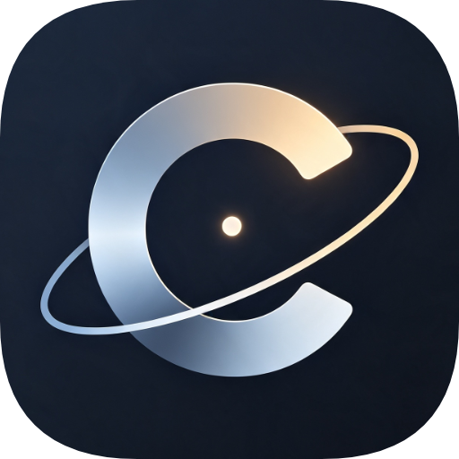
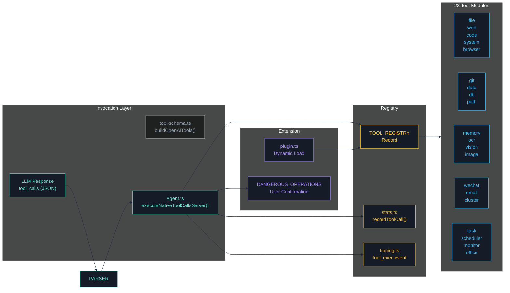
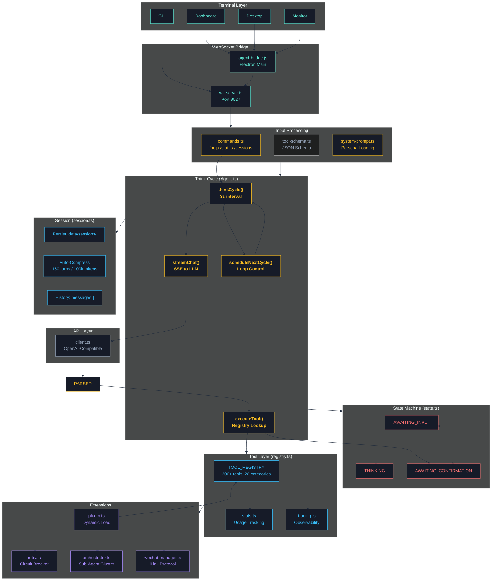

<div align="center">



# CogitoAgent

> **Think Continuously · Act Autonomously · Stay Private**
>
> _A local-first autonomous AI agent — your workspace, your data, your rules._

[](https://www.typescriptlang.org/)
[](https://www.electronjs.org/)
[](https://nodejs.org/)

</div>

<p align="center">
  <a href="README.md">English</a> · <a href="README.zh.md">中文</a> ·
  <a href="ROADMAP.md">Roadmap</a> ·
  <a href="CHANGELOG.md">Changelog</a> ·
  <a href="CONTRIBUTING.md">Contributing</a> ·
  <a href="SECURITY.md">Security</a> ·
  <a href="CODE_OF_CONDUCT.md">Code of Conduct</a>
</p>

---

## 📋 Table of Contents

- [Why CogitoAgent?](#-why-cogitoagent)
- [Core Features](#-core-features)
- [Use Cases](#-use-cases)
- [Quick Start](#-quick-start)
- [Tool System](#-tool-system)
- [Architecture](#-architecture)
- [Security](#-security)
- [Configuration](#-configuration)
- [Command Reference](#-command-reference)
- [Docker Deployment](#-docker-deployment)
- [Project Structure](#-project-structure)
- [Testing & Quality](#-testing--quality)
- [Roadmap](#-roadmap)
- [Community & Support](#-community--support)
- [Contributing](#-contributing)
- [License](#-license)

---

## 💡 Why CogitoAgent?

Cloud-based AI assistants send your files, code, and conversations to third-party servers. **CogitoAgent takes a different approach**: it is an autonomous agent that runs directly in your local workspace, driven by the LLM API of your choice — while your data never leaves your machine.

Cogito, ergo sum — _I think, therefore I am._ CogitoAgent isn't a chat window; it's a **continuously thinking agent** that:

- **Thinks continuously** — automatically reflects and acts on your workspace even while you're away
- **Explores autonomously** — discovers, organizes, and processes your local assets proactively
- **Executes 200+ tools** — from file operations and code execution to web research, databases, OCR, and multi-agent orchestration
- **Stays private** — only the conversation context is sent to the LLM API you specify. Your files never leave your workspace.


---

## ✨ Core Features

| Feature                         | Description                                                                                                   |
| ------------------------------- | ------------------------------------------------------------------------------------------------------------- |
| **Local-First Privacy**         | Workspace files stay on your machine; only the minimal conversation context goes to the LLM API you configure |
| **Continuous Thinking**         | Automatic thinking cycle (3s default, configurable) keeps the agent actively working on your tasks            |
| **200+ Tools / 28 Modules**     | File ops, code execution, Git, databases, OCR, Office documents, image generation, bioinformatics and more    |
| **TypeScript Core**             | Full type safety, strict mode, and compile-time error detection across the entire codebase                    |
| **Security Sandbox**            | `isolated-vm` process-level isolation for JavaScript; sanitized environment for Python subprocesses           |
| **Multi-Session Management**    | Independent conversation contexts with persistent storage and automatic context compression                   |
| **Agent Cluster**               | Spawn sub-agents, delegate tasks, parallel execution, panel discussion & voting — multi-agent collaboration   |
| **Electron Desktop**            | Transparent overlay window, full-screen dashboard, and a dedicated monitor panel for live telemetry           |
| **Plugin System**               | Dynamically load custom tool plugins at runtime with a 15s import timeout and permission gates                |
| **Thought-Chain Visualization** | Real-time stream of reasoning, tool calls, and results — full observability of every step                     |
| **WeChat Integration**          | QR-code login, message send/receive, dedicated session and tool-bubble display                                |
| **Image Generation**            | Text-to-image / image-to-image via configurable image models (e.g. `qwen-image-2.0-pro`)                      |
| **Observability**               | Per-category tool usage statistics, token/cost tracking, and lightweight event tracing                        |

> **Privacy note**: CogitoAgent never uploads your files to any cloud. Only conversation context is sent to the LLM API you specify. Your workspace stays yours.

---

## 🎯 Use Cases

| Scenario                          | How CogitoAgent Helps                                                                                       |
| --------------------------------- | ----------------------------------------------------------------------------------------------------------- |
| **Personal Knowledge Management** | Continuously scans your workspace, organizes files, and answers questions from your local data              |
| **Automated Research & Drafting** | Searches the web, browses pages, and drafts documents directly into your workspace                          |
| **Code & DevOps Assistance**      | Executes code (JS/Python), manages Git repositories, runs SQL, and automates routine tasks                  |
| **Office Document Processing**    | Creates PowerPoint, Word, and Excel files; OCR for scanned images; vision analysis                          |
| **Data Analysis Pipeline**        | Reads CSVs/JSONs, queries SQLite, and produces structured reports                                           |
| **Multi-Agent Collaboration**     | Delegates subtasks to specialized persona sub-agents (Critic, Programmer, Analyst…) with cluster monitoring |
| **Headless Server Deployment**    | Runs as a pure CLI/WebSocket service in Docker for always-on agent operations                               |

---

## 🚀 Quick Start

### Requirements

| Dependency  | Version | Notes                                       |
| ----------- | ------- | ------------------------------------------- |
| **Node.js** | ≥ 20    | LTS recommended                             |
| **npm**     | ≥ 10    | or yarn/pnpm                                |
| **Python**  | 3.x     | _Optional_ — only for Python code execution |

> **Users in China**: if `npm install` fails downloading the Electron binary:
>
> ```bash
> # Windows (PowerShell)
> $env:ELECTRON_MIRROR = "https://npmmirror.com/mirrors/electron/"
> npm install
>
> # macOS / Linux
> export ELECTRON_MIRROR="https://npmmirror.com/mirrors/electron/"
> npm install
> ```

### Installation

```bash
git clone https://github.com/SnowLeopard-io/CogitoAgent.git
cd cogito-agent
npm install
npm start
```

> China mirror: `git clone https://gitee.com/cnt-code/cogito-agent.git`

### First-Time Setup

The setup wizard will guide you through:

1. **API Base URL** — any OpenAI-compatible endpoint
2. **API Key** — your LLM provider key
3. **Model Name** — e.g. `gpt-4o`, `claude-3-sonnet`, `deepseek-chat`
4. **Workspace Path** — the directory the agent is allowed to access
5. **Persona** — choose an agent personality preset

### Usage Modes

| Command                      | Mode         | Description                                                |
| ---------------------------- | ------------ | ---------------------------------------------------------- |
| `npm start`                  | Setup Wizard | First-time configuration or re-configuration               |
| `npm run electron:desktop`   | Desktop      | Transparent overlay window + terminal agent over WebSocket |
| `npm run electron:dashboard` | Dashboard    | Full-window dashboard with sessions, tools & live charts   |
| `npm run cli`                | CLI          | Terminal-only agent (headless / server environments)       |

---

## 🛠 Tool System

All tools are managed by a central registry (`registry.ts`) with JSON Schema (`tool-schema.ts`) and invoked via **native function calling** — streaming `tool_calls`, not fragile text markers.



| Category           | Module         | Highlights                                                                                         |
| ------------------ | -------------- | -------------------------------------------------------------------------------------------------- |
| File Operations    | `file.ts`      | `ls`, `read`, `write`, `create`, `copy`, `move`, `rename`, `delete`                                |
| Path Utilities     | `path.ts`      | `getBasePath`, `resolvePath`, `normalizePath`, `joinPath`, `getExtension`                          |
| Web Tools          | `web.ts`       | `search`, `browse`, `fetchPage`                                                                    |
| Browser Automation | `browser.ts`   | `initBrowser`, `clickElement`, `fillField`, `takeScreenshot`, `downloadFile`                       |
| System Operations  | `system.ts`    | `listApps`, `openApp`, `closeApp`                                                                  |
| Code Execution     | `code.ts`      | `executeCode`, `executeFile`, `runJavaScript`, `runPython`, `formatCode`                           |
| Security Sandbox   | `sandbox.ts`   | `createJavaScriptSandbox`, `runPythonSandbox`, `executeCodeSandbox`                                |
| Git                | `git.ts`       | 20+ commands: `init`, `clone`, `add`, `commit`, `push`, `pull`, `branch`, `merge`, `diff`, `stash` |
| Task Management    | `task.ts`      | `createTask`, `splitTask`, `getTaskStats`, `clearTasks`                                            |
| Memory System      | `memory.ts`    | `addMemory`, `searchMemory`, `getRelatedMemories`, `clearMemory`                                   |
| Data Processing    | `data.ts`      | `readCSV`, `writeCSV`, `queryData`, `analyzeData`, `sortData`, `filterData`, `groupData`           |
| Database           | `db.ts`        | `executeSQL`, `query`, `insert`, `update`, `createTable`, `executeTransaction`                     |
| Email              | `email.ts`     | `sendEmail`, `sendTextEmail`, `sendHtmlEmail`, `sendTemplateEmail`                                 |
| System Monitoring  | `monitor.ts`   | `getCPUInfo`, `getMemoryInfo`, `getDiskInfo`, `getProcesses`, `monitorSystem`                      |
| Scheduled Tasks    | `scheduler.ts` | `addScheduleTask`, `getScheduleTasks`, `startScheduler`, `stopScheduler`                           |
| Image Recognition  | `ocr.ts`       | `ocr`, `ocrBatch`                                                                                  |
| Vision Analysis    | `vision.ts`    | `vision`, `visionFromUrl`                                                                          |
| Office Documents   | `office.ts`    | `createPpt`, `createWord`, `createExcel`, `readExcel`                                              |
| Image Generation   | `image-gen.ts` | `generateImage`                                                                                    |
| Agent Cluster      | `cluster.ts`   | `spawnAgent`, `delegateTask`, `parallelExecute`, `panelDiscussion`, `pipeline`, `voting`           |
| WeChat             | `wechat.ts`    | `loginWechat`, `sendWechatMessage`, `sendWechatImage`, `generateWechatQRCode`                      |

> 📚 Detailed tool documentation (registration, usage, best practices): [introduction/tools.md](introduction/tools.md)

<p align="center">
  
  
  <br>
  <em>Image Vision · Web Search · Browser Automation</em>
</p>

---

## 🏗 Architecture



| Component               | Responsibility                                                        |
| ----------------------- | --------------------------------------------------------------------- |
| **Agent.ts**            | Thinking loop — automatically triggers every 3 seconds                |
| **state.ts**            | State machine — THINKING / AWAITING_INPUT / AWAITING_CONFIRMATION     |
| **registry.ts**         | Tool registry — centralized management of all tool modules            |
| **session.ts**          | Session management — multi-session switching, context compression     |
| **commands.ts**         | Command handling — `/help`, `/status`, `/persona`, `/sessions`, etc.  |
| **sandbox.ts**          | Code sandbox — `isolated-vm` process-level isolation                  |
| **stats.ts**            | Statistics — tool usage tracking and metrics                          |
| **tracing.ts**          | Tracing — lightweight observability for tool executions and LLM calls |
| **cluster-commands.ts** | Cluster commands — spawn, delegate, stop sub-agents                   |
| **plugin.ts**           | Plugin system — dynamic loading of custom tool plugins                |
| **ws-server.ts**        | WebSocket — desktop mode communication (port 9527)                    |
| **wechat-manager.ts**   | WeChat channel — iLink protocol, message routing, session sync        |

> 📚 Complete architecture details (think cycle, tool call flow, state machine, WebSocket): [introduction/architecture.md](introduction/architecture.md)

---

## 🔒 Security

Security is a first-class concern in CogitoAgent:

| Layer                    | Protection                                                                                                                                                                                               |
| ------------------------ | -------------------------------------------------------------------------------------------------------------------------------------------------------------------------------------------------------- |
| **Code Execution**       | JavaScript runs in `isolated-vm` (separate V8 heap — prototype-pollution escapes are structurally impossible); Python runs in a sanitized environment (`PYTHONNOUSERSITE`, cleaned `PATH`, hard timeout) |
| **Dangerous Operations** | `DANGEROUS_OPERATIONS` gate requires explicit user confirmation before destructive actions                                                                                                               |
| **Tool Permissions**     | Per-tool allow/deny/ask policy, with untrusted plugins downgraded to a restricted default                                                                                                                |
| **Workspace Boundary**   | All file tools resolve paths with realpath checks — path traversal outside the workspace is rejected                                                                                                     |
| **Electron Hardening**   | `contextIsolation: true`, `sandbox: true`, `nodeIntegration: false`, strict CSP header, sender-validated IPC                                                                                             |
| **SQL Injection**        | Parameterized queries and input sanitization across the database module                                                                                                                                  |
| **Secrets Handling**     | Credentials stored encrypted; never logged; masked when echoed back to the UI                                                                                                                            |
| **Supply Chain**         | Plugin loading runs under a 15s import timeout with error logging; dynamic imports are cache-busted                                                                                                      |
| **Dependency Audit**     | `npm audit` + CodeQL scanning enforced in CI                                                                                                                                                             |

> 📚 Report a vulnerability: [SECURITY.md](SECURITY.md)

---

## ⚙️ Configuration

Configuration lives in `config.json` and environment variables (`.env`) — env vars take priority. Key variables:

| Variable                                            | Description                                                                          |
| --------------------------------------------------- | ------------------------------------------------------------------------------------ |
| `COGITO_API_KEY`                                    | LLM API key (fallback for OCR / Vision / Image Generation when their keys are blank) |
| `COGITO_API_BASE_URL`                               | OpenAI-compatible endpoint URL                                                       |
| `COGITO_MODEL`                                      | Default model name (e.g. `gpt-4o`)                                                   |
| `COGITO_IMAGEGEN_API_KEY` / `COGITO_IMAGEGEN_MODEL` | Image generation credentials & model (default `qwen-image-2.0-pro`)                  |
| `COGITO_VISION_API_KEY` / `COGITO_OCR_API_KEY`      | Optional per-feature keys                                                            |
| `COGITO_USER_DATA_DIR`                              | Runtime data directory (defaults to CWD)                                             |
| `COGITO_WS_TOKEN`                                   | WebSocket access token for remote clients                                            |
| `COGITO_SANDBOX_MODE`                               | Set to `false` to disable the isolated sandbox (not recommended)                     |

> 📚 Full configuration reference (advanced options, compression, truncation): [introduction/configuration.md](introduction/configuration.md)

---

## ⌨️ Command Reference

| Command                                               | Description                               |
| ----------------------------------------------------- | ----------------------------------------- |
| `/sessions` / `/new`                                  | List sessions / create a new session      |
| `/switch <id>` / `/delete <id>` / `/rename <name>`    | Session management                        |
| `/help` / `/status` / `/config`                       | Display help / status / configuration     |
| `/persona <name>` / `/personas`                       | Switch / list personas                    |
| `/tools` / `/clear` / `/debug`                        | List tools / clear history / toggle debug |
| `/wechat/status` / `/wechat/login` / `/wechat/logout` | WeChat channel control                    |
| `/spawn <persona> <name> <instruction>`               | Create a sub-agent                        |
| `/agents` / `/delegate <agentId> <task>`              | List / delegate to sub-agents             |
| `/stop-agent <agentId>` / `/stop-all-agents`          | Stop sub-agents                           |
| `ENTER` / `exit`                                      | Interrupt thinking / exit the program     |

---

## 🐳 Docker Deployment

For headless / server environments, run the agent as a containerized WebSocket service:

```bash
cp .env.example .env    # set COGITO_API_KEY and COGITO_WS_TOKEN
docker-compose up -d
```

The image runs as a **non-root user**, exposes health checks on `:9528`, and persists runtime data to a named volume.

> 📚 Deployment & development guide: [introduction/deployment.md](introduction/deployment.md)

---

## 📁 Project Structure

```
cogito-agent/
├── src/                              # TypeScript source
│   ├── agent/                        # Core agent module
│   │   ├── Agent.ts / state.ts / registry.ts
│   │   ├── commands.ts / session.ts / stats.ts
│   │   ├── plugin.ts / thought-trace.ts / retry.ts
│   │   ├── orchestrator.ts           # Sub-agent cluster orchestration
│   │   ├── wechat-manager.ts         # WeChat channel management
│   │   └── tools/                    # 28 tool modules (200+ tools)
│   ├── api/                          # LLM API layer (OpenAI-compatible)
│   ├── io/                           # Terminal, WebSocket, Webhook
│   ├── config.ts                     # Configuration management
│   ├── types/                        # Type definitions
│   └── index.ts                      # Application entry
├── electron/                         # Desktop shell (main / preload / windows)
├── plugins/                          # Extensible tool plugins
├── personas/                         # 28 persona presets (selectable roles)
├── tests/                            # Jest unit & integration tests
├── workflows/                        # Scientific workflow definitions
├── introduction/                     # In-depth documentation
├── Dockerfile / docker-compose.yml   # Container deployment
├── electron-builder.yml              # Desktop packaging config
└── tsconfig.json                     # TypeScript config
```

---

## ✅ Testing & Quality

- **850+ tests** across 49 suites (Jest, ESM mode)
- **Strict TypeScript** — `tsc --noEmit` enforced in CI
- **ESLint + Prettier** — unified code style
- **GitHub Actions CI/CD** — lint → typecheck → test → build → release
- **CodeQL** — automated security scanning
- **Dependabot** — automated dependency updates

```bash
npm test              # run the full test suite
npm run typecheck     # TypeScript strict type checking
npm run lint          # ESLint
npm run format        # Prettier
```

---

## 🗺 Roadmap

See [ROADMAP.md](ROADMAP.md) for the full roadmap, including:

- Enhanced multi-modal capabilities
- More persona roles & collaboration patterns
- Advanced RAG & knowledge graph memory
- Additional LLM provider integrations
- Mobile/remote access via WebSocket

---

## 💬 Community & Support

- [GitHub Issues](https://github.com/SnowLeopard-io/CogitoAgent/issues) — Report bugs & request features
- [GitHub Discussions](https://github.com/SnowLeopard-io/CogitoAgent/discussions) — Ask questions & share ideas
- [Gitee](https://gitee.com/cnt-code/cogito-agent) — Chinese mirror repository
- [SECURITY.md](SECURITY.md) — Security disclosure policy

We welcome all contributions, feedback, and ideas!

---

## 🤝 Contributing

We welcome contributions from the community! Whether you want to fix a bug, add a feature, or improve documentation, your help is appreciated.

<a href="https://github.com/SnowLeopard-io/CogitoAgent/issues?q=is%3Aopen+is%3Aissue+label%3A%22good+first+issue%22"></a>
<a href="https://github.com/SnowLeopard-io/CogitoAgent/issues?q=is%3Aopen+is%3Aissue+label%3A%22help+wanted%22"></a>

### Getting Started

1. Read the [Contributing Guide](CONTRIBUTING.md)
2. Browse [good first issues](https://github.com/SnowLeopard-io/CogitoAgent/issues?q=is%3Aopen+is%3Aissue+label%3A%22good+first+issue%22)
3. Follow the [Code of Conduct](CODE_OF_CONDUCT.md)
4. Report security issues via [SECURITY.md](SECURITY.md)

### Ways to Contribute

- 🐛 Report bugs
- ✨ Suggest new features
- 📝 Improve documentation
- 🧪 Write tests
- 🔧 Fix issues
- 🎨 Improve UI/UX

---

## 📄 License

[Apache License 2.0](LICENSE)

Copyright © 2026 CogitoAgent Team

---

<div align="center">
  <sub>Built with ❤️ by the CogitoAgent team · <em>Think Continuously, Act Autonomously, Stay Private</em></sub>
</div>
