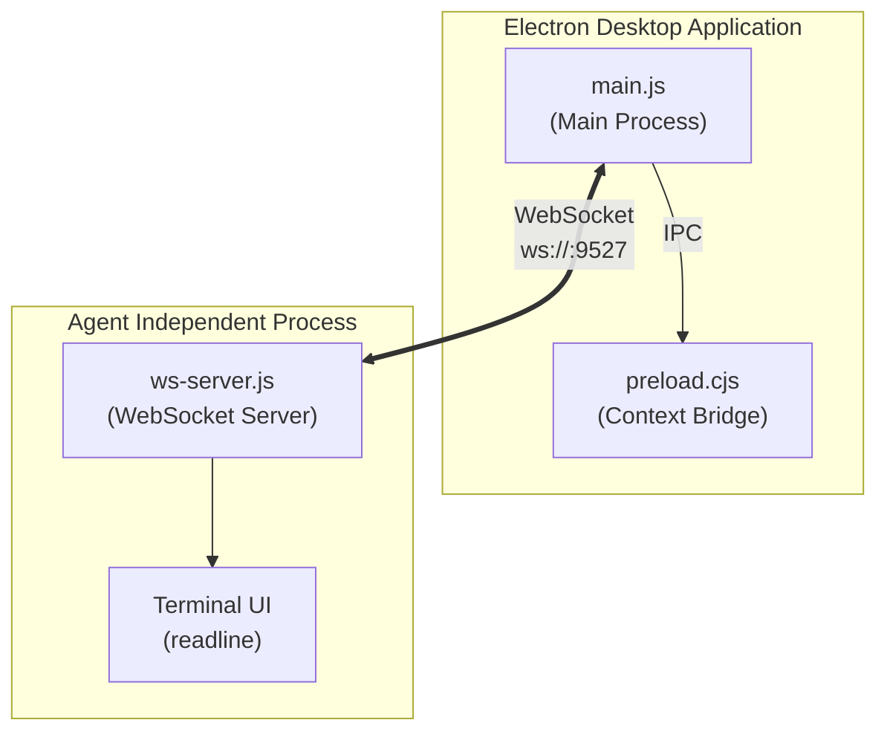
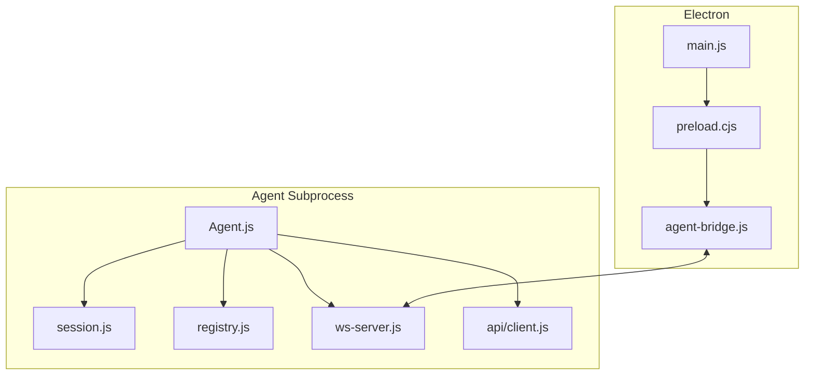
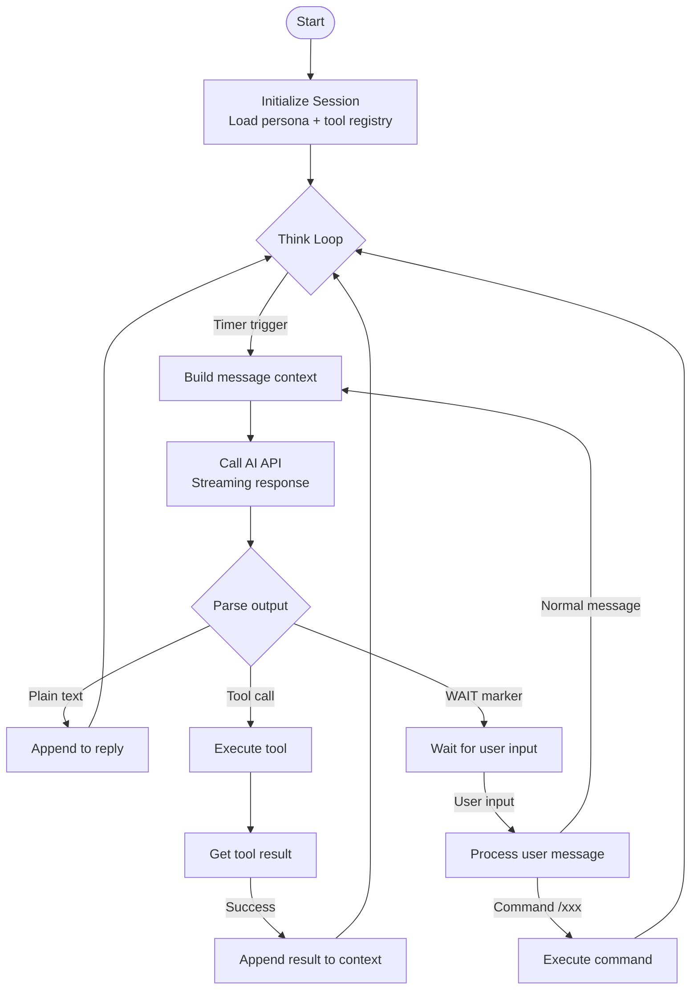
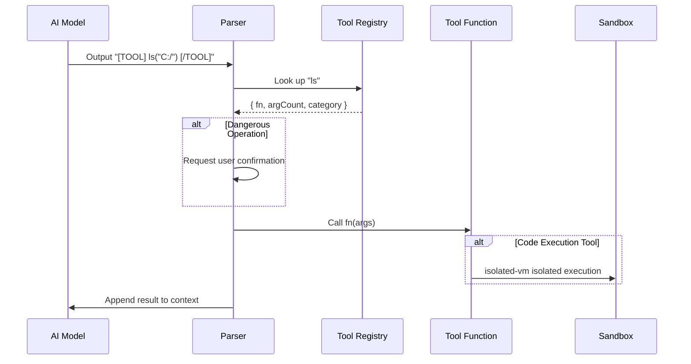
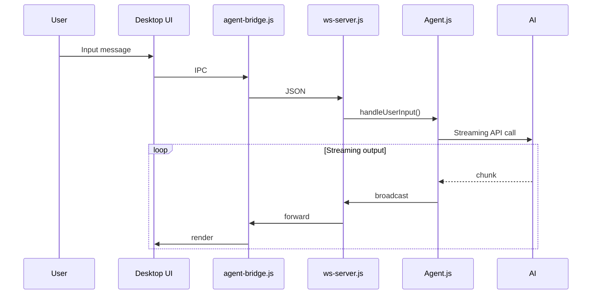
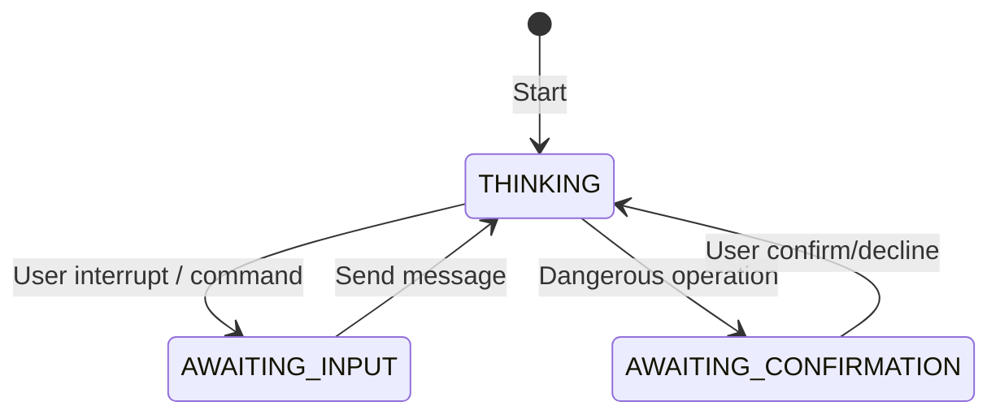

<h1 align="center">
  <strong style="font-size: 3em; background: linear-gradient(135deg, #667eea 0%, #764ba2 100%); -webkit-background-clip: text; -webkit-text-fill-color: transparent;">
    CogitoAgent
  </strong>
</h1>

<p align="center">
  <strong style="font-size: 1.4em; color: #667eea;">✦ Continuously Thinking Local Autonomous AI Agent ✦</strong>
  <br>
  <em style="font-size: 1.1em; color: #888;">Think Continuously · Act Autonomously · Stay Private</em>
</p>

<p align="center">
  <a href="#-core-features">⚡ Features</a> &nbsp;·&nbsp;
  <a href="#-quick-start">🚀 Quick Start</a> &nbsp;·&nbsp;
  <a href="#continuous-thinking-loop">🧠 Architecture</a> &nbsp;·&nbsp;
  <a href="#tool-system">🔧 Tools</a> &nbsp;·&nbsp;
  <a href="src/agent/tools/TOOL_DEVELOPMENT.md">📦 Development</a>
</p>

<br>

<p align="center" style="display: flex; justify-content: center; gap: 8px; flex-wrap: wrap;">
  <a href="#"></a>
  <a href="#"></a>
  <a href="#"></a>
  <a href="#"></a>
  <a href="#"></a>
</p>

<br>

<div align="center">
  
</div>

<br>

<table align="center">
  <tr>
    <td align="center" width="50%">
      
      <br>
      <sub>🖥️ Desktop Mode — Electron Window</sub>
    </td>
    <td align="center" width="50%">
      
      <br>
      <sub>🖥️ Desktop Mode — Electron Window</sub>
    </td>
  </tr>
</table>

<br>

---

> **Cogito, ergo sum** — I think, therefore I am. CogitoAgent is not just a tool; it is your autonomous thinking partner in your local environment.

**CogitoAgent** is a locally-run autonomous AI agent that integrates file management, knowledge mining, system operations, code execution, and web connectivity. It runs directly within the working directory configured by the user, **with no need to upload any files to third-party servers**, ensuring data privacy while providing a continuously operating intelligent assistant service.

Unlike traditional chatbots, CogitoAgent possesses the ability to **Think Continuously** · **Explore Autonomously** · **Execute Tools**, capable of proactively discovering and organizing your local file assets in the background, with additional capabilities available through an extensible toolset.

---

## Core Features

| Feature | Description |
|---------|-------------|
| **Privacy First** | All data stored locally; no files uploaded to third-party servers |
| **Continuous Thinking** | Automatically triggers a thinking cycle every 3 seconds, proactively analyzing current task status |
| **Tool Execution** | Built-in 18 tool modules supporting file operations, code execution, Git, databases, OCR, and more |
| **Security Sandbox** | JavaScript code execution uses `isolated-vm` for process-level isolation |
| **Multi-Session Management** | Supports multiple independent conversation sessions with persistent data storage |
| **Desktop Mode** | Electron desktop window communicating with the terminal Agent via WebSocket |

---

## 🚀 Quick Start

### Requirements

- **Node.js** 18.0 or higher
- **npm** or **yarn** package manager
- **Python** 3.x (optional, for Python code execution)

### Installation

```bash
# Clone the project
git clone https://gitee.com/cnt-code/cogito-agent.git
cd cogito-agent

# Install dependencies
npm install

# Start the program
npm start
```

### First-Time Setup

The first run will automatically guide you through the following configuration:

1. **API Base URL** — Supports OpenAI-compatible third-party APIs
2. **API Key** — Your API key
3. **Model Name** — e.g., gpt-4o, claude-3-sonnet, etc.
4. **Workspace Path** — The directory the AI can access (defaults to user home directory)
5. **Persona Selection** — Choose a preset AI persona

### Daily Usage

The program supports two operation modes:

| Command | Mode | Description |
|---------|------|-------------|
| `npm start` | Setup Wizard | First-time configuration or modifying settings; does not start the Agent |
| `npm run electron` | Desktop Mode | Electron desktop window + terminal Agent, communicating via WebSocket |
| `npm run cli` | CLI Mode | Terminal Agent only, without Electron (suitable for pure command-line environments) |

#### Setup Wizard

```bash
npm start
```

On first run, the welcome page will automatically open and guide you through configuration. If already configured, it will prompt you to use the correct startup command.

#### Desktop Mode

```bash
npm run electron
```

The Electron main process will automatically launch the terminal Agent, create the desktop window, and establish the connection.

**Interaction Methods:**

- **Desktop Window** — Semi-transparent frosted glass dialog + virtual character video, input directly on the desktop
- **Terminal Input** — Type commands directly in the startup terminal, press ENTER to send
- **ENTER** — Interrupt the current AI thinking and enter input state
- **exit** — Exit the program (or close the desktop window directly)


#### CLI Mode

```bash
npm run cli
```

Pure command-line mode, without Electron or WebSocket services, directly interacting in the terminal.

Suitable for:
- Server environments
- Remote connections without a GUI
- Resource-constrained environments

#### Session Selector

On startup (both CLI and Electron modes), a session selection interface will be displayed, allowing users to choose an existing session or create a new one.

**CLI Mode Session Selection:**

```
  ────────────────────────────────────────────
  📋 Select Session:
    0 - Create New Session
    1 - Default Session ◀ Current
        Last Active: 06/20 15:30
    2 - Work Discussion
        Last Active: 06/19 10:22
  ────────────────────────────────────────────
  Enter number: _
```

Enter the number to enter the corresponding session, or enter `0` to create a new session.

**Electron Mode Session Selection:**

After the desktop window starts, a session list is displayed. Click a session card to enter that session, or click the "New Session" button to create one.

---

## Continuous Thinking Loop

The core of the Agent is a continuously running thinking loop. After startup, the Agent automatically triggers one round of the thinking process every 3 seconds (configurable via `thinkingInterval`):

1. Build the current message context (including system prompt, tool registry, and conversation history)
2. Call the AI API (streaming response)
3. Parse the AI output:
   - Plain text → Directly appended to the reply
   - Tool call → Execute the tool function, append the result to the context
   - WAIT marker → Pause and wait for user input

Users can interrupt the current thinking at any time by pressing `ENTER` to enter input mode.

## Tool System

The tool system is managed uniformly by `registry.js`. All tool functions are called using the `[TOOL] functionName(args) [/TOOL]` format.

### Tool Categories

| Category | File | Main Functions |
|----------|------|----------------|
| File Operations | `file.js` | `ls`, `read`, `create`, `copy`, `mkdir`, `delete`, `move` |
| Web Tools | `web.js` | `search`, `browse`, `fetchPage`, `searchOnEngine` |
| Browser Automation | `browser.js` | `initBrowser`, `clickElement`, `fillField`, `takeScreenshot` |
| System Operations | `system.js` | `listApps`, `openApp`, `closeApp` |
| Code Execution | `code.js` | `executeCode`, `runJavaScript`, `runPython` |
| Git | `git.js` | `gitStatus`, `gitCommit`, `gitPush`, `gitPull`, `gitDiff`, `gitLog` |
| Task Management | `task.js` | `createTask`, `getTasks`, `completeTask`, `splitTask` |
| Memory System | `memory.js` | `addMemory`, `searchMemory`, `getRelatedMemories`, `deleteMemory` |
| Data Processing | `data.js` | `readCSV`, `writeJSON`, `csvToJSON`, `queryData` |
| Database | `db.js` | `executeSQL`, `query`, `insert`, `update`, `createTable`, `getTables` |
| Email | `email.js` | `sendEmail`, `sendTextEmail`, `sendHtmlEmail` |
| System Monitoring | `monitor.js` | `getCPUInfo`, `getMemoryInfo`, `monitorSystem` |
| Scheduled Tasks | `scheduler.js` | `addScheduleTask`, `getScheduleTasks`, `toggleScheduleTask` |
| Image Recognition | `ocr.js` | `ocr`, `ocrBatch` |

### Tool Registration Mechanism

Tool functions are uniformly registered in the registry, containing the following metadata:

```javascript
{
  name: 'functionName',
  description: 'Function description',
  parameters: { /* JSON Schema */ },
  category: 'category',
  dangerLevel: 'none | low | medium | high',  // Dangerous operations require user confirmation
  fn: async (args) => { /* Implementation */ }
}
```

### Tool Call Example

```
AI: [TOOL] ls("/project/src") [/TOOL]
→ Returns directory file list

AI: [TOOL] runPython("print('hello')") [/TOOL]
→ Executes Python code, returns output
```

> Detailed tool development documentation can be found at [src/agent/tools/TOOL_DEVELOPMENT.md](src/agent/tools/TOOL_DEVELOPMENT.md)

### Browser Automation In Detail

The browser automation tool is based on Playwright, supporting web page interaction, screenshots, form filling, and more.


#### Core Tools

| Tool | Description | Parameters |
|------|-------------|------------|
| `initBrowser` | Initialize browser instance | None |
| `navigateTo` | Navigate to specified URL | `url` |
| `clickElement` | Click a page element | `selector` |
| `fillField` | Fill a form field | `selector`, `value` |
| `takeScreenshot` | Take a page screenshot | `selector` (optional) |
| `getText` | Get element text | `selector` |
| `waitForElement` | Wait for an element to appear | `selector`, `timeout` |
| `closeBrowser` | Close the browser instance | None |

#### Usage Examples

**Basic Web Browsing:**

```javascript
// Initialize browser
[TOOL] initBrowser() [/TOOL]

// Navigate to webpage
[TOOL] navigateTo("https://example.com") [/TOOL]

// Take full-page screenshot
[TOOL] takeScreenshot() [/TOOL]

// Close browser
[TOOL] closeBrowser() [/TOOL]
```

**Form Filling and Submission:**

```javascript
// Initialize and navigate
[TOOL] initBrowser() [/TOOL]
[TOOL] navigateTo("https://login.example.com") [/TOOL]

// Fill login form
[TOOL] fillField("#username", "myuser") [/TOOL]
[TOOL] fillField("#password", "mypassword") [/TOOL]

// Click login button
[TOOL] clickElement("#login-button") [/TOOL]

// Wait for successful login
[TOOL] waitForElement(".dashboard", 5000) [/TOOL]

// Take screenshot of logged-in page
[TOOL] takeScreenshot() [/TOOL]
```

**Data Scraping:**

```javascript
// Navigate to target page
[TOOL] navigateTo("https://news.example.com") [/TOOL]

// Get title list
[TOOL] getText(".article-title") [/TOOL]

// Take screenshot of specific area
[TOOL] takeScreenshot(".main-content") [/TOOL]
```

#### Browser Configuration

**Browser Type:**

Chromium is used by default, can be switched via configuration:

```json
{
  "browser": {
    "type": "chromium",  // chromium | firefox | webkit
    "headless": true,    // Headless mode
    "timeout": 30000     // Default timeout (ms)
  }
}
```

**Security Restrictions:**

- Browser instances live for a maximum of 5 minutes
- Automatically close browsers that have been idle for too long
- Access to local file system URLs (file://) is prohibited
- Screenshots are automatically saved to a temporary directory and cleaned up periodically

#### Best Practices

1. **Close browsers promptly** — Avoid resource waste
2. **Use headless mode** — Improve execution efficiency
3. **Set reasonable timeouts** — Prevent page loading from hanging
4. **Selector priority** — ID > Class > XPath
5. **Error handling** — Check if elements exist before operating

### Database Operations In Detail

The database tool supports SQLite database creation, querying, insertion, updating, and more.

#### Core Tools

| Tool | Description | Parameters |
|------|-------------|------------|
| `executeSQL` | Execute arbitrary SQL statements | `sql` |
| `query` | Execute query statements | `sql`, `params` (optional) |
| `insert` | Insert data | `table`, `data` |
| `update` | Update data | `table`, `data`, `where` |
| `delete` | Delete data | `table`, `where` |
| `executeTransaction` | Execute a transaction | `statements` |
| `createTable` | Create a table | `tableName`, `schema` |
| `listTables` | List all tables | None |

#### Usage Examples

**Create Table:**

```javascript
[TOOL] createTable("users", {
  id: "INTEGER PRIMARY KEY AUTOINCREMENT",
  name: "TEXT NOT NULL",
  email: "TEXT UNIQUE",
  created_at: "INTEGER"
}) [/TOOL]
```

**Insert Data:**

```javascript
// Single insert
[TOOL] insert("users", {
  name: "John Doe",
  email: "john@example.com",
  created_at: Date.now()
}) [/TOOL]

// Batch insert
[TOOL] executeTransaction([
  { sql: "INSERT INTO users (name, email) VALUES (?, ?)", params: ["John", "john@example.com"] },
  { sql: "INSERT INTO users (name, email) VALUES (?, ?)", params: ["Jane", "jane@example.com"] }
]) [/TOOL]
```

**Query Data:**

```javascript
// Simple query
[TOOL] query("SELECT * FROM users") [/TOOL]

// Conditional query
[TOOL] query("SELECT * FROM users WHERE name = ?", ["John"]) [/TOOL]

// Sorted query
[TOOL] query("SELECT * FROM users ORDER BY created_at DESC LIMIT 10") [/TOOL]
```

**Update Data:**

```javascript
[TOOL] update("users", 
  { email: "newemail@example.com" },
  { name: "John" }
) [/TOOL]
```

**Delete Data:**

```javascript
[TOOL] delete("users", { name: "John" }) [/TOOL]
```

**Transaction Operations:**

```javascript
[TOOL] executeTransaction([
  { sql: "UPDATE accounts SET balance = balance - 100 WHERE id = 1" },
  { sql: "UPDATE accounts SET balance = balance + 100 WHERE id = 2" },
  { sql: "INSERT INTO transactions (from_id, to_id, amount) VALUES (1, 2, 100)" }
]) [/TOOL]
```

#### Database Configuration

**Database Path:**

```json
{
  "database": {
    "path": "./data/mydb.db",
    "timeout": 5000
  }
}
```

**Security Restrictions:**

- Can only access database files within the workspace
- Dangerous operations like DROP DATABASE are prohibited
- Transactions automatically roll back on failure
- Query results return at most 1000 rows

#### Database Management

**List All Tables:**

```javascript
[TOOL] listTables() [/TOOL]
// → ["users", "tasks", "memories"]
```

**Get Table Schema:**

```javascript
[TOOL] query("PRAGMA table_info(users)") [/TOOL]
```

**Database Backup:**

```javascript
// Export database
[TOOL] executeSQL("SELECT * FROM users") [/TOOL]
// Save results as JSON file
[TOOL] create("./backup/users.json", JSON.stringify(result)) [/TOOL]
```

#### Best Practices

1. **Use transactions** — Use transactions for batch operations to improve performance
2. **Parameterized queries** — Prevent SQL injection
3. **Index optimization** — Create indexes for frequently queried fields
4. **Regular backups** — Export important data
5. **Error handling** — Check SQL execution results

### Optical Character Recognition (OCR) In Detail

The OCR tool is based on vision-language models (such as Qwen2.5-VL-32B-Instruct) to recognize text from images, supporting common image formats.

#### Core Tools

| Tool | Description | Parameters |
|------|-------------|------------|
| `ocr` | Recognize text from a single image | `imagePath` (image path, supports relative/absolute paths) |
| `ocrBatch` | Batch recognize text from multiple images | `images` (multiple image paths, separated by commas) |

#### Supported Formats

| Format | Extension | Description |
|--------|-----------|-------------|
| JPEG | `.jpg` `.jpeg` | Most commonly used compressed image format |
| PNG | `.png` | Lossless compression, supports transparent backgrounds |
| WebP | `.webp` | Modern efficient compression format |
| BMP | `.bmp` | Bitmap, uncompressed |
| GIF | `.gif` | Animated images (takes the first frame) |

#### Usage Examples

**Single Image Recognition:**

```javascript
// Recognize text from a local image
[TOOL] ocr("/path/to/screenshot.png") [/TOOL]
// → Returns the recognized text content

// Recognize an image within the workspace
[TOOL] ocr("documents/invoice.jpg") [/TOOL]
// → Recognizes text information from an invoice image
```

**Batch Recognition:**

```javascript
// Batch recognize multiple screenshots
[TOOL] ocrBatch("img1.jpg, img2.png, img3.webp") [/TOOL]
// → Returns recognition results for each image sequentially
```

**Combining with Other Tools:**

```javascript
// First get files in the directory, then recognize
[TOOL] ls("./screenshots") [/TOOL]
// → ["page1.png", "page2.png", "page3.png"]

// Recognize one of the images
[TOOL] ocr("./screenshots/page1.png") [/TOOL]
// → Returns text content from the image
```

#### OCR Configuration

Configure OCR-related parameters in `config.json`:

```json
{
  "ocr": {
    "provider": "",              // OCR service provider (optional)
    "baseURL": "",              // OCR API base URL, uses api.baseURL if empty
    "apiKey": "",               // OCR API key (required)
    "model": "Qwen2.5-VL-32B-Instruct"  // Vision model name
  }
}
```

**Configuration Description:**

| Field | Required | Description | Default |
|-------|----------|-------------|---------|
| `apiKey` | ✅ | API key for OCR service | - |
| `baseURL` | ⚠️ | API service URL, uses main API URL if not set | `api.baseURL` |
| `model` | ✅ | Vision model name, must support image input | `Qwen2.5-VL-32B-Instruct` |
| `provider` | ⚠️ | Service provider identifier, for distinguishing different providers | - |

#### Supported Vision Models

| Model Name | Description |
|------------|-------------|
| `Qwen2.5-VL-32B-Instruct` | Alibaba Tongyi Qianwen vision model, recommended |
| `gpt-4o` / `gpt-4o-mini` | OpenAI vision models, requires corresponding API configuration |
| `claude-3-opus` / `claude-3-sonnet` | Anthropic vision models |
| `gemini-1.5-pro` / `gemini-1.5-flash` | Google vision models |

#### Image Requirements

| Item | Limit | Description |
|------|-------|-------------|
| File Size | ≤ 10 MB | Larger images may cause API request failures |
| Format Support | 5 types | JPEG, PNG, WebP, BMP, GIF |
| Text Clarity | ≥ 12pt recommended | Text that is too small or blurry may not be recognized accurately |
| Path Encoding | UTF-8 | Ensure file system supports Chinese paths |

#### Usage Flow

```
1. Configure ocr.apiKey and ocr.model in config.json
2. Ask the Agent to call ocr(imagePath) in conversation
3. Agent encodes the image to base64 and sends via multimodal API
4. AI model recognizes text in the image and returns results
5. Results are appended to the conversation context as text
```

#### Best Practices

1. **Ensure image clarity** — Larger and clearer text yields better recognition results
2. **Control image size** — Recommend compressing to under 5MB for faster processing
3. **Use batch wisely** — `ocrBatch` calls the API sequentially; be mindful of API rate limits
4. **Correct paths** — Relative paths are relative to the configured workspace, or use absolute paths
5. **Protect API keys** — Do not commit `config.json` to public repositories

#### Common Issues

| Issue | Cause | Solution |
|-------|-------|----------|
| "API key not configured" | `ocr.apiKey` is empty | Fill in the correct API key in config.json |
| "File not found" | Incorrect image path | Check if the path is correct, and if relative paths are relative to workspace |
| "Unsupported format" | File extension not in support list | Convert the image to JPEG/PNG/WebP etc. |
| "File too large" | Image exceeds 10MB | Use image compression tools to reduce file size |
| API request timeout/failure | Network issues or API service unavailable | Check network connection, confirm API service is functional |

#### Environment Variable Configuration

OCR can also be configured via environment variables (higher priority than config.json):

```bash
# OCR API key (required)
OCR_API_KEY=your-ocr-api-key-here

# OCR API base URL (optional, uses main API URL if not set)
OCR_API_BASE_URL=https://api.example.com/v1

# OCR vision model name (optional, defaults to Qwen2.5-VL-32B-Instruct)
OCR_MODEL=Qwen2.5-VL-32B-Instruct

# OCR service provider (optional)
OCR_PROVIDER=qwen
```

## Memory System

The memory system is based on SQLite, providing long-term information storage and semantic retrieval capabilities.

### Core Operations

| Operation | Function | Description |
|-----------|----------|-------------|
| Add Memory | `addMemory(content, tags, metadata)` | Store information with tags |
| Search Memory | `searchMemory(keyword)` | Keyword fuzzy search |
| Semantic Search | `getRelatedMemories(text)` | Embedding-based semantic search |
| Delete Memory | `deleteMemory(id)` | Delete by ID |

### Data Structure

```sql
CREATE TABLE memories (
  id TEXT PRIMARY KEY,
  content TEXT NOT NULL,
  tags TEXT,           -- JSON array
  embedding BLOB,      -- Embedding vector
  metadata TEXT,       -- JSON object
  created_at INTEGER
);
```

### Retrieval Mechanism

- **Keyword Search**: LIKE fuzzy matching
- **Semantic Search**: Cosine similarity calculation, returns related memories

## Task Management System

The task management system is based on SQLite storage, supporting task creation, decomposition, and status tracking.

### Data Structure

```sql
CREATE TABLE tasks (
  id TEXT PRIMARY KEY,
  title TEXT NOT NULL,
  description TEXT,
  status TEXT DEFAULT 'pending',  -- pending | in_progress | completed
  priority TEXT DEFAULT 'middle', -- low | middle | high
  parent_id TEXT,
  created_at INTEGER,
  completed_at INTEGER
);
```

### Core Operations

| Operation | Function | Description |
|-----------|----------|-------------|
| Create Task | `createTask(title, description, priority)` | Create a new task |
| Get Tasks | `getTasks(filter)` | Filter by status/priority |
| Update Status | `completeTask(id)` | Mark as completed |
| Decompose Task | `splitTask(parentId, subtasks)` | Split into subtasks |

### Task Status Flow

```
pending → in_progress → completed
```

Subtask completion automatically updates the parent task status.

## Code Execution Sandbox

The code execution module uses `isolated-vm` for process-level isolation, ensuring system security.

### JavaScript Execution

| Security Measure | Description |
|------------------|-------------|
| Process Isolation | Executes in an independent v8 isolate |
| Object Freezing | Deeply freezes built-in objects like JSON, Math, Array |
| Dangerous Objects Disabled | Disables `eval`, `Function`, `Proxy`, `process`, `require` |
| Memory Limit | 128MB |
| Timeout Control | Auto-terminates after 30 seconds |

### Python Execution

| Security Measure | Description |
|------------------|-------------|
| Temporary Files | Code written to temporary .py files for execution |
| Command Injection Protection | Disables `subprocess`, `os.system`, etc. |
| Timeout Control | Temporary files are automatically deleted after execution |

### Execution Flow

```
runJavaScript(code)
  → Create isolate
  → Inject frozen built-in objects
  → Execute code
  → Return result or error
  → Destroy isolate
```

## Preset Personas

Persona configurations are stored in the `personas/` directory, each file defining a character's personality traits.

### Persona File Format

```javascript
// personas/explorer.js
module.exports = {
  name: 'explorer',
  description: 'Explorer',
  prompt: 'You are a careful explorer, skilled at discovering file structures and code logic...',
  temperature: 0.7,
  maxTokens: 2000
};
```

### Available Personas

| Persona | Description |
|---------|-------------|
| explorer | File exploration, project understanding |
| scholar | Knowledge research, in-depth analysis |
| assistant | Daily tasks, simple Q&A |
| creative | Writing, creative generation |
| critic | Code review, improvement suggestions |
| teacher | Teaching, knowledge explanation |
| wenchen | Literary creation |
| wujiang | Decision execution, emergency handling |
| yingwei | Strategic planning, project management |
| zhanshi | Technical problem-solving |
| moushi | Strategic analysis, risk assessment |
| jianguan | Quality control, process management |
| xiake | Free exploration |

Switch command: `/persona <name>`

### Persona System In Detail

#### Persona File Structure

Each persona file contains the following content:

```markdown
# Persona Name

You are a [role description].

## Personality Traits
- Trait 1
- Trait 2
- Trait 3

## Speaking Style
- Style description
- Common expressions

## Behavior Patterns
- Main behavioral characteristics
- Interaction preferences
```

#### Persona Switching Mechanism

Switching personas triggers the following operations:

1. **Load new persona file** — Read the corresponding `.md` file from the `personas/` directory
2. **Rebuild system prompt** — Inject new persona content into the system prompt header
3. **Clear current context** — Prevent old persona conversation history from affecting new behavior
4. **Save historical records** — Archive current session conversations

#### Custom Personas

Steps to create a custom persona:

1. Create a new `.md` file in the `personas/` directory
2. Write the persona content following the above structure
3. Use the `/persona <filename>` command to switch

**Example: Creating a "Programmer" Persona**

```markdown
# Programmer

You are an experienced programmer focused on code quality and best practices.

## Personality Traits
- Emphasis on code standards and readability
- Preference for using modern programming techniques
- Emphasis on testing and documentation
- In-depth research on performance optimization

## Speaking Style
- Uses technical terminology accurately
- Provides code examples and best practice suggestions
- Commonly used: "Let me look at the code", "This can be optimized"

## Behavior Patterns
- Actively analyzes code structure
- Provides refactoring suggestions
- Recommends appropriate tools and libraries
- Focuses on error handling and edge cases
```

#### Persona Hot-Switching

CogitoAgent supports hot-switching personas without restarting the program:

- Use the `/persona <name>` command to switch immediately
- The system prompt is dynamically rebuilt
- The current workspace path is automatically injected into the new persona

## Multi-Session Management

The `sessions/` module supports multiple independent conversation sessions, each maintaining its own independent context.

### Session Storage

```
data/sessions/
├── session_abc123.json   # Session metadata
├── session_def456.json
└── ...
```

### Session Metadata Structure

```javascript
{
  id: "abc123",
  name: "Project A Discussion",
  createdAt: 1718000000000,
  updatedAt: 1718001000000,
  messageCount: 45,
  contextTokens: 8500,
  persona: "explorer"
}
```

### Session Commands

| Command | Description |
|---------|-------------|
| `/sessions` | List all sessions |
| `/new` | Create a new session |
| `/switch <id>` | Switch sessions |
| `/delete <id>` | Delete a session |
| `/rename <name>` | Rename the current session |

### Context Management

- **Context Window**: Auto-compression (150 turns or 100K tokens)
- **Session Isolation**: Clear current context when switching sessions

### WebSocket Communication In Detail

#### WebSocket Server

The WebSocket server runs in the Agent process, default port `9527`.

**Core Functions:**

| Function | Description |
|----------|-------------|
| Connection Management | Supports multiple clients simultaneously |
| Message Broadcasting | Broadcasts messages to all clients |
| Heartbeat Mechanism | Automatically detects connection status |
| Error Handling | Automatically cleans up on disconnection |

**Message Format:**

```javascript
{
  type: "message_type",
  data: { /* message content */ }
}
```

**Message Types:**

| Type | Description |
|------|-------------|
| `user_input` | User input message |
| `assistant_response` | AI reply message |
| `tool_call` | Tool call notification |
| `tool_result` | Tool execution result |
| `state_change` | State change notification |
| `error` | Error message |

#### Electron Client

The Electron main process connects to the Agent via WebSocket:

**Connection Flow:**

1. Electron main process starts the Agent subprocess
2. Agent starts the WebSocket server (port 9527)
3. Electron establishes a WebSocket connection via `agent-bridge.js`
4. Bidirectional communication: User input → Agent → AI → Streaming reply → Electron UI

**IPC Bridge:**

```javascript
// Electron main process → WebSocket
ipcMain.on('user-input', (event, message) => {
  ws.send(JSON.stringify({ type: 'user_input', data: message }));
});

// WebSocket → Electron main process
ws.on('message', (raw) => {
  const msg = JSON.parse(raw);
  mainWindow.webContents.send('ws-message', msg);
});
```

#### Custom WebSocket Client

You can develop custom clients to connect to the Agent:

```javascript
const WebSocket = require('ws');
const ws = new WebSocket('ws://localhost:9527');

ws.on('open', () => {
  console.log('Connected to Agent');
  
  // Send user message
  ws.send(JSON.stringify({
    type: 'user_input',
    data: 'Hello, please help me analyze this project'
  }));
});

ws.on('message', (raw) => {
  const msg = JSON.parse(raw);
  console.log('Received message:', msg.type);
  
  if (msg.type === 'assistant_response') {
    console.log('AI reply:', msg.data);
  }
});
```

#### WebSocket Configuration

**Port Configuration:**

The WebSocket port can be modified via environment variable:

```bash
WS_PORT=9527  # Default port
```

**Connection Parameters:**

| Parameter | Default | Description |
|-----------|---------|-------------|
| Port | 9527 | WebSocket service port |
| Reconnect Interval | 3000ms | Auto-reconnect interval after disconnection |
| Heartbeat Interval | 30000ms | Heartbeat detection interval |

## Desktop Mode

The desktop mode is implemented with Electron, providing a GUI interface.

### Architecture



### Main Processes

| Process | File | Responsibility |
|---------|------|----------------|
| Main Process | `electron/main.js` | Window management, system tray |
| Preload | `electron/preload.cjs` | Secure context bridging |
| Bridge | `electron/agent-bridge.js` | WebSocket ↔ IPC conversion |
| WebSocket | `src/io/ws-server.js` | Real-time communication (port 9527) |

### Window Features

| Feature | Implementation |
|---------|----------------|
| Frameless Window | `frame: false` |
| Transparent Background | `transparent: true` + CSS `backdrop-filter` |
| Always on Top | `alwaysOnTop: true` |
| Click-Through | `enableMouseEvents: false` (configurable) |

---

## Project Structure

```
cogito-agent/
├── src/                              # Source code directory
│   ├── agent/                        # Core agent module
│   │   ├── Agent.js                  # Core agent
│   │   ├── state.js                  # State machine
│   │   ├── registry.js               # Tool registry
│   │   ├── commands.js               # Command handling
│   │   ├── session.js                # Multi-session management
│   │   ├── prompt.js                 # System prompt construction
│   │   ├── mcp.js                    # MCP protocol server
│   │   ├── plugin.js                 # Plugin system
│   │   ├── tracing.js                # Lightweight observability
│   │   ├── retry.js                  # Retry and circuit breaker
│   │   ├── tools/                    # Toolset (19 modules)
│   │   │   ├── index.js              # Tool unified export
│   │   │   ├── path.js               # Path security utilities
│   │   │   ├── file.js               # File operations
│   │   │   ├── web.js                # Web tools
│   │   │   ├── browser.js            # Browser automation
│   │   │   ├── system.js             # System operations
│   │   │   ├── code.js               # Code execution
│   │   │   ├── sandbox.js            # Sandbox security
│   │   │   ├── git.js                # Git version control
│   │   │   ├── task.js               # Task management
│   │   │   ├── memory.js             # Memory system
│   │   │   ├── data.js               # Data processing
│   │   │   ├── db.js                 # Database
│   │   │   ├── email.js              # Email functionality
│   │   │   ├── monitor.js            # System monitoring
│   │   │   ├── scheduler.js          # Scheduled tasks
│   │   │   ├── ocr.js                # Optical Character Recognition
│   │   │   ├── storage.js            # File storage
│   │   │   └── TOOL_DEVELOPMENT.md   # Tool development docs
│   │   └── ...
│   ├── api/                          # API layer
│   │   ├── client.js                 # OpenAI-compatible API client
│   │   ├── webSearch.js              # Web search module
│   │   └── models.js                 # Multi-model management
│   ├── io/                           # Input/Output
│   │   ├── terminal.js               # Terminal UI
│   │   ├── logger.js                 # Log management
│   │   └── ws-server.js              # WebSocket service
│   ├── config.js                     # Configuration management
│   └── index.js                      # Application entry
├── electron/                         # Electron desktop mode
│   ├── main.js                       # Main process
│   ├── preload.cjs                   # Secure context bridge
│   ├── agent-bridge.js               # WebSocket ↔ IPC bridge
│   ├── desktop/                      # Main window UI
│   │   ├── index.html
│   │   ├── renderer.js
│   │   └── style.css
│   ├── setup/                        # Setup wizard UI
│   │   ├── setup.html
│   │   ├── setup-renderer.js
│   │   └── setup-style.css
│   └── assets/                       # Desktop assets
│       ├── zhanshi.mp4              # Virtual character video
│       └── README.md
├── personas/                         # 13 preset personas
├── tests/                            # Test files
└── data/                             # Runtime data (auto-created)
```

---

## Common Command Reference

### Session Management

| Command | Description |
|---------|-------------|
| `/sessions` | View all sessions |
| `/new` | Create a new session |
| `/switch <id>` | Switch to specified session |
| `/delete <id>` | Delete specified session |
| `/rename <name>` | Rename current session |

### System Commands

| Command | Description |
|---------|-------------|
| `/help` | Display help information |
| `/status` | Display current status |
| `/config` | Display configuration |
| `/clear` | Clear screen |
| `/persona <name>` | Switch persona |
| `/debug` | Toggle debug mode |

### Interaction Shortcuts

| Key | Description |
|-----|-------------|
| `ENTER` | Interrupt current thinking, enter input mode |
| `exit` | Exit the program |

---

## Configuration Guide

### Configuration File (config.json)

```json
{
  "api": {
    "baseUrl": "https://api.openai.com/v1",
    "apiKey": "your-api-key",
    "model": "gpt-4o"
  },
  "workspace": "./",
  "persona": "explorer",
  "thinkingInterval": 3000,
  "database": {
    "path": "./data/example.db"
  },
  "code": {
    "maxExecutionTime": 30000,
    "maxOutputSize": 100000
  },
  "ocr": {
    "provider": "",
    "baseURL": "",
    "apiKey": "",
    "model": "Qwen2.5-VL-32B-Instruct"
  },
  "tools": {
    "enabledCategories": ["file", "web", "code", "git", "task", "memory", "data"]
  }
}
```

### Environment Variables (.env)

Sensitive configuration is recommended to use environment variables:

```bash
COGITO_API_KEY=your-api-key-here
COGITO_API_BASE_URL=https://api.openai.com/v1
COGITO_MODEL=gpt-4o
COGITO_WORKSPACE=/home/user/projects
COGITO_EMAIL_PASSWORD=your-email-password
```

### Tool Category Configuration

Load tool categories on demand to reduce token consumption:

| Category | Description |
|----------|-------------|
| `file` | File operations |
| `web` | Web tools |
| `browser` | Browser automation |
| `system` | System operations |
| `code` | Code execution |
| `git` | Git version control |
| `task` | Task management |
| `memory` | Memory system |
| `data` | Data processing |
| `db` | Database |
| `email` | Email functionality |
| `monitor` | System monitoring |
| `scheduler` | Scheduled tasks |
| `ocr` | Optical Character Recognition |

### Complete Environment Variables List

All available environment variable configurations:

#### API Configuration

| Environment Variable | Description | Default |
|----------------------|-------------|---------|
| `COGITO_API_KEY` | API key (required) | - |
| `COGITO_API_BASE_URL` | API service URL | `https://api.openai.com/v1` |
| `COGITO_API_PROVIDER` | API service provider name | `openai` |
| `COGITO_MODEL` | Model name | `gpt-4o` |

#### Multi-Model API Keys

| Environment Variable | Description |
|----------------------|-------------|
| `OPENAI_API_KEY` | OpenAI API key |
| `MOARK_API_KEY` | Moark API key |
| `ANTHROPIC_API_KEY` | Anthropic API key |
| `GOOGLE_API_KEY` | Google API key |

#### Thinking and Execution Configuration

| Environment Variable | Description | Default |
|----------------------|-------------|---------|
| `COGITO_THINKING_INTERVAL` | Thinking interval (ms) | `3000` |
| `COGITO_CODE_TIMEOUT` | Code execution timeout (ms) | `30000` |
| `COGITO_CODE_MAX_OUTPUT` | Max code output size (chars) | `100000` |

#### Database Configuration

| Environment Variable | Description | Default |
|----------------------|-------------|---------|
| `COGITO_DATABASE_PATH` | SQLite database file path | `./data/example.db` |

#### Email Configuration

| Environment Variable | Description | Default |
|----------------------|-------------|---------|
| `COGITO_EMAIL_HOST` | SMTP server address | - |
| `COGITO_EMAIL_PORT` | SMTP port | `587` |
| `COGITO_EMAIL_USER` | Email username | - |
| `COGITO_EMAIL_PASSWORD` | Email password | - |
| `COGITO_EMAIL_FROM` | Sender email address | - |

#### Workspace Configuration

| Environment Variable | Description | Default |
|----------------------|-------------|---------|
| `COGITO_WORKSPACE` | Workspace root path | User home directory |

#### WebSocket Configuration

| Environment Variable | Description | Default |
|----------------------|-------------|---------|
| `WS_PORT` | WebSocket port | `9527` |
| `DISABLE_WS` | Disable WebSocket service | `false` |

#### Debug Configuration

| Environment Variable | Description | Default |
|----------------------|-------------|---------|
| `DEBUG` | Enable debug mode | `false` |
| `NODE_ENV` | Runtime environment | `development` |

### Advanced Configuration Options

#### Context Compression Strategy

**Compression Triggers:**

- Conversation turns exceed 150
- Token count exceeds 100K (estimated)

**Compression Strategy:**

```javascript
{
  COMPRESS_TURNS: 150,           // Turn threshold to trigger compression
  KEEP_RECENT_TURNS: 10,         // Recent turns to keep after compression
  MAX_TOKEN_ESTIMATE: 100000,    // Token upper limit (estimated)
  WARN_TOKEN_THRESHOLD: 80000    // Token warning threshold (80%)
}
```

**Compression Flow:**

1. Extract the last 10 conversation turns
2. Archive previous conversations to file
3. Generate context summary
4. Rebuild conversation history

**Token Estimation Methods:**

- Chinese characters: ~1 token ≈ 1.5 characters
- English characters: ~1 token ≈ 4 characters

#### Tool Output Truncation Configuration

Output truncation limits for different tools:

| Tool | Truncation Limit | Description |
|------|------------------|-------------|
| `ls` | 5000 chars | Directory listing is shorter |
| `gitLog` | 10000 chars | Git log is medium length |
| `gitDiff` | 10000 chars | Git diff is medium length |
| `executeCode` | 50000 chars | Code execution results are longer |
| `runJavaScript` | 50000 chars | JS execution results |
| `runPython` | 50000 chars | Python execution results |
| `read` | 20000 chars | File content is medium length |
| `executeSQL` | 20000 chars | Database query results |
| `searchMemory` | 10000 chars | Search results |
| `default` | 10000 chars | Default limit |

#### Session Archiving Strategy

**Archive Triggers:**

- Automatically archive current session when switching
- Archive old conversations when compressing history

**Archive Files:**

```
data/sessions/
├── session_abc123.json           # Current session
├── session_abc123_archive.json   # Archive file (max 3 kept)
└── meta.json                     # Session metadata
```

**Archive Retention Policy:**

- Each session retains a maximum of 3 archive files
- Archive files contain timestamps and conversation content

#### Thinking Interval Optimization

**Adjusting Thinking Interval:**

```javascript
// config.json
{
  "chat": {
    "thinkingInterval": 3000  // Default 3 seconds
  }
}

// Or via environment variable
COGITO_THINKING_INTERVAL=5000  // 5 seconds
```

**Recommended Values:**

| Scenario | Recommended Interval | Description |
|----------|---------------------|-------------|
| Fast Response | 1000-2000ms | Suitable for frequent interaction |
| Normal Use | 3000ms | Default, balanced performance |
| Resource-Constrained | 5000-10000ms | Reduces API call frequency |
| Background Running | 10000ms+ | Minimizes resource usage |

---

## Docker Deployment

### Requirements

- Docker 20.10+
- Docker Compose 2.0+

### Quick Start

```bash
# Clone the project
git clone https://gitee.com/cnt-code/cogito-agent.git
cd cogito-agent

# Create configuration file
cp config.example.json config.json
# Edit config.json and fill in API Key

# Start container
docker-compose up -d

# View logs
docker-compose logs -f
```

### Configuration

Override configuration via environment variables:

| Environment Variable | Description | Default |
|----------------------|-------------|---------|
| `COGITO_API_KEY` | API key | - |
| `COGITO_API_BASE_URL` | API URL | `https://api.openai.com/v1` |
| `COGITO_MODEL` | Model name | `gpt-4o` |
| `COGITO_WORKSPACE` | Workspace directory | `./workspace` |
| `THINKING_INTERVAL` | Thinking interval (ms) | `3000` |

### Manual Build

```bash
# Build image
docker build -t cogito-agent .

# Run container
docker run -d \
  --name cogito-agent \
  -p 9527:9527 \
  -v ./config.json:/app/config.json:ro \
  -e COGITO_API_KEY=your-key \
  cogito-agent
```

### Docker Compose Production Configuration

```yaml
version: '3.8'
services:
  cogito-agent:
    image: cogito-agent:latest
    container_name: cogito-agent
    restart: always
    ports:
      - "9527:9527"
    environment:
      - COGITO_API_KEY=${COGITO_API_KEY}
      - COGITO_API_BASE_URL=${COGITO_API_BASE_URL}
      - COGITO_MODEL=${COGITO_MODEL:-gpt-4o}
      - THINKING_INTERVAL=3000
    volumes:
      - ./config.json:/app/config.json:ro
      - ./data:/app/data
      - ${COGITO_WORKSPACE:-./workspace}:/app/workspace
```

---

## CI/CD Integration (Not Yet Enabled)

The project has not yet enabled Gitee Go pipelines:

| Workflow | Trigger | Function |
|----------|---------|----------|
| `ci.yml` | push/PR | Automated tests, Docker build |
| `release.yml` | tag v* | Build image, create Gitee release |

**Usage Steps:**

1. Enable the pipeline feature in Gitee repository → Services → Gitee Go
2. Configure Docker registry credentials (optional, for pushing images)
3. Push code to trigger CI:
   ```bash
   git push origin develop
   ```
4. Tag for release:
   ```bash
   git tag v1.0.0
   git push origin v1.0.0
   ```

**Gitee Go Pipeline Description:**

- CI pipeline runs on push and PR, including tests and Docker image builds
- Release pipeline triggers on tag, requires manual confirmation
- After image build, it can be manually pushed to Docker registry

---

## Use Case Examples

### File Exploration

```javascript
// Analyze project structure
[TOOL] ls("./src") [/TOOL]
// → ["agent", "api", "io", "config.js", "index.js"]

// Read key file
[TOOL] read("./src/agent/Agent.js") [/TOOL]
// → Returns file content
```

### Code Execution

```javascript
// Python script execution
[TOOL] runPython(`
import json
data = {"fibonacci": [0, 1, 1, 2, 3, 5, 8]}
print(json.dumps(data))
`) [/TOOL]
// → {"fibonacci": [0, 1, 1, 2, 3, 5, 8]}

// JavaScript sandbox execution
[TOOL] runJavaScript(`
const arr = [1, 2, 3, 4, 5];
const sum = arr.reduce((a, b) => a + b, 0);
console.log(sum);
`) [/TOOL]
// → 15
```

### Git Version Control

```javascript
// View repository status
[TOOL] gitStatus() [/TOOL]
// → { files: ["src/index.js", "README.md"], branch: "main" }

// Commit changes
[TOOL] gitCommit("feat: add new tool") [/TOOL]
// → committed (a1b2c3d)

// Push to remote
[TOOL] gitPush("origin", "main") [/TOOL]
// → done
```

### Database Operations

```javascript
// Execute SQL
[TOOL] executeSQL("SELECT * FROM tasks WHERE status = 'pending'") [/TOOL]
// → [{ id: "1", title: "Task A", status: "pending" }]

// Insert data
[TOOL] insert("tasks", { title: "New Task", priority: "high" }) [/TOOL]
// → { id: "2", title: "New Task", priority: "high" }
```

### Web Search

```javascript
// Search information
[TOOL] search("Node.js 20 new features") [/TOOL]
// → [{ title: "...", url: "...", snippet: "..." }]

// Get page content
[TOOL] fetchPage("https://nodejs.org/") [/TOOL]
// → { title: "Node.js", content: "..." }
```

### Optical Character Recognition (OCR)

```javascript
// Recognize text from a single image
[TOOL] ocr("screenshots/invoice.png") [/TOOL]
// → Returns text content from the image

// Batch recognize multiple images
[TOOL] ocrBatch("page1.jpg, page2.jpg, page3.jpg") [/TOOL]
// → Returns recognition results for each image sequentially

// Combine with file operation tools
[TOOL] ls("./photos") [/TOOL]
// → ["meeting_notes.jpg", "whiteboard.png"]
[TOOL] ocr("./photos/whiteboard.png") [/TOOL]
// → Recognize text from whiteboard photo
```

---

## Architecture Design

### Core Components

| Component | Responsibility | Description |
|-----------|----------------|-------------|
| **Agent.js** | Thinking loop | Automatically triggers thinking every 3 seconds |
| **state.js** | State machine | THINKING / AWAITING_INPUT / AWAITING_CONFIRMATION |
| **registry.js** | Tool registry | Centralized management of 18 tool modules |
| **session.js** | Session management | Multi-session switching, context compression |
| **commands.js** | Command handling | Special commands like /help, /status |
| **sandbox.js** | Code sandbox | isolated-vm process-level isolation |
| **ws-server.js** | WebSocket | Desktop mode communication |

### Module Relationships



---

## Core Principles

### Think Cycle

The Agent's core is a continuously running thinking loop, automatically triggering one round of thinking at fixed intervals until interrupted by the user.



### Tool Call Flow



### Desktop Mode Message Flow



### State Machine



---

## Plugin System

CogitoAgent supports dynamically loading custom tool plugins to extend the Agent's capabilities.

### Plugin Directory Structure

```
plugins/
└── my-plugin/
    ├── index.js      # Plugin entry (required)
    ├── package.json  # Plugin configuration (optional)
    └── utils.js      # Helper modules (optional)
```

### Plugin Development

#### Plugin Entry File

```javascript
// plugins/my-plugin/index.js

/**
 * Plugin must export an array of tools
 */
export default [
  {
    name: 'myCustomTool',
    description: 'My custom tool',
    category: 'custom',
    fn: async (arg1, arg2) => {
      try {
        // Tool logic
        const result = await someOperation(arg1, arg2);
        
        return {
          success: true,
          data: result
        };
      } catch (error) {
        return {
          success: false,
          error: error.message
        };
      }
    }
  },
  {
    name: 'anotherTool',
    description: 'Another tool',
    category: 'custom',
    fn: async (input) => {
      // Tool implementation
      return { success: true, data: `Processed: ${input}` };
    }
  }
];

/**
 * Plugin metadata (optional)
 */
export const metadata = {
  name: 'my-plugin',
  version: '1.0.0',
  author: 'Your Name',
  description: 'Custom plugin description'
};
```

#### Plugin Configuration File

```json
// plugins/my-plugin/package.json
{
  "name": "cogito-plugin-my-plugin",
  "version": "1.0.0",
  "description": "A CogitoAgent plugin",
  "main": "index.js",
  "type": "module"
}
```

### Plugin Loading

#### Auto-Loading

Automatically loads all plugins in the `plugins/` directory on startup:

```javascript
// Agent automatically calls this on startup
const { loaded, errors } = await loadPlugins();

console.log(`Loaded ${loaded} plugins`);
if (errors.length > 0) {
  console.error('Plugin load errors:', errors);
}
```

#### Manual Loading

```javascript
import { getPluginManager } from './agent/plugin.js';

const pm = getPluginManager();

// Load a single plugin
await pm.loadPlugin('my-plugin', '/path/to/plugin');

// List loaded plugins
const plugins = pm.listPlugins();

// List all custom tools
const tools = pm.listCustomTools();
```

### Plugin Management

| Operation | Method | Description |
|-----------|--------|-------------|
| Load all plugins | `loadPlugins()` | Auto-load plugins directory |
| Load single plugin | `pm.loadPlugin(name, path)` | Load specified plugin manually |
| Unload plugin | `unloadPlugin(name)` | Remove plugin and its tools |
| List plugins | `listPlugins()` | Get list of loaded plugins |
| List tools | `listCustomTools()` | Get all custom tools |

### Tool Registration

Plugin tools are automatically registered in the global tool registry:

```javascript
// Can be called directly after registration
[TOOL] myCustomTool("arg1", "arg2") [/TOOL]
```

### Plugin Best Practices

1. **Modular Design** — Each tool should focus on a single function
2. **Error Handling** — All tools must return `{ success, data/error }` format
3. **Comprehensive Documentation** — Provide clear tool descriptions and parameter documentation
4. **Version Management** — Use package.json to manage version information
5. **Test Coverage** — Write test cases for plugins

---

## MCP Protocol Compatibility

CogitoAgent supports the MCP (Model Context Protocol) protocol, exposing tools as an MCP Server for other AI clients to call.

### MCP Protocol Overview

MCP is a standardized protocol for communication between AI models and external tools:

- Based on JSON-RPC 2.0
- Supports tool calls, resource access, and prompt management
- Provides unified tool description format

### Starting the MCP Server

#### Default Start

```javascript
import { startMCPServer } from './agent/mcp.js';

// Default port 3001
const port = await startMCPServer();
console.log(`MCP Server started: http://localhost:${port}`);
```

#### Custom Port

```javascript
const port = await startMCPServer(4001);
```

### MCP Tool List

The MCP server automatically exposes all registered tools:

```javascript
// MCP client requests tool list
{
  "jsonrpc": "2.0",
  "id": 1,
  "method": "tools/list"
}

// Response
{
  "jsonrpc": "2.0",
  "id": 1,
  "result": {
    "tools": [
      {
        "name": "ls",
        "description": "file: ls",
        "inputSchema": {
          "type": "object",
          "properties": {
            "args": { "type": "array", "items": { "type": "string" } }
          },
          "required": ["args"]
        }
      },
      // ... more tools
    ]
  }
}
```

### MCP Tool Call

```javascript
// MCP client calls a tool
{
  "jsonrpc": "2.0",
  "id": 2,
  "method": "tools/call",
  "params": {
    "name": "ls",
    "arguments": ["./src"]
  }
}

// Response
{
  "jsonrpc": "2.0",
  "id": 2,
  "result": {
    "content": [
      {
        "type": "text",
        "text": "[\"agent\", \"api\", \"io\", \"config.js\"]"
      }
    ],
    "isError": false
  }
}
```

### MCP Resource Access

The MCP server provides resource access interfaces:

| Resource URI | Description |
|--------------|-------------|
| `file://workspace` | Current workspace directory |
| `session://current` | Current session information |

### MCP Prompts

The MCP server provides preset prompts:

```javascript
// Get prompt list
{
  "jsonrpc": "2.0",
  "id": 3,
  "method": "prompts/list"
}

// Response
{
  "jsonrpc": "2.0",
  "id": 3,
  "result": {
    "prompts": [
      {
        "name": "explore",
        "description": "Start exploring the workspace",
        "arguments": [
          {
            "name": "path",
            "description": "Directory path to explore",
            "required": false
          }
        ]
      }
    ]
  }
}
```

### MCP Client Example

```javascript
// Connect using MCP client
const client = new MCPClient('http://localhost:3001');

// Initialize connection
await client.initialize();

// Get tool list
const tools = await client.listTools();

// Call a tool
const result = await client.callTool('ls', ['./src']);
console.log(result.content[0].text);
```

### MCP Configuration

| Configuration Item | Default | Description |
|--------------------|---------|-------------|
| Port | 3001 | MCP service port |
| Protocol Version | 2.0 | JSON-RPC version |
| CORS | Enabled | Allows cross-origin access |

---

## Tracing Module

CogitoAgent includes a lightweight tracing system that records tool executions, LLM calls, state transitions, and other events.

### Tracing Features

| Feature | Description |
|---------|-------------|
| Event Recording | Records key operations and state changes |
| Performance Monitoring | Statistics on execution time and frequency |
| Error Tracking | Records error information and context |
| Data Persistence | Saves trace records to files |

### Trace Event Types

| Event | Description |
|-------|-------------|
| `llm_call` | LLM API call |
| `tool_exec` | Tool execution |
| `state_change` | State transition |
| `session_start` | Session start |
| `session_end` | Session end |
| `error` | Error event |

### Enabling Tracing

Tracing is enabled by default and can be controlled as follows:

```javascript
import { setTracingEnabled } from './agent/tracing.js';

// Enable tracing
setTracingEnabled(true);

// Disable tracing
setTracingEnabled(false);
```

### Trace Records

#### LLM Call Tracing

```javascript
traceLLMCall(
  'gpt-4o',           // Model name
  1500,               // Input length
  800,                // Output length
  2500,               // Execution time (ms)
  { total: 2300 }     // Token usage stats
);
```

#### Tool Execution Tracing

```javascript
traceToolExec(
  'ls',               // Tool name
  ['./src'],          // Arguments
  { success: true },  // Result
  150,                // Execution time (ms)
  true                // Whether successful
);
```

#### State Transition Tracing

```javascript
traceStateChange(
  'THINKING',         // Previous state
  'AWAITING_INPUT',   // New state
  'User interrupted'  // Reason
);
```

### Tracing Statistics

```javascript
import { getStats } from './agent/tracing.js';

const stats = getStats();

console.log(stats);
// {
//   sessionId: 'sess_abc123',
//   totalTraces: 150,
//   events: {
//     llm_call: 45,
//     tool_exec: 80,
//     state_change: 20,
//     error: 5
//   },
//   totalToolDuration: 12500,
//   avgToolDuration: 156,
//   totalInputTokens: 67500,
//   totalOutputTokens: 36000
// }
```

### Trace Logs

Trace records are automatically saved to files:

```
data/logs/
└── trace_sess_abc123_2024-01-15.json
```

**Log Content:**

```json
{
  "sessionId": "sess_abc123",
  "savedAt": "2024-01-15T10:30:00Z",
  "stats": { /* Statistics */ },
  "traces": [
    {
      "id": "trace_x7y8z9",
      "timestamp": "2024-01-15T10:25:30Z",
      "event": "tool_exec",
      "data": {
        "tool": "ls",
        "args": ["./src"],
        "success": true,
        "resultSize": 150,
        "duration": 120
      }
    },
    // ... more trace records
  ]
}
```

### Tracing Best Practices

1. **Regularly check statistics** — Monitor performance and error rates
2. **Analyze tool duration** — Identify performance bottlenecks
3. **Trace error patterns** — Discover common issues
4. **Optimize high-frequency tools** — Improve overall performance

---

## Circuit Breaker and Retry Mechanism

CogitoAgent includes built-in circuit breaker and retry mechanisms to ensure the reliability of unstable operations like network requests.

### Circuit Breaker Mechanism

The circuit breaker prevents the system from continuously making requests during failures, protecting system stability.

#### Circuit Breaker States

| State | Description | Behavior |
|-------|-------------|----------|
| `closed` | Normal state | Allows all requests |
| `open` | Circuit open state | Rejects all requests |
| `half_open` | Half-open state | Allows a small number of test requests |

#### State Transitions

```
closed → open: Failure count reaches threshold (default 5)
open → half_open: Timeout elapsed (default 60 seconds)
half_open → closed: Test request succeeds
half_open → open: Test request fails
```

#### Circuit Breaker Configuration

```javascript
import { getCircuitBreaker } from './agent/retry.js';

const breaker = getCircuitBreaker('api-calls', {
  failureThreshold: 5,    // Failure threshold
  resetTimeout: 60000,    // Reset timeout (ms)
  halfOpenRequests: 1     // Number of requests allowed in half-open state
});
```

#### Circuit Breaker Usage

```javascript
import { withCircuitBreaker } from './agent/retry.js';

const result = await withCircuitBreaker(
  async () => {
    // Execute unstable operation
    return await fetchAPI();
  },
  'api-calls',           // Circuit breaker name
  { failureThreshold: 5 }
);

if (!result.success) {
  console.error('Circuit breaker intercepted:', result.error);
}
```

### Retry Mechanism

The retry mechanism automatically retries failed network requests to improve success rates.

#### Retry Configuration

```javascript
const retryConfig = {
  maxRetries: 3,              // Maximum retry attempts
  initialDelay: 1000,         // Initial delay (ms)
  maxDelay: 10000,            // Maximum delay (ms)
  backoffMultiplier: 2,       // Backoff multiplier
  retryableErrors: [
    'ECONNRESET',
    'ECONNREFUSED',
    'ETIMEDOUT',
    'ENOTFOUND',
    'socket hang up'
  ]
};
```

#### Retry Usage

```javascript
import { withRetry } from './agent/retry.js';

const result = await withRetry(
  async (attempt) => {
    // Execute operation that may fail
    console.log(`Attempt ${attempt + 1}`);
    return await fetchData();
  },
  {
    maxRetries: 3,
    initialDelay: 1000,
    onRetry: (info) => {
      console.log(`Retrying ${info.attempt}/${info.maxRetries}`);
    }
  }
);
```

#### Backoff Strategy

Retry delays use exponential backoff:

```
1st retry: 1000ms + random jitter (0-25%)
2nd retry: 2000ms + random jitter
3rd retry: 4000ms + random jitter
Maximum delay: 10000ms
```

### Combined Usage

Circuit breaker and retry can be used together:

```javascript
import { withCircuitAndRetry } from './agent/retry.js';

const result = await withCircuitAndRetry(
  async () => await fetchAPI(),
  {
    name: 'api-calls',
    enableBreaker: true,
    enableRetry: true,
    breakerConfig: { failureThreshold: 5 },
    retryConfig: { maxRetries: 3 }
  }
);
```

### Status Monitoring

```javascript
import { getAllBreakerStatus } from './agent/retry.js';

const status = getAllBreakerStatus();

console.log(status);
// {
//   'api-calls': {
//     name: 'api-calls',
//     state: 'closed',
//     failureCount: 0,
//     successCount: 150,
//     lastFailureTime: null,
//     timeUntilRetry: 0
//   }
// }
```

### Best Practices

1. **Set reasonable thresholds** — Adjust based on service stability
2. **Monitor circuit breaker status** — Detect issues promptly
3. **Avoid excessive retries** — Set reasonable retry limits
4. **Log failure reasons** — Analyze root causes

---

## Multi-Model Support

CogitoAgent supports multiple AI model providers, allowing flexible switching and configuration.

### Supported Providers

| Provider | Base URL | Supported Models |
|----------|----------|------------------|
| OpenAI | `https://api.openai.com/v1` | gpt-4, gpt-4-turbo, gpt-3.5-turbo |
| Moark | `https://api.moark.com/v1` | DeepSeek-V4-Flash, DeepSeek-V4 |
| Anthropic | `https://api.anthropic.com/v1` | claude-3-opus, claude-3-sonnet, claude-3-haiku |
| Google | `https://generativelanguage.googleapis.com/v1beta` | gemini-pro, gemini-1.5-pro |

### Configuring Multiple Models

#### Environment Variable Configuration

```bash
# OpenAI
OPENAI_API_KEY=sk-xxxxx

# Moark
MOARK_API_KEY=mk-xxxxx

# Anthropic
ANTHROPIC_API_KEY=ant-xxxxx

# Google
GOOGLE_API_KEY=goo-xxxxx
```

#### Configuration File

```json
{
  "models": {
    "openai": {
      "apiKey": "sk-xxxxx",
      "baseURL": "https://api.openai.com/v1"
    },
    "moark": {
      "apiKey": "mk-xxxxx",
      "baseURL": "https://api.moark.com/v1"
    },
    "anthropic": {
      "apiKey": "ant-xxxxx",
      "baseURL": "https://api.anthropic.com/v1"
    },
    "google": {
      "apiKey": "goo-xxxxx",
      "baseURL": "https://generativelanguage.googleapis.com/v1beta"
    }
  }
}
```

### Switching Models

#### Using Commands

```javascript
import { switchProvider } from './api/models.js';

const result = switchProvider('anthropic', 'claude-3-opus');

if (result.success) {
  console.log('Switched to:', result.data.model);
}
```

#### Using Environment Variables

```bash
COGITO_API_PROVIDER=anthropic
COGITO_MODEL=claude-3-opus
```

### Model Parameter Configuration

Different models can have different parameter configurations:

```json
{
  "chat": {
    "maxTokens": 384000,
    "temperature": 0.7,
    "topP": 0.7,
    "topK": 50,
    "frequencyPenalty": 1
  }
}
```

### Getting Model Information

```javascript
import { getCurrentModel, listProviders, getModels } from './api/models.js';

// Current model
const current = getCurrentModel();
console.log(current);
// { provider: 'openai', model: 'gpt-4o', baseURL: '...' }

// All providers
const providers = listProviders();

// Models for a specific provider
const models = getModels('openai');
```

### Model Selection Recommendations

| Scenario | Recommended Model | Description |
|----------|-------------------|-------------|
| Code Generation | gpt-4o, DeepSeek-V4 | Strong code understanding capabilities |
| Creative Writing | claude-3-opus | Excellent creative writing |
| Fast Response | gpt-3.5-turbo, DeepSeek-V4-Flash | Low latency, low cost |
| Long Text Processing | gemini-1.5-pro | Supports extremely long contexts |
| Daily Conversation | claude-3-sonnet | Balanced performance and cost |

---

## Web Search Configuration

CogitoAgent includes built-in web search capabilities to retrieve real-time information.

### Search Configuration

#### Basic Configuration

```json
{
  "search": {
    "enabled": true,
    "baseURL": "",              // Search API URL (uses default if empty)
    "recencyFilter": "",        // Time filter
    "siteFilter": ""            // Site filter
  }
}
```

#### Search URL Configuration

Search URL construction rules:

1. Prefer `search.baseURL`
2. Otherwise use `api.baseURL` + `/web-search-v2`
3. Default to Moark search API

```bash
# Custom search URL
COGITO_SEARCH_BASE_URL=https://custom-search-api.com/v1
```

### Search Parameters

#### Recency Filter

Limits the time range of search results:

```json
{
  "search": {
    "recencyFilter": "day"      // Last day
  }
}
```

| Value | Description |
|-------|-------------|
| `day` | Last day |
| `week` | Last week |
| `month` | Last month |
| `year` | Last year |

#### Site Filter

Limits search results to specific sites:

```json
{
  "search": {
    "siteFilter": "github.com"  // Search only GitHub
  }
}
```

### Search Usage

```javascript
import { search } from './api/webSearch.js';

const result = await search('Node.js 20 new features');

if (result.success) {
  console.log('Search results:', result.data);
}
```

### Search Result Format

```javascript
{
  success: true,
  data: [
    {
      title: "Node.js 20 Released",
      url: "https://nodejs.org/blog",
      snippet: "Node.js 20 brings new features...",
      publishedDate: "2024-01-15"
    },
    // ... more results
  ]
}
```

### Search Best Practices

1. **Use recency filter** — Get the latest information
2. **Use site filter** — Improve search precision
3. **Optimize keywords** — Use specific, clear search terms
4. **Combine with other tools** — Use `fetchPage` after searching for detailed content

---

## Testing

### Running Tests

```bash
npm test              # Run all tests
npm test -- --verbose # Verbose output
npm test -- --coverage # Coverage report

# E2E Tests
npm run test:e2e           # Run E2E tests
npm run test:e2e -- --watch # Watch mode
```

### Test Coverage

| Module | Test Cases | Coverage Content |
|--------|:----------:|------------------|
| Agent | 27 | Parameter parsing, tool calls, state management |
| Configuration | 12 | Environment variable parsing, config merging |
| Git Operations | 20 | Repository operations, secure parameter passing |
| Code Execution | 8 | Sandbox security, dangerous code rejection |
| Database | 10 | SQL execution, CRUD, transactions |
| Web Module | 3 | browse, fetchPage |
| Browser | 2 | Playwright lifecycle |
| E2E WebSocket | 6 | Connection, heartbeat, messaging, concurrency |
| E2E Agent Flow | 15 | Initialization, think cycle, tool execution, state machine, session management |

### E2E Test Description

E2E tests are located in `tests/e2e/`:

| Test File | Description |
|-----------|-------------|
| `websocket.test.js` | WebSocket communication tests |
| `agent-flow.test.js` | Agent complete flow tests |

E2E test coverage:
- WebSocket connection establishment, message sending/receiving, heartbeat mechanism
- Agent initialization, thinking loop, tool calls
- State machine transitions, session management, memory system
- Task management, API integration, command handling

---

## Contributing Guide

Contributions are welcome:

1. Fork the project
2. Create a branch: `git checkout -b feature/your-feature`
3. Write code and test
4. Ensure `npm test` passes
5. Submit a Pull Request

### Code Standards

- Use ES6+ syntax
- Use `async/await` for asynchronous operations
- Tool functions return format: `{ success: boolean, data?: any, error?: string }`

---

## Changelog

### v2.3.0

- Multi-session management (create, switch, delete, rename)
- Tool category on-demand loading
- Automatic context compression (150 turns / 100K tokens)
- Sandbox upgrade — deep freezing of built-in objects
- New tracing.js — tracing module
- New retry.js — circuit breaker and retry mechanism
- MCP protocol compatibility
- Plugin system (Plugin SDK)
- New OCR image text recognition tool

### v2.2.0

- Agent.js split into independent modules
- logger.js supports DEBUG/INFO/WARN/ERROR levels
- Test cases increased to 103+

### v2.1.0

- Removed vm2 dependency (security vulnerability)
- Switched to Node.js native vm module
- Cross-platform compatibility improvements

### v2.0.0

- Code execution engine (JS/Python)
- Git version control integration
- Task management system
- Memory system
- Data processing tools
- SQLite database
- Email functionality
- System monitoring
- Scheduled task scheduling
- Multi-model support

---

## License

Apache 2.0

---

Built with CogitoAgent Team