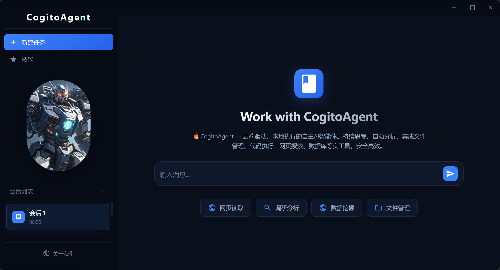
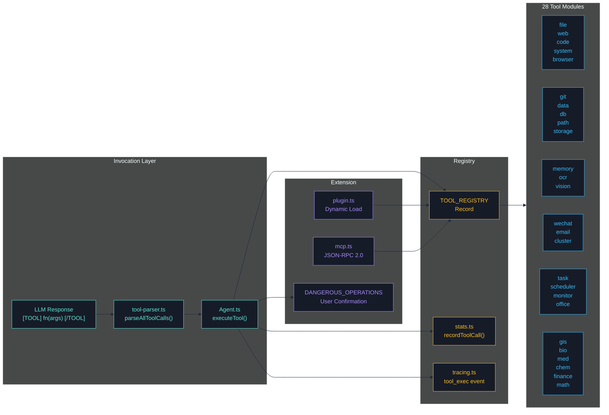
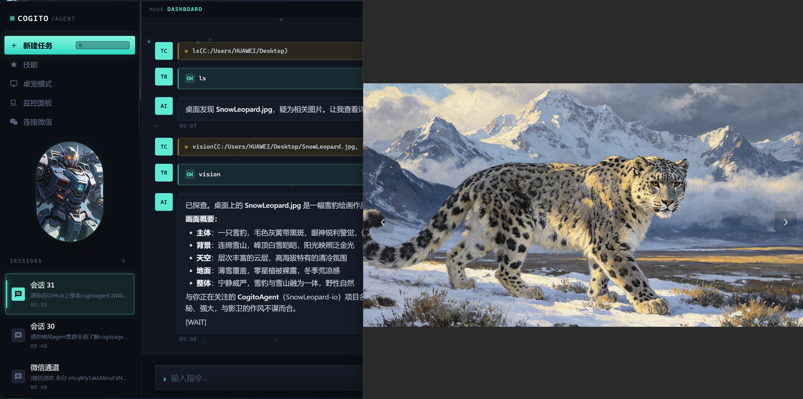
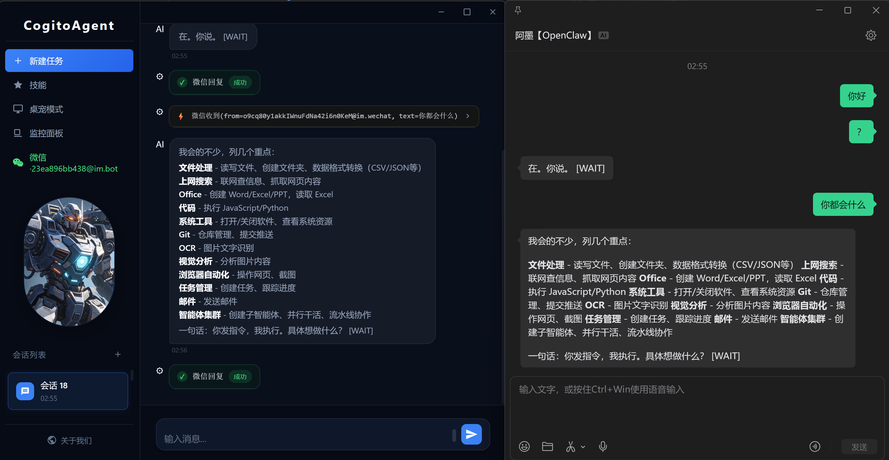
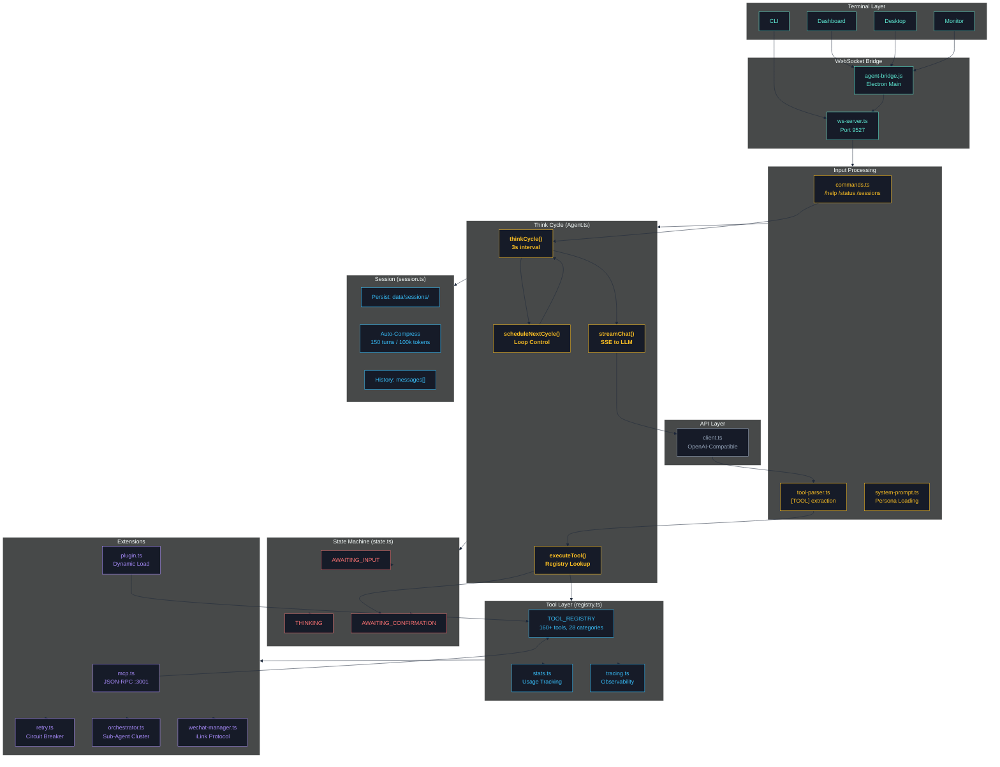
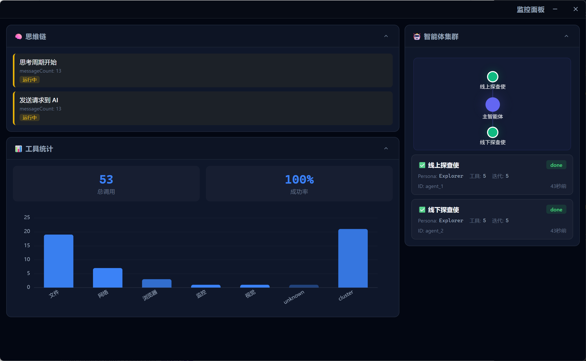

<div align="center">

# 🧠 CogitoAgent

> **Think Continuously · Act Autonomously · Stay Private**
>
> _Your AI agent that lives in your computer — not in the cloud._

[](https://gitee.com/cnt-code/cogito-agent)
[](https://github.com/SnowLeopard-io/CogitoAgent)
[](https://www.npmjs.com/package/cogitoagent)
[](https://www.npmjs.com/package/cogitoagent)
[](<>)
[](<>)
[](<>)
[](<>)
[](<>)
[](https://github.com/SnowLeopard-io/CogitoAgent/actions)
[](https://github.com/SnowLeopard-io/CogitoAgent/issues?q=is%3Aopen+is%3Aissue+label%3A%22good+first+issue%22)
[](ROADMAP.md)

</div>

<p align="center">
  <a href="README.md">English</a> · <a href="README.zh.md">中文</a> ·
  <a href="ROADMAP.md">Roadmap</a> ·
  <a href="CHANGELOG.md">Changelog</a> ·
  <a href="CONTRIBUTING.md">Contributing</a> ·
  <a href="CODE_OF_CONDUCT.md">Code of Conduct</a>
</p>

Cogito, ergo sum — **CogitoAgent is not just a tool; it is your autonomous AI agent that lives in your computer.**

Unlike cloud-dependent agents that upload your files to third-party servers, CogitoAgent runs directly in your local workspace. Powered by the LLM API of your choice, it **thinks continuously**, **explores autonomously**, and **executes 200+ tools** — all while keeping your data private and secure.



---

## Core Features

| Feature                         | Description                                                                                                                                                             |
| ------------------------------- | ----------------------------------------------------------------------------------------------------------------------------------------------------------------------- |
| **TypeScript Core**             | Full TypeScript migration with type safety and compile-time error detection                                                                                             |
| **Privacy First**               | Workspace files stay local; only conversation context is sent to the LLM API you specify                                                                                |
| **Continuous Thinking**         | Automatically triggers a thinking cycle every 3 seconds (configurable)                                                                                                  |
| **Tool Execution**              | 28 tool modules with 200+ tools for file operations, code execution, Git, databases, OCR, Office documents, GIS, bioinformatics, medicine, chemistry, finance, and more |
| **Security Sandbox**            | JavaScript code execution uses `isolated-vm` for process-level isolation                                                                                                |
| **Multi-Session Management**    | Multiple independent conversation sessions with persistent storage and auto-compression                                                                                 |
| **Desktop Mode**                | Electron desktop window communicating via WebSocket with the terminal Agent                                                                                             |
| **MCP Protocol**                | Expose tools as MCP Server for integration with other AI clients                                                                                                        |
| **Plugin System**               | Dynamically load custom tool plugins                                                                                                                                    |
| **Thought Chain Visualization** | Real-time visualization of thinking process and tool execution                                                                                                          |
| **Agent Cluster**               | Sub-agent creation, task delegation, and multi-agent collaboration                                                                                                      |
| **Monitor Panel**               | Dedicated window for real-time cluster topology, thought chain, and tool stats                                                                                          |
| **WeChat Integration**          | QR code login, message sending/receiving, dedicated session, tool bubble display                                                                                        |

### Comparison with Other AI Agents

| Feature                              |   CogitoAgent    |     AutoGPT      |  Claude Code  |      Cline       |
| ------------------------------------ | :--------------: | :--------------: | :-----------: | :--------------: |
| **Privacy (files stay local)**       |        ✅        |        ❌        |      ❌       |        ⚠️        |
| **Continuous thinking (auto-cycle)** |      ✅ 3s       |        ❌        |      ❌       |        ❌        |
| **Desktop GUI (Electron)**           |        ✅        |        ❌        |      ❌       |        ❌        |
| **MCP Protocol support**             |    ✅ Server     |        ❌        |   ✅ Client   |    ✅ Client     |
| **Plugin system**                    | ✅ Dynamic load  |        ✅        |      ❌       |        ❌        |
| **Agent Cluster (sub-agents)**       |        ✅        |        ❌        |      ❌       |        ❌        |
| **WeChat integration**               |        ✅        |        ❌        |      ❌       |        ❌        |
| **Code sandbox (isolated-vm)**       |        ✅        |        ❌        |      ❌       |        ❌        |
| **200+ built-in tools**              |        ✅        |        ❌        |      ❌       |        ❌        |
| **Multi-session + auto-compress**    |        ✅        |        ❌        |      ❌       |        ❌        |
| **Docker support**                   |        ✅        |        ✅        |      ❌       |        ✅        |
| **Open source**                      |  ✅ Apache 2.0   |      ✅ MIT      |      ❌       |  ✅ Apache 2.0   |
| **Free to use**                      | ✅ (BYO LLM key) | ✅ (BYO LLM key) | ❌ (paid API) | ✅ (BYO LLM key) |

> **Privacy note**: CogitoAgent never uploads your files to any cloud. Only conversation context is sent to the LLM API you specify. Your workspace stays yours.

---

## 🚀 Quick Start

### Requirements

- **Node.js** 22.12 or higher
- **npm** or **yarn** package manager
- **Python** 3.x (optional, for Python code execution)

> **Note for users in China**: If `npm install` fails to download the Electron binary:
>
> ```bash
> $env:ELECTRON_MIRROR = "https://npmmirror.com/mirrors/electron/"
> npm install
> ```

### Installation

```bash
git clone https://github.com/SnowLeopard-io/CogitoAgent.git
cd cogito-agent
npm install
npm start
```

If you're in China, use the Gitee mirror for faster download:

```bash
git clone https://gitee.com/cnt-code/cogito-agent.git
cd cogito-agent
npm install
npm start
```

### First-Time Setup

1. **API Base URL** — Supports OpenAI-compatible third-party APIs
2. **API Key** — Your API key
3. **Model Name** — e.g., gpt-4o, claude-3-sonnet, etc.
4. **Workspace Path** — The directory the AI can access
5. **Persona Selection** — Choose a preset AI persona

### Usage Modes

| Command                      | Mode           | Description                                                          |
| ---------------------------- | -------------- | -------------------------------------------------------------------- |
| `npm start`                  | Setup Wizard   | First-time configuration or modifying settings                       |
| `npm run electron:desktop`   | Desktop Mode   | Electron overlay window + terminal Agent via WebSocket               |
| `npm run electron:dashboard` | Dashboard Mode | Full-window dashboard with session management and tool visualization |
| `npm run cli`                | CLI Mode       | Terminal-only, no Electron (for server/headless environments)        |

---

## Tool System

All tools are managed by `registry.ts` and invoked via `[TOOL] functionName(args) [/TOOL]`.



| Category           | File           | Main Functions                                                                                                                                                                                                                                                                                    |
| ------------------ | -------------- | ------------------------------------------------------------------------------------------------------------------------------------------------------------------------------------------------------------------------------------------------------------------------------------------------- |
| File Operations    | `file.ts`      | `ls`, `read`, `create`, `copy`, `mkdir`, `write`, `append`, `move`, `rename`, `delete`                                                                                                                                                                                                            |
| Path Utilities     | `path.ts`      | `getBasePath`, `joinPath`, `resolvePath`, `normalizePath`, `getExtension`, `getFileName`, `getParentDir`                                                                                                                                                                                          |
| Web Tools          | `web.ts`       | `search`, `browse`, `fetchPage`                                                                                                                                                                                                                                                                   |
| Browser Automation | `browser.ts`   | `initBrowser`, `clickElement`, `fillField`, `selectOption`, `viewChanges`, `getPageContent`, `takeScreenshot`, `closeBrowser`, `searchOnPage`, `findElements`, `searchOnEngine`, `downloadFile`                                                                                                   |
| System Operations  | `system.ts`    | `listApps`, `openApp`, `closeApp`                                                                                                                                                                                                                                                                 |
| Code Execution     | `code.ts`      | `executeCode`, `executeFile`, `runJavaScript`, `runPython`, `formatCode`                                                                                                                                                                                                                          |
| Security Sandbox   | `sandbox.ts`   | `createJavaScriptSandbox`, `runJavaScriptSandbox`, `runPythonSandbox`, `executeCodeSandbox`                                                                                                                                                                                                       |
| Git                | `git.ts`       | `gitInit`, `gitClone`, `gitAdd`, `gitCommit`, `gitPush`, `gitPull`, `gitStatus`, `gitLog`, `gitBranchCreate`, `gitBranchDelete`, `gitBranchList`, `gitCheckout`, `gitCheckoutNew`, `gitMerge`, `gitDiff`, `gitRemoteAdd`, `gitRemoteList`, `gitConfigUser`, `gitReset`, `gitStash`, `gitStashPop` |
| Task Management    | `task.ts`      | `createTask`, `getTasks`, `getTask`, `updateTask`, `deleteTask`, `completeTask`, `splitTask`, `getTaskStats`, `clearTasks`                                                                                                                                                                        |
| Memory System      | `memory.ts`    | `addMemory`, `searchMemory`, `getAllMemories`, `getMemory`, `updateMemory`, `deleteMemory`, `getMemoryStats`, `getRelatedMemories`, `clearMemory`                                                                                                                                                 |
| Data Processing    | `data.ts`      | `readCSV`, `writeCSV`, `readJSON`, `writeJSON`, `csvToJSON`, `jsonToCSV`, `queryData`, `analyzeData`, `sortData`, `filterData`, `groupData`, `aggregateData`                                                                                                                                      |
| Database           | `db.ts`        | `executeSQL`, `query`, `insert`, `update`, `deleteData`, `createTable`, `dropTable`, `getTables`, `getTableSchema`, `executeTransaction`, `closeDB`                                                                                                                                               |
| Email              | `email.ts`     | `sendEmail`, `sendTextEmail`, `sendHtmlEmail`, `sendTemplateEmail`, `sendEmailWithAttachments`, `checkEmailConfig`                                                                                                                                                                                |
| System Monitoring  | `monitor.ts`   | `getCPUInfo`, `getMemoryInfo`, `getDiskInfo`, `getNetworkInfo`, `getProcesses`, `getSystemInfo`, `getCurrentProcess`, `getSystemLoad`, `monitorSystem`                                                                                                                                            |
| Scheduled Tasks    | `scheduler.ts` | `addScheduleTask`, `getScheduleTasks`, `getScheduleTask`, `updateScheduleTask`, `toggleScheduleTask`, `removeScheduleTask`, `startScheduler`, `stopScheduler`                                                                                                                                     |
| Storage            | `storage.ts`   | `FileStorage`, `createStorage`, `getStorage`, `clearStorage`                                                                                                                                                                                                                                      |
| Image Recognition  | `ocr.ts`       | `ocr`, `ocrBatch`                                                                                                                                                                                                                                                                                 |
| Vision Analysis    | `vision.ts`    | `vision`, `visionFromUrl`                                                                                                                                                                                                                                                                         |
| Office Documents   | `office.ts`    | `createPpt`, `createWord`, `createExcel`, `readExcel`                                                                                                                                                                                                                                             |
| Cluster            | `cluster.ts`   | `spawnAgent`, `delegateTask`, `getClusterStatus`, `stopAgent`, `stopAllAgents`, `parallelExecute`, `panelDiscussion`, `pipeline`, `voting`                                                                                                                                                        |
| WeChat             | `wechat.ts`    | `loginWechat`, `logoutWechat`, `sendWechatMessage`, `sendWechatImage`, `getWechatStatus`, `generateWechatQRCode`                                                                                                                                                                                  |
| GIS                | `gis.ts`       | `convertCoord`, `calcDistance`, `calcArea`, `calcCenter`, `pointInPolygon`, `isInChina`, `readGeoJSON`, `queryGeoJSON`, `geoJSONStats`, `geoJSONToCSV`, `geoJSONToKML`                                                                                                                            |
| Life Science       | `bio.ts`       | `dnaComplement`, `dnaReverseComplement`, `rnaTranscribe`, `translate`, `gcContent`, `molecularWeight`, `hammingDistance`, `levenshteinDistance`, `tmEstimate`, `hairpinCheck`, `parseFASTA`, `parseFASTQ`, `fastaToCSV`, `codonUsage`, `randomSeq`                                                |
| Medicine           | `med.ts`       | `bmi`, `bsa`, `egfr`, `crcl`, `childPugh`, `calculateDose`, `bsaDose`, `infusionRate`, `idealBodyWeight`, `convertUnit`, `temperatureConvert`, `meanArterialPressure`, `anionGap`, `correctedCalcium`, `oxygenIndex`, `parseVitalSigns`, `vitalsReport`                                           |
| Chemistry          | `chem.ts`      | `elementInfo`, `molWeight`, `elementComposition`, `molarity`, `dilution`, `phFromH`, `phToH`, `idealGasLaw`, `gasDensity`                                                                                                                                                                         |
| Finance            | `finance.ts`   | `compoundInterest`, `presentValue`, `futureValueAnnuity`, `npv`, `irr`, `paybackPeriod`, `roi`, `loanPayment`, `amortizationSchedule`, `totalInterest`, `movingAverage`, `volatility`                                                                                                             |
| Math/Stats         | `math.ts`      | `describe`, `correlation`, `linearRegression`, `matrixMultiply`, `matrixDeterminant`, `matrixInverse`, `solveQuadratic`, `factorial`, `combination`, `permutation`, `siConvert`                                                                                                                   |

> Detailed tool documentation: registration mechanism, usage examples, best practices → [introduction/tools.md](introduction/tools.md) (Chinese)

<p align="center">
  
  
  <!--  -->
  <br>
  <em>Image Vision · Web Search · Browser Automation</em>
</p>

---

## Architecture



| Component               | Responsibility                                                             |
| ----------------------- | -------------------------------------------------------------------------- |
| **Agent.ts**            | Thinking loop — automatically triggers every 3 seconds                     |
| **state.ts**            | State machine — THINKING / AWAITING_INPUT / AWAITING_CONFIRMATION          |
| **registry.ts**         | Tool registry — centralized management of all tool modules                 |
| **session.ts**          | Session management — multi-session switching, context compression          |
| **commands.ts**         | Command handling — /help, /status, /persona, /sessions, etc.               |
| **sandbox.ts**          | Code sandbox — isolated-vm process-level isolation                         |
| **stats.ts**            | Statistics — tool usage tracking and metrics                               |
| **tracing.ts**          | Tracing — lightweight observability for tool executions and LLM calls      |
| **cluster-commands.ts** | Cluster commands — spawn, delegate, stop sub-agents                        |
| **mcp.ts**              | MCP Server — expose tools as MCP protocol                                  |
| **plugin.ts**           | Plugin system — dynamic loading of custom tool plugins                     |
| **ws-server.ts**        | WebSocket — desktop mode communication (port 9527)                         |
| **wechat-manager.ts**   | WeChat Channel — iLink protocol integration, message routing, session sync |

> Complete architecture details: think cycle diagrams, tool call flow, state machine, message flow, WebSocket → [introduction/architecture.md](introduction/architecture.md) (Chinese)

---

## Command Reference

| Command                                 | Description                          |
| --------------------------------------- | ------------------------------------ |
| `/sessions`                             | List all sessions                    |
| `/new`                                  | Create a new session                 |
| `/switch <id>`                          | Switch to a session                  |
| `/delete <id>`                          | Delete a session                     |
| `/rename <name>`                        | Rename current session               |
| `/help`                                 | Display help                         |
| `/status`                               | Display current status               |
| `/config`                               | Display configuration                |
| `/persona <name>`                       | Switch persona                       |
| `/personas`                             | List all available personas          |
| `/tools`                                | List all available tools             |
| `/clear`                                | Clear conversation history           |
| `/debug`                                | Toggle debug mode                    |
| `/wechat/status`                        | Show WeChat channel status           |
| `/wechat/login`                         | Login to WeChat via QR code          |
| `/wechat/logout`                        | Logout from WeChat                   |
| `/spawn <persona> <name> <instruction>` | Create a sub-agent                   |
| `/agents`                               | List all sub-agents                  |
| `/delegate <agentId> <task>`            | Delegate task to sub-agent           |
| `/stop-agent <agentId>`                 | Stop a sub-agent                     |
| `/stop-all-agents`                      | Stop all sub-agents                  |
| `ENTER`                                 | Interrupt thinking, enter input mode |
| `exit`                                  | Exit the program                     |

---

## Configuration

Configuration via `config.json` and environment variables (`.env`), with env vars taking priority.

> Full configuration reference: environment variables list, advanced options (compression, truncation, archiving) → [introduction/configuration.md](introduction/configuration.md) (Chinese)

---

## Project Structure

```
cogito-agent/
├── src/                              # Source code (TypeScript)
│   ├── agent/                        # Core agent module
│   │   ├── Agent.ts / state.ts / registry.ts
│   │   ├── commands.ts / session.ts / stats.ts
│   │   ├── mcp.ts / plugin.ts / thought-trace.ts / retry.ts
│   │   ├── wechat-manager.ts         # WeChat channel management
│   │   └── tools/                    # 16+ tool modules
│   ├── api/                          # API layer (client, models, webSearch)
│   ├── io/                           # Terminal, Logger, WebSocket
│   ├── config.ts                     # Configuration management
│   ├── types/                        # TypeScript type definitions
│   └── index.ts                      # Application entry
├── electron/                         # Desktop mode (JS)
│   ├── main.js / preload.cjs / agent-bridge.js
│   ├── desktop/ / dashboard/ / monitor/ / setup/
│   ├── shared/                       # Shared utilities
│   └── assets/
├── personas/                         # 22 preset personas (13 modern + 9 ancient)
├── tests/                            # Test files
├── data/                             # Runtime data (auto-created)
├── tsconfig.json                     # TypeScript config
└── introduction/                     # Detailed documentation
    ├── tools.md                      # Tool system details
    ├── architecture.md               # Architecture details
    ├── configuration.md              # Configuration guide
    ├── systems.md                    # Core systems details
    ├── extensions.md                 # Extensions details
    └── deployment.md                 # Deployment & development
```

---

## Core Systems

> See [introduction/systems.md](introduction/systems.md) (Chinese) for details

```mermaid
%%{init: {"theme": "dark", "themeVariables": {"bgColor": "#0b0e14", "primaryColor": "#5eead4", "primaryTextColor": "#5eead4", "primaryBorderColor": "#5eead4", "lineColor": "#1e293b", "textColor": "#94a3b8", "fontFamily": "JetBrains Mono, monospace", "fontSize": "10", "secondaryColor": "#161b28", "tertiaryColor": "#1c2230"}}}%%
flowchart TD
    subgraph ORCHESTRATION["Orchestration"]
        AGENT["Agent.ts<br/>Think Cycle 3s"]
        STATE["state.ts<br/>THINKING / AWAIT / CONFIRM"]
        SESSION["session.ts<br/>Multi-Session + Persist"]
        CMDS["commands.ts<br/>/help /status /sessions"]
    end

    subgraph COGNITION["Cognition"]
        MEMORY["memory.ts<br/>SQLite Storage + Semantic Search"]
        PERSONA["system-prompt.ts<br/>22 Personas + Custom"]
        THOUGHT["thought-trace.ts<br/>Real-Time Chain Visualization"]
    end

    subgraph EXECUTION["Execution"]
        REGISTRY["registry.ts<br/>160+ Tools, 28 Categories"]
        SANDBOX["sandbox.ts<br/>isolated-vm + Python Subprocess"]
        TASK["task.ts<br/>CRUD + Decomposition + Stats"]
        CLUSTER["orchestrator.ts<br/>Sub-Agent Spawn + Delegate"]
    end

    subgraph OBSERVABILITY["Observability"]
        STATS["stats.ts<br/>Per-Category Usage + Metrics"]
        TRACING["tracing.ts<br/>Event Logging + Duration"]
    end

    subgraph SECURITY["Security"]
        DANGER["DANGEROUS_OPERATIONS<br/>User Confirmation Required"]
        RETRY["retry.ts<br/>Circuit Breaker + Backoff"]
    end

    subgraph INTEGRATION["Integration"]
        MCP["mcp.ts<br/>JSON-RPC 2.0 on :3001"]
        PLUGIN["plugin.ts<br/>Dynamic Tool Loading"]
        WECHAT["wechat-manager.ts<br/>iLink QR Login + Routing"]
    end

    AGENT --> STATE
    AGENT --> SESSION
    AGENT --> CMDS
    AGENT --> MEMORY
    AGENT --> PERSONA
    AGENT --> THOUGHT
    AGENT --> REGISTRY
    REGISTRY --> SANDBOX
    REGISTRY --> TASK
    REGISTRY --> CLUSTER
    AGENT --> STATS
    AGENT --> TRACING
    AGENT --> DANGER
    AGENT --> RETRY
    AGENT --> MCP
    AGENT --> PLUGIN
    AGENT --> WECHAT

    classDef orchestration fill:#161b28,stroke:#fbbf24,color:#fbbf24,font-weight:bold;
    classDef cognition fill:#161b28,stroke:#a78bfa,color:#a78bfa;
    classDef execution fill:#161b28,stroke:#38bdf8,color:#38bdf8;
    classDef obs fill:#161b28,stroke:#94a3b8,color:#94a3b8;
    classDef security fill:#161b28,stroke:#f87171,color:#f87171;
    classDef integration fill:#161b28,stroke:#5eead4,color:#5eead4;

    class AGENT,STATE,SESSION,CMDS orchestration;
    class MEMORY,PERSONA,THOUGHT cognition;
    class REGISTRY,SANDBOX,TASK,CLUSTER execution;
    class STATS,TRACING obs;
    class DANGER,RETRY security;
    class MCP,PLUGIN,WECHAT integration;
```



- **Memory System** — JSON-based long-term storage with tag-based semantic retrieval
- **Task Management** — Task creation, decomposition, and status tracking
- **Code Sandbox** — `isolated-vm` process-level isolation for JS and Python
- **Personas** — 25 preset roles (14 modern + 11 ancient/regional) with custom and hot-switch support
- **Session Management** — Independent contexts with auto-compression
- **Statistics** — Tool usage tracking and performance metrics
- **Thought Chain Visualization** — Real-time thinking process display
- **Agent Cluster** — Sub-agent creation, task delegation, and cluster monitoring, see [introduction/agent-cluster.md](introduction/agent-cluster.md)

<p align="center">
  
  <br>
  <em>Agent Cluster Monitoring Panel</em>
</p>

## Extensions

> See [introduction/extensions.md](introduction/extensions.md) (Chinese) for details

- **Plugin System** — Dynamic loading of custom tool plugins
- **MCP Protocol** — Expose tools as MCP Server
- **Tracing** — Lightweight observability for tool executions and LLM calls
- **Circuit Breaker & Retry** — Reliable network requests
- **Multi-Model** — OpenAI, Moark, Anthropic, Google support
- **Web Search** — Built-in internet search capability

## Docker

> See [introduction/deployment.md](introduction/deployment.md) (Chinese) for details

```bash
docker-compose up -d
```

---

## Changelog

See [CHANGELOG.md](CHANGELOG.md) for a full version history.

---

## Community

Join the CogitoAgent community:

- [GitHub Issues](https://github.com/SnowLeopard-io/CogitoAgent/issues) — Report bugs and request features
- [GitHub Discussions](https://github.com/SnowLeopard-io/CogitoAgent/discussions) — Ask questions and share ideas
- [Gitee](https://gitee.com/cnt-code/cogito-agent) — Chinese mirror repository

We welcome all contributions, feedback, and ideas!

---

## Contributing

We welcome contributions from the community! Whether you want to fix a bug, add a new feature, or improve documentation, your help is appreciated.

<a href="https://github.com/SnowLeopard-io/CogitoAgent/issues?q=is%3Aopen+is%3Aissue+label%3A%22good+first+issue%22"></a>
<a href="https://github.com/SnowLeopard-io/CogitoAgent/issues?q=is%3Aopen+is%3Aissue+label%3A%22help+wanted%22"></a>

### Getting Started

1. Read our [Contributing Guide](CONTRIBUTING.md) for detailed instructions
2. Check out [good first issues](https://github.com/SnowLeopard-io/CogitoAgent/issues?q=is%3Aopen+is%3Aissue+label%3A%22good+first+issue%22) to get started
3. Follow our [Code of Conduct](CODE_OF_CONDUCT.md)
4. Report security issues via [SECURITY.md](SECURITY.md)

### Ways to Contribute

- 🐛 Report bugs
- ✨ Suggest new features
- 📝 Improve documentation
- 🧪 Write tests
- 🔧 Fix issues
- 🎨 Improve UI/UX

---

## License

Apache 2.0

---

Built with CogitoAgent Team
