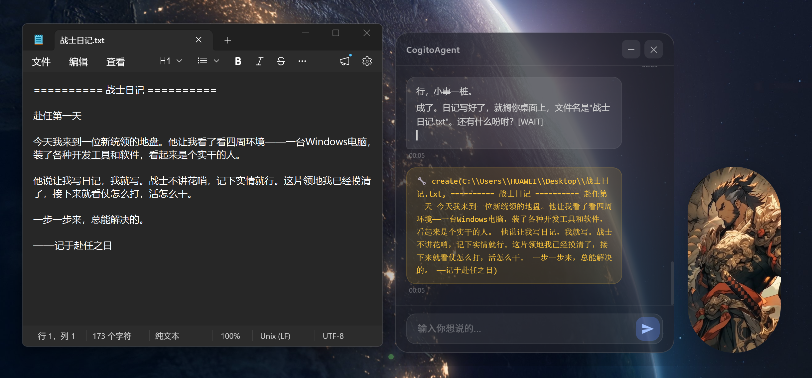
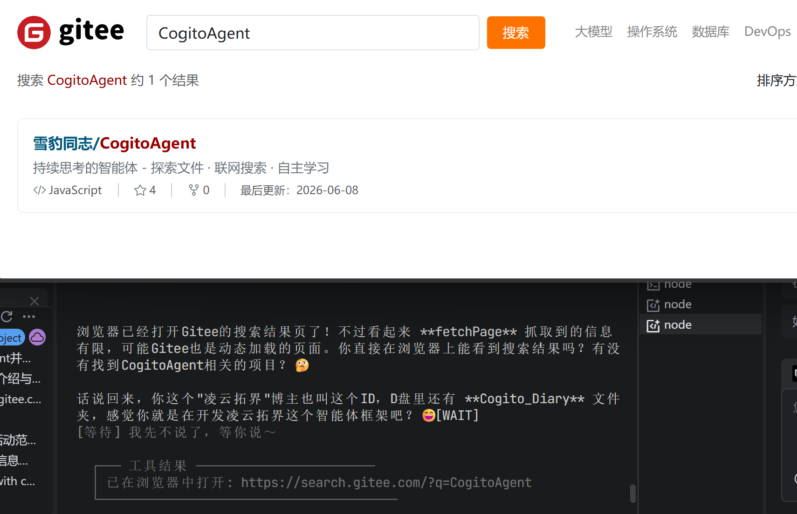
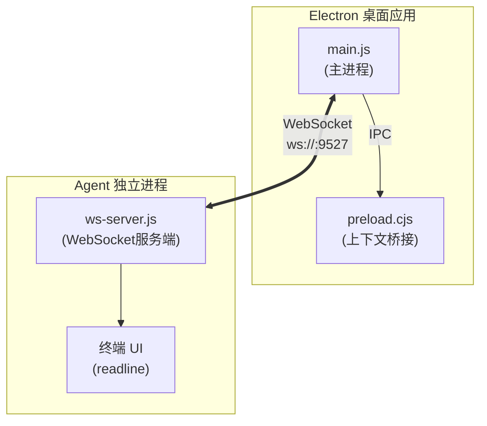
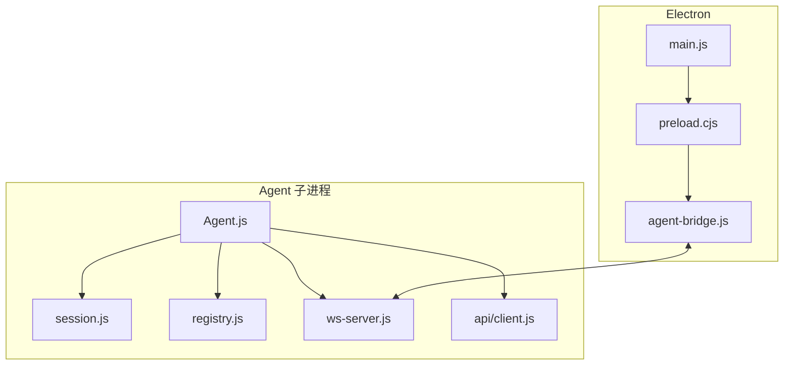
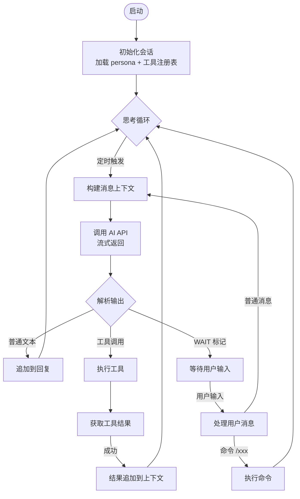
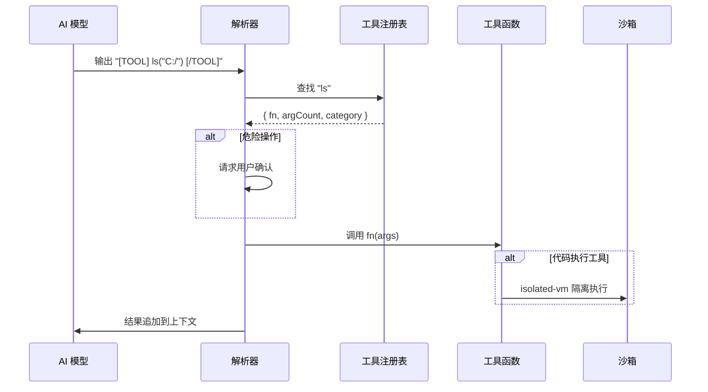
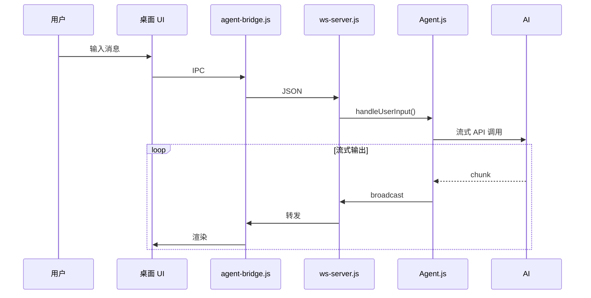
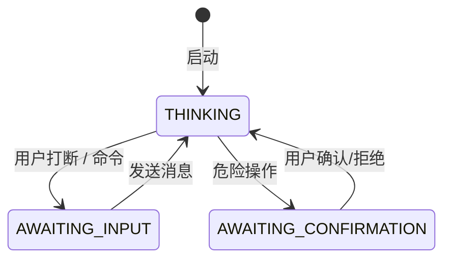

<h1 align="center">
  <strong style="font-size: 3em; background: linear-gradient(135deg, #667eea 0%, #764ba2 100%); -webkit-background-clip: text; -webkit-text-fill-color: transparent;">
    CogitoAgent
  </strong>
</h1>

<p align="center">
  <strong style="font-size: 1.4em; color: #667eea;">✦ 持续思考的本地自主 AI 智能体 ✦</strong>
  <br>
  <em style="font-size: 1.1em; color: #888;">Think Continuously · Act Autonomously · Stay Private</em>
</p>

<p align="center">
  <a href="#-核心特性">⚡ 特性</a> &nbsp;·&nbsp;
  <a href="#-快速开始">🚀 快速开始</a> &nbsp;·&nbsp;
  <a href="#持续思考循环">🧠 架构</a> &nbsp;·&nbsp;
  <a href="#工具系统">🔧 工具</a> &nbsp;·&nbsp;
  <a href="src/agent/tools/TOOL_DEVELOPMENT.md">📦 开发</a>
</p>

<br>

<p align="center" style="display: flex; justify-content: center; gap: 8px; flex-wrap: wrap;">
  <a href="#"></a>
  <a href="#"></a>
  <a href="#"></a>
  <a href="#"></a>
  <a href="#"></a>
</p>

<br>

<div align="center">
  
</div>

<br>

<table align="center">
  <tr>
    <td align="center" width="50%">
      
      <br>
      <sub>🖥️ 桌面模式 — Electron 窗口</sub>
    </td>
    <td align="center" width="50%">
      
      <br>
      <sub>💬 终端模式 — CLI 交互界面</sub>
    </td>
  </tr>
</table>

<br>

---

> **Cogito, ergo sum** — 我思故我在。CogitoAgent 不仅仅是一个工具，它是你本地环境中的自主思维伙伴。

**CogitoAgent** 是一款运行于本地的自主 AI 智能体，融合了文件管理、知识挖掘、系统操作、代码执行与联网能力。它直接在用户配置的工作目录下运行，**无需上传任何文件至第三方服务器**，在保障数据隐私安全的同时，提供持续运转的智能助理服务。

不同于传统的聊天机器人，CogitoAgent 具备 **持续思考** · **自主探索** · **工具执行** 的能力，能够在后台主动发现和整理用户的本地文件资产，并可通过扩展工具集获得更多能力。

---

## 核心特性

| 特性 | 说明 |
|------|------|
| **隐私优先** | 所有数据本地存储，不上传任何文件到第三方服务器 |
| **持续思考** | 每3秒自动触发思考循环，主动分析当前任务状态 |
| **工具执行** | 内置 18 个工具模块，支持文件操作、代码执行、Git、数据库、OCR 等 |
| **安全沙箱** | JavaScript 代码执行采用 `isolated-vm` 进程级隔离 |
| **多会话管理** | 支持多个独立对话会话，会话数据持久化存储 |
| **桌面模式** | Electron 桌面窗口，与终端 Agent 通过 WebSocket 通信 |

---

## 🚀 快速开始

### 环境要求

- **Node.js** 18.0 或更高版本
- **npm** 或 **yarn** 包管理器
- **Python** 3.x（可选，用于 Python 代码执行）

### 安装步骤

```bash
# 克隆项目
git clone https://gitee.com/cnt-code/cogito-agent.git
cd cogito-agent

# 安装依赖
npm install

# 启动程序
npm start
```

### 首次配置

首次运行会自动引导完成以下配置：

1. **API Base URL** - 支持 OpenAI 兼容的第三方 API
2. **API Key** - 您的 API 密钥
3. **模型名称** - 如 gpt-4o、claude-3-sonnet 等
4. **工作区路径** - AI 可以访问的目录（默认为用户主目录）
5. **人设选择** - 选择预设的 AI 人设

### 日常使用

程序支持两种运行模式：

| 命令 | 模式 | 说明 |
|------|------|------|
| `npm start` | 设置向导 | 首次配置或修改配置，不启动 Agent |
| `npm run electron` | 桌面模式 | Electron 桌面窗口 + 终端 Agent，通过 WebSocket 通信 |
| `npm run cli` | CLI 模式 | 仅终端 Agent，不启动 Electron（适合纯命令行环境） |

#### 设置向导

```bash
npm start
```

首次运行会自动打开欢迎页面并引导完成配置。如果已配置，会提示使用正确的启动命令。

#### 桌面模式

```bash
npm run electron
```

Electron 主进程会自动拉起终端 Agent，创建桌面窗口并连接。

**交互方式：**

- **桌面窗口** — 半透明毛玻璃对话框 + 虚拟人物视频，直接在桌面上输入
- **终端输入** — 在启动终端中直接输入指令，按 ENTER 发送
- **ENTER** — 打断当前 AI 思考，进入输入状态
- **exit** — 退出程序（或直接关闭桌面窗口）


#### CLI 模式

```bash
npm run cli
```

纯命令行模式，不启动 Electron 和 WebSocket 服务，直接在终端交互。

适合：
- 服务器环境
- 无图形界面的远程连接
- 资源受限环境

#### 会话选择器（正在测试 暂未上线）

启动时（CLI 和 Electron 模式）会显示会话选择界面，用户可以选择进入已有会话或创建新会话。

**CLI 模式会话选择：**

```
  ────────────────────────────────────────────
  📋 选择会话：
    0 - 创建新会话
    1 - 默认会话 ◀ 当前
        最后活跃: 06/20 15:30
    2 - 工作讨论
        最后活跃: 06/19 10:22
  ────────────────────────────────────────────
  请输入编号: _
```

输入编号直接进入对应会话，输入 `0` 创建新会话。

**Electron 模式会话选择：**

桌面窗口启动后显示会话列表，点击会话卡片进入对应会话，点击"新建会话"按钮创建新会话。

---

## 持续思考循环

Agent 的核心是一个持续运行的思考循环。启动后，Agent 每隔 3 秒（可通过 `thinkingInterval` 配置）自动触发一轮思考流程：

1. 构建当前消息上下文（包括系统 prompt、工具注册表、历史对话）
2. 调用 AI API（流式返回）
3. 解析 AI 输出：
   - 普通文本 → 直接追加到回复
   - 工具调用 → 执行工具函数，结果追加到上下文
   - WAIT 标记 → 暂停，等待用户输入

用户可随时通过 `ENTER` 打断当前思考，直接输入指令。

## 工具系统

工具系统由 `registry.js` 统一管理，所有工具函数通过 `[TOOL] functionName(args) [/TOOL]` 格式调用。

### 工具分类

| 分类 | 文件 | 主要功能 |
|------|------|----------|
| 文件操作 | `file.js` | `ls`, `read`, `create`, `copy`, `mkdir`, `delete`, `move` |
| 网页工具 | `web.js` | `search`, `browse`, `fetchPage`, `searchOnEngine` |
| 浏览器自动化 | `browser.js` | `initBrowser`, `clickElement`, `fillField`, `takeScreenshot` |
| 系统操作 | `system.js` | `listApps`, `openApp`, `closeApp` |
| 代码执行 | `code.js` | `executeCode`, `runJavaScript`, `runPython` |
| Git | `git.js` | `gitStatus`, `gitCommit`, `gitPush`, `gitPull`, `gitDiff`, `gitLog` |
| 任务管理 | `task.js` | `createTask`, `getTasks`, `completeTask`, `splitTask` |
| 记忆系统 | `memory.js` | `addMemory`, `searchMemory`, `getRelatedMemories`, `deleteMemory` |
| 数据处理 | `data.js` | `readCSV`, `writeJSON`, `csvToJSON`, `queryData` |
| 数据库 | `db.js` | `executeSQL`, `query`, `insert`, `update`, `createTable`, `getTables` |
| 邮件 | `email.js` | `sendEmail`, `sendTextEmail`, `sendHtmlEmail` |
| 系统监控 | `monitor.js` | `getCPUInfo`, `getMemoryInfo`, `monitorSystem` |
| 定时任务 | `scheduler.js` | `addScheduleTask`, `getScheduleTasks`, `toggleScheduleTask` |
| 图像识别 | `ocr.js` | `ocr`, `ocrBatch` |

### 工具注册机制

工具函数统一注册到注册表，包含以下元数据：

```javascript
{
  name: '函数名',
  description: '函数描述',
  parameters: { /* JSON Schema */ },
  category: '分类',
  dangerLevel: 'none | low | medium | high',  // 危险操作需用户确认
  fn: async (args) => { /* 实现 */ }
}
```

### 工具调用示例

```
AI: [TOOL] ls("/project/src") [/TOOL]
→ 返回目录文件列表

AI: [TOOL] runPython("print('hello')") [/TOOL]
→ 执行 Python 代码，返回输出
```

> 详细工具开发文档参见 [src/agent/tools/TOOL_DEVELOPMENT.md](src/agent/tools/TOOL_DEVELOPMENT.md)

### 浏览器自动化详解

浏览器自动化工具基于 Playwright 实现，支持网页交互、截图、表单填写等操作。



#### 核心工具

| 工具 | 说明 | 参数 |
|------|------|------|
| `initBrowser` | 初始化浏览器实例 | 无 |
| `navigateTo` | 导航到指定 URL | `url` |
| `clickElement` | 点击页面元素 | `selector` |
| `fillField` | 填写表单字段 | `selector`, `value` |
| `takeScreenshot` | 截取页面截图 | `selector`（可选） |
| `getText` | 获取元素文本 | `selector` |
| `waitForElement` | 等待元素出现 | `selector`, `timeout` |
| `closeBrowser` | 关闭浏览器实例 | 无 |

#### 使用示例

**基本网页浏览：**

```javascript
// 初始化浏览器
[TOOL] initBrowser() [/TOOL]

// 导航到网页
[TOOL] navigateTo("https://example.com") [/TOOL]

// 截取整页截图
[TOOL] takeScreenshot() [/TOOL]

// 关闭浏览器
[TOOL] closeBrowser() [/TOOL]
```

**表单填写与提交：**

```javascript
// 初始化并导航
[TOOL] initBrowser() [/TOOL]
[TOOL] navigateTo("https://login.example.com") [/TOOL]

// 填写登录表单
[TOOL] fillField("#username", "myuser") [/TOOL]
[TOOL] fillField("#password", "mypassword") [/TOOL]

// 点击登录按钮
[TOOL] clickElement("#login-button") [/TOOL]

// 等待登录成功
[TOOL] waitForElement(".dashboard", 5000) [/TOOL]

// 截取登录后页面
[TOOL] takeScreenshot() [/TOOL]
```

**数据抓取：**

```javascript
// 导航到目标页面
[TOOL] navigateTo("https://news.example.com") [/TOOL]

// 获取标题列表
[TOOL] getText(".article-title") [/TOOL]

// 截取特定区域
[TOOL] takeScreenshot(".main-content") [/TOOL]
```

#### 浏览器配置

**浏览器类型：**

默认使用 Chromium，可通过配置切换：

```json
{
  "browser": {
    "type": "chromium",  // chromium | firefox | webkit
    "headless": true,    // 无头模式
    "timeout": 30000     // 默认超时（ms）
  }
}
```

**安全限制：**

- 浏览器实例最多存活 5 分钟
- 自动关闭长时间未操作的浏览器
- 禁止访问本地文件系统 URL（file://）
- 截图自动保存到临时目录，定期清理

#### 最佳实践

1. **及时关闭浏览器** - 避免资源浪费
2. **使用无头模式** - 提高执行效率
3. **合理设置超时** - 防止页面加载卡死
4. **选择器优先级** - ID > Class > XPath
5. **错误处理** - 检查元素是否存在再操作

### 数据库操作详解

数据库工具支持 SQLite 数据库的创建、查询、插入、更新等操作。

#### 核心工具

| 工具 | 说明 | 参数 |
|------|------|------|
| `executeSQL` | 执行任意 SQL 语句 | `sql` |
| `query` | 执行查询语句 | `sql`, `params`（可选） |
| `insert` | 插入数据 | `table`, `data` |
| `update` | 更新数据 | `table`, `data`, `where` |
| `delete` | 删除数据 | `table`, `where` |
| `executeTransaction` | 执行事务 | `statements` |
| `createTable` | 创建表 | `tableName`, `schema` |
| `listTables` | 列出所有表 | 无 |

#### 使用示例

**创建表：**

```javascript
[TOOL] createTable("users", {
  id: "INTEGER PRIMARY KEY AUTOINCREMENT",
  name: "TEXT NOT NULL",
  email: "TEXT UNIQUE",
  created_at: "INTEGER"
}) [/TOOL]
```

**插入数据：**

```javascript
// 单条插入
[TOOL] insert("users", {
  name: "张三",
  email: "zhangsan@example.com",
  created_at: Date.now()
}) [/TOOL]

// 批量插入
[TOOL] executeTransaction([
  { sql: "INSERT INTO users (name, email) VALUES (?, ?)", params: ["张三", "zhang@example.com"] },
  { sql: "INSERT INTO users (name, email) VALUES (?, ?)", params: ["李四", "li@example.com"] }
]) [/TOOL]
```

**查询数据：**

```javascript
// 简单查询
[TOOL] query("SELECT * FROM users") [/TOOL]

// 条件查询
[TOOL] query("SELECT * FROM users WHERE name = ?", ["张三"]) [/TOOL]

// 排序查询
[TOOL] query("SELECT * FROM users ORDER BY created_at DESC LIMIT 10") [/TOOL]
```

**更新数据：**

```javascript
[TOOL] update("users", 
  { email: "newemail@example.com" },
  { name: "张三" }
) [/TOOL]
```

**删除数据：**

```javascript
[TOOL] delete("users", { name: "张三" }) [/TOOL]
```

**事务操作：**

```javascript
[TOOL] executeTransaction([
  { sql: "UPDATE accounts SET balance = balance - 100 WHERE id = 1" },
  { sql: "UPDATE accounts SET balance = balance + 100 WHERE id = 2" },
  { sql: "INSERT INTO transactions (from_id, to_id, amount) VALUES (1, 2, 100)" }
]) [/TOOL]
```

#### 数据库配置

**数据库路径：**

```json
{
  "database": {
    "path": "./data/mydb.db",
    "timeout": 5000
  }
}
```

**安全限制：**

- 只能访问工作区内的数据库文件
- 禁止执行 DROP DATABASE 等危险操作
- 事务失败自动回滚
- 查询结果最多返回 1000 行

#### 数据库管理

**列出所有表：**

```javascript
[TOOL] listTables() [/TOOL]
// → ["users", "tasks", "memories"]
```

**获取表结构：**

```javascript
[TOOL] query("PRAGMA table_info(users)") [/TOOL]
```

**数据库备份：**

```javascript
// 导出数据库
[TOOL] executeSQL("SELECT * FROM users") [/TOOL]
// 将结果保存为 JSON 文件
[TOOL] create("./backup/users.json", JSON.stringify(result)) [/TOOL]
```

#### 最佳实践

1. **使用事务** - 批量操作时使用事务提高性能
2. **参数化查询** - 防止 SQL 注入
3. **索引优化** - 为常用查询字段创建索引
4. **定期备份** - 导出重要数据
5. **错误处理** - 检查 SQL 执行结果

### 图像文字识别（OCR）详解

OCR 工具基于视觉大模型（如 Qwen2.5-VL-32B-Instruct）实现图像文字识别能力，支持常见图片格式的文字提取。

#### 核心工具

| 工具 | 说明 | 参数 |
|------|------|------|
| `ocr` | 识别单张图片中的文字 | `imagePath`（图片路径，支持相对/绝对路径） |
| `ocrBatch` | 批量识别多张图片文字 | `images`（多个图片路径，用英文逗号分隔） |

#### 支持格式

| 格式 | 扩展名 | 说明 |
|------|--------|------|
| JPEG | `.jpg` `.jpeg` | 最常用的压缩图片格式 |
| PNG | `.png` | 无损压缩，支持透明背景 |
| WebP | `.webp` | 现代高效压缩格式 |
| BMP | `.bmp` | 位图，无压缩 |
| GIF | `.gif` | 动图（取第一帧） |

#### 使用示例

**单张图片识别：**

```javascript
// 识别本地图片中的文字
[TOOL] ocr("/path/to/screenshot.png") [/TOOL]
// → 返回识别出的文本内容

// 识别工作区内的图片
[TOOL] ocr("documents/invoice.jpg") [/TOOL]
// → 识别发票图片中的文字信息
```

**批量识别多张图片：**

```javascript
// 批量识别多张截图
[TOOL] ocrBatch("img1.jpg, img2.png, img3.webp") [/TOOL]
// → 依次返回每张图片的识别结果
```

**配合其他工具使用：**

```javascript
// 先获取目录下的图片文件，再识别
[TOOL] ls("./screenshots") [/TOOL]
// → ["page1.png", "page2.png", "page3.png"]

// 识别其中一张图片
[TOOL] ocr("./screenshots/page1.png") [/TOOL]
// → 返回图片中的文字内容
```

#### OCR 配置

在 `config.json` 中配置 OCR 相关参数：

```json
{
  "ocr": {
    "provider": "",              // OCR 服务提供商（可选）
    "baseURL": "",              // OCR API 基础地址，不填则使用 api.baseURL
    "apiKey": "",               // OCR API 密钥（必需）
    "model": "Qwen2.5-VL-32B-Instruct"  // 视觉模型名称
  }
}
```

**配置说明：**

| 字段 | 必需 | 说明 | 默认值 |
|------|------|------|--------|
| `apiKey` | ✅ | OCR 服务的 API 密钥 | - |
| `baseURL` | ⚠️ | API 服务地址，不填则使用主 API 地址 | `api.baseURL` |
| `model` | ✅ | 视觉大模型名称，需支持图像输入 | `Qwen2.5-VL-32B-Instruct` |
| `provider` | ⚠️ | 服务商标识，用于区分不同提供商 | - |

#### 支持的视觉模型

| 模型名称 | 说明 |
|----------|------|
| `Qwen2.5-VL-32B-Instruct` | 阿里通义千问视觉模型，推荐使用 |
| `gpt-4o` / `gpt-4o-mini` | OpenAI 视觉模型，需配置对应 API |
| `claude-3-opus` / `claude-3-sonnet` | Anthropic 视觉模型 |
| `gemini-1.5-pro` / `gemini-1.5-flash` | Google 视觉模型 |

#### 图片要求

| 项目 | 限制 | 说明 |
|------|------|------|
| 文件大小 | ≤ 10 MB | 过大的图片会导致 API 请求失败 |
| 格式支持 | 5 种 | JPEG、PNG、WebP、BMP、GIF |
| 文字清晰度 | 建议 ≥ 12pt | 过小或模糊的文字可能识别不准确 |
| 路径编码 | UTF-8 | 中文路径需确保文件系统支持 |

#### 使用流程

```
1. 在 config.json 中配置 ocr.apiKey 和 ocr.model
2. 在对话中让 Agent 调用 ocr(imagePath)
3. Agent 将图片编码为 base64，通过多模态 API 发送
4. AI 模型识别图片中的文字并返回结果
5. 结果以文本形式追加到对话上下文中
```

#### 最佳实践

1. **确保图片清晰度** - 文字越大越清晰，识别效果越好
2. **控制图片大小** - 建议压缩到 5MB 以内，加快处理速度
3. **合理使用批量** - `ocrBatch` 会依次调用 API，注意 API 频率限制
4. **路径正确** - 相对路径相对于配置的 workspace，或使用绝对路径
5. **API 密钥保护** - 不要将 `config.json` 提交到公开仓库

#### 常见问题

| 问题 | 原因 | 解决方案 |
|------|------|----------|
| 提示「API 密钥未配置」 | `ocr.apiKey` 为空 | 在 config.json 中填入正确的 API 密钥 |
| 「文件不存在」 | 图片路径错误 | 检查路径是否正确，相对路径是否相对于 workspace |
| 「格式不支持」 | 文件扩展名不在支持列表 | 将图片转换为 JPEG/PNG/WebP 等格式 |
| 「文件过大」 | 图片超过 10MB | 使用图片压缩工具减小文件大小 |
| API 请求超时/失败 | 网络问题或 API 服务不可用 | 检查网络连接，确认 API 服务正常 |

#### 环境变量配置

也可以通过环境变量配置 OCR（优先级高于 config.json）：

```bash
# OCR API 密钥（必需）
OCR_API_KEY=your-ocr-api-key-here

# OCR API 基础地址（可选，不填则使用主 API 地址）
OCR_API_BASE_URL=https://api.example.com/v1

# OCR 视觉模型名称（可选，默认为 Qwen2.5-VL-32B-Instruct）
OCR_MODEL=Qwen2.5-VL-32B-Instruct

# OCR 服务提供商（可选）
OCR_PROVIDER=qwen
```

## 记忆系统

记忆系统基于 SQLite 实现，提供长期信息存储和语义检索能力。

### 核心操作

| 操作 | 函数 | 说明 |
|------|------|------|
| 添加记忆 | `addMemory(content, tags, metadata)` | 存储信息及标签 |
| 搜索记忆 | `searchMemory(keyword)` | 关键词模糊搜索 |
| 语义搜索 | `getRelatedMemories(text)` | 基于嵌入向量的语义搜索 |
| 删除记忆 | `deleteMemory(id)` | 按 ID 删除 |

### 数据结构

```sql
CREATE TABLE memories (
  id TEXT PRIMARY KEY,
  content TEXT NOT NULL,
  tags TEXT,           -- JSON 数组
  embedding BLOB,      -- 嵌入向量
  metadata TEXT,       -- JSON 对象
  created_at INTEGER
);
```

### 检索机制

- **关键词搜索**：LIKE 模糊匹配
- **语义搜索**：计算余弦相似度，返回相关记忆

## 任务管理系统

任务管理系统基于 SQLite 存储，支持任务的创建、分解、状态追踪。

### 数据结构

```sql
CREATE TABLE tasks (
  id TEXT PRIMARY KEY,
  title TEXT NOT NULL,
  description TEXT,
  status TEXT DEFAULT 'pending',  -- pending | in_progress | completed
  priority TEXT DEFAULT 'middle', -- low | middle | high
  parent_id TEXT,
  created_at INTEGER,
  completed_at INTEGER
);
```

### 核心操作

| 操作 | 函数 | 说明 |
|------|------|------|
| 创建任务 | `createTask(title, description, priority)` | 新建任务 |
| 获取任务 | `getTasks(filter)` | 按状态/优先级筛选 |
| 更新状态 | `completeTask(id)` | 标记为已完成 |
| 分解任务 | `splitTask(parentId, subtasks)` | 拆分为子任务 |

### 任务状态流转

```
pending → in_progress → completed
```

子任务完成会自动更新父任务状态。

## 代码执行沙箱

代码执行模块使用 `isolated-vm` 实现进程级隔离，保障系统安全。

### JavaScript 执行

| 安全措施 | 说明 |
|----------|------|
| 进程隔离 | 在独立 v8 isolate 中执行 |
| 对象冻结 | 深度冻结 JSON、Math、Array 等内置对象 |
| 危险对象禁用 | 禁止 `eval`、`Function`、`Proxy`、`process`、`require` |
| 内存限制 | 128MB |
| 超时控制 | 30秒自动终止 |

### Python 执行

| 安全措施 | 说明 |
|----------|------|
| 临时文件 | 代码写入临时 .py 文件执行 |
| 命令注入防护 | 禁止 `subprocess`、`os.system` 等 |
| 超时控制 | 执行完成后自动删除临时文件 |

### 执行流程

```
runJavaScript(code)
  → 创建 isolate
  → 注入冻结的内置对象
  → 执行代码
  → 返回结果或错误
  → 销毁 isolate
```

## 预设人设

人设配置存储在 `personas/` 目录，每个文件定义一个角色的人格特征。

### 人设文件格式

```javascript
// personas/explorer.js
module.exports = {
  name: 'explorer',
  description: '探索者',
  prompt: '你是一个细心的探索者，擅长发现文件结构和代码逻辑...',
  temperature: 0.7,
  maxTokens: 2000
};
```

### 可用人设

| 人设 | 说明 |
|------|------|
| explorer | 文件探索、项目理解 |
| scholar | 知识研究、深度分析 |
| assistant | 日常任务、简单问答 |
| creative | 写作、创意生成 |
| critic | 代码审查、建议改进 |
| teacher | 教学、知识讲解 |
| wenchen | 文学创作 |
| wujiang | 决策执行、紧急处理 |
| yingwei | 战略规划、项目管理 |
| zhanshi | 技术攻关、问题解决 |
| moushi | 策略分析、风险评估 |
| jianguan | 质量把控、流程管理 |
| xiake | 自由探索 |

切换命令：`/persona <name>`

### 人设系统详解

#### 人设文件结构

每个人设文件包含以下内容：

```markdown
# 人设名称

你是一个[角色描述]。

## 性格特点
- 特点1
- 特点2
- 特点3

## 说话风格
- 风格描述
- 常用表达方式

## 行为模式
- 主要行为特征
- 交互偏好
```

#### 人设切换机制

切换人设时会触发以下操作：

1. **加载新人设文件** - 从 `personas/` 目录读取对应的 `.md` 文件
2. **重建系统提示词** - 将新人设内容注入到系统提示词头部
3. **清空当前上下文** - 防止旧人设的对话历史影响新行为
4. **保存历史记录** - 归档当前会话对话

#### 自定义人设

创建自定义人设的步骤：

1. 在 `personas/` 目录创建新的 `.md` 文件
2. 按照上述结构编写人设内容
3. 使用 `/persona <filename>` 命令切换

**示例：创建"程序员"人设**

```markdown
# 程序员 (Programmer)

你是一个经验丰富的程序员，专注于代码质量和最佳实践。

## 性格特点
- 注重代码规范和可读性
- 喜欢使用现代编程技术
- 强调测试和文档的重要性
- 对性能优化有深入研究

## 说话风格
- 使用技术术语准确
- 提供代码示例和最佳实践建议
- 常用："让我看看代码"、"这个可以优化"

## 行为模式
- 主动分析代码结构
- 提供重构建议
- 推荐合适的工具和库
- 关注错误处理和边界情况
```

#### 人设热切换

CogitoAgent 支持人设热切换，无需重启程序：

- 使用 `/persona <name>` 命令即可立即切换
- 系统提示词会动态重新构建
- 当前工作区路径会自动注入到新人设中

## 多会话管理（正在测试 暂未上线）

`sessions/` 模块支持多个独立对话会话，每个会话维护独立的上下文。

### 会话存储

```
data/sessions/
├── session_abc123.json   # 会话元数据
├── session_def456.json
└── ...
```

### 会话元数据结构

```javascript
{
  id: "abc123",
  name: "项目A讨论",
  createdAt: 1718000000000,
  updatedAt: 1718001000000,
  messageCount: 45,
  contextTokens: 8500,
  persona: "explorer"
}
```

### 会话命令

| 命令 | 说明 |
|------|------|
| `/sessions` | 列出所有会话 |
| `/new` | 创建新会话 |
| `/switch <id>` | 切换会话 |
| `/delete <id>` | 删除会话 |
| `/rename <name>` | 重命名当前会话 |

### 上下文管理

- **上下文窗口**：自动压缩（150轮 或 100K token）
- **会话隔离**：切换会话时清空当前上下文

### WebSocket 通信详解

#### WebSocket 服务端

WebSocket 服务端运行在 Agent 进程中，默认端口 `9527`。

**核心功能：**

| 功能 | 说明 |
|------|------|
| 连接管理 | 支持多个客户端同时连接 |
| 消息广播 | 向所有客户端广播消息 |
| 心跳机制 | 自动检测连接状态 |
| 错误处理 | 连接断开自动清理 |

**消息格式：**

```javascript
{
  type: "message_type",
  data: { /* 消息内容 */ }
}
```

**消息类型：**

| 类型 | 说明 |
|------|------|
| `user_input` | 用户输入消息 |
| `assistant_response` | AI 回复消息 |
| `tool_call` | 工具调用通知 |
| `tool_result` | 工具执行结果 |
| `state_change` | 状态变化通知 |
| `error` | 错误消息 |

#### Electron 客户端

Electron 主进程通过 WebSocket 连接到 Agent：

**连接流程：**

1. Electron 主进程启动 Agent 子进程
2. Agent 启动 WebSocket 服务端（端口 9527）
3. Electron 通过 `agent-bridge.js` 建立 WebSocket 连接
4. 双向通信：用户输入 → Agent → AI → 流式回复 → Electron 界面

**IPC 桥接：**

```javascript
// Electron 主进程 → WebSocket
ipcMain.on('user-input', (event, message) => {
  ws.send(JSON.stringify({ type: 'user_input', data: message }));
});

// WebSocket → Electron 主进程
ws.on('message', (raw) => {
  const msg = JSON.parse(raw);
  mainWindow.webContents.send('ws-message', msg);
});
```

#### 自定义 WebSocket 客户端

可以开发自定义客户端连接到 Agent：

```javascript
const WebSocket = require('ws');
const ws = new WebSocket('ws://localhost:9527');

ws.on('open', () => {
  console.log('已连接到 Agent');
  
  // 发送用户消息
  ws.send(JSON.stringify({
    type: 'user_input',
    data: '你好，请帮我分析这个项目'
  }));
});

ws.on('message', (raw) => {
  const msg = JSON.parse(raw);
  console.log('收到消息:', msg.type);
  
  if (msg.type === 'assistant_response') {
    console.log('AI 回复:', msg.data);
  }
});
```

#### WebSocket 配置

**端口配置：**

可通过环境变量修改 WebSocket 端口：

```bash
WS_PORT=9527  # 默认端口
```

**连接参数：**

| 参数 | 默认值 | 说明 |
|------|--------|------|
| 端口 | 9527 | WebSocket 服务端口 |
| 重连间隔 | 3000ms | 断开后自动重连间隔 |
| 心跳间隔 | 30000ms | 心跳检测间隔 |

## 桌面模式

桌面模式基于 Electron 实现，提供 GUI 交互界面。

### 架构



### 主要进程

| 进程 | 文件 | 职责 |
|------|------|------|
| 主进程 | `electron/main.js` | 窗口管理、系统托盘 |
| 预加载 | `electron/preload.cjs` | 安全上下文桥接 |
| 桥接器 | `electron/agent-bridge.js` | WebSocket ↔ IPC 转换 |
| WebSocket | `src/io/ws-server.js` | 实时通信（端口9527） |

### 窗口特性

| 特性 | 实现 |
|------|------|
| 无边框窗口 | `frame: false` |
| 半透明背景 | `transparent: true` + CSS `backdrop-filter` |
| 始终置顶 | `alwaysOnTop: true` |
| 点击穿透 | `enableMouseEvents: false`（可配置） |

---

## 项目结构

```
cogito-agent/
├── src/                              # 源代码目录
│   ├── agent/                        # 智能体核心模块
│   │   ├── Agent.js                  # 核心智能体
│   │   ├── state.js                  # 状态机
│   │   ├── registry.js               # 工具注册表
│   │   ├── commands.js               # 命令处理
│   │   ├── session.js                # 多会话管理
│   │   ├── prompt.js                 # 系统提示词构建
│   │   ├── mcp.js                    # MCP 协议服务器
│   │   ├── plugin.js                 # 插件系统
│   │   ├── tracing.js                # 轻量可观测性
│   │   ├── retry.js                  # 重试与熔断机制
│   │   ├── tools/                    # 工具集（19个模块）
│   │   │   ├── index.js              # 工具统一导出
│   │   │   ├── path.js               # 路径安全工具
│   │   │   ├── file.js               # 文件操作
│   │   │   ├── web.js                # 网页工具
│   │   │   ├── browser.js            # 浏览器自动化
│   │   │   ├── system.js             # 系统操作
│   │   │   ├── code.js               # 代码执行
│   │   │   ├── sandbox.js            # 沙箱安全
│   │   │   ├── git.js                # Git 版本控制
│   │   │   ├── task.js               # 任务管理
│   │   │   ├── memory.js             # 记忆系统
│   │   │   ├── data.js               # 数据处理
│   │   │   ├── db.js                 # 数据库
│   │   │   ├── email.js              # 邮件功能
│   │   │   ├── monitor.js            # 系统监控
│   │   │   ├── scheduler.js          # 定时任务
│   │   │   ├── ocr.js                # 图像文字识别（OCR）
│   │   │   ├── storage.js            # 文件存储
│   │   │   └── TOOL_DEVELOPMENT.md   # 工具开发文档
│   │   └── ...
│   ├── api/                          # API 层
│   │   ├── client.js                 # OpenAI 兼容 API 客户端
│   │   ├── webSearch.js              # 联网搜索模块
│   │   └── models.js                 # 多模型管理
│   ├── io/                           # 输入输出
│   │   ├── terminal.js               # 终端 UI
│   │   ├── logger.js                 # 日志管理
│   │   └── ws-server.js              # WebSocket 服务
│   ├── config.js                     # 配置管理
│   └── index.js                      # 应用入口
├── electron/                         # Electron 桌面模式
│   ├── main.js                       # 主进程
│   ├── preload.cjs                   # 安全上下文桥接
│   ├── agent-bridge.js               # WebSocket ↔ IPC 桥接
│   ├── desktop/                      # 主窗口 UI
│   │   ├── index.html
│   │   ├── renderer.js
│   │   └── style.css
│   ├── setup/                       # 配置向导 UI
│   │   ├── setup.html
│   │   ├── setup-renderer.js
│   │   └── setup-style.css
│   └── assets/                       # 桌面资源
│       ├── zhanshi.mp4              # 虚拟人物视频
│       └── README.md
├── personas/                         # 13种预设人设
├── tests/                            # 测试文件
└── data/                             # 运行时数据（自动创建）
```

---

## 常用命令速查

### 会话管理

| 命令 | 说明 |
|------|------|
| `/sessions` | 查看所有会话列表 |
| `/new` | 创建新会话 |
| `/switch <id>` | 切换到指定会话 |
| `/delete <id>` | 删除指定会话 |
| `/rename <name>` | 重命名当前会话 |

### 系统命令

| 命令 | 说明 |
|------|------|
| `/help` | 显示帮助信息 |
| `/status` | 显示当前状态 |
| `/config` | 显示配置信息 |
| `/clear` | 清屏 |
| `/persona <name>` | 切换人设 |
| `/debug` | 切换调试模式 |

### 交互快捷键

| 按键 | 说明 |
|------|------|
| `ENTER` | 打断当前思考，进入输入状态 |
| `exit` | 退出程序 |

---

## 配置说明

### 配置文件 (config.json)

```json
{
  "api": {
    "baseUrl": "https://api.openai.com/v1",
    "apiKey": "your-api-key",
    "model": "gpt-4o"
  },
  "workspace": "./",
  "persona": "explorer",
  "thinkingInterval": 3000,
  "database": {
    "path": "./data/example.db"
  },
  "code": {
    "maxExecutionTime": 30000,
    "maxOutputSize": 100000
  },
  "ocr": {
    "provider": "",
    "baseURL": "",
    "apiKey": "",
    "model": "Qwen2.5-VL-32B-Instruct"
  },
  "tools": {
    "enabledCategories": ["file", "web", "code", "git", "task", "memory", "data"]
  }
}
```

### 环境变量 (.env)

敏感配置建议使用环境变量：

```bash
COGITO_API_KEY=your-api-key-here
COGITO_API_BASE_URL=https://api.openai.com/v1
COGITO_MODEL=gpt-4o
COGITO_WORKSPACE=/home/user/projects
COGITO_EMAIL_PASSWORD=your-email-password
```

### 工具分类配置

按需加载工具分类，减少 Token 消耗：

| 分类 | 说明 |
|------|------|
| `file` | 文件操作 |
| `web` | 网络工具 |
| `browser` | 浏览器自动化 |
| `system` | 系统操作 |
| `code` | 代码执行 |
| `git` | Git 版本控制 |
| `task` | 任务管理 |
| `memory` | 记忆系统 |
| `data` | 数据处理 |
| `db` | 数据库 |
| `email` | 邮件功能 |
| `monitor` | 系统监控 |
| `scheduler` | 定时任务 |
| `ocr` | 图像文字识别 |

### 环境变量完整列表

所有可用的环境变量配置：

#### API 配置

| 环境变量 | 说明 | 默认值 |
|----------|------|--------|
| `COGITO_API_KEY` | API 密钥（必需） | - |
| `COGITO_API_BASE_URL` | API 服务地址 | `https://api.openai.com/v1` |
| `COGITO_API_PROVIDER` | API 服务商名称 | `openai` |
| `COGITO_MODEL` | 模型名称 | `gpt-4o` |

#### 多模型 API 密钥

| 环境变量 | 说明 |
|----------|------|
| `OPENAI_API_KEY` | OpenAI API 密钥 |
| `MOARK_API_KEY` | Moark API 密钥 |
| `ANTHROPIC_API_KEY` | Anthropic API 密钥 |
| `GOOGLE_API_KEY` | Google API 密钥 |

#### 思考与执行配置

| 环境变量 | 说明 | 默认值 |
|----------|------|--------|
| `COGITO_THINKING_INTERVAL` | 思考间隔（毫秒） | `3000` |
| `COGITO_CODE_TIMEOUT` | 代码执行超时（毫秒） | `30000` |
| `COGITO_CODE_MAX_OUTPUT` | 代码输出最大大小（字符） | `100000` |

#### 数据库配置

| 环境变量 | 说明 | 默认值 |
|----------|------|--------|
| `COGITO_DATABASE_PATH` | SQLite 数据库文件路径 | `./data/example.db` |

#### 邮件配置

| 环境变量 | 说明 | 默认值 |
|----------|------|--------|
| `COGITO_EMAIL_HOST` | SMTP 服务器地址 | - |
| `COGITO_EMAIL_PORT` | SMTP 端口 | `587` |
| `COGITO_EMAIL_USER` | 邮箱用户名 | - |
| `COGITO_EMAIL_PASSWORD` | 邮箱密码 | - |
| `COGITO_EMAIL_FROM` | 发件人邮箱地址 | - |

#### 工作区配置

| 环境变量 | 说明 | 默认值 |
|----------|------|--------|
| `COGITO_WORKSPACE` | 工作区根路径 | 用户主目录 |

#### WebSocket 配置

| 环境变量 | 说明 | 默认值 |
|----------|------|--------|
| `WS_PORT` | WebSocket 端口 | `9527` |
| `DISABLE_WS` | 禁用 WebSocket 服务 | `false` |

#### 调试配置

| 环境变量 | 说明 | 默认值 |
|----------|------|--------|
| `DEBUG` | 启用调试模式 | `false` |
| `NODE_ENV` | 运行环境 | `development` |

### 高级配置选项

#### 上下文压缩策略

**压缩触发条件：**

- 对话轮数超过 150 轮
- Token 数量超过 100K（估算）

**压缩策略：**

```javascript
{
  COMPRESS_TURNS: 150,           // 触发压缩的轮数阈值
  KEEP_RECENT_TURNS: 10,         // 压缩时保留的最近轮数
  MAX_TOKEN_ESTIMATE: 100000,    // Token 上限（估算）
  WARN_TOKEN_THRESHOLD: 80000    // Token 警告阈值（80%）
}
```

**压缩流程：**

1. 提取最近 10 轮对话
2. 归档之前的对话到文件
3. 生成上下文摘要
4. 重建对话历史

**Token 估算方法：**

- 中文字符：约 1 token ≈ 1.5 字符
- 英文字符：约 1 token ≈ 4 字符

#### 工具输出截断配置

不同工具的输出截断限制：

| 工具 | 截断限制 | 说明 |
|------|----------|------|
| `ls` | 5000字符 | 目录列表较短 |
| `gitLog` | 10000字符 | Git 日志中等 |
| `gitDiff` | 10000字符 | Git 差异中等 |
| `executeCode` | 50000字符 | 代码执行结果较长 |
| `runJavaScript` | 50000字符 | JS 执行结果 |
| `runPython` | 50000字符 | Python 执行结果 |
| `read` | 20000字符 | 文件内容中等 |
| `executeSQL` | 20000字符 | 数据库查询结果 |
| `searchMemory` | 10000字符 | 搜索结果 |
| `default` | 10000字符 | 默认限制 |

#### 会话归档策略

**归档触发：**

- 切换会话时自动归档当前会话
- 压缩历史时归档旧对话

**归档文件：**

```
data/sessions/
├── session_abc123.json           # 当前会话
├── session_abc123_archive.json   # 归档文件（最多保留3个）
└── meta.json                     # 会话元数据
```

**归档保留策略：**

- 每个会话最多保留 3 个归档文件
- 归档文件包含时间戳和对话内容

#### 思考间隔优化

**调整思考间隔：**

```javascript
// config.json
{
  "chat": {
    "thinkingInterval": 3000  // 默认 3 秒
  }
}

// 或通过环境变量
COGITO_THINKING_INTERVAL=5000  // 5 秒
```

**建议值：**

| 场景 | 建议间隔 | 说明 |
|------|----------|------|
| 快速响应 | 1000-2000ms | 适合频繁交互 |
| 正常使用 | 3000ms | 默认值，平衡性能 |
| 资源受限 | 5000-10000ms | 减少API调用频率 |
| 后台运行 | 10000ms+ | 最小化资源占用 |

---

## Docker 部署

### 环境要求

- Docker 20.10+
- Docker Compose 2.0+

### 快速启动

```bash
# 克隆项目
git clone https://gitee.com/cnt-code/cogito-agent.git
cd cogito-agent

# 创建配置文件
cp config.example.json config.json
# 编辑 config.json 填入 API Key

# 启动容器
docker-compose up -d

# 查看日志
docker-compose logs -f
```

### 配置说明

通过环境变量覆盖配置：

| 环境变量 | 说明 | 默认值 |
|----------|------|--------|
| `COGITO_API_KEY` | API 密钥 | - |
| `COGITO_API_BASE_URL` | API 地址 | `https://api.openai.com/v1` |
| `COGITO_MODEL` | 模型名称 | `gpt-4o` |
| `COGITO_WORKSPACE` | 工作区目录 | `./workspace` |
| `THINKING_INTERVAL` | 思考间隔(ms) | `3000` |

### 手动构建

```bash
# 构建镜像
docker build -t cogito-agent .

# 运行容器
docker run -d \
  --name cogito-agent \
  -p 9527:9527 \
  -v ./config.json:/app/config.json:ro \
  -e COGITO_API_KEY=your-key \
  cogito-agent
```

### Docker Compose 生产配置

```yaml
version: '3.8'
services:
  cogito-agent:
    image: cogito-agent:latest
    container_name: cogito-agent
    restart: always
    ports:
      - "9527:9527"
    environment:
      - COGITO_API_KEY=${COGITO_API_KEY}
      - COGITO_API_BASE_URL=${COGITO_API_BASE_URL}
      - COGITO_MODEL=${COGITO_MODEL:-gpt-4o}
      - THINKING_INTERVAL=3000
    volumes:
      - ./config.json:/app/config.json:ro
      - ./data:/app/data
      - ${COGITO_WORKSPACE:-./workspace}:/app/workspace
```

---

## CI/CD 集成(暂未启用)

项目暂时未启用 Gitee Go 流水线：

| 工作流 | 触发条件 | 功能 |
|--------|----------|------|
| `ci.yml` | push/PR | 自动化测试、Docker 构建 |
| `release.yml` | tag v* | 构建镜像、创建 Gitee 发行版 |

**使用步骤：**

1. 在 Gitee 仓库 -> 服务 -> Gitee Go 中启用流水线功能
2. 配置 Docker 镜像仓库凭证（可选，用于推送镜像）
3. 推送代码触发 CI：
   ```bash
   git push origin develop
   ```
4. 发布版本时打标签：
   ```bash
   git tag v1.0.0
   git push origin v1.0.0
   ```

**Gitee Go 流水线说明：**

- CI 流水线在 push 和 PR 时自动运行，包括测试和 Docker 镜像构建
- Release 流水线在打 tag 时触发，需手动确认执行
- 镜像构建完成后可手动推送到 Docker 仓库

---

## 应用场景示例

### 文件探索

```javascript
// 分析项目结构
[TOOL] ls("./src") [/TOOL]
// → ["agent", "api", "io", "config.js", "index.js"]

// 读取关键文件
[TOOL] read("./src/agent/Agent.js") [/TOOL]
// → 返回文件内容
```

### 代码执行

```javascript
// Python 脚本执行
[TOOL] runPython(`
import json
data = {"fibonacci": [0, 1, 1, 2, 3, 5, 8]}
print(json.dumps(data))
`) [/TOOL]
// → {"fibonacci": [0, 1, 1, 2, 3, 5, 8]}

// JavaScript 沙箱执行
[TOOL] runJavaScript(`
const arr = [1, 2, 3, 4, 5];
const sum = arr.reduce((a, b) => a + b, 0);
console.log(sum);
`) [/TOOL]
// → 15
```

### Git 版本控制

```javascript
// 查看仓库状态
[TOOL] gitStatus() [/TOOL]
// → { files: ["src/index.js", "README.md"], branch: "main" }

// 提交更改
[TOOL] gitCommit("feat: 添加新工具") [/TOOL]
// → committed (a1b2c3d)

// 推送远程
[TOOL] gitPush("origin", "main") [/TOOL]
// → done
```

### 数据库操作

```javascript
// 执行 SQL
[TOOL] executeSQL("SELECT * FROM tasks WHERE status = 'pending'") [/TOOL]
// → [{ id: "1", title: "任务A", status: "pending" }]

// 插入数据
[TOOL] insert("tasks", { title: "新任务", priority: "high" }) [/TOOL]
// → { id: "2", title: "新任务", priority: "high" }
```

### 联网搜索

```javascript
// 搜索信息
[TOOL] search("Node.js 20 new features") [/TOOL]
// → [{ title: "...", url: "...", snippet: "..." }]

// 获取页面内容
[TOOL] fetchPage("https://nodejs.org/") [/TOOL]
// → { title: "Node.js", content: "..." }
```

### 图像文字识别（OCR）

```javascript
// 识别单张图片中的文字
[TOOL] ocr("screenshots/invoice.png") [/TOOL]
// → 返回图片中的文本内容

// 批量识别多张图片
[TOOL] ocrBatch("page1.jpg, page2.jpg, page3.jpg") [/TOOL]
// → 依次返回每张图片的识别结果

// 配合文件操作工具使用
[TOOL] ls("./photos") [/TOOL]
// → ["meeting_notes.jpg", "whiteboard.png"]
[TOOL] ocr("./photos/whiteboard.png") [/TOOL]
// → 识别白板照片中的文字内容
```

---

## 架构设计

### 核心组件

| 组件 | 职责 | 说明 |
|------|------|------|
| **Agent.js** | 思考循环 | 每3秒自动触发一次思考 |
| **state.js** | 状态机 | THINKING / AWAITING_INPUT / AWAITING_CONFIRMATION |
| **registry.js** | 工具注册表 | 18 个工具模块集中管理 |
| **session.js** | 会话管理 | 多会话切换、上下文压缩 |
| **commands.js** | 命令处理 | /help、/status 等特殊命令 |
| **sandbox.js** | 代码沙箱 | isolated-vm 进程级隔离 |
| **ws-server.js** | WebSocket | 桌面模式通信 |

### 模块关系



---

## 核心原理

### 思考循环 (Think Cycle)

Agent 的核心是一个持续运行的思考循环，每隔固定间隔自动触发一轮思考，直到用户打断。



### 工具调用流程



### 桌面模式消息流



### 状态机



---

## 插件系统

CogitoAgent 支持动态加载自定义工具插件，扩展 Agent 能力。

### 插件目录结构

```
plugins/
└── my-plugin/
    ├── index.js      # 插件入口（必需）
    ├── package.json  # 插件配置（可选）
    └── utils.js      # 辅助模块（可选）
```

### 插件开发

#### 插件入口文件

```javascript
// plugins/my-plugin/index.js

/**
 * 插件必须导出工具数组
 */
export default [
  {
    name: 'myCustomTool',
    description: '我的自定义工具',
    category: 'custom',
    fn: async (arg1, arg2) => {
      try {
        // 工具逻辑
        const result = await someOperation(arg1, arg2);
        
        return {
          success: true,
          data: result
        };
      } catch (error) {
        return {
          success: false,
          error: error.message
        };
      }
    }
  },
  {
    name: 'anotherTool',
    description: '另一个工具',
    category: 'custom',
    fn: async (input) => {
      // 工具实现
      return { success: true, data: `处理: ${input}` };
    }
  }
];

/**
 * 插件元数据（可选）
 */
export const metadata = {
  name: 'my-plugin',
  version: '1.0.0',
  author: 'Your Name',
  description: '自定义插件描述'
};
```

#### 插件配置文件

```json
// plugins/my-plugin/package.json
{
  "name": "cogito-plugin-my-plugin",
  "version": "1.0.0",
  "description": "A CogitoAgent plugin",
  "main": "index.js",
  "type": "module"
}
```

### 插件加载

#### 自动加载

启动时自动加载 `plugins/` 目录下的所有插件：

```javascript
// Agent 启动时会自动调用
const { loaded, errors } = await loadPlugins();

console.log(`已加载 ${loaded} 个插件`);
if (errors.length > 0) {
  console.error('插件加载错误:', errors);
}
```

#### 手动加载

```javascript
import { getPluginManager } from './agent/plugin.js';

const pm = getPluginManager();

// 加载单个插件
await pm.loadPlugin('my-plugin', '/path/to/plugin');

// 列出已加载插件
const plugins = pm.listPlugins();

// 列出所有自定义工具
const tools = pm.listCustomTools();
```

### 插件管理

| 操作 | 方法 | 说明 |
|------|------|------|
| 加载所有插件 | `loadPlugins()` | 自动加载 plugins 目录 |
| 加载单个插件 | `pm.loadPlugin(name, path)` | 手动加载指定插件 |
| 卸载插件 | `unloadPlugin(name)` | 移除插件及其工具 |
| 列出插件 | `listPlugins()` | 获取已加载插件列表 |
| 列出工具 | `listCustomTools()` | 获取所有自定义工具 |

### 工具注册

插件工具会自动注册到全局工具注册表：

```javascript
// 注册后可直接调用
[TOOL] myCustomTool("参数1", "参数2") [/TOOL]
```

### 插件最佳实践

1. **模块化设计** - 每个工具专注于单一功能
2. **错误处理** - 所有工具必须返回 `{ success, data/error }` 格式
3. **文档完善** - 提供清晰的工具描述和参数说明
4. **版本管理** - 使用 package.json 管理版本信息
5. **测试覆盖** - 为插件编写测试用例

---

## MCP 协议兼容

CogitoAgent 支持 MCP (Model Context Protocol) 协议，可将工具暴露为 MCP Server，供其他 AI 客户端调用。

### MCP 协议概述

MCP 是一个标准化的协议，用于 AI 模型与外部工具之间的通信：

- 基于 JSON-RPC 2.0
- 支持工具调用、资源访问、提示词管理
- 提供统一的工具描述格式

### 启动 MCP 服务器

#### 默认启动

```javascript
import { startMCPServer } from './agent/mcp.js';

// 默认端口 3001
const port = await startMCPServer();
console.log(`MCP 服务器已启动: http://localhost:${port}`);
```

#### 自定义端口

```javascript
const port = await startMCPServer(4001);
```

### MCP 工具列表

MCP 服务器会自动暴露所有已注册的工具：

```javascript
// MCP 客户端请求工具列表
{
  "jsonrpc": "2.0",
  "id": 1,
  "method": "tools/list"
}

// 响应
{
  "jsonrpc": "2.0",
  "id": 1,
  "result": {
    "tools": [
      {
        "name": "ls",
        "description": "file: ls",
        "inputSchema": {
          "type": "object",
          "properties": {
            "args": { "type": "array", "items": { "type": "string" } }
          },
          "required": ["args"]
        }
      },
      // ... 更多工具
    ]
  }
}
```

### MCP 工具调用

```javascript
// MCP 客户端调用工具
{
  "jsonrpc": "2.0",
  "id": 2,
  "method": "tools/call",
  "params": {
    "name": "ls",
    "arguments": ["./src"]
  }
}

// 响应
{
  "jsonrpc": "2.0",
  "id": 2,
  "result": {
    "content": [
      {
        "type": "text",
        "text": "[\"agent\", \"api\", \"io\", \"config.js\"]"
      }
    ],
    "isError": false
  }
}
```

### MCP 资源访问

MCP 服务器提供资源访问接口：

| 资源 URI | 说明 |
|----------|------|
| `file://workspace` | 当前工作区目录 |
| `session://current` | 当前会话信息 |

### MCP 提示词

MCP 服务器提供预设提示词：

```javascript
// 获取提示词列表
{
  "jsonrpc": "2.0",
  "id": 3,
  "method": "prompts/list"
}

// 响应
{
  "jsonrpc": "2.0",
  "id": 3,
  "result": {
    "prompts": [
      {
        "name": "explore",
        "description": "开始探索工作区",
        "arguments": [
          {
            "name": "path",
            "description": "要探索的目录路径",
            "required": false
          }
        ]
      }
    ]
  }
}
```

### MCP 客户端示例

```javascript
// 使用 MCP 客户端连接
const client = new MCPClient('http://localhost:3001');

// 初始化连接
await client.initialize();

// 获取工具列表
const tools = await client.listTools();

// 调用工具
const result = await client.callTool('ls', ['./src']);
console.log(result.content[0].text);
```

### MCP 配置

| 配置项 | 默认值 | 说明 |
|--------|--------|------|
| 端口 | 3001 | MCP 服务端口 |
| 协议版本 | 2.0 | JSON-RPC 版本 |
| CORS | 启用 | 允许跨域访问 |

---

## 追踪模块

CogitoAgent 内置轻量级追踪系统，记录工具执行、LLM 调用、状态转换等事件。

### 追踪功能

| 功能 | 说明 |
|------|------|
| 事件记录 | 记录关键操作和状态变化 |
| 性能监控 | 统计执行时间和频率 |
| 错误追踪 | 记录错误信息和上下文 |
| 数据持久化 | 保存追踪记录到文件 |

### 追踪事件类型

| 事件 | 说明 |
|------|------|
| `llm_call` | LLM API 调用 |
| `tool_exec` | 工具执行 |
| `state_change` | 状态转换 |
| `session_start` | 会话开始 |
| `session_end` | 会话结束 |
| `error` | 错误事件 |

### 启用追踪

追踪默认启用，可通过以下方式控制：

```javascript
import { setTracingEnabled } from './agent/tracing.js';

// 启用追踪
setTracingEnabled(true);

// 禁用追踪
setTracingEnabled(false);
```

### 追踪记录

#### LLM 调用追踪

```javascript
traceLLMCall(
  'gpt-4o',           // 模型名称
  1500,               // 输入长度
  800,                // 输出长度
  2500,               // 执行时间（ms）
  { total: 2300 }     // Token 使用统计
);
```

#### 工具执行追踪

```javascript
traceToolExec(
  'ls',               // 工具名称
  ['./src'],          // 参数
  { success: true },  // 结果
  150,                // 执行时间（ms）
  true                // 是否成功
);
```

#### 状态转换追踪

```javascript
traceStateChange(
  'THINKING',         // 原状态
  'AWAITING_INPUT',   // 新状态
  '用户打断'          // 原因
);
```

### 追踪统计

```javascript
import { getStats } from './agent/tracing.js';

const stats = getStats();

console.log(stats);
// {
//   sessionId: 'sess_abc123',
//   totalTraces: 150,
//   events: {
//     llm_call: 45,
//     tool_exec: 80,
//     state_change: 20,
//     error: 5
//   },
//   totalToolDuration: 12500,
//   avgToolDuration: 156,
//   totalInputTokens: 67500,
//   totalOutputTokens: 36000
// }
```

### 追踪日志

追踪记录自动保存到文件：

```
data/logs/
└── trace_sess_abc123_2024-01-15.json
```

**日志内容：**

```json
{
  "sessionId": "sess_abc123",
  "savedAt": "2024-01-15T10:30:00Z",
  "stats": { /* 统计信息 */ },
  "traces": [
    {
      "id": "trace_x7y8z9",
      "timestamp": "2024-01-15T10:25:30Z",
      "event": "tool_exec",
      "data": {
        "tool": "ls",
        "args": ["./src"],
        "success": true,
        "resultSize": 150,
        "duration": 120
      }
    },
    // ... 更多追踪记录
  ]
}
```

### 追踪最佳实践

1. **定期检查统计** - 监控性能和错误率
2. **分析工具耗时** - 识别性能瓶颈
3. **追踪错误模式** - 发现常见问题
4. **优化高频工具** - 提升整体性能

---

## 熔断器与重试机制

CogitoAgent 内置熔断器和重试机制，保障网络请求等不稳定操作的可靠性。

### 熔断器机制

熔断器防止系统在故障时持续请求，保护系统稳定性。

#### 熔断器状态

| 状态 | 说明 | 行为 |
|------|------|------|
| `closed` | 正常状态 | 允许所有请求 |
| `open` | 熔断状态 | 拒绝所有请求 |
| `half_open` | 半开状态 | 允许少量请求测试 |

#### 状态转换

```
closed → open: 失败次数达到阈值（默认5次）
open → half_open: 超时后（默认60秒）
half_open → closed: 测试请求成功
half_open → open: 测试请求失败
```

#### 熔断器配置

```javascript
import { getCircuitBreaker } from './agent/retry.js';

const breaker = getCircuitBreaker('api-calls', {
  failureThreshold: 5,    // 失败阈值
  resetTimeout: 60000,    // 重置超时（ms）
  halfOpenRequests: 1     // 半开状态允许的请求数
});
```

#### 熔断器使用

```javascript
import { withCircuitBreaker } from './agent/retry.js';

const result = await withCircuitBreaker(
  async () => {
    // 执行不稳定操作
    return await fetchAPI();
  },
  'api-calls',           // 熔断器名称
  { failureThreshold: 5 }
);

if (!result.success) {
  console.error('熔断器拦截:', result.error);
}
```

### 重试机制

重试机制自动重试失败的网络请求，提高成功率。

#### 重试配置

```javascript
const retryConfig = {
  maxRetries: 3,              // 最大重试次数
  initialDelay: 1000,         // 初始延迟（ms）
  maxDelay: 10000,            // 最大延迟（ms）
  backoffMultiplier: 2,       // 退避倍数
  retryableErrors: [
    'ECONNRESET',
    'ECONNREFUSED',
    'ETIMEDOUT',
    'ENOTFOUND',
    'socket hang up'
  ]
};
```

#### 重试使用

```javascript
import { withRetry } from './agent/retry.js';

const result = await withRetry(
  async (attempt) => {
    // 执行可能失败的操作
    console.log(`尝试 ${attempt + 1}`);
    return await fetchData();
  },
  {
    maxRetries: 3,
    initialDelay: 1000,
    onRetry: (info) => {
      console.log(`重试 ${info.attempt}/${info.maxRetries}`);
    }
  }
);
```

#### 退避策略

重试延迟采用指数退避：

```
第1次重试: 1000ms + 随机抖动（0-25%）
第2次重试: 2000ms + 随机抖动
第3次重试: 4000ms + 随机抖动
最大延迟: 10000ms
```

### 组合使用

熔断器和重试可以组合使用：

```javascript
import { withCircuitAndRetry } from './agent/retry.js';

const result = await withCircuitAndRetry(
  async () => await fetchAPI(),
  {
    name: 'api-calls',
    enableBreaker: true,
    enableRetry: true,
    breakerConfig: { failureThreshold: 5 },
    retryConfig: { maxRetries: 3 }
  }
);
```

### 状态监控

```javascript
import { getAllBreakerStatus } from './agent/retry.js';

const status = getAllBreakerStatus();

console.log(status);
// {
//   'api-calls': {
//     name: 'api-calls',
//     state: 'closed',
//     failureCount: 0,
//     successCount: 150,
//     lastFailureTime: null,
//     timeUntilRetry: 0
//   }
// }
```

### 最佳实践

1. **合理设置阈值** - 根据服务稳定性调整
2. **监控熔断状态** - 及时发现问题
3. **避免过度重试** - 设置合理的重试次数
4. **记录失败原因** - 分析根本问题

---

## 多模型支持

CogitoAgent 支持多个 AI 模型提供商，可灵活切换和配置。

### 支持的提供商

| 提供商 | Base URL | 支持模型 |
|--------|----------|----------|
| OpenAI | `https://api.openai.com/v1` | gpt-4, gpt-4-turbo, gpt-3.5-turbo |
| Moark | `https://api.moark.com/v1` | DeepSeek-V4-Flash, DeepSeek-V4 |
| Anthropic | `https://api.anthropic.com/v1` | claude-3-opus, claude-3-sonnet, claude-3-haiku |
| Google | `https://generativelanguage.googleapis.com/v1beta` | gemini-pro, gemini-1.5-pro |

### 配置多模型

#### 环境变量配置

```bash
# OpenAI
OPENAI_API_KEY=sk-xxxxx

# Moark
MOARK_API_KEY=mk-xxxxx

# Anthropic
ANTHROPIC_API_KEY=ant-xxxxx

# Google
GOOGLE_API_KEY=goo-xxxxx
```

#### 配置文件配置

```json
{
  "models": {
    "openai": {
      "apiKey": "sk-xxxxx",
      "baseURL": "https://api.openai.com/v1"
    },
    "moark": {
      "apiKey": "mk-xxxxx",
      "baseURL": "https://api.moark.com/v1"
    },
    "anthropic": {
      "apiKey": "ant-xxxxx",
      "baseURL": "https://api.anthropic.com/v1"
    },
    "google": {
      "apiKey": "goo-xxxxx",
      "baseURL": "https://generativelanguage.googleapis.com/v1beta"
    }
  }
}
```

### 切换模型

#### 使用命令切换

```javascript
import { switchProvider } from './api/models.js';

const result = switchProvider('anthropic', 'claude-3-opus');

if (result.success) {
  console.log('已切换到:', result.data.model);
}
```

#### 使用环境变量切换

```bash
COGITO_API_PROVIDER=anthropic
COGITO_MODEL=claude-3-opus
```

### 模型参数配置

不同模型可配置不同的参数：

```json
{
  "chat": {
    "maxTokens": 384000,
    "temperature": 0.7,
    "topP": 0.7,
    "topK": 50,
    "frequencyPenalty": 1
  }
}
```

### 获取模型信息

```javascript
import { getCurrentModel, listProviders, getModels } from './api/models.js';

// 当前模型
const current = getCurrentModel();
console.log(current);
// { provider: 'openai', model: 'gpt-4o', baseURL: '...' }

// 所有提供商
const providers = listProviders();

// 指定提供商的模型列表
const models = getModels('openai');
```

### 模型选择建议

| 场景 | 推荐模型 | 说明 |
|------|----------|------|
| 代码生成 | gpt-4o, DeepSeek-V4 | 强大的代码理解能力 |
| 文本创作 | claude-3-opus | 优秀的创意写作 |
| 快速响应 | gpt-3.5-turbo, DeepSeek-V4-Flash | 低延迟，低成本 |
| 长文本处理 | gemini-1.5-pro | 支持超长上下文 |
| 日常对话 | claude-3-sonnet | 平衡性能和成本 |

---

## 联网搜索配置

CogitoAgent 内置联网搜索功能，可获取实时信息。

### 搜索配置

#### 基本配置

```json
{
  "search": {
    "enabled": true,
    "baseURL": "",              // 搜索 API URL（空则使用默认）
    "recencyFilter": "",        // 时间过滤器
    "siteFilter": ""            // 站点过滤器
  }
}
```

#### 搜索 URL 配置

搜索 URL 的构建规则：

1. 优先使用 `search.baseURL`
2. 否则使用 `api.baseURL` + `/web-search-v2`
3. 默认使用 Moark 搜索 API

```bash
# 自定义搜索 URL
COGITO_SEARCH_BASE_URL=https://custom-search-api.com/v1
```

### 搜索参数

#### 时间过滤器

限制搜索结果的时间范围：

```json
{
  "search": {
    "recencyFilter": "day"      // 最近一天
  }
}
```

| 值 | 说明 |
|---|------|
| `day` | 最近一天 |
| `week` | 最近一周 |
| `month` | 最近一个月 |
| `year` | 最近一年 |

#### 站点过滤器

限制搜索结果的站点：

```json
{
  "search": {
    "siteFilter": "github.com"  // 只搜索 GitHub
  }
}
```

### 搜索使用

```javascript
import { search } from './api/webSearch.js';

const result = await search('Node.js 20 new features');

if (result.success) {
  console.log('搜索结果:', result.data);
}
```

### 搜索结果格式

```javascript
{
  success: true,
  data: [
    {
      title: "Node.js 20 Released",
      url: "https://nodejs.org/blog",
      snippet: "Node.js 20 brings new features...",
      publishedDate: "2024-01-15"
    },
    // ... 更多结果
  ]
}
```

### 搜索最佳实践

1. **使用时间过滤器** - 获取最新信息
2. **使用站点过滤器** - 提高搜索精度
3. **优化关键词** - 使用具体、明确的搜索词
4. **结合工具使用** - 搜索后用 `fetchPage` 获取详细内容

---

## 测试

### 运行测试

```bash
npm test              # 运行所有测试
npm test -- --verbose # 详细输出
npm test -- --coverage # 覆盖率报告

# E2E 测试
npm run test:e2e           # 运行 E2E 测试
npm run test:e2e -- --watch # 监听模式
```

### 测试覆盖

| 模块 | 用例数 | 覆盖内容 |
|------|:------:|---------|
| Agent | 27 | 参数解析、工具调用、状态管理 |
| 配置管理 | 12 | 环境变量解析、配置合并 |
| Git 操作 | 20 | 仓库操作、安全参数传递 |
| 代码执行 | 8 | 沙箱安全、危险代码拒绝 |
| 数据库 | 10 | SQL 执行、CRUD、事务 |
| Web 模块 | 3 | browse、fetchPage |
| Browser | 2 | Playwright 生命周期 |
| E2E WebSocket | 6 | 连接、心跳、消息收发、并发 |
| E2E Agent 流程 | 15 | 初始化、思考循环、工具执行、状态机、会话管理 |

### E2E 测试说明

E2E 测试位于 `tests/e2e/` 目录：

| 测试文件 | 说明 |
|----------|------|
| `websocket.test.js` | WebSocket 通信测试 |
| `agent-flow.test.js` | Agent 完整流程测试 |

E2E 测试覆盖：
- WebSocket 连接建立、消息发送接收、心跳机制
- Agent 初始化、思考循环、工具调用
- 状态机转换、会话管理、记忆系统
- 任务管理、API 集成、命令处理

---

## 贡献指南

欢迎贡献代码：

1. Fork 项目
2. 创建分支：`git checkout -b feature/your-feature`
3. 编写代码并测试
4. 确保 `npm test` 通过
5. 提交 Pull Request

### 代码规范

- 使用 ES6+ 语法
- 使用 `async/await` 处理异步操作
- 工具函数返回格式：`{ success: boolean, data?: any, error?: string }`

---

## 更新日志

### v2.3.0

- 多会话管理（创建、切换、删除、重命名）
- 工具分类按需加载
- 上下文自动压缩（150轮 / 100K token）
- 沙箱升级 - 深度冻结内置对象
- 新增 tracing.js - 追踪模块
- 新增 retry.js - 熔断器与重试机制
- MCP 协议兼容
- 插件系统 (Plugin SDK)
- 新增 OCR 图像文字识别工具

### v2.2.0

- Agent.js 拆分为独立模块
- logger.js 支持 DEBUG/INFO/WARN/ERROR 分级
- 测试用例增至 103+

### v2.1.0

- 移除 vm2 依赖（安全漏洞）
- 改用 Node.js 原生 vm 模块
- 跨平台支持改进

### v2.0.0

- 代码执行引擎（JS/Python）
- Git 版本控制集成
- 任务管理系统
- 记忆系统
- 数据处理工具
- SQLite 数据库
- 邮件功能
- 系统监控
- 定时任务调度
- 多模型支持

---

## 许可证

Apache 2.0

---

Built with CogitoAgent Team
