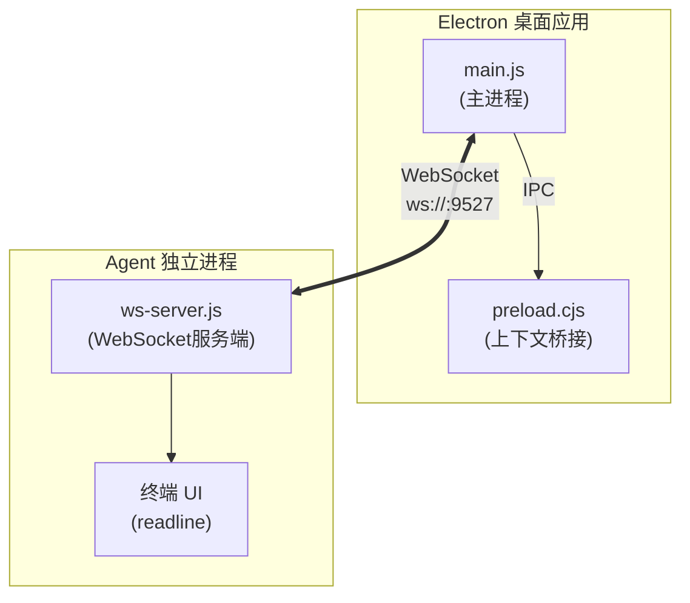
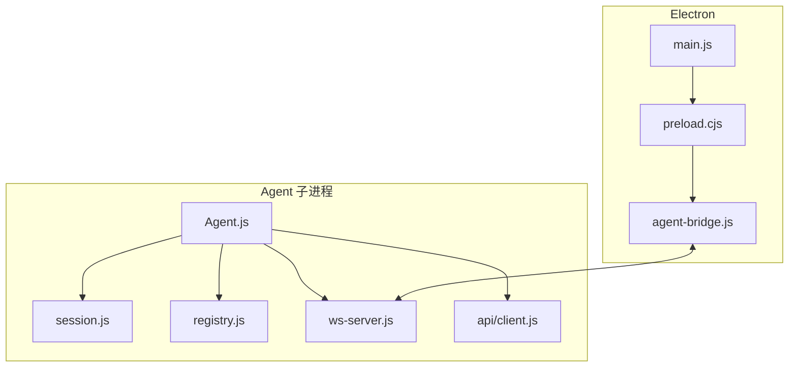
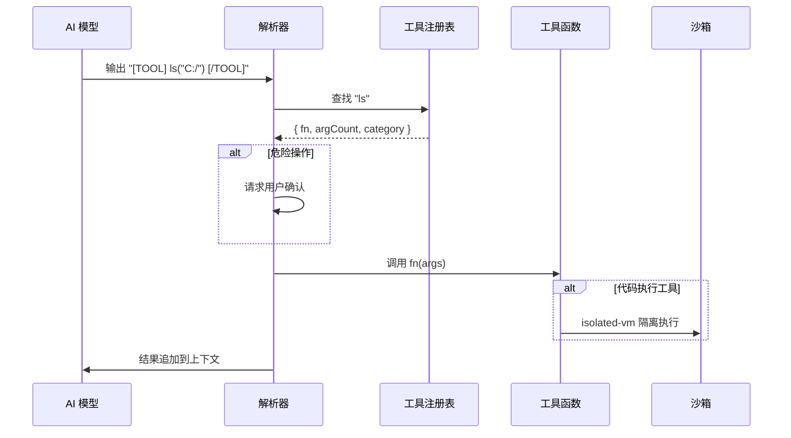
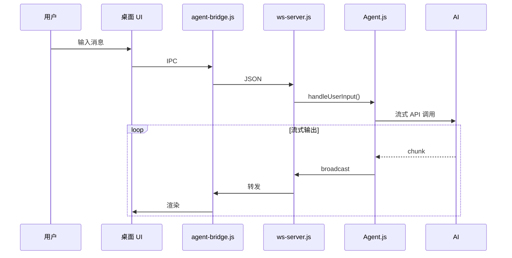
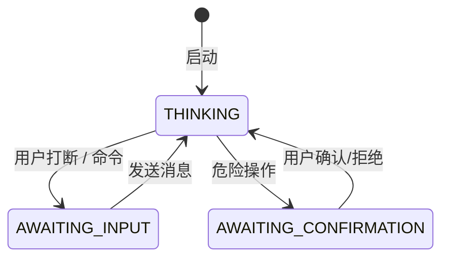

# CogitoAgent

> 持续思考的本地自主 AI 智能体

CogitoAgent 是一款运行于本地的自主 AI 智能体，融合了文件管理、知识挖掘、系统操作、代码执行与联网能力。它直接在用户配置的工作目录下运行，无需上传任何文件至第三方服务器，在保障数据隐私安全的同时，提供持续运转的智能助理服务。

不同于传统的聊天机器人，CogitoAgent 具备**持续思考**、**自主探索**、**工具执行**的能力，能够在后台主动发现和整理用户的本地文件资产，并可通过扩展工具集获得更多能力。


---

## 核心特性

| 特性 | 说明 |
|------|------|
| **隐私优先** | 所有数据本地存储，不上传任何文件到第三方服务器 |
| **持续思考** | 每3秒自动触发思考循环，主动分析当前任务状态 |
| **工具执行** | 内置 100+ 工具函数，支持文件操作、代码执行、Git、数据库等 |
| **安全沙箱** | JavaScript 代码执行采用 `isolated-vm` 进程级隔离 |
| **多会话管理** | 支持多个独立对话会话，会话数据持久化存储 |
| **桌面模式** | Electron 桌面窗口，与终端 Agent 通过 WebSocket 通信 |

---

## 🚀 快速开始

### 环境要求

- **Node.js** 18.0 或更高版本
- **npm** 或 **yarn** 包管理器
- **Python** 3.x（可选，用于 Python 代码执行）

### 安装步骤

```bash
# 克隆项目
git clone https://gitee.com/cnt-code/cogito-agent.git
cd cogito-agent

# 安装依赖
npm install

# 启动程序
npm start
```

### 首次配置

首次运行会自动引导完成以下配置：

1. **API Base URL** - 支持 OpenAI 兼容的第三方 API
2. **API Key** - 您的 API 密钥
3. **模型名称** - 如 gpt-4o、claude-3-sonnet 等
4. **工作区路径** - AI 可以访问的目录（默认为用户主目录）
5. **人设选择** - 选择预设的 AI 人设

### 日常使用

程序支持两种运行模式：

| 命令 | 模式 | 说明 |
|------|------|------|
| `npm start` 或 `npm run desktop` | 桌面模式 | Electron 桌面窗口 + 终端 Agent，通过 WebSocket 通信 |
| `npm run cli` | CLI 模式 | 仅终端 Agent，不启动 Electron（适合纯命令行环境） |

#### 桌面模式

```bash
npm start
```

Electron 主进程会自动拉起终端 Agent，创建桌面窗口并连接。

**交互方式：**

- **桌面窗口** — 半透明毛玻璃对话框 + 虚拟人物视频，直接在桌面上输入
- **终端输入** — 在启动终端中直接输入指令，按 ENTER 发送
- **ENTER** — 打断当前 AI 思考，进入输入状态
- **exit** — 退出程序（或直接关闭桌面窗口）

#### CLI 模式

```bash
npm run cli
```

纯命令行模式，不启动 Electron 和 WebSocket 服务，直接在终端交互。

适合：
- 服务器环境
- 无图形界面的远程连接
- 资源受限环境

---

## 持续思考循环

Agent 的核心是一个持续运行的思考循环。启动后，Agent 每隔 3 秒（可通过 `thinkingInterval` 配置）自动触发一轮思考流程：

1. 构建当前消息上下文（包括系统 prompt、工具注册表、历史对话）
2. 调用 AI API（流式返回）
3. 解析 AI 输出：
   - 普通文本 → 直接追加到回复
   - 工具调用 → 执行工具函数，结果追加到上下文
   - WAIT 标记 → 暂停，等待用户输入

用户可随时通过 `ENTER` 打断当前思考，直接输入指令。

## 工具系统

工具系统由 `registry.js` 统一管理，所有工具函数通过 `[TOOL] functionName(args) [/TOOL]` 格式调用。

### 工具分类

| 分类 | 文件 | 主要功能 |
|------|------|----------|
| 文件操作 | `file.js` | `ls`, `read`, `create`, `copy`, `mkdir`, `delete`, `move` |
| 网页工具 | `web.js` | `search`, `browse`, `fetchPage`, `searchOnEngine` |
| 浏览器自动化 | `browser.js` | `initBrowser`, `clickElement`, `fillField`, `takeScreenshot` |
| 系统操作 | `system.js` | `listApps`, `openApp`, `closeApp` |
| 代码执行 | `code.js` | `executeCode`, `runJavaScript`, `runPython` |
| Git | `git.js` | `gitStatus`, `gitCommit`, `gitPush`, `gitPull`, `gitDiff`, `gitLog` |
| 任务管理 | `task.js` | `createTask`, `getTasks`, `completeTask`, `splitTask` |
| 记忆系统 | `memory.js` | `addMemory`, `searchMemory`, `getRelatedMemories`, `deleteMemory` |
| 数据处理 | `data.js` | `readCSV`, `writeJSON`, `csvToJSON`, `queryData` |
| 数据库 | `db.js` | `executeSQL`, `query`, `insert`, `executeTransaction` |
| 邮件 | `email.js` | `sendEmail`, `sendTextEmail`, `sendHtmlEmail` |
| 系统监控 | `monitor.js` | `getCPUInfo`, `getMemoryInfo`, `monitorSystem` |
| 定时任务 | `scheduler.js` | `addScheduleTask`, `getScheduleTasks`, `toggleScheduleTask` |

### 工具注册机制

工具函数统一注册到注册表，包含以下元数据：

```javascript
{
  name: '函数名',
  description: '函数描述',
  parameters: { /* JSON Schema */ },
  category: '分类',
  dangerLevel: 'none | low | medium | high',  // 危险操作需用户确认
  fn: async (args) => { /* 实现 */ }
}
```

### 工具调用示例

```
AI: [TOOL] ls("/project/src") [/TOOL]
→ 返回目录文件列表

AI: [TOOL] runPython("print('hello')") [/TOOL]
→ 执行 Python 代码，返回输出
```

> 详细工具开发文档参见 [src/agent/tools/TOOL_DEVELOPMENT.md](src/agent/tools/TOOL_DEVELOPMENT.md)

## 记忆系统

记忆系统基于 SQLite 实现，提供长期信息存储和语义检索能力。

### 核心操作

| 操作 | 函数 | 说明 |
|------|------|------|
| 添加记忆 | `addMemory(content, tags, metadata)` | 存储信息及标签 |
| 搜索记忆 | `searchMemory(keyword)` | 关键词模糊搜索 |
| 语义搜索 | `getRelatedMemories(text)` | 基于嵌入向量的语义搜索 |
| 删除记忆 | `deleteMemory(id)` | 按 ID 删除 |

### 数据结构

```sql
CREATE TABLE memories (
  id TEXT PRIMARY KEY,
  content TEXT NOT NULL,
  tags TEXT,           -- JSON 数组
  embedding BLOB,      -- 嵌入向量
  metadata TEXT,       -- JSON 对象
  created_at INTEGER
);
```

### 检索机制

- **关键词搜索**：LIKE 模糊匹配
- **语义搜索**：计算余弦相似度，返回相关记忆

## 任务管理系统

任务管理系统基于 SQLite 存储，支持任务的创建、分解、状态追踪。

### 数据结构

```sql
CREATE TABLE tasks (
  id TEXT PRIMARY KEY,
  title TEXT NOT NULL,
  description TEXT,
  status TEXT DEFAULT 'pending',  -- pending | in_progress | completed
  priority TEXT DEFAULT 'middle', -- low | middle | high
  parent_id TEXT,
  created_at INTEGER,
  completed_at INTEGER
);
```

### 核心操作

| 操作 | 函数 | 说明 |
|------|------|------|
| 创建任务 | `createTask(title, description, priority)` | 新建任务 |
| 获取任务 | `getTasks(filter)` | 按状态/优先级筛选 |
| 更新状态 | `completeTask(id)` | 标记为已完成 |
| 分解任务 | `splitTask(parentId, subtasks)` | 拆分为子任务 |

### 任务状态流转

```
pending → in_progress → completed
```

子任务完成会自动更新父任务状态。

## 代码执行沙箱

代码执行模块使用 `isolated-vm` 实现进程级隔离，保障系统安全。

### JavaScript 执行

| 安全措施 | 说明 |
|----------|------|
| 进程隔离 | 在独立 v8 isolate 中执行 |
| 对象冻结 | 深度冻结 JSON、Math、Array 等内置对象 |
| 危险对象禁用 | 禁止 `eval`、`Function`、`Proxy`、`process`、`require` |
| 内存限制 | 128MB |
| 超时控制 | 30秒自动终止 |

### Python 执行

| 安全措施 | 说明 |
|----------|------|
| 临时文件 | 代码写入临时 .py 文件执行 |
| 命令注入防护 | 禁止 `subprocess`、`os.system` 等 |
| 超时控制 | 执行完成后自动删除临时文件 |

### 执行流程

```
runJavaScript(code)
  → 创建 isolate
  → 注入冻结的内置对象
  → 执行代码
  → 返回结果或错误
  → 销毁 isolate
```

## 预设人设

人设配置存储在 `personas/` 目录，每个文件定义一个角色的人格特征。

### 人设文件格式

```javascript
// personas/explorer.js
module.exports = {
  name: 'explorer',
  description: '探索者',
  prompt: '你是一个细心的探索者，擅长发现文件结构和代码逻辑...',
  temperature: 0.7,
  maxTokens: 2000
};
```

### 可用人设

| 人设 | 说明 |
|------|------|
| explorer | 文件探索、项目理解 |
| scholar | 知识研究、深度分析 |
| assistant | 日常任务、简单问答 |
| creative | 写作、创意生成 |
| critic | 代码审查、建议改进 |
| teacher | 教学、知识讲解 |
| wenchen | 文学创作 |
| wujiang | 决策执行、紧急处理 |
| yingwei | 战略规划、项目管理 |
| zhanshi | 技术攻关、问题解决 |
| moushi | 策略分析、风险评估 |
| jianguan | 质量把控、流程管理 |
| xiake | 自由探索 |

切换命令：`/persona <name>`

## 多会话管理

`sessions/` 模块支持多个独立对话会话，每个会话维护独立的上下文。

### 会话存储

```
data/sessions/
├── session_abc123.json   # 会话元数据
├── session_def456.json
└── ...
```

### 会话元数据结构

```javascript
{
  id: "abc123",
  name: "项目A讨论",
  createdAt: 1718000000000,
  updatedAt: 1718001000000,
  messageCount: 45,
  contextTokens: 8500,
  persona: "explorer"
}
```

### 会话命令

| 命令 | 说明 |
|------|------|
| `/sessions` | 列出所有会话 |
| `/new` | 创建新会话 |
| `/switch <id>` | 切换会话 |
| `/delete <id>` | 删除会话 |
| `/rename <name>` | 重命名当前会话 |

### 上下文管理

- **上下文窗口**：自动压缩（150轮 或 100K token）
- **会话隔离**：切换会话时清空当前上下文

## 桌面模式

桌面模式基于 Electron 实现，提供 GUI 交互界面。

### 架构



### 主要进程

| 进程 | 文件 | 职责 |
|------|------|------|
| 主进程 | `electron/main.js` | 窗口管理、系统托盘 |
| 预加载 | `electron/preload.cjs` | 安全上下文桥接 |
| 桥接器 | `electron/agent-bridge.js` | WebSocket ↔ IPC 转换 |
| WebSocket | `src/io/ws-server.js` | 实时通信（端口9527） |

### 窗口特性

| 特性 | 实现 |
|------|------|
| 无边框窗口 | `frame: false` |
| 半透明背景 | `transparent: true` + CSS `backdrop-filter` |
| 始终置顶 | `alwaysOnTop: true` |
| 点击穿透 | `enableMouseEvents: false`（可配置） |

---

## 项目结构

```
cogito-agent/
├── src/                              # 源代码目录
│   ├── agent/                        # 智能体核心模块
│   │   ├── Agent.js                  # 核心智能体
│   │   ├── state.js                  # 状态机
│   │   ├── registry.js               # 工具注册表
│   │   ├── commands.js               # 命令处理
│   │   ├── session.js                # 多会话管理
│   │   ├── tools/                    # 工具集（13个模块）
│   │   │   ├── index.js              # 工具统一导出
│   │   │   ├── file.js               # 文件操作
│   │   │   ├── web.js                # 网页工具
│   │   │   ├── browser.js            # 浏览器自动化
│   │   │   ├── system.js             # 系统操作
│   │   │   ├── code.js               # 代码执行
│   │   │   ├── sandbox.js            # 沙箱安全
│   │   │   ├── git.js                # Git 版本控制
│   │   │   ├── task.js               # 任务管理
│   │   │   ├── memory.js             # 记忆系统
│   │   │   ├── data.js               # 数据处理
│   │   │   ├── db.js                 # 数据库
│   │   │   ├── email.js              # 邮件功能
│   │   │   ├── monitor.js            # 系统监控
│   │   │   ├── scheduler.js          # 定时任务
│   │   │   └── TOOL_DEVELOPMENT.md   # 工具开发文档
│   │   └── ...
│   ├── api/                          # API 层
│   │   ├── client.js                 # OpenAI 兼容 API 客户端
│   │   ├── webSearch.js              # 联网搜索模块
│   │   └── models.js                 # 多模型支持
│   ├── io/                           # 输入输出
│   │   ├── terminal.js               # 终端 UI
│   │   ├── logger.js                 # 日志管理
│   │   └── ws-server.js              # WebSocket 服务
│   ├── config.js                     # 配置管理
│   └── index.js                      # 应用入口
├── electron/                         # Electron 桌面模式
│   ├── main.js                       # 主进程
│   ├── agent-bridge.js               # WS 桥接
│   └── desktop/                       # 桌面 UI
├── personas/                         # 13种预设人设
├── tests/                            # 测试文件
│   ├── Agent.test.js                 # 智能体核心测试
│   ├── config.test.js                # 配置管理测试
│   ├── code.test.js                  # 代码执行沙箱测试
│   └── ...
└── data/                             # 运行时数据（自动创建）
```

---

## 常用命令速查

### 会话管理

| 命令 | 说明 |
|------|------|
| `/sessions` | 查看所有会话列表 |
| `/new` | 创建新会话 |
| `/switch <id>` | 切换到指定会话 |
| `/delete <id>` | 删除指定会话 |
| `/rename <name>` | 重命名当前会话 |

### 系统命令

| 命令 | 说明 |
|------|------|
| `/help` | 显示帮助信息 |
| `/status` | 显示当前状态 |
| `/config` | 显示配置信息 |
| `/clear` | 清屏 |
| `/persona <name>` | 切换人设 |
| `/debug` | 切换调试模式 |

### 交互快捷键

| 按键 | 说明 |
|------|------|
| `ENTER` | 打断当前思考，进入输入状态 |
| `exit` | 退出程序 |

---

## 配置说明

### 配置文件 (config.json)

```json
{
  "api": {
    "baseUrl": "https://api.openai.com/v1",
    "apiKey": "your-api-key",
    "model": "gpt-4o"
  },
  "workspace": "./",
  "persona": "explorer",
  "thinkingInterval": 3000,
  "database": {
    "path": "./data/example.db"
  },
  "code": {
    "maxExecutionTime": 30000,
    "maxOutputSize": 100000
  },
  "tools": {
    "enabledCategories": ["file", "web", "code", "git", "task", "memory", "data"]
  }
}
```

### 环境变量 (.env)

敏感配置建议使用环境变量：

```bash
COGITO_API_KEY=your-api-key-here
COGITO_API_BASE_URL=https://api.openai.com/v1
COGITO_MODEL=gpt-4o
COGITO_WORKSPACE=/home/user/projects
COGITO_EMAIL_PASSWORD=your-email-password
```

### 工具分类配置

按需加载工具分类，减少 Token 消耗：

| 分类 | 说明 |
|------|------|
| `file` | 文件操作 |
| `web` | 网络工具 |
| `browser` | 浏览器自动化 |
| `system` | 系统操作 |
| `code` | 代码执行 |
| `git` | Git 版本控制 |
| `task` | 任务管理 |
| `memory` | 记忆系统 |
| `data` | 数据处理 |
| `db` | 数据库 |
| `email` | 邮件功能 |
| `monitor` | 系统监控 |
| `scheduler` | 定时任务 |

---

## Docker 部署

### 环境要求

- Docker 20.10+
- Docker Compose 2.0+

### 快速启动

```bash
# 克隆项目
git clone https://gitee.com/cnt-code/cogito-agent.git
cd cogito-agent

# 创建配置文件
cp config.example.json config.json
# 编辑 config.json 填入 API Key

# 启动容器
docker-compose up -d

# 查看日志
docker-compose logs -f
```

### 配置说明

通过环境变量覆盖配置：

| 环境变量 | 说明 | 默认值 |
|----------|------|--------|
| `COGITO_API_KEY` | API 密钥 | - |
| `COGITO_API_BASE_URL` | API 地址 | `https://api.openai.com/v1` |
| `COGITO_MODEL` | 模型名称 | `gpt-4o` |
| `COGITO_WORKSPACE` | 工作区目录 | `./workspace` |
| `THINKING_INTERVAL` | 思考间隔(ms) | `3000` |

### 手动构建

```bash
# 构建镜像
docker build -t cogito-agent .

# 运行容器
docker run -d \
  --name cogito-agent \
  -p 9527:9527 \
  -v ./config.json:/app/config.json:ro \
  -e COGITO_API_KEY=your-key \
  cogito-agent
```

### Docker Compose 生产配置

```yaml
version: '3.8'
services:
  cogito-agent:
    image: cogito-agent:latest
    container_name: cogito-agent
    restart: always
    ports:
      - "9527:9527"
    environment:
      - COGITO_API_KEY=${COGITO_API_KEY}
      - COGITO_API_BASE_URL=${COGITO_API_BASE_URL}
      - COGITO_MODEL=${COGITO_MODEL:-gpt-4o}
      - THINKING_INTERVAL=3000
    volumes:
      - ./config.json:/app/config.json:ro
      - ./data:/app/data
      - ${COGITO_WORKSPACE:-./workspace}:/app/workspace
```

---

## CI/CD 集成

项目已配置 Gitee Go 流水线：

| 工作流 | 触发条件 | 功能 |
|--------|----------|------|
| `ci.yml` | push/PR | 自动化测试、Docker 构建 |
| `release.yml` | tag v* | 构建镜像、创建 Gitee 发行版 |

**使用步骤：**

1. 在 Gitee 仓库 -> 服务 -> Gitee Go 中启用流水线功能
2. 配置 Docker 镜像仓库凭证（可选，用于推送镜像）
3. 推送代码触发 CI：
   ```bash
   git push origin develop
   ```
4. 发布版本时打标签：
   ```bash
   git tag v1.0.0
   git push origin v1.0.0
   ```

**Gitee Go 流水线说明：**

- CI 流水线在 push 和 PR 时自动运行，包括测试和 Docker 镜像构建
- Release 流水线在打 tag 时触发，需手动确认执行
- 镜像构建完成后可手动推送到 Docker 仓库

---

## 应用场景示例

### 文件探索

```javascript
// 分析项目结构
[TOOL] ls("./src") [/TOOL]
// → ["agent", "api", "io", "config.js", "index.js"]

// 读取关键文件
[TOOL] read("./src/agent/Agent.js") [/TOOL]
// → 返回文件内容
```

### 代码执行

```javascript
// Python 脚本执行
[TOOL] runPython(`
import json
data = {"fibonacci": [0, 1, 1, 2, 3, 5, 8]}
print(json.dumps(data))
`) [/TOOL]
// → {"fibonacci": [0, 1, 1, 2, 3, 5, 8]}

// JavaScript 沙箱执行
[TOOL] runJavaScript(`
const arr = [1, 2, 3, 4, 5];
const sum = arr.reduce((a, b) => a + b, 0);
console.log(sum);
`) [/TOOL]
// → 15
```

### Git 版本控制

```javascript
// 查看仓库状态
[TOOL] gitStatus() [/TOOL]
// → { files: ["src/index.js", "README.md"], branch: "main" }

// 提交更改
[TOOL] gitCommit("feat: 添加新工具") [/TOOL]
// → committed (a1b2c3d)

// 推送远程
[TOOL] gitPush("origin", "main") [/TOOL]
// → done
```

### 数据库操作

```javascript
// 执行 SQL
[TOOL] executeSQL("SELECT * FROM tasks WHERE status = 'pending'") [/TOOL]
// → [{ id: "1", title: "任务A", status: "pending" }]

// 插入数据
[TOOL] insert("tasks", { title: "新任务", priority: "high" }) [/TOOL]
// → { id: "2", title: "新任务", priority: "high" }
```

### 联网搜索

```javascript
// 搜索信息
[TOOL] search("Node.js 20 new features") [/TOOL]
// → [{ title: "...", url: "...", snippet: "..." }]

// 获取页面内容
[TOOL] fetchPage("https://nodejs.org/") [/TOOL]
// → { title: "Node.js", content: "..." }
```

---

## 架构设计

### 核心组件

| 组件 | 职责 | 说明 |
|------|------|------|
| **Agent.js** | 思考循环 | 每3秒自动触发一次思考 |
| **state.js** | 状态机 | THINKING / AWAITING_INPUT / AWAITING_CONFIRMATION |
| **registry.js** | 工具注册表 | 100+ 工具集中管理 |
| **session.js** | 会话管理 | 多会话切换、上下文压缩 |
| **commands.js** | 命令处理 | /help、/status 等特殊命令 |
| **sandbox.js** | 代码沙箱 | isolated-vm 进程级隔离 |
| **ws-server.js** | WebSocket | 桌面模式通信 |

### 模块关系



---

## 核心原理

<details>
<summary>点击展开 / 收起</summary>

### 思考循环 (Think Cycle)

Agent 的核心是一个持续运行的思考循环，每隔固定间隔自动触发一轮思考，直到用户打断。


### 工具调用流程



### 桌面模式消息流



### 状态机



</details>

---

## 测试

### 运行测试

```bash
npm test              # 运行所有测试
npm test -- --verbose # 详细输出
npm test -- --coverage # 覆盖率报告

# E2E 测试
npm run test:e2e           # 运行 E2E 测试
npm run test:e2e -- --watch # 监听模式
```

### 测试覆盖

| 模块 | 用例数 | 覆盖内容 |
|------|:------:|---------|
| Agent | 27 | 参数解析、工具调用、状态管理 |
| 配置管理 | 12 | 环境变量解析、配置合并 |
| Git 操作 | 20 | 仓库操作、安全参数传递 |
| 代码执行 | 8 | 沙箱安全、危险代码拒绝 |
| 数据库 | 10 | SQL 执行、CRUD、事务 |
| Web 模块 | 3 | browse、fetchPage |
| Browser | 2 | Playwright 生命周期 |
| E2E WebSocket | 6 | 连接、心跳、消息收发、并发 |
| E2E Agent 流程 | 15 | 初始化、思考循环、工具执行、状态机、会话管理 |

### E2E 测试说明

E2E 测试位于 `tests/e2e/` 目录：

| 测试文件 | 说明 |
|----------|------|
| `websocket.test.js` | WebSocket 通信测试 |
| `agent-flow.test.js` | Agent 完整流程测试 |

E2E 测试覆盖：
- WebSocket 连接建立、消息发送接收、心跳机制
- Agent 初始化、思考循环、工具调用
- 状态机转换、会话管理、记忆系统
- 任务管理、API 集成、命令处理

---

## 贡献指南

欢迎贡献代码：

1. Fork 项目
2. 创建分支：`git checkout -b feature/your-feature`
3. 编写代码并测试
4. 确保 `npm test` 通过
5. 提交 Pull Request

### 代码规范

- 使用 ES6+ 语法
- 使用 `async/await` 处理异步操作
- 工具函数返回格式：`{ success: boolean, data?: any, error?: string }`

---

## 更新日志

### v2.3.0

- 多会话管理（创建、切换、删除、重命名）
- 工具分类按需加载
- 上下文自动压缩（150轮 / 100K token）
- 沙箱升级 - 深度冻结内置对象
- 新增 tracing.js - 追踪模块
- 新增 retry.js - 熔断器与重试机制
- MCP 协议兼容
- 插件系统 (Plugin SDK)

### v2.2.0

- Agent.js 拆分为独立模块
- logger.js 支持 DEBUG/INFO/WARN/ERROR 分级
- 测试用例增至 103+

### v2.1.0

- 移除 vm2 依赖（安全漏洞）
- 改用 Node.js 原生 vm 模块
- 跨平台支持改进

### v2.0.0

- 代码执行引擎（JS/Python）
- Git 版本控制集成
- 任务管理系统
- 记忆系统
- 数据处理工具
- SQLite 数据库
- 邮件功能
- 系统监控
- 定时任务调度
- 多模型支持

---

## 已知问题

- [ ] 工具 `downloadFile` 会把目标文件下载到临时目录
- [ ] AI 回复会早于工具调用提示

---

## 许可证

Apache 2.0

---

Built with CogitoAgent Team
