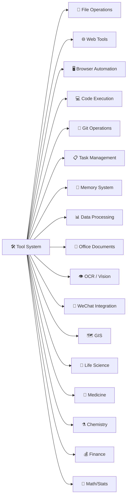
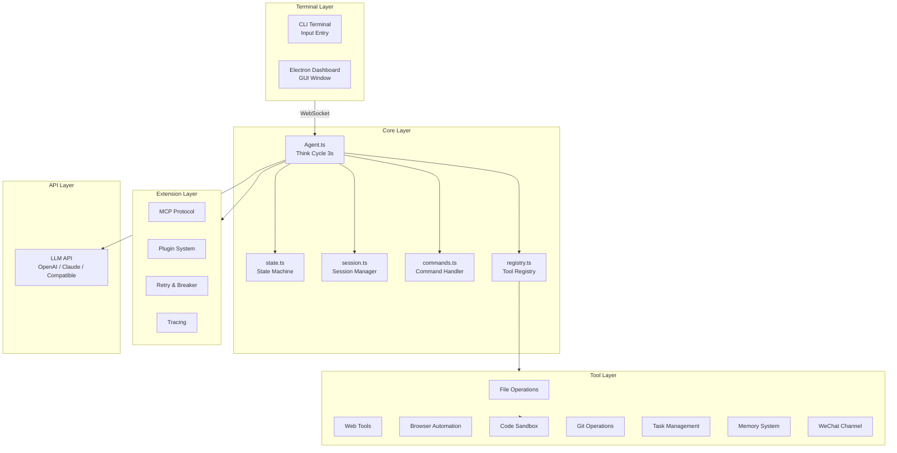
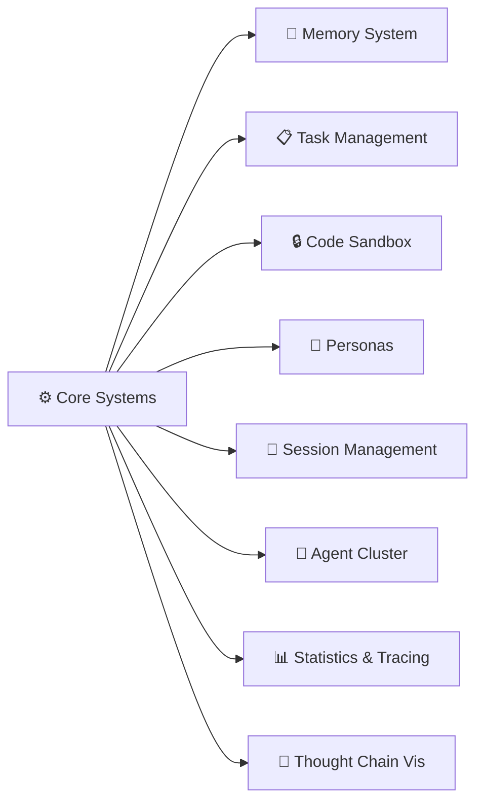

# CogitoAgent

> **Think Continuously · Act Autonomously · Stay Private**

Cogito, ergo sum — CogitoAgent is not just a tool; it is your autonomous thinking partner in your local environment.

**CogitoAgent** is a cloud-driven, locally-executed agent framework that integrates file management, knowledge mining, system operations, code execution, and web connectivity. It runs directly within the working directory configured by the user, powered by the LLM API of your choice for thinking and decision-making — **your workspace files stay local**, keeping your file assets secure while providing a continuously operating intelligent assistant service.


Unlike traditional chatbots, CogitoAgent possesses the ability to **Think Continuously**, **Explore Autonomously**, and **Execute Tools**, capable of proactively discovering and organizing your local file assets in the background, with additional capabilities available through an extensible toolset.

<p align="center">
  <a href="#"></a>
  <a href="#"></a>
  <a href="#"></a>
  <a href="#"></a>
  <a href="#"></a>
</p>

---

## Core Features

| Feature | Description |
|---------|-------------|
| **TypeScript Core** | Full TypeScript migration with type safety and compile-time error detection |
| **Privacy First** | Workspace files stay local; only conversation context is sent to the LLM API you specify |
| **Continuous Thinking** | Automatically triggers a thinking cycle every 3 seconds (configurable) |
| **Tool Execution** | 16+ tool modules with 100+ tools for file operations, code execution, Git, databases, OCR, Office documents, and more |
| **Security Sandbox** | JavaScript code execution uses `isolated-vm` for process-level isolation |
| **Multi-Session Management** | Multiple independent conversation sessions with persistent storage and auto-compression |
| **Desktop Mode** | Electron desktop window communicating via WebSocket with the terminal Agent |
| **MCP Protocol** | Expose tools as MCP Server for integration with other AI clients |
| **Plugin System** | Dynamically load custom tool plugins |
| **Thought Chain Visualization** | Real-time visualization of thinking process and tool execution |
| **Agent Cluster** | Sub-agent creation, task delegation, and multi-agent collaboration |
| **Monitor Panel** | Dedicated window for real-time cluster topology, thought chain, and tool stats |
| **WeChat Integration** | QR code login, message sending/receiving, dedicated session, tool bubble display |

---

## 🚀 Quick Start

### Requirements

- **Node.js** 22.12 or higher
- **npm** or **yarn** package manager
- **Python** 3.x (optional, for Python code execution)

> **Note for users in China**: If `npm install` fails to download the Electron binary:
> ```bash
> $env:ELECTRON_MIRROR = "https://npmmirror.com/mirrors/electron/"
> npm install
> ```

### Installation

```bash
git clone https://gitee.com/cnt-code/cogito-agent.git
cd cogito-agent
npm install
npm start
```

### First-Time Setup

1. **API Base URL** — Supports OpenAI-compatible third-party APIs
2. **API Key** — Your API key
3. **Model Name** — e.g., gpt-4o, claude-3-sonnet, etc.
4. **Workspace Path** — The directory the AI can access
5. **Persona Selection** — Choose a preset AI persona

### Usage Modes

| Command | Mode | Description |
|---------|------|-------------|
| `npm start` | Setup Wizard | First-time configuration or modifying settings |
| `npm run electron:desktop` | Desktop Mode | Electron overlay window + terminal Agent via WebSocket |
| `npm run electron:dashboard` | Dashboard Mode | Full-window dashboard with session management and tool visualization |
| `npm run cli` | CLI Mode | Terminal-only, no Electron (for server/headless environments) |

---

## Tool System

All tools are managed by `registry.ts` and invoked via `[TOOL] functionName(args) [/TOOL]`.



| Category | File | Main Functions |
|----------|------|----------------|
| File Operations | `file.ts` | `ls`, `read`, `create`, `copy`, `mkdir` |
| Path Utilities | `path.ts` | `getBasePath` |
| Web Tools | `web.ts` | `search`, `browse`, `fetchPage` |
| Browser Automation | `browser.ts` | `initBrowser`, `clickElement`, `fillField`, `selectOption`, `viewChanges`, `getPageContent`, `takeScreenshot`, `closeBrowser`, `searchOnPage`, `findElements`, `searchOnEngine`, `downloadFile` |
| System Operations | `system.ts` | `listApps`, `openApp`, `closeApp` |
| Code Execution | `code.ts` | `executeCode`, `executeFile`, `runJavaScript`, `runPython`, `formatCode` |
| Security Sandbox | `sandbox.ts` | `createJavaScriptSandbox`, `runJavaScriptSandbox`, `runPythonSandbox`, `executeCodeSandbox` |
| Git | `git.ts` | `gitInit`, `gitClone`, `gitAdd`, `gitCommit`, `gitPush`, `gitPull`, `gitStatus`, `gitLog`, `gitBranchCreate`, `gitBranchDelete`, `gitBranchList`, `gitCheckout`, `gitCheckoutNew`, `gitMerge`, `gitDiff`, `gitRemoteAdd`, `gitRemoteList`, `gitConfigUser`, `gitReset`, `gitStash`, `gitStashPop` |
| Task Management | `task.ts` | `createTask`, `getTasks`, `getTask`, `updateTask`, `deleteTask`, `completeTask`, `splitTask`, `getTaskStats`, `clearTasks` |
| Memory System | `memory.ts` | `addMemory`, `searchMemory`, `getAllMemories`, `getMemory`, `updateMemory`, `deleteMemory`, `getMemoryStats`, `getRelatedMemories`, `clearMemory` |
| Data Processing | `data.ts` | `readCSV`, `writeCSV`, `readJSON`, `writeJSON`, `csvToJSON`, `jsonToCSV`, `queryData`, `analyzeData`, `sortData` |
| Database | `db.ts` | `executeSQL`, `query`, `insert`, `update`, `deleteData`, `createTable`, `dropTable`, `getTables`, `getTableSchema`, `executeTransaction`, `closeDB` |
| Email | `email.ts` | `sendEmail`, `sendTextEmail`, `sendHtmlEmail`, `sendTemplateEmail`, `sendEmailWithAttachments`, `checkEmailConfig` |
| System Monitoring | `monitor.ts` | `getCPUInfo`, `getMemoryInfo`, `getDiskInfo`, `getNetworkInfo`, `getProcesses`, `getSystemInfo`, `getCurrentProcess`, `getSystemLoad`, `monitorSystem` |
| Scheduled Tasks | `scheduler.ts` | `addScheduleTask`, `getScheduleTasks`, `getScheduleTask`, `updateScheduleTask`, `toggleScheduleTask`, `removeScheduleTask`, `startScheduler`, `stopScheduler` |
| Storage | `storage.ts` | `FileStorage`, `createStorage` |
| Image Recognition | `ocr.ts` | `ocr`, `ocrBatch` |
| Vision Analysis | `vision.ts` | `vision`, `visionFromUrl` |
| Office Documents | `office.ts` | `createPpt`, `createWord`, `createExcel`, `readExcel` |
| GIS | `gis.ts` | `convertCoord`, `calcDistance`, `calcArea`, `readGeoJSON`, `pointInPolygon`, `geoJSONToKML` |
| Life Science | `bio.ts` | `dnaComplement`, `translate`, `gcContent`, `parseFASTA`, `hammingDistance`, `codonUsage` |
| Medicine | `med.ts` | `bmi`, `egfr`, `childPugh`, `convertUnit`, `oxygenIndex`, `parseVitalSigns` |
| Chemistry | `chem.ts` | `molWeight`, `elementInfo`, `phFromH`, `idealGasLaw`, `dilution`, `elementComposition` |
| Finance | `finance.ts` | `compoundInterest`, `npv`, `irr`, `loanPayment`, `roi`, `volatility`, `movingAverage` |
| Math/Stats | `math.ts` | `describe`, `correlation`, `linearRegression`, `matrixMultiply`, `solveQuadratic`, `factorial` |

> Detailed tool documentation: registration mechanism, usage examples, best practices → [introduction/tools.md](introduction/tools.md) (Chinese)

<p align="center">
  
  
  
  <br>
  <em>File Operations · Web Search · WeChat Integration</em>
</p>

---

## Architecture



| Component | Responsibility |
|-----------|----------------|
| **Agent.ts** | Thinking loop — automatically triggers every 3 seconds |
| **state.ts** | State machine — THINKING / AWAITING_INPUT / AWAITING_CONFIRMATION |
| **registry.ts** | Tool registry — centralized management of all tool modules |
| **session.ts** | Session management — multi-session switching, context compression |
| **commands.ts** | Command handling — /help, /status, /persona, /sessions, etc. |
| **sandbox.ts** | Code sandbox — isolated-vm process-level isolation |
| **stats.ts** | Statistics — tool usage tracking and metrics |
| **tracing.ts** | Tracing — lightweight observability for tool executions and LLM calls |
| **retry.ts** | Retry & Circuit Breaker — reliable network requests |
| **mcp.ts** | MCP Server — expose tools as MCP protocol |
| **plugin.ts** | Plugin system — dynamic loading of custom tool plugins |
| **ws-server.ts** | WebSocket — desktop mode communication (port 9527) |
| **wechat-manager.ts** | WeChat Channel — iLink protocol integration, message routing, session sync |

> Complete architecture details: think cycle diagrams, tool call flow, state machine, message flow, WebSocket → [introduction/architecture.md](introduction/architecture.md) (Chinese)

---

## Command Reference

| Command | Description |
|---------|-------------|
| `/sessions` | List all sessions |
| `/new` | Create a new session |
| `/switch <id>` | Switch to a session |
| `/delete <id>` | Delete a session |
| `/rename <name>` | Rename current session |
| `/help` | Display help |
| `/status` | Display current status |
| `/config` | Display configuration |
| `/persona <name>` | Switch persona |
| `/personas` | List all available personas |
| `/tools` | List all available tools |
| `/clear` | Clear conversation history |
| `/debug` | Toggle debug mode |
| `/wechat` | Show WeChat channel status |
| `/wechat login` | Login to WeChat via QR code |
| `/wechat logout` | Logout from WeChat |
| `ENTER` | Interrupt thinking, enter input mode |
| `exit` | Exit the program |

---

## Configuration

Configuration via `config.json` and environment variables (`.env`), with env vars taking priority.

> Full configuration reference: environment variables list, advanced options (compression, truncation, archiving) → [introduction/configuration.md](introduction/configuration.md) (Chinese)

---

## Project Structure

```
cogito-agent/
├── src/                              # Source code (TypeScript)
│   ├── agent/                        # Core agent module
│   │   ├── Agent.ts / state.ts / registry.ts
│   │   ├── commands.ts / session.ts / stats.ts
│   │   ├── mcp.ts / plugin.ts / thought-trace.ts / retry.ts
│   │   ├── wechat-manager.ts         # WeChat channel management
│   │   └── tools/                    # 16+ tool modules
│   ├── api/                          # API layer (client, models, webSearch)
│   ├── io/                           # Terminal, Logger, WebSocket
│   ├── config.ts                     # Configuration management
│   ├── types/                        # TypeScript type definitions
│   └── index.ts                      # Application entry
├── electron/                         # Desktop mode (JS)
│   ├── main.js / preload.cjs / agent-bridge.js
│   ├── desktop/ / dashboard/ / monitor/ / setup/
│   ├── shared/                       # Shared utilities
│   └── assets/
├── personas/                         # 22 preset personas (13 modern + 9 ancient)
├── tests/                            # Test files
├── data/                             # Runtime data (auto-created)
├── tsconfig.json                     # TypeScript config
└── introduction/                     # Detailed documentation
    ├── tools.md                      # Tool system details
    ├── architecture.md               # Architecture details
    ├── configuration.md              # Configuration guide
    ├── systems.md                    # Core systems details
    ├── extensions.md                 # Extensions details
    └── deployment.md                 # Deployment & development
```

---

## Core Systems

> See [introduction/systems.md](introduction/systems.md) (Chinese) for details



- **Memory System** — SQLite-based long-term storage and semantic retrieval
- **Task Management** — Task creation, decomposition, and status tracking
- **Code Sandbox** — `isolated-vm` process-level isolation for JS and Python
- **Personas** — 22 preset roles with custom and hot-switch support
- **Session Management** — Independent contexts with auto-compression
- **Statistics** — Tool usage tracking and performance metrics
- **Thought Chain Visualization** — Real-time thinking process display
- **Agent Cluster** — Sub-agent creation, task delegation, and cluster monitoring, see [introduction/agent-cluster.md](introduction/agent-cluster.md)

<p align="center">
  
  <br>
  <em>Agent Cluster Monitoring Panel</em>
</p>

## Extensions

> See [introduction/extensions.md](introduction/extensions.md) (Chinese) for details

- **Plugin System** — Dynamic loading of custom tool plugins
- **MCP Protocol** — Expose tools as MCP Server
- **Tracing** — Lightweight observability for tool executions and LLM calls
- **Circuit Breaker & Retry** — Reliable network requests
- **Multi-Model** — OpenAI, Moark, Anthropic, Google support
- **Web Search** — Built-in internet search capability

## Docker

> See [introduction/deployment.md](introduction/deployment.md) (Chinese) for details

```bash
docker-compose up -d
```

---

## Changelog

### v2.3.2
- **Full TypeScript migration** — 54 JS files migrated to TypeScript with type safety and compile-time error detection
- 6 new professional tool modules with 75 tools
- GIS: coordinate conversion, distance/area calculation, GeoJSON processing (11 tools)
- Life Science: DNA/RNA/protein sequence analysis, FASTA/FASTQ parsing (15 tools)
- Medicine: clinical scoring, drug dosage, physiological parameters, unit conversion (17 tools)
- Chemistry: molecular weight, periodic table, pH, gas laws (9 tools)
- Finance: compound interest, NPV/IRR, loan calculation, volatility (12 tools)
- Math/Stats: descriptive stats, regression, matrix operations, combinatorics (11 tools)
- CI/CD pipelines: GitHub Actions and Gitee Pipeline support

### v2.3.1
- WeChat iLink protocol integration with QR code login and message sending/receiving
- WeChat dedicated permanent session, click "WeChat Channel" to auto-connect and load
- WeChat message dual-write mechanism: stored in both `weichat.json` and session history
- Messages displayed as tool call bubbles, clearly distinguishing send/receive directions
- Fixed persona switching bug that accidentally cleared session history

### v2.3.0
- Multi-session management, tool category on-demand loading, auto context compression
- Sandbox upgrade — deep freezing of built-in objects
- New tracing.js, retry.js, MCP protocol, plugin system
- New OCR and Vision analysis tools
- Statistics module for tool usage tracking
- Thought chain visualization

### v2.2.0
- Agent.js modularized, logger.js with log levels

### v2.1.0
- Removed vm2, switched to Node.js native vm module

### v2.0.0
- Code execution engine, Git, task management, memory system
- Data processing, SQLite, email, monitoring, scheduled tasks

---

## License

Apache 2.0

---

Built with CogitoAgent Team