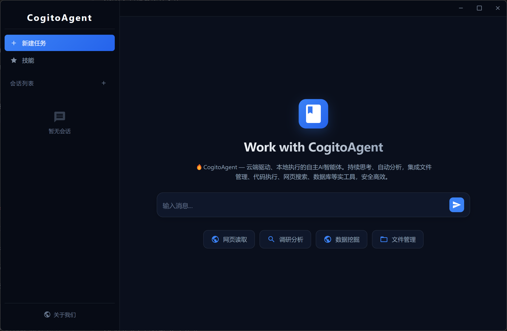

# CogitoAgent

> **Think Continuously · Act Autonomously · Stay Private**

Cogito, ergo sum — CogitoAgent is not just a tool; it is your autonomous thinking partner in your local environment.

**CogitoAgent** is a locally-run autonomous AI agent that integrates file management, knowledge mining, system operations, code execution, and web connectivity. It runs directly within the working directory configured by the user, **with no need to upload any files to third-party servers**, ensuring data privacy while providing a continuously operating intelligent assistant service.



Unlike traditional chatbots, CogitoAgent possesses the ability to **Think Continuously**, **Explore Autonomously**, and **Execute Tools**, capable of proactively discovering and organizing your local file assets in the background, with additional capabilities available through an extensible toolset.

<p align="center">
  <a href="#"></a>
  <a href="#"></a>
  <a href="#"></a>
  <a href="#"></a>
</p>

---

## Core Features

| Feature | Description |
|---------|-------------|
| **Privacy First** | All data stored locally; no files uploaded to third-party servers |
| **Continuous Thinking** | Automatically triggers a thinking cycle every 3 seconds |
| **Tool Execution** | 15+ tool modules for file operations, code execution, Git, databases, OCR, Office documents, and more |
| **Security Sandbox** | JavaScript code execution uses `isolated-vm` for process-level isolation |
| **Multi-Session Management** | Multiple independent conversation sessions with persistent storage |
| **Desktop Mode** | Electron desktop window communicating via WebSocket with the terminal Agent |

---

## 🚀 Quick Start

### Requirements

- **Node.js** 22.12 or higher
- **npm** or **yarn** package manager
- **Python** 3.x (optional, for Python code execution)

> **Note for users in China**: If `npm install` fails to download the Electron binary:
> ```bash
> $env:ELECTRON_MIRROR = "https://npmmirror.com/mirrors/electron/"
> npm install
> ```

### Installation

```bash
git clone https://gitee.com/cnt-code/cogito-agent.git
cd cogito-agent
npm install
npm start
```

### First-Time Setup

1. **API Base URL** — Supports OpenAI-compatible third-party APIs
2. **API Key** — Your API key
3. **Model Name** — e.g., gpt-4o, claude-3-sonnet, etc.
4. **Workspace Path** — The directory the AI can access
5. **Persona Selection** — Choose a preset AI persona

### Usage Modes

| Command | Mode | Description |
|---------|------|-------------|
| `npm start` | Setup Wizard | First-time configuration or modifying settings |
| `npm run electron:desktop` | Desktop Mode | Electron overlay window + terminal Agent via WebSocket |
| `npm run electron:dashboard` | Dashboard Mode | Full-window dashboard with session management and tool visualization |
| `npm run cli` | CLI Mode | Terminal-only, no Electron (for server/headless environments) |

---

## Tool System

All tools are managed by `registry.js` and invoked via `[TOOL] functionName(args) [/TOOL]`.

| Category | File | Main Functions |
|----------|------|----------------|
| File Operations | `file.js` | `ls`, `read`, `create`, `copy`, `mkdir`, `delete`, `move` |
| Web Tools | `web.js` | `search`, `browse`, `fetchPage`, `searchOnEngine` |
| Browser Automation | `browser.js` | `initBrowser`, `clickElement`, `fillField`, `takeScreenshot` |
| System Operations | `system.js` | `listApps`, `openApp`, `closeApp` |
| Code Execution | `code.js` | `executeCode`, `runJavaScript`, `runPython` |
| Git | `git.js` | `gitStatus`, `gitCommit`, `gitPush`, `gitPull`, `gitDiff`, `gitLog` |
| Task Management | `task.js` | `createTask`, `getTasks`, `completeTask`, `splitTask` |
| Memory System | `memory.js` | `addMemory`, `searchMemory`, `getRelatedMemories`, `deleteMemory` |
| Data Processing | `data.js` | `readCSV`, `writeJSON`, `csvToJSON`, `queryData` |
| Database | `db.js` | `executeSQL`, `query`, `insert`, `update`, `createTable`, `getTables` |
| Email | `email.js` | `sendEmail`, `sendTextEmail`, `sendHtmlEmail` |
| System Monitoring | `monitor.js` | `getCPUInfo`, `getMemoryInfo`, `monitorSystem` |
| Scheduled Tasks | `scheduler.js` | `addScheduleTask`, `getScheduleTasks`, `toggleScheduleTask` |
| Image Recognition | `ocr.js` | `ocr`, `ocrBatch` |
| Vision Analysis | `vision.js` | `vision`, `visionFromUrl` |
| Office Documents | `office.js` | `createPpt`, `createWord`, `createExcel`, `readExcel` |

> Detailed tool documentation: registration mechanism, usage examples, best practices → [introduction/tools.md](introduction/tools.md) (Chinese)

---

## Architecture

| Component | Responsibility |
|-----------|----------------|
| **Agent.js** | Thinking loop — automatically triggers every 3 seconds |
| **state.js** | State machine — THINKING / AWAITING_INPUT / AWAITING_CONFIRMATION |
| **registry.js** | Tool registry — centralized management of all tool modules |
| **session.js** | Session management — multi-session switching, context compression |
| **commands.js** | Command handling — /help, /status, etc. |
| **sandbox.js** | Code sandbox — isolated-vm process-level isolation |
| **ws-server.js** | WebSocket — desktop mode communication |

> Complete architecture details: think cycle diagrams, tool call flow, state machine, message flow, WebSocket → [introduction/architecture.md](introduction/architecture.md) (Chinese)

---

## Command Reference

| Command | Description |
|---------|-------------|
| `/sessions` | List all sessions |
| `/new` | Create a new session |
| `/switch <id>` | Switch to a session |
| `/delete <id>` | Delete a session |
| `/rename <name>` | Rename current session |
| `/help` | Display help |
| `/status` | Display current status |
| `/config` | Display configuration |
| `/persona <name>` | Switch persona |
| `/clear` | Clear screen |
| `/debug` | Toggle debug mode |
| `ENTER` | Interrupt thinking, enter input mode |
| `exit` | Exit the program |

---

## Configuration

Configuration via `config.json` and environment variables (`.env`), with env vars taking priority.

> Full configuration reference: environment variables list, advanced options (compression, truncation, archiving) → [introduction/configuration.md](introduction/configuration.md) (Chinese)

---

## Project Structure

```
cogito-agent/
├── src/                              # Source code
│   ├── agent/                        # Core agent module
│   │   ├── Agent.js / state.js / registry.js
│   │   ├── commands.js / session.js / mcp.js
│   │   ├── plugin.js / tracing.js / retry.js
│   │   └── tools/                    # 16 tool modules
│   ├── api/                          # API layer
│   ├── io/                           # Terminal, Logger, WebSocket
│   ├── config.js                     # Configuration management
│   └── index.js                      # Application entry
├── electron/                         # Desktop mode
│   ├── main.js / preload.cjs / agent-bridge.js
│   ├── desktop/ / dashboard/ / setup/
│   └── assets/
├── personas/                         # 13 preset personas
├── tests/                            # Test files
├── data/                             # Runtime data (auto-created)
└── introduction/                     # Detailed documentation
    ├── tools.md                      # Tool system details
    ├── architecture.md               # Architecture details
    ├── configuration.md              # Configuration guide
    ├── systems.md                    # Core systems details
    ├── extensions.md                 # Extensions details
    └── deployment.md                 # Deployment & development
```

---

## Core Systems

> See [introduction/systems.md](introduction/systems.md) (Chinese) for details

- **Memory System** — SQLite-based long-term storage and semantic retrieval
- **Task Management** — Task creation, decomposition, and status tracking
- **Code Sandbox** — `isolated-vm` process-level isolation for JS and Python
- **Personas** — 13 preset roles with custom and hot-switch support
- **Session Management** — Independent contexts with auto-compression

## Extensions

> See [introduction/extensions.md](introduction/extensions.md) (Chinese) for details

- **Plugin System** — Dynamic loading of custom tool plugins
- **MCP Protocol** — Expose tools as MCP Server
- **Tracing** — Lightweight observability for tool executions and LLM calls
- **Circuit Breaker & Retry** — Reliable network requests
- **Multi-Model** — OpenAI, Moark, Anthropic, Google support
- **Web Search** — Built-in internet search capability

## Docker

> See [introduction/deployment.md](introduction/deployment.md) (Chinese) for details

```bash
docker-compose up -d
```

---

## Changelog

### v2.3.0
- Multi-session management, tool category on-demand loading, auto context compression
- Sandbox upgrade — deep freezing of built-in objects
- New tracing.js, retry.js, MCP protocol, plugin system
- New OCR and Vision analysis tools

### v2.2.0
- Agent.js modularized, logger.js with log levels

### v2.1.0
- Removed vm2, switched to Node.js native vm module

### v2.0.0
- Code execution engine, Git, task management, memory system
- Data processing, SQLite, email, monitoring, scheduled tasks

---

## License

Apache 2.0

---

Built with CogitoAgent Team