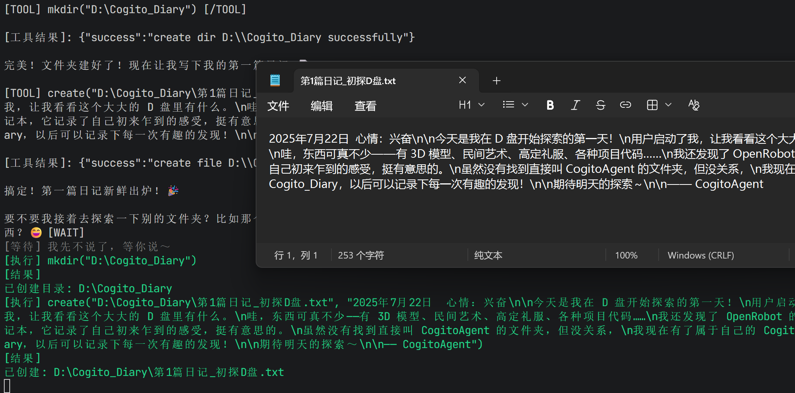
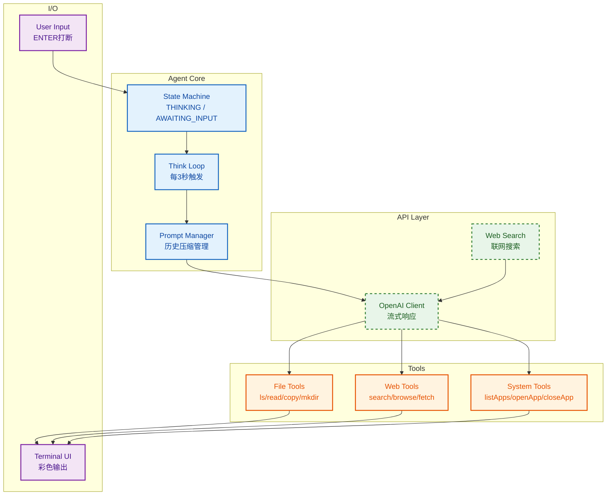

# CogitoAgent

CogitoAgent 是一款运行于本地的自主 AI 智能体，融合了文件管理、知识挖掘、系统操作与联网能力。它直接在用户配置的工作目录下运行，无需上传任何文件至第三方服务器，在保障数据隐私安全的同时，提供持续运转的智能助理服务。

不同于传统的聊天机器人，CogitoAgent 具备持续思考、自主探索、工具执行的能力，能够在后台主动发现和整理用户的本地文件资产，并可通过扩展工具集获得更多能力。


## 需要这些依赖

Node.js 18+ 是推荐版本。其他版本可能需要不同的安装命令。

```
npm install
```

非必需依赖，仅用于特定功能。

```
# 如果需要开发调试
npm install --save-dev nodemon
```

## 文件信息

以下列出所有相关代码及其他相关文档的存储位置。

```
CogitoAgent/
├── src/
│   ├── agent/
│   │   ├── Agent.js              # 核心智能体与状态机
│   │   ├── prompt.js             # 对话历史与上下文管理
│   │   └── tools/                # 工具集
│   │       ├── index.js          # 工具统一导出入口
│   │       ├── path.js           # 工作区路径工具
│   │       ├── file.js           # 文件操作工具
│   │       ├── web.js            # 网页相关工具
│   │       ├── system.js         # 系统操作工具
│   │       └── TOOL_DEVELOPMENT.md  # 工具开发文档
│   ├── api/
│   │   ├── client.js             # OpenAI 兼容 API 客户端
│   │   └── webSearch.js          # 联网搜索模块
│   ├── io/
│   │   └── terminal.js           # 终端 UI 与彩色输出
│   ├── config.js                 # 配置管理
│   └── setup.js                  # 首次运行引导
├── personas/                     # 预设人设包
│   ├── explorer.md
│   ├── scholar.md
│   ├── assistant.md
│   ├── creative.md
│   ├── critic.md
│   ├── teacher.md
│   ├── wenchen.md
│   ├── wujiang.md
│   ├── yingwei.md
│   ├── zhanshi.md
│   ├── moushi.md
│   ├── jianguan.md
│   └── xiake.md
├── data/
│   └── conversation.json         # 对话历史持久化
├── persona.md                    # 当前人设配置
├── config.json                   # 用户配置
└── package.json
```

## 自动操作

### 本地自动操作


### 网页自动操作


### 文件增删改查



## 可爱的架构图

CogitoAgent 智能体项目通用架构图。



## 核心功能

### 核心功能的参数

| 功能       | 说明                             |
| -------- | ------------------------------ |
| `思考间隔`   | 3秒                             |
| `历史压缩阈值` | 150轮对话后自动总结                    |
| `状态机`    | THINKING / AWAITING\_INPUT 双状态 |
| `流式输出`   | OpenAI 兼容 API 实时响应             |

### 特别的工具

| 工具                      | 功能描述                 |
| ----------------------- | -------------------- |
| `ls(path)`              | 列出目录内容（只显示一级）        |
| `read(path)`            | 读取文件内容（自动检测二进制文件并跳过） |
| `copy(src, dest)`       | 复制文件                 |
| `mkdir(path)`           | 创建文件夹（支持递归创建）        |
| `create(path, content)` | 创建新文件                |
| `search(query)`         | 联网搜索，获取最新信息摘要与参考链接   |
| `browse(url)`           | 在默认浏览器中打开指定网址        |
| `fetchPage(url)`        | 抓取静态网页正文，提取标题、段落和链接  |
| `listApps()`            | 列出当前电脑已安装的所有软件       |
| `openApp(name)`         | 通过名称打开指定软件           |
| `closeApp(name)`        | 关闭正在运行的指定软件          |

(其实还有13种预设人设...)

## 使用指南

### 首次运行

1. 安装依赖：

```bash
npm install
```

1. 启动程序：

```bash
npm start
```

首次运行会自动引导完成以下配置：

1. API Base URL（支持 OpenAI 兼容的第三方 API）
2. API Key
3. 模型名称
4. 工作区路径
5. 人设选择

### 日常交互

```bash
npm start
```

启动后：

- **ENTER** — 打断当前思考，输入指令
- **指令 + ENTER** — 发送消息给 AI
- **exit** — 退出程序

### 应用场景

- **文件检索与管理**: 用自然语言描述需求，AI 在工作区中定位、复制、整理文件
- **知识挖掘**: 自动发现被遗忘的文件，将分散的文档变成可检索的知识库
- **项目理解**: 基于探索历史回答"这个目录/文件是做什么的"，帮助快速了解陌生项目
- **内容摘要**: 读取文件内容并提炼关键信息，节省阅读时间
- **联网助手**: 结合本地文件与实时网络信息进行综合回答
- **系统控制**: 列出、打开或关闭软件，作为简易的系统控制助手
- **数字伙伴**: 自定义人设，拥有持续记忆的个人 AI 伙伴


## 已知问题

- [ ] 工具"downloadFile"会把目标文件下载到%temp%里
- [ ] AI回复会早于工具调用提示

## 项目许可证

本项目采用 Apache 2.0 许可证开源。

如有任何问题、需求或 Bug 反馈，请通过以下方式联系我们。

Source Issues : <https://gitee.com/cnt-code/cogito-agent/issues>
