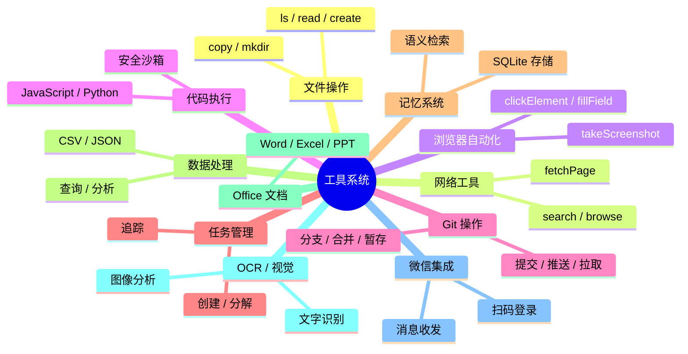
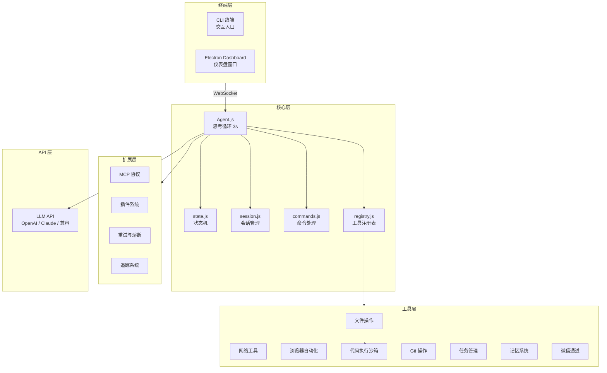
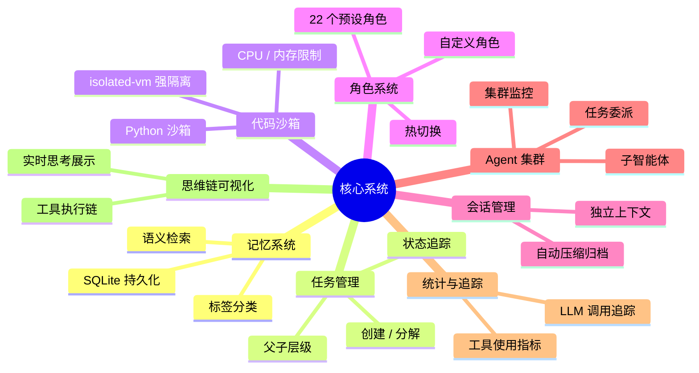

# CogitoAgent

> **持续思考 · 自主行动 · 隐私优先**

我思故我在 —— CogitoAgent 不仅仅是一个工具，它是您在本地环境中的自主思考伙伴。

**CogitoAgent** 是一款云端驱动，本地执行的智能体框架，集成了文件管理、知识挖掘、系统操作、代码执行和网络连接能力。它直接运行在用户配置的工作目录内，通过调用用户指定的大模型 API 驱动思考与决策，**用户的工作文件保留在本地**，在保障文件资产安全的同时提供持续运行的智能助手服务。


与传统聊天机器人不同，CogitoAgent 具备**持续思考**、**自主探索**和**工具执行**的能力，能够在后台主动发现和整理您的本地文件资产，并通过可扩展的工具集提供更多能力。

<p align="center">
  <a href="#"></a>
  <a href="#"></a>
  <a href="#"></a>
  <a href="#"></a>
</p>

---

## 核心功能

| 功能 | 描述 |
|------|------|
| **隐私优先** | 用户工作文件保留在本地，仅通过 API 将必要上下文发送至你指定的模型服务商 |
| **持续思考** | 每 3 秒自动触发一次思考循环（可配置） |
| **工具执行** | 16+ 工具模块，100+ 工具，覆盖文件操作、代码执行、Git、数据库、OCR、Office 文档等 |
| **安全沙箱** | JavaScript 代码执行使用 `isolated-vm` 进行进程级隔离 |
| **多会话管理** | 多个独立的对话会话，持久化存储，自动压缩 |
| **桌面模式** | Electron 桌面窗口，通过 WebSocket 与终端 Agent 通信 |
| **MCP 协议** | 将工具暴露为 MCP Server，支持与其他 AI 客户端集成 |
| **插件系统** | 动态加载自定义工具插件 |
| **思维链可视化** | 实时可视化思考过程和工具执行 |
| **智能体集群** | 支持子智能体创建与任务委派，多智能体协作 |
| **监控面板** | 独立窗口实时展示集群拓扑、思维链和工具统计 |
| **微信集成** | 扫码登录、消息收发、专属会话、工具气泡展示 |

---

## 🚀 快速开始

### 环境要求

- **Node.js** 22.12 或更高版本
- **npm** 或 **yarn** 包管理器
- **Python** 3.x（可选，用于 Python 代码执行）

> **国内用户注意**：如果 `npm install` 下载 Electron 失败：
> ```bash
> $env:ELECTRON_MIRROR = "https://npmmirror.com/mirrors/electron/"
> npm install
> ```

### 安装步骤

```bash
git clone https://gitee.com/cnt-code/cogito-agent.git
cd cogito-agent
npm install
npm start
```

### 首次配置

1. **API 基础地址** — 支持 OpenAI 兼容的第三方 API
2. **API Key** — 您的 API 密钥
3. **模型名称** — 例如 gpt-4o, claude-3-sonnet 等
4. **工作目录路径** — AI 可以访问的目录
5. **角色选择** — 选择预设的 AI 角色

### 使用模式

| 命令 | 模式 | 描述 |
|------|------|------|
| `npm start` | 设置向导 | 首次配置或修改设置 |
| `npm run electron:desktop` | 桌面模式 | Electron 悬浮窗口 + 终端 Agent（WebSocket 通信） |
| `npm run electron:dashboard` | 仪表盘模式 | 全屏仪表盘，包含会话管理和工具可视化 |
| `npm run cli` | CLI 模式 | 纯终端模式，无 Electron（适用于服务器/无头环境） |

---

## 工具系统

所有工具由 `registry.js` 管理，通过 `[TOOL] functionName(args) [/TOOL]` 格式调用。



| 分类 | 文件 | 主要函数 |
|------|------|----------|
| 文件操作 | `file.js` | `ls`, `read`, `create`, `copy`, `mkdir` |
| 路径工具 | `path.js` | `getBasePath` |
| 网络工具 | `web.js` | `search`, `browse`, `fetchPage` |
| 浏览器自动化 | `browser.js` | `initBrowser`, `clickElement`, `fillField`, `selectOption`, `viewChanges`, `getPageContent`, `takeScreenshot`, `closeBrowser`, `searchOnPage`, `findElements`, `searchOnEngine`, `downloadFile` |
| 系统操作 | `system.js` | `listApps`, `openApp`, `closeApp` |
| 代码执行 | `code.js` | `executeCode`, `executeFile`, `runJavaScript`, `runPython`, `formatCode` |
| 安全沙箱 | `sandbox.js` | `createJavaScriptSandbox`, `runJavaScriptSandbox`, `runPythonSandbox`, `executeCodeSandbox` |
| Git | `git.js` | `gitInit`, `gitClone`, `gitAdd`, `gitCommit`, `gitPush`, `gitPull`, `gitStatus`, `gitLog`, `gitBranchCreate`, `gitBranchDelete`, `gitBranchList`, `gitCheckout`, `gitCheckoutNew`, `gitMerge`, `gitDiff`, `gitRemoteAdd`, `gitRemoteList`, `gitConfigUser`, `gitReset`, `gitStash`, `gitStashPop` |
| 任务管理 | `task.js` | `createTask`, `getTasks`, `getTask`, `updateTask`, `deleteTask`, `completeTask`, `splitTask`, `getTaskStats`, `clearTasks` |
| 记忆系统 | `memory.js` | `addMemory`, `searchMemory`, `getAllMemories`, `getMemory`, `updateMemory`, `deleteMemory`, `getMemoryStats`, `getRelatedMemories`, `clearMemory` |
| 数据处理 | `data.js` | `readCSV`, `writeCSV`, `readJSON`, `writeJSON`, `csvToJSON`, `jsonToCSV`, `queryData`, `analyzeData`, `sortData` |
| 数据库 | `db.js` | `executeSQL`, `query`, `insert`, `update`, `deleteData`, `createTable`, `dropTable`, `getTables`, `getTableSchema`, `executeTransaction`, `closeDB` |
| 邮件 | `email.js` | `sendEmail`, `sendTextEmail`, `sendHtmlEmail`, `sendTemplateEmail`, `sendEmailWithAttachments`, `checkEmailConfig` |
| 系统监控 | `monitor.js` | `getCPUInfo`, `getMemoryInfo`, `getDiskInfo`, `getNetworkInfo`, `getProcesses`, `getSystemInfo`, `getCurrentProcess`, `getSystemLoad`, `monitorSystem` |
| 定时任务 | `scheduler.js` | `addScheduleTask`, `getScheduleTasks`, `getScheduleTask`, `updateScheduleTask`, `toggleScheduleTask`, `removeScheduleTask`, `startScheduler`, `stopScheduler` |
| 存储 | `storage.js` | `FileStorage`, `createStorage` |
| 图像识别 | `ocr.js` | `ocr`, `ocrBatch` |
| 视觉分析 | `vision.js` | `vision`, `visionFromUrl` |
| Office 文档 | `office.js` | `createPpt`, `createWord`, `createExcel`, `readExcel` |

> 详细工具文档：注册机制、使用示例、最佳实践 → [introduction/tools.md](introduction/tools.md)

<p align="center">
  
  
  
  <br>
  <em>文件操作 · 网络搜索 · 微信集成</em>
</p>

---

## 架构



| 组件 | 职责 |
|------|------|
| **Agent.js** | 思考循环 —— 每 3 秒自动触发 |
| **state.js** | 状态机 —— THINKING / AWAITING_INPUT / AWAITING_CONFIRMATION |
| **registry.js** | 工具注册表 —— 集中管理所有工具模块 |
| **session.js** | 会话管理 —— 多会话切换、上下文压缩 |
| **commands.js** | 命令处理 —— /help, /status, /persona, /sessions 等 |
| **sandbox.js** | 代码沙箱 —— isolated-vm 进程级隔离 |
| **stats.js** | 统计 —— 工具使用追踪和指标 |
| **tracing.js** | 追踪 —— 工具执行和 LLM 调用的轻量级可观测性 |
| **retry.js** | 重试与熔断 —— 可靠的网络请求 |
| **mcp.js** | MCP Server —— 将工具暴露为 MCP 协议 |
| **plugin.js** | 插件系统 —— 动态加载自定义工具插件 |
| **ws-server.js** | WebSocket —— 桌面模式通信（端口 9527） |
| **wechat-manager.js** | 微信通道 —— iLink 协议集成、消息路由、会话同步 |

> 完整架构详情：思考循环图、工具调用流程、状态机、消息流、WebSocket → [introduction/architecture.md](introduction/architecture.md)

---

## 命令参考

| 命令 | 描述 |
|------|------|
| `/sessions` | 列出所有会话 |
| `/new` | 创建新会话 |
| `/switch <id>` | 切换到指定会话 |
| `/delete <id>` | 删除会话 |
| `/rename <name>` | 重命名当前会话 |
| `/help` | 显示帮助信息 |
| `/status` | 显示当前状态 |
| `/config` | 显示配置信息 |
| `/persona <name>` | 切换角色 |
| `/personas` | 列出所有可用角色 |
| `/tools` | 列出所有可用工具 |
| `/clear` | 清除对话历史 |
| `/debug` | 切换调试模式 |
| `/wechat` | 显示微信通道状态 |
| `/wechat login` | 扫码登录微信 |
| `/wechat logout` | 退出微信登录 |
| `ENTER` | 中断思考，进入输入模式 |
| `exit` | 退出程序 |

---

## 配置

通过 `config.json` 和环境变量（`.env`）进行配置，环境变量优先级更高。

> 完整配置参考：环境变量列表、高级选项（压缩、截断、归档）→ [introduction/configuration.md](introduction/configuration.md)

---

## 项目结构

```
cogito-agent/
├── src/                              # 源代码
│   ├── agent/                        # 核心 agent 模块
│   │   ├── Agent.js / state.js / registry.js
│   │   ├── commands.js / session.js / stats.js
│   │   ├── mcp.js / plugin.js / tracing.js / retry.js
│   │   ├── wechat-manager.js         # 微信通道管理
│   │   └── tools/                    # 16+ 工具模块
│   ├── api/                          # API 层（client, models, webSearch）
│   ├── io/                           # Terminal, Logger, WebSocket
│   ├── config.js                     # 配置管理
│   └── index.js                      # 应用入口
├── electron/                         # 桌面模式
│   ├── main.js / preload.cjs / agent-bridge.js
│   ├── desktop/ / dashboard/ / monitor/ / setup/
│   ├── shared/                       # 共享工具
│   └── assets/
├── personas/                         # 22 个预设角色（13 现代 + 9 古代）
├── tests/                            # 测试文件
├── data/                             # 运行时数据（自动创建）
└── introduction/                     # 详细文档
    ├── tools.md                      # 工具系统详情
    ├── architecture.md               # 架构详情
    ├── configuration.md              # 配置指南
    ├── systems.md                    # 核心系统详情
    ├── extensions.md                 # 扩展详情
    └── deployment.md                 # 部署与开发
```

---

## 核心系统

> 详见 [introduction/systems.md](introduction/systems.md)



- **记忆系统** —— 基于 SQLite 的长期存储和语义检索
- **任务管理** —— 任务创建、分解和状态追踪
- **代码沙箱** —— `isolated-vm` 进程级隔离，支持 JS 和 Python
- **角色系统** —— 22 个预设角色，支持自定义和热切换
- **会话管理** —— 独立上下文，自动压缩
- **统计模块** —— 工具使用追踪和性能指标
- **思维链可视化** —— 实时思考过程展示
- **智能体集群** —— 子智能体创建、任务委派与集群监控，详见 [introduction/agent-cluster.md](introduction/agent-cluster.md)

<p align="center">
  
  <br>
  <em>智能体集群监控面板</em>
</p>

## 扩展

> 详见 [introduction/extensions.md](introduction/extensions.md)

- **插件系统** —— 动态加载自定义工具插件
- **MCP 协议** —— 将工具暴露为 MCP Server
- **追踪系统** —— 工具执行和 LLM 调用的轻量级可观测性
- **熔断与重试** —— 可靠的网络请求
- **多模型支持** —— OpenAI、Moark、Anthropic、Google
- **网络搜索** —— 内置互联网搜索能力

## Docker

> 详见 [introduction/deployment.md](introduction/deployment.md)

```bash
docker-compose up -d
```

---

## 更新日志

### v2.3.1
- 微信 iLink 协议集成，支持扫码登录、消息收发
- 微信专属永久会话，点击"微信通道"自动连接并加载
- 微信消息双写机制：同时存储到 `weichat.json` 和会话历史
- 消息以工具调用气泡样式展示，清晰区分收发方向
- 修复 persona 切换时误清空会话历史的问题

### v2.3.0
- 多会话管理、工具分类按需加载、自动上下文压缩
- 沙箱升级 —— 内置对象深度冻结
- 新增 tracing.js、retry.js、MCP 协议、插件系统
- 新增 OCR 和视觉分析工具
- 统计模块，工具使用追踪
- 思维链可视化

### v2.2.0
- Agent.js 模块化，logger.js 支持日志级别

### v2.1.0
- 移除 vm2，切换为 Node.js 原生 vm 模块

### v2.0.0
- 代码执行引擎、Git、任务管理、记忆系统
- 数据处理、SQLite、邮件、监控、定时任务

---

## 许可证

Apache 2.0

---

由 CogitoAgent Team 开发