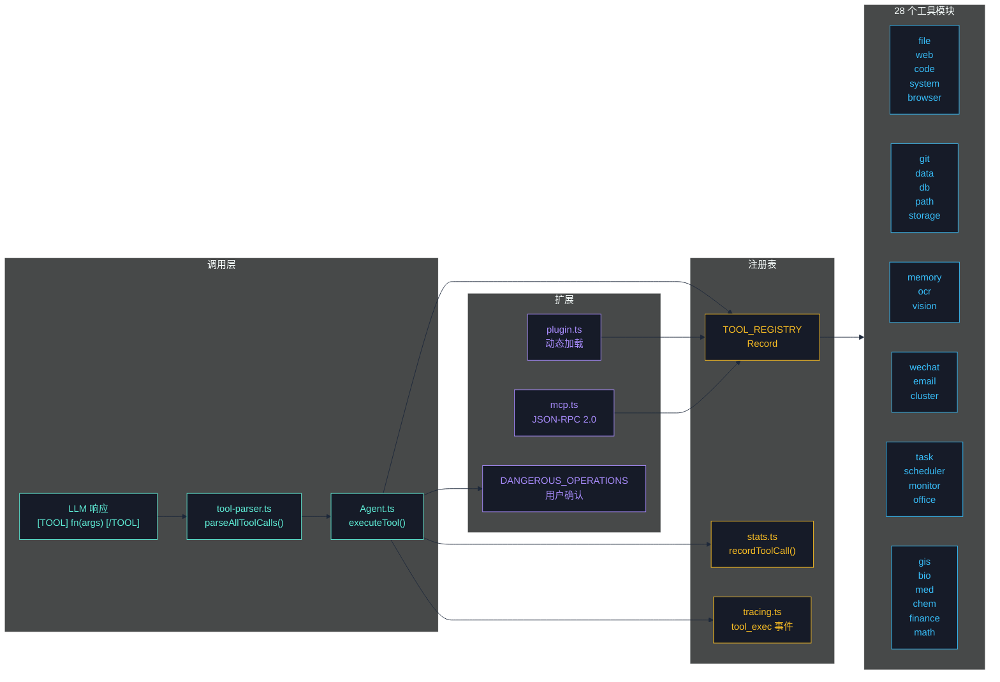
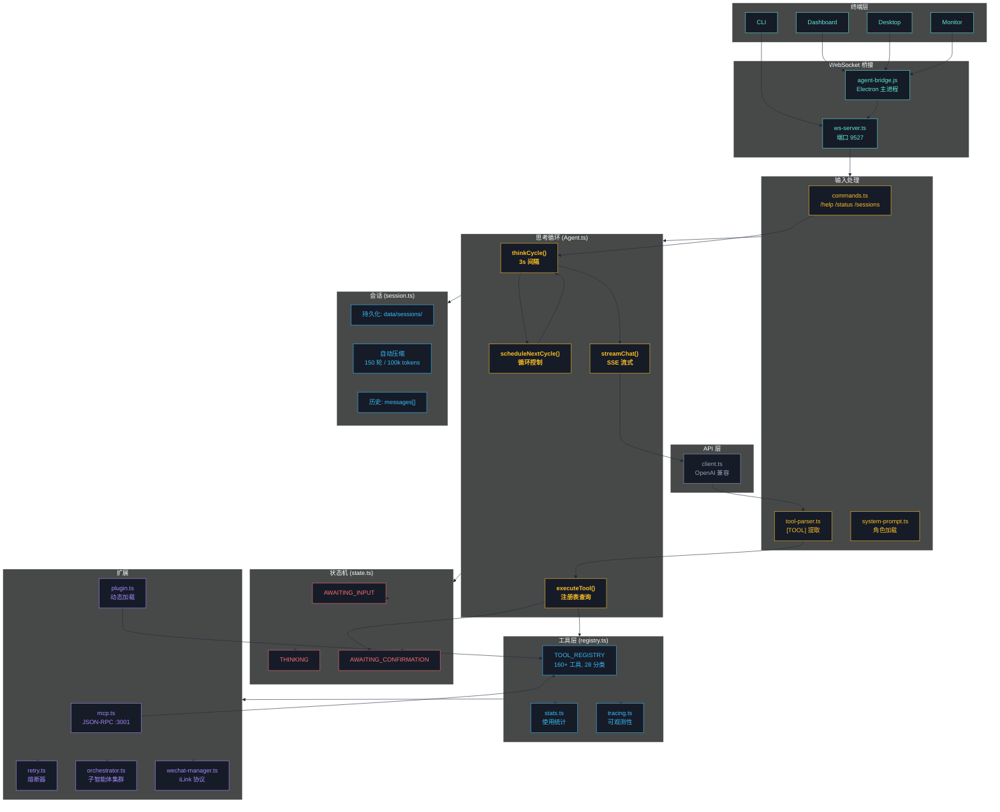

# CogitoAgent

> **持续思考 · 自主行动 · 隐私优先**

我思故我在 —— CogitoAgent 不仅仅是一个工具，它是您在本地环境中的自主思考伙伴。

**CogitoAgent** 是一款云端驱动，本地执行的智能体框架，集成了文件管理、知识挖掘、系统操作、代码执行和网络连接能力。它直接运行在用户配置的工作目录内，通过调用用户指定的大模型 API 驱动思考与决策，**用户的工作文件保留在本地**，在保障文件资产安全的同时提供持续运行的智能助手服务。


与传统聊天机器人不同，CogitoAgent 具备**持续思考**、**自主探索**和**工具执行**的能力，能够在后台主动发现和整理您的本地文件资产，并通过可扩展的工具集提供更多能力。

<p align="center">
  <a href="https://github.com/SnowLeopard-io/CogitoAgent"></a>
  <a href="https://gitee.com/cnt-code/cogito-agent"></a>
  <a href="#"></a>
  <a href="#"></a>
  <a href="#"></a>
  <a href="#"></a>
  <a href="#"></a>
  <a href="#"></a>
  <a href="https://github.com/SnowLeopard-io/CogitoAgent/issues?q=is%3Aopen+is%3Aissue+label%3A%22good+first+issue%22"></a>
</p>

<p align="center">
  <a href="README.md">English</a> · <a href="README.zh.md">中文</a> ·
  <a href="ROADMAP.md">路线图</a> ·
  <a href="CONTRIBUTING.md">贡献指南</a> ·
  <a href="CODE_OF_CONDUCT.md">行为准则</a>
</p>

---

## 核心功能

| 功能                | 描述                                                                                                             |
| ------------------- | ---------------------------------------------------------------------------------------------------------------- |
| **TypeScript 核心** | 全量 TypeScript 重构，类型安全，编译时错误检测                                                                   |
| **隐私优先**        | 用户工作文件保留在本地，仅通过 API 将必要上下文发送至你指定的模型服务商                                          |
| **持续思考**        | 每 3 秒自动触发一次思考循环（可配置）                                                                            |
| **工具执行**        | 28 工具模块，200+ 工具，覆盖文件操作、代码执行、Git、数据库、OCR、Office 文档、GIS、生物信息、医学、化学、金融等 |
| **安全沙箱**        | JavaScript 代码执行使用 `isolated-vm` 进行进程级隔离                                                             |
| **多会话管理**      | 多个独立的对话会话，持久化存储，自动压缩                                                                         |
| **桌面模式**        | Electron 桌面窗口，通过 WebSocket 与终端 Agent 通信                                                              |
| **MCP 协议**        | 将工具暴露为 MCP Server，支持与其他 AI 客户端集成                                                                |
| **插件系统**        | 动态加载自定义工具插件                                                                                           |
| **思维链可视化**    | 实时可视化思考过程和工具执行                                                                                     |
| **智能体集群**      | 支持子智能体创建与任务委派，多智能体协作                                                                         |
| **监控面板**        | 独立窗口实时展示集群拓扑、思维链和工具统计                                                                       |
| **微信集成**        | 扫码登录、消息收发、专属会话、工具气泡展示                                                                       |

---

## 🚀 快速开始

### 环境要求

- **Node.js** 22.12 或更高版本
- **npm** 或 **yarn** 包管理器
- **Python** 3.x（可选，用于 Python 代码执行）

> **国内用户注意**：如果 `npm install` 下载 Electron 失败：
>
> ```bash
> $env:ELECTRON_MIRROR = "https://npmmirror.com/mirrors/electron/"
> npm install
> ```

### 安装步骤

```bash
git clone https://gitee.com/cnt-code/cogito-agent.git
cd cogito-agent
npm install
npm start
```

### 首次配置

1. **API 基础地址** — 支持 OpenAI 兼容的第三方 API
2. **API Key** — 您的 API 密钥
3. **模型名称** — 例如 gpt-4o, claude-3-sonnet 等
4. **工作目录路径** — AI 可以访问的目录
5. **角色选择** — 选择预设的 AI 角色

### 使用模式

| 命令                         | 模式       | 描述                                             |
| ---------------------------- | ---------- | ------------------------------------------------ |
| `npm start`                  | 设置向导   | 首次配置或修改设置                               |
| `npm run electron:desktop`   | 桌面模式   | Electron 悬浮窗口 + 终端 Agent（WebSocket 通信） |
| `npm run electron:dashboard` | 仪表盘模式 | 全屏仪表盘，包含会话管理和工具可视化             |
| `npm run cli`                | CLI 模式   | 纯终端模式，无 Electron（适用于服务器/无头环境） |

---

## 工具系统

所有工具由 `registry.ts` 管理，通过 `[TOOL] functionName(args) [/TOOL]` 格式调用。



| 分类         | 文件           | 主要函数                                                                                                                                                                                                                                                                                          |
| ------------ | -------------- | ------------------------------------------------------------------------------------------------------------------------------------------------------------------------------------------------------------------------------------------------------------------------------------------------- |
| 文件操作     | `file.ts`      | `ls`, `read`, `create`, `copy`, `mkdir`, `write`, `append`, `move`, `rename`, `delete`                                                                                                                                                                                                            |
| 路径工具     | `path.ts`      | `getBasePath`, `joinPath`, `resolvePath`, `normalizePath`, `getExtension`, `getFileName`, `getParentDir`                                                                                                                                                                                          |
| 网络工具     | `web.ts`       | `search`, `browse`, `fetchPage`                                                                                                                                                                                                                                                                   |
| 浏览器自动化 | `browser.ts`   | `initBrowser`, `clickElement`, `fillField`, `selectOption`, `viewChanges`, `getPageContent`, `takeScreenshot`, `closeBrowser`, `searchOnPage`, `findElements`, `searchOnEngine`, `downloadFile`                                                                                                   |
| 系统操作     | `system.ts`    | `listApps`, `openApp`, `closeApp`                                                                                                                                                                                                                                                                 |
| 代码执行     | `code.ts`      | `executeCode`, `executeFile`, `runJavaScript`, `runPython`, `formatCode`                                                                                                                                                                                                                          |
| 安全沙箱     | `sandbox.ts`   | `createJavaScriptSandbox`, `runJavaScriptSandbox`, `runPythonSandbox`, `executeCodeSandbox`                                                                                                                                                                                                       |
| Git          | `git.ts`       | `gitInit`, `gitClone`, `gitAdd`, `gitCommit`, `gitPush`, `gitPull`, `gitStatus`, `gitLog`, `gitBranchCreate`, `gitBranchDelete`, `gitBranchList`, `gitCheckout`, `gitCheckoutNew`, `gitMerge`, `gitDiff`, `gitRemoteAdd`, `gitRemoteList`, `gitConfigUser`, `gitReset`, `gitStash`, `gitStashPop` |
| 任务管理     | `task.ts`      | `createTask`, `getTasks`, `getTask`, `updateTask`, `deleteTask`, `completeTask`, `splitTask`, `getTaskStats`, `clearTasks`                                                                                                                                                                        |
| 记忆系统     | `memory.ts`    | `addMemory`, `searchMemory`, `getAllMemories`, `getMemory`, `updateMemory`, `deleteMemory`, `getMemoryStats`, `getRelatedMemories`, `clearMemory`                                                                                                                                                 |
| 数据处理     | `data.ts`      | `readCSV`, `writeCSV`, `readJSON`, `writeJSON`, `csvToJSON`, `jsonToCSV`, `queryData`, `analyzeData`, `sortData`, `filterData`, `groupData`, `aggregateData`                                                                                                                                      |
| 数据库       | `db.ts`        | `executeSQL`, `query`, `insert`, `update`, `deleteData`, `createTable`, `dropTable`, `getTables`, `getTableSchema`, `executeTransaction`, `closeDB`                                                                                                                                               |
| 邮件         | `email.ts`     | `sendEmail`, `sendTextEmail`, `sendHtmlEmail`, `sendTemplateEmail`, `sendEmailWithAttachments`, `checkEmailConfig`                                                                                                                                                                                |
| 系统监控     | `monitor.ts`   | `getCPUInfo`, `getMemoryInfo`, `getDiskInfo`, `getNetworkInfo`, `getProcesses`, `getSystemInfo`, `getCurrentProcess`, `getSystemLoad`, `monitorSystem`                                                                                                                                            |
| 定时任务     | `scheduler.ts` | `addScheduleTask`, `getScheduleTasks`, `getScheduleTask`, `updateScheduleTask`, `toggleScheduleTask`, `removeScheduleTask`, `startScheduler`, `stopScheduler`                                                                                                                                     |
| 存储         | `storage.ts`   | `FileStorage`, `createStorage`, `getStorage`, `clearStorage`                                                                                                                                                                                                                                      |
| 图像识别     | `ocr.ts`       | `ocr`, `ocrBatch`                                                                                                                                                                                                                                                                                 |
| 视觉分析     | `vision.ts`    | `vision`, `visionFromUrl`                                                                                                                                                                                                                                                                         |
| Office 文档  | `office.ts`    | `createPpt`, `createWord`, `createExcel`, `readExcel`                                                                                                                                                                                                                                             |
| 集群管理     | `cluster.ts`   | `spawnAgent`, `delegateTask`, `getClusterStatus`, `stopAgent`, `stopAllAgents`, `parallelExecute`, `panelDiscussion`, `pipeline`, `voting`                                                                                                                                                        |
| 微信消息     | `wechat.ts`    | `loginWechat`, `logoutWechat`, `sendWechatMessage`, `sendWechatImage`, `getWechatStatus`, `generateWechatQRCode`                                                                                                                                                                                  |
| GIS 地理信息 | `gis.ts`       | `convertCoord`, `calcDistance`, `calcArea`, `calcCenter`, `pointInPolygon`, `isInChina`, `readGeoJSON`, `queryGeoJSON`, `geoJSONStats`, `geoJSONToCSV`, `geoJSONToKML`                                                                                                                            |
| 生命科学     | `bio.ts`       | `dnaComplement`, `dnaReverseComplement`, `rnaTranscribe`, `translate`, `gcContent`, `molecularWeight`, `hammingDistance`, `levenshteinDistance`, `tmEstimate`, `hairpinCheck`, `parseFASTA`, `parseFASTQ`, `fastaToCSV`, `codonUsage`, `randomSeq`                                                |
| 医学         | `med.ts`       | `bmi`, `bsa`, `egfr`, `crcl`, `childPugh`, `calculateDose`, `bsaDose`, `infusionRate`, `idealBodyWeight`, `convertUnit`, `temperatureConvert`, `meanArterialPressure`, `anionGap`, `correctedCalcium`, `oxygenIndex`, `parseVitalSigns`, `vitalsReport`                                           |
| 化学         | `chem.ts`      | `elementInfo`, `molWeight`, `elementComposition`, `molarity`, `dilution`, `phFromH`, `phToH`, `idealGasLaw`, `gasDensity`                                                                                                                                                                         |
| 金融         | `finance.ts`   | `compoundInterest`, `presentValue`, `futureValueAnnuity`, `npv`, `irr`, `paybackPeriod`, `roi`, `loanPayment`, `amortizationSchedule`, `totalInterest`, `movingAverage`, `volatility`                                                                                                             |
| 数学统计     | `math.ts`      | `describe`, `correlation`, `linearRegression`, `matrixMultiply`, `matrixDeterminant`, `matrixInverse`, `solveQuadratic`, `factorial`, `combination`, `permutation`, `siConvert`                                                                                                                   |

> 详细工具文档：注册机制、使用示例、最佳实践 → [introduction/tools.md](introduction/tools.md)

<p align="center">
  
  
  <!--  -->
  <br>
  <em>图像视觉 · 搜索与浏览器 · 自动化</em>
</p>

---

## 架构



| 组件                  | 职责                                                        |
| --------------------- | ----------------------------------------------------------- |
| **Agent.ts**          | 思考循环 —— 每 3 秒自动触发                                 |
| **state.ts**          | 状态机 —— THINKING / AWAITING_INPUT / AWAITING_CONFIRMATION |
| **registry.ts**       | 工具注册表 —— 集中管理所有工具模块                          |
| **session.ts**        | 会话管理 —— 多会话切换、上下文压缩                          |
| **commands.ts**       | 命令处理 —— /help, /status, /persona, /sessions 等          |
| **sandbox.ts**        | 代码沙箱 —— isolated-vm 进程级隔离                          |
| **stats.ts**          | 统计 —— 工具使用追踪和指标                                  |
| **tracing.ts**        | 追踪 —— 工具执行和 LLM 调用的轻量级可观测性                 |
| **retry.ts**          | 重试与熔断 —— 可靠的网络请求                                |
| **mcp.ts**            | MCP Server —— 将工具暴露为 MCP 协议                         |
| **plugin.ts**         | 插件系统 —— 动态加载自定义工具插件                          |
| **ws-server.ts**      | WebSocket —— 桌面模式通信（端口 9527）                      |
| **wechat-manager.ts** | 微信通道 —— iLink 协议集成、消息路由、会话同步              |

> 完整架构详情：思考循环图、工具调用流程、状态机、消息流、WebSocket → [introduction/architecture.md](introduction/architecture.md)

---

## 命令参考

| 命令                                    | 描述                   |
| --------------------------------------- | ---------------------- |
| `/sessions`                             | 列出所有会话           |
| `/new`                                  | 创建新会话             |
| `/switch <id>`                          | 切换到指定会话         |
| `/delete <id>`                          | 删除会话               |
| `/rename <name>`                        | 重命名当前会话         |
| `/help`                                 | 显示帮助信息           |
| `/status`                               | 显示当前状态           |
| `/config`                               | 显示配置信息           |
| `/persona <name>`                       | 切换角色               |
| `/personas`                             | 列出所有可用角色       |
| `/tools`                                | 列出所有可用工具       |
| `/clear`                                | 清除对话历史           |
| `/debug`                                | 切换调试模式           |
| `/wechat/status`                        | 显示微信通道状态       |
| `/wechat/login`                         | 扫码登录微信           |
| `/wechat/logout`                        | 退出微信登录           |
| `/spawn <persona> <name> <instruction>` | 创建子智能体           |
| `/agents`                               | 列出所有子智能体       |
| `/delegate <agentId> <task>`            | 向子智能体委派任务     |
| `/stop-agent <agentId>`                 | 停止指定子智能体       |
| `/stop-all-agents`                      | 停止所有子智能体       |
| `ENTER`                                 | 中断思考，进入输入模式 |
| `exit`                                  | 退出程序               |

---

## 配置

通过 `config.json` 和环境变量（`.env`）进行配置，环境变量优先级更高。

> 完整配置参考：环境变量列表、高级选项（压缩、截断、归档）→ [introduction/configuration.md](introduction/configuration.md)

---

## 项目结构

```
cogito-agent/
├── src/                              # 源代码（TypeScript）
│   ├── agent/                        # 核心 agent 模块
│   │   ├── Agent.ts / state.ts / registry.ts
│   │   ├── commands.ts / session.ts / stats.ts
│   │   ├── mcp.ts / plugin.ts / thought-trace.ts / retry.ts
│   │   ├── wechat-manager.ts         # 微信通道管理
│   │   └── tools/                    # 16+ 工具模块
│   ├── api/                          # API 层（client, models, webSearch）
│   ├── io/                           # Terminal, Logger, WebSocket
│   ├── config.ts                     # 配置管理
│   ├── types/                        # TypeScript 类型定义
│   └── index.ts                      # 应用入口
├── electron/                         # 桌面模式（JS）
│   ├── main.js / preload.cjs / agent-bridge.js
│   ├── desktop/ / dashboard/ / monitor/ / setup/
│   ├── shared/                       # 共享工具
│   └── assets/
├── personas/                         # 22 个预设角色（13 现代 + 9 古代）
├── tests/                            # 测试文件
├── data/                             # 运行时数据（自动创建）
├── tsconfig.json                     # TypeScript 配置
└── introduction/                     # 详细文档
    ├── tools.md                      # 工具系统详情
    ├── architecture.md               # 架构详情
    ├── configuration.md              # 配置指南
    ├── systems.md                    # 核心系统详情
    ├── extensions.md                 # 扩展详情
    └── deployment.md                 # 部署与开发
```

---

## 核心系统

> 详见 [introduction/systems.md](introduction/systems.md)

```mermaid
%%{init: {"theme": "dark", "themeVariables": {"bgColor": "#0b0e14", "primaryColor": "#5eead4", "primaryTextColor": "#5eead4", "primaryBorderColor": "#5eead4", "lineColor": "#1e293b", "textColor": "#94a3b8", "fontFamily": "JetBrains Mono, monospace", "fontSize": "10", "secondaryColor": "#161b28", "tertiaryColor": "#1c2230"}}}%%
flowchart TD
    subgraph ORCHESTRATION["编排层"]
        AGENT["Agent.ts<br/>思考循环 3s"]
        STATE["state.ts<br/>THINKING / AWAIT / CONFIRM"]
        SESSION["session.ts<br/>多会话 + 持久化"]
        CMDS["commands.ts<br/>/help /status /sessions"]
    end

    subgraph COGNITION["认知层"]
        MEMORY["memory.ts<br/>SQLite 存储 + 语义搜索"]
        PERSONA["system-prompt.ts<br/>22 角色 + 自定义"]
        THOUGHT["thought-trace.ts<br/>实时思维链可视化"]
    end

    subgraph EXECUTION["执行层"]
        REGISTRY["registry.ts<br/>160+ 工具, 28 分类"]
        SANDBOX["sandbox.ts<br/>isolated-vm + Python 子进程"]
        TASK["task.ts<br/>CRUD + 分解 + 统计"]
        CLUSTER["orchestrator.ts<br/>子智能体创建 + 委派"]
    end

    subgraph OBSERVABILITY["可观测性"]
        STATS["stats.ts<br/>按分类统计 + 指标"]
        TRACING["tracing.ts<br/>事件日志 + 耗时"]
    end

    subgraph SECURITY["安全层"]
        DANGER["DANGEROUS_OPERATIONS<br/>用户确认"]
        RETRY["retry.ts<br/>熔断器 + 退避重试"]
    end

    subgraph INTEGRATION["集成层"]
        MCP["mcp.ts<br/>JSON-RPC 2.0 端口 :3001"]
        PLUGIN["plugin.ts<br/>动态工具加载"]
        WECHAT["wechat-manager.ts<br/>iLink 扫码登录 + 路由"]
    end

    AGENT --> STATE
    AGENT --> SESSION
    AGENT --> CMDS
    AGENT --> MEMORY
    AGENT --> PERSONA
    AGENT --> THOUGHT
    AGENT --> REGISTRY
    REGISTRY --> SANDBOX
    REGISTRY --> TASK
    REGISTRY --> CLUSTER
    AGENT --> STATS
    AGENT --> TRACING
    AGENT --> DANGER
    AGENT --> RETRY
    AGENT --> MCP
    AGENT --> PLUGIN
    AGENT --> WECHAT

    classDef orchestration fill:#161b28,stroke:#fbbf24,color:#fbbf24,font-weight:bold;
    classDef cognition fill:#161b28,stroke:#a78bfa,color:#a78bfa;
    classDef execution fill:#161b28,stroke:#38bdf8,color:#38bdf8;
    classDef obs fill:#161b28,stroke:#94a3b8,color:#94a3b8;
    classDef security fill:#161b28,stroke:#f87171,color:#f87171;
    classDef integration fill:#161b28,stroke:#5eead4,color:#5eead4;

    class AGENT,STATE,SESSION,CMDS orchestration;
    class MEMORY,PERSONA,THOUGHT cognition;
    class REGISTRY,SANDBOX,TASK,CLUSTER execution;
    class STATS,TRACING obs;
    class DANGER,RETRY security;
    class MCP,PLUGIN,WECHAT integration;
```



- **记忆系统** —— 基于 JSON 的长期存储和标签语义检索
- **任务管理** —— 任务创建、分解和状态追踪
- **代码沙箱** —— `isolated-vm` 进程级隔离，支持 JS 和 Python
- **角色系统** —— 25 个预设角色（14 现代 + 11 古风/地域），支持自定义和热切换
- **会话管理** —— 独立上下文，自动压缩
- **统计模块** —— 工具使用追踪和性能指标
- **思维链可视化** —— 实时思考过程展示
- **智能体集群** —— 子智能体创建、任务委派与集群监控，详见 [introduction/agent-cluster.md](introduction/agent-cluster.md)

<p align="center">
  
  <br>
  <em>智能体集群监控面板</em>
</p>

## 扩展

> 详见 [introduction/extensions.md](introduction/extensions.md)

- **插件系统** —— 动态加载自定义工具插件
- **MCP 协议** —— 将工具暴露为 MCP Server
- **追踪系统** —— 工具执行和 LLM 调用的轻量级可观测性
- **熔断与重试** —— 可靠的网络请求
- **多模型支持** —— OpenAI、Moark、Anthropic、Google
- **网络搜索** —— 内置互联网搜索能力

## Docker

> 详见 [introduction/deployment.md](introduction/deployment.md)

```bash
docker-compose up -d
```

---

## 更新日志

### v2.3.2

- **核心 TypeScript 化** — 全量 54 个 JS 文件迁移至 TypeScript，类型安全，编译时错误检测
- 新增 6 个专业工具模块，共 75 个工具
- GIS 地理信息：坐标转换、距离面积计算、GeoJSON 处理（11个工具）
- 生命科学：DNA/RNA/蛋白质序列分析、FASTA/FASTQ 解析（15个工具）
- 医学：临床评分、药物剂量、生理参数、单位换算（17个工具）
- 化学：分子量、元素周期表、pH、气体定律（9个工具）
- 金融：复利、NPV/IRR、贷款计算、波动率（12个工具）
- 数学统计：描述统计、回归、矩阵运算、组合数学（11个工具）
- CI/CD 流水线：GitHub Actions 和 Gitee 流水线双支持

### v2.3.1

- 微信 iLink 协议集成，支持扫码登录、消息收发
- 微信专属永久会话，点击"微信通道"自动连接并加载
- 微信消息双写机制：同时存储到 `weichat.json` 和会话历史
- 消息以工具调用气泡样式展示，清晰区分收发方向
- 修复 persona 切换时误清空会话历史的问题

### v2.3.0

- 多会话管理、工具分类按需加载、自动上下文压缩
- 沙箱升级 —— 内置对象深度冻结
- 新增 tracing.js、retry.js、MCP 协议、插件系统
- 新增 OCR 和视觉分析工具
- 统计模块，工具使用追踪
- 思维链可视化

### v2.2.0

- Agent.js 模块化，logger.js 支持日志级别

### v2.1.0

- 移除 vm2，切换为 Node.js 原生 vm 模块

### v2.0.0

- 代码执行引擎、Git、任务管理、记忆系统
- 数据处理、SQLite、邮件、监控、定时任务

---

## 贡献

我们欢迎社区贡献！无论你想修复 bug、添加新功能，还是改进文档，你的帮助都非常宝贵。

<a href="https://github.com/SnowLeopard-io/CogitoAgent/issues?q=is%3Aopen+is%3Aissue+label%3A%22good+first+issue%22"></a>
<a href="https://github.com/SnowLeopard-io/CogitoAgent/issues?q=is%3Aopen+is%3Aissue+label%3A%22help+wanted%22"></a>

### 开始参与

1. 阅读 [贡献指南](CONTRIBUTING.md) 获取详细说明
2. 查看 [good first issues](https://github.com/SnowLeopard-io/CogitoAgent/issues?q=is%3Aopen+is%3Aissue+label%3A%22good+first+issue%22) 开始入门
3. 遵守 [行为准则](CODE_OF_CONDUCT.md)
4. 通过 [SECURITY.md](SECURITY.md) 报告安全问题

### 贡献方式

- 🐛 报告 bug
- ✨ 提出新功能建议
- 📝 改进文档
- 🧪 编写测试
- 🔧 修复问题
- 🎨 改进用户体验

---

## 许可证

Apache 2.0

---

由 CogitoAgent Team 开发
