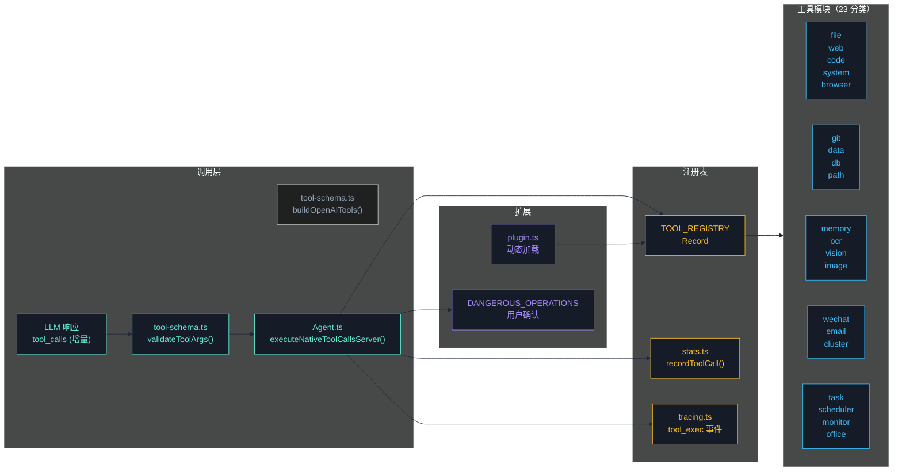
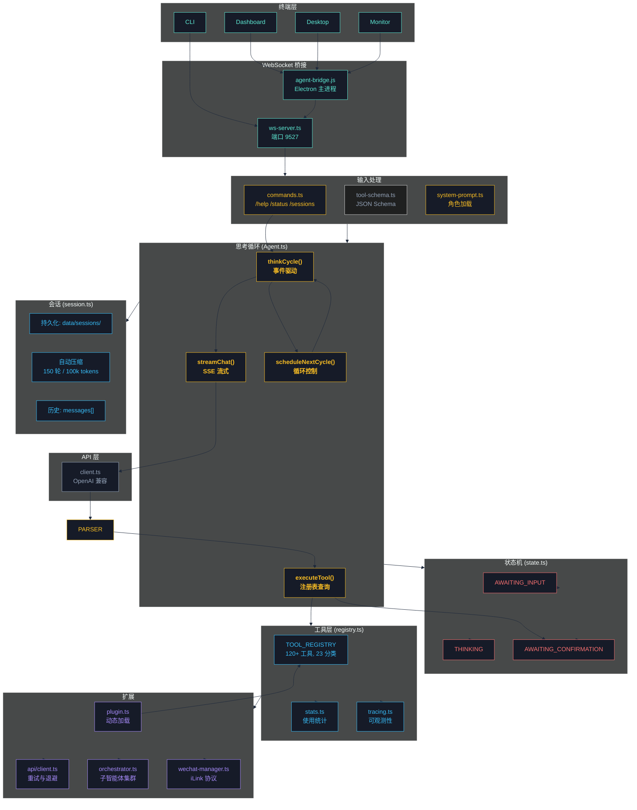

<div align="center">


# CogitoAgent

> **持续思考 · 自主行动 · 隐私优先**
>
> _本地优先的自主智能体 —— 你的工作区、你的数据、你的规则。_

[](https://www.typescriptlang.org/)
[](https://www.electronjs.org/)
[](https://nodejs.org/)

</div>

我思故我在 —— CogitoAgent 不仅仅是一个工具，它是您在本地环境中的自主思考伙伴。

**CogitoAgent** 是一款云端驱动、本地执行的智能体框架，集成了文件管理、知识挖掘、系统操作、代码执行和网络连接能力。它直接运行在用户配置的工作目录内，通过调用用户指定的大模型 API 驱动思考与决策，**用户的工作文件保留在本地**，在保障文件资产安全的同时提供持续运行的智能助手服务。

与传统聊天机器人不同，CogitoAgent 具备**持续思考**、**自主探索**和**工具执行**的能力，能够在后台主动发现和整理您的本地文件资产，并通过可扩展的工具集提供更多能力。


<p align="center">
  <a href="README.md">English</a> · <a href="README.zh.md">中文</a> ·
  <a href="ROADMAP.md">路线图</a> ·
  <a href="CHANGELOG.md">更新日志</a> ·
  <a href="CONTRIBUTING.md">贡献指南</a> ·
  <a href="SECURITY.md">安全策略</a> ·
  <a href="CODE_OF_CONDUCT.md">行为准则</a>
</p>

---

## 📋 目录

- [为什么选择 CogitoAgent？](#-为什么选择-cogitoagent)
- [核心功能](#-核心功能)
- [使用场景](#-使用场景)
- [快速开始](#-快速开始)
- [工具系统](#-工具系统)
- [架构设计](#-架构设计)
- [安全体系](#-安全体系)
- [配置说明](#-配置说明)
- [命令参考](#-命令参考)
- [Docker 部署](#-docker-部署)
- [项目结构](#-项目结构)
- [测试与质量](#-测试与质量)
- [路线图](#-路线图)
- [社区与支持](#-社区与支持)
- [贡献指南](#-贡献指南)
- [许可证](#-许可证)

---

## 💡 为什么选择 CogitoAgent？

云端 AI 助手会把你的文件、代码和对话发送到第三方服务器。**CogitoAgent 走的是另一条路**：它是一个直接运行在你本地工作区的自主智能体，由你选择的 LLM API 驱动——而你的数据永远不会离开你的机器。

- **持续思考** — 即使你不在，也会主动对你的工作区进行反思与行动（事件驱动，消息/工具结果即时推进）
- **自主探索** — 主动发现、整理和处理你的本地文件资产
- **执行 120+ 内置工具** — 从文件操作、代码执行到网络研究、数据库、OCR、多智能体编排，另有化学 / 生物 / 文献科学插件（16+ 工具）
- **隐私安全** — 只有对话上下文会发送给你指定的 LLM API，你的文件永不离开工作区

---

## ✨ 核心功能

| 功能                    | 描述                                                              |
| ----------------------- | ----------------------------------------------------------------- |
| **本地优先隐私**        | 工作文件保留在本地，仅将必要上下文发送给你配置的 LLM API          |
| **持续思考**            | 事件驱动思考循环：用户消息与工具结果即时推进，无需轮询等待        |
| **120+ 工具 / 23 分类** | 文件、代码执行、Git、数据库、OCR、Office、图像生成、生物信息等    |
| **TypeScript 核心**     | 全量类型安全、严格模式、编译期错误检测                            |
| **安全沙箱**            | JavaScript 使用 `isolated-vm` 进程级隔离；Python 使用净化环境执行 |
| **多会话管理**          | 独立对话上下文，持久化存储，自动上下文压缩                        |
| **智能体集群**          | 子智能体创建、任务委派、并行执行、小组讨论与投票                  |
| **Electron 桌面**       | 透明悬浮窗、全屏仪表盘、专属监控面板                              |
| **插件系统**            | 运行时动态加载自定义工具插件（15s 导入超时 + 权限门禁）           |
| **思维链可视化**        | 实时展示推理、工具调用与结果，全程可观测                          |
| **微信集成**            | 扫码登录、消息收发、专属会话、工具气泡展示                        |
| **图像生成**            | 通过可配置图像模型（如 `qwen-image-2.0-pro`）文生图 / 图生图      |
| **可观测性**            | 分类工具使用统计、Token/成本追踪、轻量事件追踪                    |

> **隐私说明**：CogitoAgent 永不将你的文件上传到任何云。仅对话上下文会发送给你指定的 LLM API。你的工作区始终属于你。

---

## 🎯 使用场景

| 场景                   | CogitoAgent 的助力                                             |
| ---------------------- | -------------------------------------------------------------- |
| **个人知识管理**       | 持续扫描工作区、整理文件、基于本地数据回答问题                 |
| **自动化研究与写作**   | 联网搜索、浏览网页、直接在工作区撰写文档                       |
| **代码与 DevOps 助手** | 执行代码（JS/Python）、管理 Git 仓库、执行 SQL、自动化例行任务 |
| **办公文档处理**       | 生成 PPT / Word / Excel；扫描件 OCR；图像视觉分析              |
| **数据分析流水线**     | 读取 CSV/JSON、查询 SQLite、生成结构化报告                     |
| **多智能体协作**       | 将子任务委派给专业人设子智能体（批判者、程序员、分析师……）     |
| **无头服务器部署**     | 以纯 CLI / WebSocket 服务在 Docker 中常驻运行                  |

---

## 🚀 快速开始

### 环境要求

- **Node.js** 20 或更高版本（推荐 22+ / 24 LTS）
- **npm** 或 **yarn** 包管理器
- **Python** 3.x（可选，用于 Python 代码执行）

> **国内用户注意**：如果 `npm install` 下载 Electron 失败：
>
> ```bash
> $env:ELECTRON_MIRROR = "https://npmmirror.com/mirrors/electron/"
> npm install
> ```

### 安装步骤

```bash
git clone https://gitee.com/cnt-code/cogito-agent.git
cd cogito-agent
npm install
npm start
```

### 首次配置

1. **API 基础地址** — 支持 OpenAI 兼容的第三方 API
2. **API Key** — 您的 API 密钥
3. **模型名称** — 例如 gpt-4o, claude-3-sonnet 等
4. **工作目录路径** — AI 可以访问的目录
5. **角色选择** — 选择预设的 AI 角色

### 使用模式

| 命令                         | 模式       | 描述                                                       |
| ---------------------------- | ---------- | ---------------------------------------------------------- |
| `npm start`                  | 桌面模式   | 以 Dashboard 模式启动 Electron（未配置时自动进入设置向导） |
| `npm run electron:desktop`   | 桌面模式   | Electron 悬浮窗口 + 终端 Agent（WebSocket 通信）           |
| `npm run electron:dashboard` | 仪表盘模式 | 全屏仪表盘，包含会话管理和工具可视化                       |
| `npm run cli`                | CLI 模式   | 纯终端模式，无 Electron（适用于服务器/无头环境）           |

---

## 工具系统

所有工具由 `registry.ts` 管理（配 JSON Schema，见 `tool-schema.ts`），由模型通过**原生 function calling**（流式 `tool_calls`）调用，而非文本标记。



| 分类         | 文件           | 主要函数                                                                                                                                                                                                                                                                                          |
| ------------ | -------------- | ------------------------------------------------------------------------------------------------------------------------------------------------------------------------------------------------------------------------------------------------------------------------------------------------- |
| 文件操作     | `file.ts`      | `ls`, `read`, `create`, `copy`, `mkdir`                                                                                                                                                                                                                                                           |
| 路径工具     | `path.ts`      | `getBasePath`, `resolveInWorkspace`, `realPathClosest`（内部模块）                                                                                                                                                                                                                                |
| 网络工具     | `web.ts`       | `search`, `browse`, `fetchPage`                                                                                                                                                                                                                                                                   |
| 浏览器自动化 | `browser.ts`   | `initBrowser`, `clickElement`, `fillField`, `selectOption`, `viewChanges`, `getPageContent`, `takeScreenshot`, `closeBrowser`, `searchOnPage`, `findElements`, `searchOnEngine`, `downloadFile`                                                                                                   |
| 系统操作     | `system.ts`    | `listApps`, `openApp`, `closeApp`                                                                                                                                                                                                                                                                 |
| 代码执行     | `code.ts`      | `executeCode`, `executeFile`, `runJavaScript`, `runPython`, `formatCode`                                                                                                                                                                                                                          |
| 安全沙箱     | `sandbox.ts`   | `createJavaScriptSandbox`, `runJavaScriptSandbox`, `runPythonSandbox`, `executeCodeSandbox`                                                                                                                                                                                                       |
| Git          | `git.ts`       | `gitInit`, `gitClone`, `gitAdd`, `gitCommit`, `gitPush`, `gitPull`, `gitStatus`, `gitLog`, `gitBranchCreate`, `gitBranchDelete`, `gitBranchList`, `gitCheckout`, `gitCheckoutNew`, `gitMerge`, `gitDiff`, `gitRemoteAdd`, `gitRemoteList`, `gitConfigUser`, `gitReset`, `gitStash`, `gitStashPop` |
| 任务管理     | `task.ts`      | `createTask`, `getTasks`, `getTask`, `updateTask`, `deleteTask`, `completeTask`, `splitTask`, `getTaskStats`, `clearTasks`                                                                                                                                                                        |
| 记忆系统     | `memory.ts`    | `addMemory`, `searchMemory`, `getAllMemories`, `getMemory`, `updateMemory`, `deleteMemory`, `getMemoryStats`, `getRelatedMemories`, `clearMemory`                                                                                                                                                 |
| 数据处理     | `data.ts`      | `readCSV`, `writeCSV`, `readJSON`, `writeJSON`, `csvToJSON`, `jsonToCSV`, `queryData`, `analyzeData`, `sortData`, `filterData`, `groupData`, `aggregateData`                                                                                                                                      |
| 数据库       | `db.ts`        | `executeSQL`, `query`, `insert`, `update`, `deleteData`, `createTable`, `dropTable`, `getTables`, `getTableSchema`, `executeTransaction`, `closeDB`                                                                                                                                               |
| 邮件         | `email.ts`     | `sendEmail`, `sendTextEmail`, `sendHtmlEmail`, `sendTemplateEmail`, `sendEmailWithAttachments`, `checkEmailConfig`                                                                                                                                                                                |
| 系统监控     | `monitor.ts`   | `getCPUInfo`, `getMemoryInfo`, `getDiskInfo`, `getNetworkInfo`, `getProcesses`, `getSystemInfo`, `getCurrentProcess`, `getSystemLoad`, `monitorSystem`                                                                                                                                            |
| 定时任务     | `scheduler.ts` | `addScheduleTask`, `getScheduleTasks`, `getScheduleTask`, `updateScheduleTask`, `toggleScheduleTask`, `removeScheduleTask`, `startScheduler`, `stopScheduler`                                                                                                                                     |
| 图像识别     | `ocr.ts`       | `ocr`, `ocrBatch`                                                                                                                                                                                                                                                                                 |
| 视觉分析     | `vision.ts`    | `vision`, `visionFromUrl`                                                                                                                                                                                                                                                                         |
| Office 文档  | `office.ts`    | `createPpt`, `createWord`, `createExcel`, `readExcel`, `readWord`, `readPpt`                                                                                                                                                                                                                      |
| 图像生成     | `image-gen.ts` | `generateImage`                                                                                                                                                                                                                                                                                   |
| 集群管理     | `cluster.ts`   | `spawnAgent`, `delegateTask`, `getClusterStatus`, `stopAgent`, `stopAllAgents`, `parallelExecute`, `panelDiscussion`, `pipeline`, `voting`                                                                                                                                                        |
| 微信消息     | `wechat.ts`    | `loginWechat`, `logoutWechat`, `sendWechatMessage`, `sendWechatImage`, `getWechatStatus`, `generateWechatQRCode`                                                                                                                                                                                  |

> **图像生成**（`generateImage`）：文生图 / 图生图。以 `qwen-image-2.0-pro` 为例，建议尺寸为 `2048*2048`、`2368*1728`、`2688*1536`、`1728*2368`、`2536*2688`（模型与尺寸均为建议值，详见 `introduction/tools.md`）。

> 详细工具文档：注册机制、使用示例、最佳实践 → [introduction/tools.md](introduction/tools.md)

<p align="center">
  
  
  <!--  -->
  <br>
  <em>图像视觉 · 搜索与浏览器 · 自动化</em>
</p>

---

## 架构设计



| 组件                  | 职责                                                             |
| --------------------- | ---------------------------------------------------------------- |
| **Agent.ts**          | 思考循环 —— 事件驱动，随消息/工具结果即时推进（无固定 3 秒轮询） |
| **state.ts**          | 状态机 —— THINKING / AWAITING_INPUT / AWAITING_CONFIRMATION      |
| **registry.ts**       | 工具注册表 —— 集中管理所有工具模块                               |
| **session.ts**        | 会话管理 —— 多会话切换、上下文压缩                               |
| **commands.ts**       | 命令处理 —— /help, /status, /persona, /sessions 等               |
| **sandbox.ts**        | 代码沙箱 —— isolated-vm 进程级隔离                               |
| **stats.ts**          | 统计 —— 工具使用追踪和指标                                       |
| **tracing.ts**        | 追踪 —— 工具执行和 LLM 调用的轻量级可观测性                      |
| **client.ts**         | LLM 客户端 —— OpenAI 兼容调用、重试与退避                        |
| **plugin.ts**         | 插件系统 —— 动态加载自定义工具插件                               |
| **ws-server.ts**      | WebSocket —— 桌面模式通信（端口 9527）                           |
| **wechat-manager.ts** | 微信通道 —— iLink 协议集成、消息路由、会话同步                   |

> 完整架构详情：思考循环图、工具调用流程、状态机、消息流、WebSocket → [introduction/architecture.md](introduction/architecture.md)

---

## 安全体系

安全是 CogitoAgent 的一等公民：

| 防护层            | 保护措施                                                                                                                                  |
| ----------------- | ----------------------------------------------------------------------------------------------------------------------------------------- |
| **代码执行**      | JavaScript 运行于 `isolated-vm`（独立 V8 堆，结构上杜绝原型链污染逃逸）；Python 运行于净化环境（`PYTHONNOUSERSITE`、清理 `PATH`、硬超时） |
| **危险操作门禁**  | `DANGEROUS_OPERATIONS` 门禁——gitPush / executeCode / dropTable 等破坏性操作需用户显式确认                                                 |
| **工具权限**      | 逐工具 allow / deny / ask 策略（R5.2），未受信插件自动降级为受限默认权限                                                                  |
| **工作区边界**    | 所有文件工具经 realpath 校验——工作区外的路径穿越一律拒绝                                                                                  |
| **Electron 加固** | `contextIsolation: true`、`sandbox: true`、`nodeIntegration: false`、严格 CSP 头、IPC 发送方校验                                          |
| **SQL 注入防护**  | 数据库模块统一参数化查询与输入净化                                                                                                        |
| **凭据安全**      | 凭据加密存储、绝不写入日志、回显 UI 时打码                                                                                                |
| **供应链安全**    | 插件加载带 15s 导入超时与错误日志；动态 import 缓存失效                                                                                   |
| **依赖审计**      | CI 强制 `npm audit` + CodeQL 扫描                                                                                                         |

> 报告漏洞：[SECURITY.md](SECURITY.md)

---

## 命令参考

| 命令                                    | 描述                   |
| --------------------------------------- | ---------------------- |
| `/sessions`                             | 列出所有会话           |
| `/new`                                  | 创建新会话             |
| `/switch <id>`                          | 切换到指定会话         |
| `/delete <id>`                          | 删除会话               |
| `/rename <name>`                        | 重命名当前会话         |
| `/help`                                 | 显示帮助信息           |
| `/status`                               | 显示当前状态           |
| `/config`                               | 显示配置信息           |
| `/persona <name>`                       | 切换角色               |
| `/personas`                             | 列出所有可用角色       |
| `/tools`                                | 列出所有可用工具       |
| `/clear`                                | 清除对话历史           |
| `/debug`                                | 切换调试模式           |
| `/wechat/status`                        | 显示微信通道状态       |
| `/wechat/login`                         | 扫码登录微信           |
| `/wechat/logout`                        | 退出微信登录           |
| `/spawn <persona> <name> <instruction>` | 创建子智能体           |
| `/agents`                               | 列出所有子智能体       |
| `/delegate <agentId> <task>`            | 向子智能体委派任务     |
| `/stop-agent <agentId>`                 | 停止指定子智能体       |
| `/stop-all-agents`                      | 停止所有子智能体       |
| `ENTER`                                 | 中断思考，进入输入模式 |
| `exit`                                  | 退出程序               |

---

## 配置说明

通过 `config.json` 和环境变量（`.env`）进行配置，环境变量优先级更高。关键变量：

- `COGITO_API_KEY` — 大模型 API 密钥（OCR / 视觉 / 图像生成的回退密钥）
- `COGITO_IMAGEGEN_API_KEY` — 图像生成 API 密钥（可选，留空则回退主密钥）
- `COGITO_IMAGEGEN_MODEL` — 图像模型名，默认 `qwen-image-2.0-pro`（建议值，详见 `introduction/tools.md`）
- `COGITO_VISION_API_KEY` / `COGITO_OCR_API_KEY` — 可选的分功能密钥

> 完整配置参考：环境变量列表、高级选项（压缩、截断、归档）、图像生成 → [introduction/configuration.md](introduction/configuration.md)

---

## 项目结构

```
cogito-agent/
├── src/                              # 源代码（TypeScript）
│   ├── agent/                        # 核心 agent 模块
│   │   ├── Agent.ts / state.ts / registry.ts
│   │   ├── commands.ts / session.ts / stats.ts
│   │   ├── plugin.ts / thought-trace.ts
│   │   ├── wechat-manager.ts         # 微信通道管理
│   │   └── tools/                    # 21 个工具模块（23 分类，120+ 工具）
│   ├── api/                          # API 层（client, models, webSearch）
│   ├── io/                           # Terminal, Logger, WebSocket
│   ├── config.ts                     # 配置管理
│   ├── types/                        # TypeScript 类型定义
│   └── index.ts                      # 应用入口
├── electron/                         # 桌面模式（JS）
│   ├── main.js / preload.cjs / agent-bridge.js
│   ├── desktop/ / dashboard/ / monitor/ / setup/
│   ├── shared/                       # 共享工具
│   └── assets/
├── personas/                         # 角色文件夹 —— `cogito` 为内置默认人设，其余 28 个为可切换预设
├── tests/                            # 测试文件
├── data/                             # 运行时数据（自动创建）
├── tsconfig.json                     # TypeScript 配置
└── introduction/                     # 详细文档
    ├── tools.md                      # 工具系统详情
    ├── architecture.md               # 架构详情
    ├── configuration.md              # 配置指南
    ├── systems.md                    # 核心系统详情
    ├── extensions.md                 # 扩展详情
    ├── agent-cluster.md              # 智能体集群与监控面板
    └── deployment.md                 # 部署与开发
```

---

## 核心系统

> 详见 [introduction/systems.md](introduction/systems.md)

```mermaid
%%{init: {"theme": "dark", "themeVariables": {"bgColor": "#0b0e14", "primaryColor": "#5eead4", "primaryTextColor": "#5eead4", "primaryBorderColor": "#5eead4", "lineColor": "#1e293b", "textColor": "#94a3b8", "fontFamily": "JetBrains Mono, monospace", "fontSize": "10", "secondaryColor": "#161b28", "tertiaryColor": "#1c2230"}}}%%
flowchart TD
    subgraph ORCHESTRATION["编排层"]
        AGENT["Agent.ts<br/>事件驱动思考循环"]
        STATE["state.ts<br/>THINKING / AWAIT / CONFIRM"]
        SESSION["session.ts<br/>多会话 + 持久化"]
        CMDS["commands.ts<br/>/help /status /sessions"]
    end

    subgraph COGNITION["认知层"]
        MEMORY["memory.ts<br/>JSON 存储 + 标签语义检索"]
        PERSONA["system-prompt.ts<br/>29 角色 + 自定义"]
        THOUGHT["thought-trace.ts<br/>实时思维链可视化"]
    end

    subgraph EXECUTION["执行层"]
        REGISTRY["registry.ts<br/>120+ 工具, 23 分类"]
        SANDBOX["sandbox.ts<br/>isolated-vm + Python 子进程"]
        TASK["task.ts<br/>CRUD + 分解 + 统计"]
        CLUSTER["orchestrator.ts<br/>子智能体创建 + 委派"]
    end

    subgraph OBSERVABILITY["可观测性"]
        STATS["stats.ts<br/>按分类统计 + 指标"]
        TRACING["tracing.ts<br/>事件日志 + 耗时"]
    end

    subgraph SECURITY["安全层"]
        DANGER["DANGEROUS_OPERATIONS<br/>用户确认"]
        RETRY["api/client.ts<br/>重试 + 退避"]
    end

    subgraph INTEGRATION["集成层"]
        PLUGIN["plugin.ts<br/>动态工具加载"]
        WECHAT["wechat-manager.ts<br/>iLink 扫码登录 + 路由"]
    end

    AGENT --> STATE
    AGENT --> SESSION
    AGENT --> CMDS
    AGENT --> MEMORY
    AGENT --> PERSONA
    AGENT --> THOUGHT
    AGENT --> REGISTRY
    REGISTRY --> SANDBOX
    REGISTRY --> TASK
    REGISTRY --> CLUSTER
    AGENT --> STATS
    AGENT --> TRACING
    AGENT --> DANGER
    AGENT --> RETRY
    AGENT --> PLUGIN
    AGENT --> WECHAT

    classDef orchestration fill:#161b28,stroke:#fbbf24,color:#fbbf24,font-weight:bold;
    classDef cognition fill:#161b28,stroke:#a78bfa,color:#a78bfa;
    classDef execution fill:#161b28,stroke:#38bdf8,color:#38bdf8;
    classDef obs fill:#161b28,stroke:#94a3b8,color:#94a3b8;
    classDef security fill:#161b28,stroke:#f87171,color:#f87171;
    classDef integration fill:#161b28,stroke:#5eead4,color:#5eead4;

    class AGENT,STATE,SESSION,CMDS orchestration;
    class MEMORY,PERSONA,THOUGHT cognition;
    class REGISTRY,SANDBOX,TASK,CLUSTER execution;
    class STATS,TRACING obs;
    class DANGER,RETRY security;
    class PLUGIN,WECHAT integration;
```



- **记忆系统** —— 基于 JSON 的长期存储和标签语义检索
- **任务管理** —— 任务创建、分解和状态追踪
- **代码沙箱** —— `isolated-vm` 进程级隔离，支持 JS 和 Python
- **角色系统** —— 29 个预设角色（含内置 Cogito 默认人设 + 28 个可切换预设），支持自定义和热切换
- **会话管理** —— 独立上下文，自动压缩
- **统计模块** —— 工具使用追踪和性能指标
- **思维链可视化** —— 实时思考过程展示
- **智能体集群** —— 子智能体创建、任务委派与集群监控，详见 [introduction/agent-cluster.md](introduction/agent-cluster.md)

<p align="center">
  
  <br>
  <em>智能体集群监控面板</em>
</p>

<p align="center">
  
  <br>
  <em>监控面板 — 思维链、工具统计与智能体集群</em>
</p>

## 扩展

> 详见 [introduction/extensions.md](introduction/extensions.md)

- **插件系统** —— 动态加载自定义工具插件
- **追踪系统** —— 工具执行和 LLM 调用的轻量级可观测性
- **重试与退避** —— LLM 客户端内置可靠的重试与退避策略
- **多模型支持** —— OpenAI、Moark、Anthropic、Google
- **网络搜索** —— 内置互联网搜索能力

## Docker 部署

> 详见 [introduction/deployment.md](introduction/deployment.md)

```bash
cp .env.example .env    # 设置 COGITO_API_KEY 和 COGITO_WS_TOKEN
docker-compose up -d
```

容器以**非 root 用户**运行，健康检查暴露在 `:9528`，运行时数据持久化到命名卷。

---

## 测试与质量

- **870+ 测试用例**，覆盖 49 个测试套件（Jest，ESM 模式）
- **严格 TypeScript** — `tsc --noEmit` 在 CI 中强制执行
- **ESLint + Prettier** — 统一代码风格
- **GitHub Actions CI/CD** — lint → typecheck → test → build → release
- **CodeQL** — 自动化安全扫描
- **Dependabot** — 自动化依赖更新

```bash
npm test              # 运行完整测试套件
npm run typecheck     # TypeScript 严格类型检查
npm run lint          # ESLint
npm run format        # Prettier 格式化
```

---

## 更新日志

详见 [CHANGELOG.md](CHANGELOG.md) 完整版本历史。

---

## 路线图

详见 [ROADMAP.md](ROADMAP.md) 完整路线图，包括：

- 工具执行性能优化与常用结果缓存
- 上下文窗口利用优化与智能压缩
- Dashboard 中的可视化配置编辑器
- 插件热重载支持
- 更多 LLM 服务商集成

---

## 社区与支持

欢迎加入 CogitoAgent 社区：

- [GitHub Issues](https://github.com/SnowLeopard-io/CogitoAgent/issues) — 报告 Bug 和请求功能
- [GitHub Discussions](https://github.com/SnowLeopard-io/CogitoAgent/discussions) — 提问和交流想法
- [Gitee](https://gitee.com/cnt-code/cogito-agent) — China mirror

期待你的参与和反馈！

---

## 贡献指南

我们欢迎社区贡献！无论你想修复 bug、添加新功能，还是改进文档，你的帮助都非常宝贵。

<a href="https://github.com/SnowLeopard-io/CogitoAgent/issues?q=is%3Aopen+is%3Aissue+label%3A%22good+first+issue%22"></a>
<a href="https://github.com/SnowLeopard-io/CogitoAgent/issues?q=is%3Aopen+is%3Aissue+label%3A%22help+wanted%22"></a>

### 开始参与

1. 阅读 [贡献指南](CONTRIBUTING.md) 获取详细说明
2. 查看 [good first issues](https://github.com/SnowLeopard-io/CogitoAgent/issues?q=is%3Aopen+is%3Aissue+label%3A%22good+first+issue%22) 开始入门
3. 遵守 [行为准则](CODE_OF_CONDUCT.md)
4. 通过 [SECURITY.md](SECURITY.md) 报告安全问题

### 贡献方式

- 🐛 报告 bug
- ✨ 提出新功能建议
- 📝 改进文档
- 🧪 编写测试
- 🔧 修复问题
- 🎨 改进用户体验

---

## 许可证

Apache 2.0

---

由 CogitoAgent Team 开发
