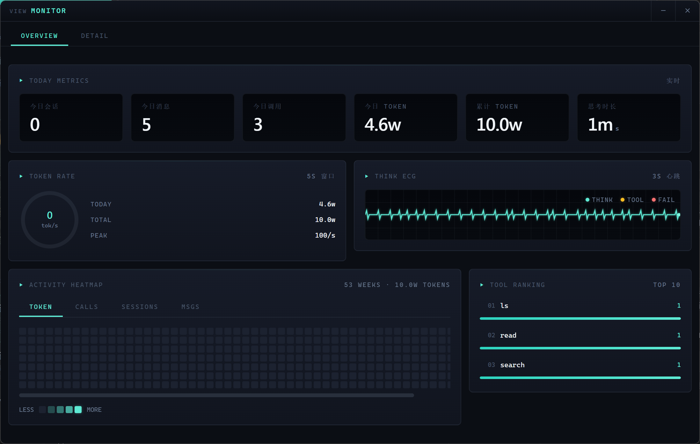

# Agent Cluster and Monitor Panel / 智能体集群与监控面板

> Visualize agent cluster state, thought chains, and tool usage statistics in real time.
>
> 实时可视化智能体集群状态、思维链和工具使用统计。

---

## 1. Overview / 概述

CogitoAgent supports creating and managing **sub-agents** to enable multi-agent collaboration. It also provides a standalone **monitor panel** window that visualizes cluster state, thought chains, and tool usage statistics in real time.

CogitoAgent 支持**子智能体**（Sub-Agent）的创建和管理，实现多智能体协作。同时提供独立的**监控面板**窗口，用于实时可视化集群状态、思维链和工具使用统计。


---

## 2. Agent Cluster / 智能体集群

### 2.1 Sub-Agent Management / 子智能体管理

Sub-agents are created with the `/spawn` command. The following creation commands are currently supported.

通过 `/spawn` 命令可以创建子智能体，当前支持以下创建方式：

| 命令                                    | 说明                               |
| --------------------------------------- | ---------------------------------- |
| `/spawn <persona> <name> <instruction>` | 创建子智能体，指定角色、名称和指令 |
| `/agents`                               | 列出所有子智能体                   |

Once a sub-agent has been created, the main agent can delegate tasks to it.

子智能体创建后，主智能体可以对子智能体进行任务委派：

| 命令                         | 说明                   |
| ---------------------------- | ---------------------- |
| `/delegate <agentId> <task>` | 向指定子智能体委派任务 |
| `/stop-agent <agentId>`      | 停止指定子智能体       |
| `/stop-all-agents`           | 停止所有子智能体       |

### 2.2 Cluster State / 集群状态

Each sub-agent carries the following state information.

每个子智能体包含以下状态信息：

| 字段                 | 说明                                                        |
| -------------------- | ----------------------------------------------------------- |
| `id`                 | 智能体唯一标识                                              |
| `name`               | 智能体名称                                                  |
| `persona`            | 智能体人设                                                  |
| `state`              | 当前状态（idle / thinking / tool_executing / done / error） |
| `toolCalls`          | 工具调用次数                                                |
| `iterationCount`     | 思考迭代次数                                                |
| `lastActiveAt`       | 最后活跃时间                                                |
| `hasError` / `error` | 错误信息                                                    |

### 2.3 State Transitions / 状态流转

The diagram below shows how an agent moves between states.

下图展示了智能体在各状态之间的流转过程。

```
idle → thinking → tool_executing → thinking → ... → done
  ↓                                                    ↓
  └────────────────── error ←──────────────────────────┘
```

- **idle**: Idle, waiting for a task.
  **idle**：空闲状态，等待任务。
- **thinking**: Currently thinking or reasoning.
  **thinking**：正在思考/推理。
- **tool_executing**: Currently executing a tool.
  **tool_executing**：正在执行工具。
- **done**: The task is complete.
  **done**：任务完成。
- **error**: Execution failed.
  **error**：执行出错。

---

## 3. Monitor Panel / 监控面板

The monitor panel is a standalone Electron window that provides three real-time visualization panels.

监控面板是一个独立的 Electron 窗口，提供三块实时可视化面板：



### 3.1 Thought Chain / 思维链（Thought Chain）

It shows the main agent's reasoning process in real time, including:

实时展示主智能体的思考过程，包含：

- **Thought step name**: The reasoning step currently being executed.
  **思考步骤名称**：当前正在执行的思考步骤。
- **Step details**: Key parameters or context information.
  **步骤详情**：关键参数或上下文信息。
- **Execution status**: running / completed / failed.
  **执行状态**：运行中 / 完成 / 失败。
- **Duration**: How long each step took.
  **耗时**：每个步骤的执行时长。

### 3.2 Tool Statistics / 工具统计（Tool Statistics）

It displays statistics and charts about tool usage:

展示工具使用情况的统计数据和图表：

- **Total calls**: The accumulated number of calls across all tools.
  **总调用次数**：所有工具累计调用次数。
- **Success rate**: The percentage of successful tool executions.
  **成功率**：工具执行成功率百分比。
- **Call distribution chart**: An ECharts bar chart showing call counts and success rates by tool category.
  **调用分布图**：ECharts 柱状图，按工具分类展示调用次数和成功率。
  - Color intensity indicates how high the success rate is.
    颜色深浅表示成功率高低。
  - Hover to view detailed information.
    悬停可查看详细信息。

### 3.3 Agent Cluster / 智能体集群（Agent Cluster）

It shows the cluster topology and agent details in real time:

实时展示集群拓扑和智能体详情：

- **Topology graph**: A ring topology drawn on Canvas.
  **拓扑图**：Canvas 绘制的环形拓扑图。
  - Center node: the main agent.
    中心节点：主智能体。
  - Surrounding nodes: the sub-agents.
    环绕节点：子智能体。
  - Edges represent communication relationships.
    连线表示通信关系。
  - Active nodes have a pulsing glow effect.
    活跃节点有脉冲光晕效果。
- **Agent list**: A detail card for each agent.
  **智能体列表**：每个智能体的详细信息卡片。
  - Status label (color-coded).
    状态标签（颜色区分）。
  - Persona / tool call count / iteration count.
    Persona / 工具调用次数 / 迭代次数。
  - Last active time.
    最后活跃时间。
  - Error message, if any.
    错误信息（如有）。

### 3.4 How to Open / 打开方式

Click the **监控面板** button in the sidebar of the main Dashboard window to open the standalone monitor panel window (16:9 landscape layout).

在 Dashboard 主窗口侧边栏点击 **监控面板** 按钮，即可弹出独立的监控面板窗口（16:9 横向布局）。

---

## 4. Data Flow / 数据流

The diagram below shows how messages flow from the terminal agent to every window.

下图展示了消息如何从终端 Agent 流向各个窗口。

```
终端 Agent (WebSocket 9527)
    ↓
Agent Bridge (agent-bridge.js)
    ├── Dashboard 窗口
    └── 监控面板窗口 ← 同时接收所有实时消息
```

All windows register themselves with `agent-bridge.js` through `initAgentBridge()` and automatically receive the following IPC messages:

所有窗口通过 `initAgentBridge()` 注册到 `agent-bridge.js`，自动接收以下 IPC 消息：

- `thought-trace`: Thought chain step updates.
  `thought-trace`：思维链步骤更新。
- `stats-response`: Tool usage statistics.
  `stats-response`：工具统计信息。
- `cluster-state`: Cluster state updates.
  `cluster-state`：集群状态更新。

---

## 5. Technical Implementation / 技术实现

### 5.1 Window Management / 窗口管理

The monitor panel window is managed by the Electron main process.

监控面板窗口由 Electron 主进程管理：

```javascript
// main.js - 创建监控面板窗口
function createMonitorWindow() {
  monitorWindow = new BrowserWindow({
    width: 960,
    height: 540,
    frame: false,
    backgroundColor: '#030712',
    webPreferences: {
      preload: path.join(__dirname, 'preload.cjs'),
      contextIsolation: true,
    },
  });
  monitorWindow.loadFile(path.join(__dirname, 'monitor', 'index.html'));
  initAgentBridge(monitorWindow);
}
```

### 5.2 File Structure / 文件结构

The relevant files are organized as follows.

相关文件的组织结构如下。

```
electron/
├── monitor/                    # 监控面板
│   ├── index.html              # 页面结构（左右布局）
│   ├── style.css               # 暗色主题样式
│   └── renderer.js             # 渲染逻辑（ThoughtManager / StatsManager / ClusterManager）
├── main.js                     # 主进程（窗口管理 + IPC）
├── preload.cjs                 # 预加载脚本（IPC 桥接）
└── agent-bridge.js             # WebSocket 桥接（消息转发）
```

### 5.3 Key Modules / 关键模块

- **ThoughtManager**: Manages thought chain tracing and updates the timeline through add/update/clear operations.
  **ThoughtManager**：管理思维链追踪，按 add/update/clear 操作更新时间轴。
- **StatsManager**: Manages tool statistics, including ECharts chart initialization and periodic refreshing.
  **StatsManager**：管理工具统计，包含 ECharts 图表初始化和定期刷新。
- **ClusterManager**: Manages cluster state, including Canvas topology drawing and agent list rendering.
  **ClusterManager**：管理集群状态，包含 Canvas 拓扑图绘制和智能体列表渲染。
