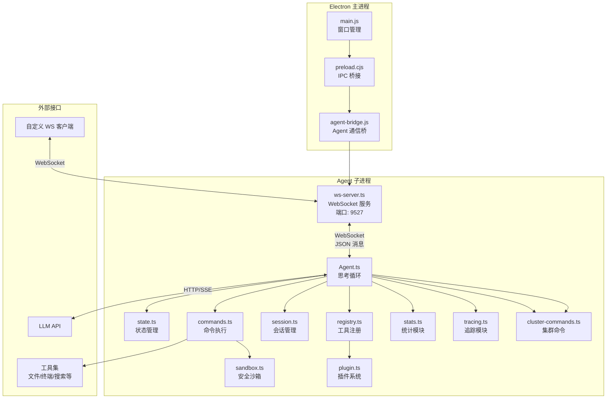
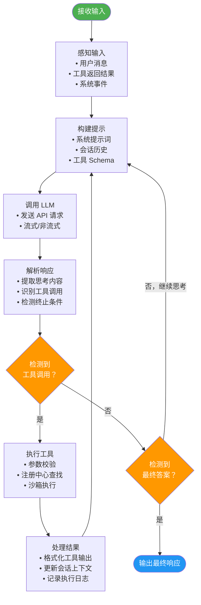
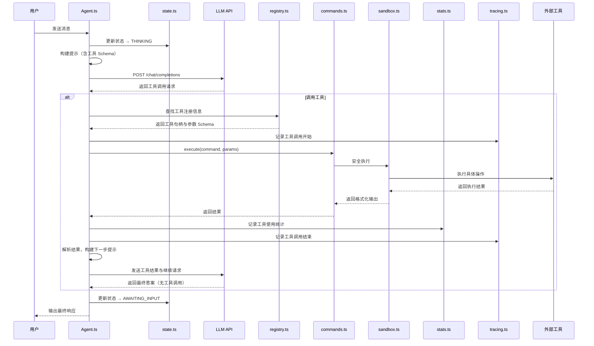
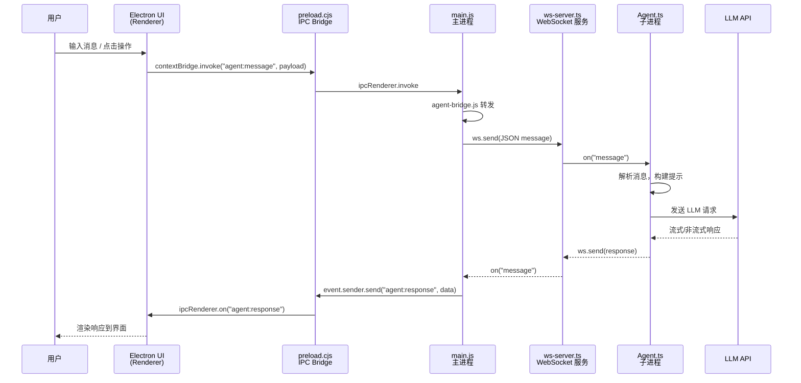
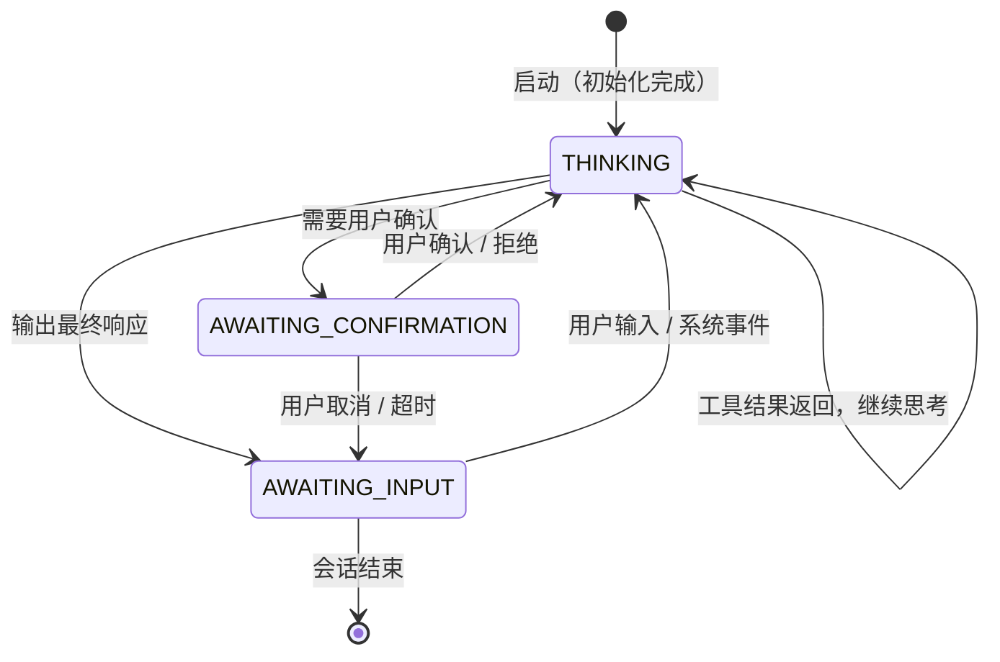
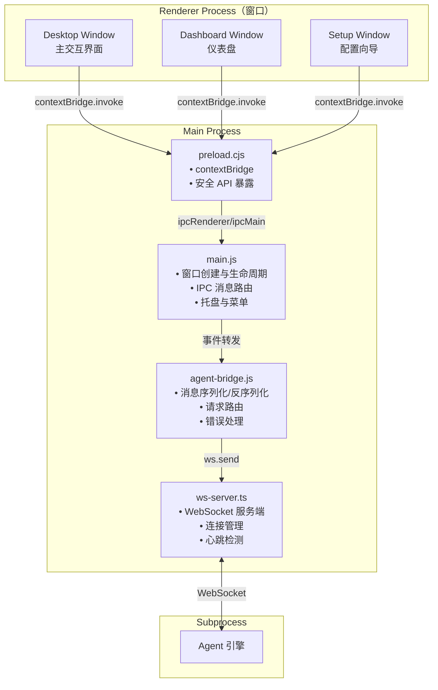
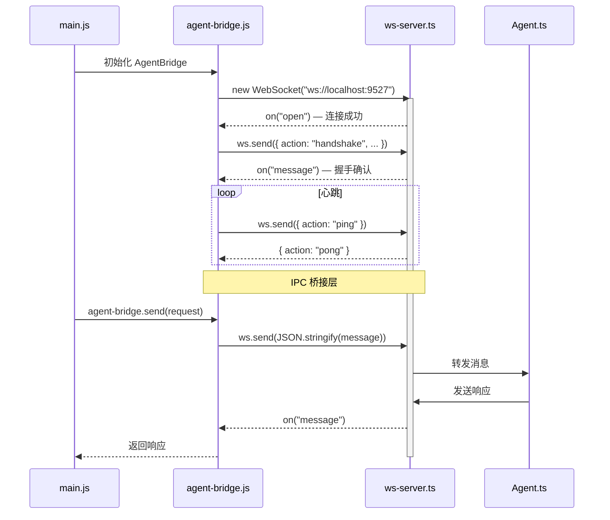

# 架构设计详解 / Architecture Design Details

> Detailed documentation: core components, thinking loop, tool invocation flow, desktop-mode architecture, and WebSocket communication.
>
> 详细文档：核心组件、思考循环、工具调用流程、桌面模式架构与 WebSocket 通信。

---

## 1. 核心组件表 / Core Components

The following table lists the core components of Cogito Agent along with their primary responsibilities and the source file that implements each one.

下表列出了 Cogito Agent 的核心组件及其主要职责，并标注了各组件对应的源文件。

| 组件                 | 文件                  | 职责描述                                                                                     |
| -------------------- | --------------------- | -------------------------------------------------------------------------------------------- |
| **Agent 引擎**       | `Agent.ts`            | 思考循环主控制器，负责任务编排、状态转换、LLM 交互调度                                       |
| **状态管理**         | `state.ts`            | 集中式状态管理，维护 Agent 生命周期状态（THINKING / AWAITING_INPUT / AWAITING_CONFIRMATION） |
| **工具注册中心**     | `registry.ts`         | 工具注册与发现，管理所有可用工具的元数据、参数 schema 和执行句柄                             |
| **会话管理**         | `session.ts`          | 多会话隔离，管理对话上下文、历史记录和配置持久化，支持自动压缩                               |
| **命令执行器**       | `commands.ts`         | 将 Agent 决策转化为具体操作，执行工具调用并处理结果                                          |
| **安全沙箱**         | `sandbox.ts`          | 命令执行沙箱，提供安全的代码/命令执行环境，使用 `isolated-vm` 进程级隔离                     |
| **统计模块**         | `stats.ts`            | 工具使用追踪和性能指标，记录调用次数、耗时等统计数据                                         |
| **追踪模块**         | `tracing.ts`          | 轻量级可观测性，记录工具执行和 LLM 调用的详细追踪信息                                        |
| **集群命令**         | `cluster-commands.ts` | 子智能体管理，支持创建、委派、停止子智能体                                                   |
| **插件系统**         | `plugin.ts`           | 动态加载自定义工具插件，扩展 Agent 能力                                                      |
| **WebSocket 服务器** | `ws-server.ts`        | 实时双向通信层，为 Electron 客户端和其他 WS 客户端提供消息通道（端口 9527）                  |

---

## 2. 模块关系图 / Module Relationship Diagram

The diagram below illustrates the connections between the Electron main process, the Agent subprocess, and external interfaces.

下图展示了 Electron 主进程、Agent 子进程与外部接口之间的连接关系。



---

## 3. 思考循环（Think Cycle）/ Thinking Cycle

The thinking cycle is the core operating mechanism of the Agent. It adopts an iterative **observe–think–act** paradigm. In each cycle, the Agent will:

思考循环是 Agent 的核心运行机制，采用 **观察-思考-行动** 的迭代范式。每一轮循环中，Agent 会：

1. **Perceive input**: Obtain context from user messages, system events, or tool return results.
1. **感知输入**：从用户消息、系统事件或工具返回结果中获取上下文。
1. **Build prompt**: Assemble the LLM prompt from the current state, history, and available tool schemas.
1. **构建提示**：将当前状态、历史记录、可用工具 schema 组装为 LLM 提示。
1. **Call LLM**: Send a request to the large model to obtain reasoning results and action decisions.
1. **调用 LLM**：向大模型发送请求，获取推理结果与行动决策。
1. **Parse response**: Extract thinking content, tool calls, or the final answer from the LLM output.
1. **解析响应**：从 LLM 输出中提取思考内容、工具调用或最终答案。
1. **Execute tool**: If the LLM decides to call a tool, execute the corresponding operation through the registry.
1. **执行工具**：若 LLM 决定调用工具，则通过注册中心执行相应操作。
1. **Update state**: Write the result back to the session context and update the state machine.
1. **更新状态**：将结果写回会话上下文，更新状态机。
1. **Decide next step**: Determine whether to continue the loop (tool result pending) or output the final response.
1. **决定下一步**：判断是继续循环（工具结果待处理）还是输出最终响应。



---

## 4. 工具调用流程 / Tool Invocation Flow

The sequence diagram below shows the complete flow of a tool invocation, from the user message through state updates, LLM calls, sandbox execution, and statistics tracing, until the final response is returned.

下图以时序图展示了工具调用的完整流程：从用户消息开始，经过状态更新、LLM 调用、沙箱执行与统计追踪，直到返回最终响应。



---

## 5. 桌面模式消息流 / Desktop-Mode Message Flow

The following sequence diagram describes how a message flows through the Electron UI, the IPC bridge, the main process, the WebSocket server, and the Agent subprocess.

以下时序图描述了消息在 Electron UI、IPC 桥接层、主进程、WebSocket 服务与 Agent 子进程之间的流转过程。



---

## 6. 状态机 / State Machine

The state machine below defines the Agent lifecycle: it starts in THINKING, may pause for AWAITING_CONFIRMATION on high-risk operations, and returns to AWAITING_INPUT when the final response is emitted (state.ts 仅定义三个状态，无 IDLE 状态).

下图所示的状态机定义了 Agent 的生命周期：初始为 THINKING，遇到高风险操作可暂停于 AWAITING_CONFIRMATION，输出最终响应后回到 AWAITING_INPUT（`state.ts` 仅定义三个状态，无 IDLE 状态）。



### 状态说明 / State Descriptions

The table below explains each state in the lifecycle.

下表说明了生命周期中的各个状态。

| 状态                    | 说明                                               |
| ----------------------- | -------------------------------------------------- |
| `THINKING`              | Agent 正在思考循环中——构建提示、调用 LLM、执行工具 |
| `AWAITING_INPUT`        | 等待用户输入消息或系统事件触发                     |
| `AWAITING_CONFIRMATION` | 等待用户确认高风险操作（如文件删除、命令执行等）   |

---

## 7. 桌面模式（Electron）/ Desktop Mode (Electron)

### 7.1 架构图 / Architecture Diagram

The architecture diagram below shows the renderer process windows, the main process modules, and the Agent subprocess, along with their communication links.

下图展示了渲染进程的窗口、主进程的模块以及 Agent 子进程之间的架构与通信链路。



### 7.2 窗口 / Windows

The table below lists the three Electron windows, their source files, and their purposes.

下表列出了三个 Electron 窗口、对应的源文件及其用途。

| 窗口                 | 文件             | 用途                                             |
| -------------------- | ---------------- | ------------------------------------------------ |
| **Desktop Window**   | `desktop.html`   | 主交互界面——用户输入、对话展示、实时流式输出     |
| **Dashboard Window** | `dashboard.html` | 仪表盘——会话概览、工具调用统计、运行状态监控     |
| **Setup Window**     | `setup.html`     | 配置向导——首次配置 API Key、模型、工作目录、角色 |

### 7.3 主要进程 / Main Processes

#### `main.js` — 窗口管理器 / Window Manager

- Create and manage the Desktop, Dashboard, and Setup window instances.
- 创建和管理 Desktop、Dashboard、Setup 窗口实例。
- Register IPC channels (`ipcMain.handle` / `ipcMain.on`).
- 注册 IPC 通道（`ipcMain.handle` / `ipcMain.on`）。
- Manage the system tray, menu bar, and global shortcuts.
- 管理系统托盘、菜单栏和全局快捷键。
- Control window lifecycle (create, hide, show, destroy).
- 控制窗口生命周期（创建、隐藏、显示、销毁）。

#### `preload.cjs` — IPC 桥接 / IPC Bridge

- Safely expose APIs via `contextBridge.exposeInMainWorld`.
- 通过 `contextBridge.exposeInMainWorld` 安全暴露 API。
- Define a whitelist of channels, limiting which main-process methods the renderer can call.
- 定义白名单通道，限制渲染进程可调用的主进程方法。
- Implement asynchronous request–response calls.
- 实现请求-响应模式的异步调用。

The following code shows how `preload.cjs` exposes the API through `contextBridge`:

```javascript
const { contextBridge, ipcRenderer } = require('electron');

contextBridge.exposeInMainWorld('electronAPI', {
  sendMessage: (payload) => ipcRenderer.invoke('agent:message', payload),
  onResponse: (callback) => ipcRenderer.on('agent:response', (_event, data) => callback(data)),
});
```

#### `agent-bridge.js` — Agent 通信桥 / Agent Communication Bridge

- Act as the intermediary layer between the main process and the Agent subprocess.
- 作为主进程与 Agent 子进程之间的中间层。
- Handle message serialization/deserialization and protocol conversion.
- 负责消息的序列化/反序列化、协议转换。
- Manage request timeouts and error-retry strategies.
- 请求超时管理、错误重试策略。
- Unified message routing: forward renderer requests to the WebSocket and relay responses back.
- 统一消息路由：将渲染进程请求转发至 WebSocket，并将响应回传。

#### `ws-server.ts` — WebSocket 服务 / WebSocket Service

See Section 8 for details.

详见第 8 节。

### 7.4 窗口特性 / Window Features

The table below summarizes the special window features and how they are configured.

下表汇总了窗口的特殊特性及其配置方式。

| 特性                          | 说明                                                                                                    |
| ----------------------------- | ------------------------------------------------------------------------------------------------------- |
| **Frameless（无边框）**       | `frame: false`，自定义标题栏和拖拽区域，实现沉浸式 UI                                                   |
| **Transparent（透明）**       | `transparent: true`，配合 CSS `background: transparent`，实现圆角、阴影等视觉效果                       |
| **AlwaysOnTop（置顶）**       | `alwaysOnTop: true`，窗口始终保持在最上层，方便快捷访问                                                 |
| **Click-Through（点击穿透）** | 通过 `win.setIgnoreMouseEvents(true, { forward: true })` 实现，在特定模式下鼠标事件可穿透窗口到下层应用 |

---

## 8. WebSocket 通信详解 / WebSocket Communication Details

### 8.1 WebSocket 服务器 / WebSocket Server

`ws-server.ts` is a WebSocket server built on the `ws` library. It serves as the real-time communication bridge between the Agent and external clients (the Electron main process and custom clients), listening on port **9527** by default.

`ws-server.ts` 是基于 `ws` 库构建的 WebSocket 服务端，作为 Agent 与外部客户端（Electron 主进程、自定义客户端）的实时通信桥梁，默认监听端口 **9527**。

#### 核心功能 / Core Features

| 功能         | 说明                                     |
| ------------ | ---------------------------------------- |
| **连接管理** | 维护活跃客户端列表，处理连接/断开事件    |
| **消息路由** | 基于 `action` 字段分发消息到对应处理器   |
| **心跳检测** | 定时 ping/pong 检测客户端存活状态        |
| **重连支持** | 客户端断线后自动重连，服务端保持会话状态 |
| **广播**     | 支持向所有或指定客户端广播消息           |

#### 消息格式 / Message Format

The JSON message envelope exchanged over WebSocket is shown below.

WebSocket 上交换的 JSON 消息封装格式如下所示。

```json
{
  "action": "message_action",
  "id": "req-uuid-xxxx",
  "timestamp": "2026-07-05T10:30:00.000Z",
  "payload": {
    "content": "消息内容",
    "sessionId": "session-uuid",
    "metadata": {}
  }
}
```

| 字段        | 类型   | 说明                       |
| ----------- | ------ | -------------------------- |
| `action`    | string | 消息动作类型               |
| `id`        | string | 请求唯一标识，用于响应关联 |
| `timestamp` | string | ISO 8601 时间戳            |
| `payload`   | object | 消息体，存放具体数据       |

#### 消息类型 / Message Types

| 方向            | action            | 说明                   |
| --------------- | ----------------- | ---------------------- |
| Client → Server | `user:message`    | 用户发送消息           |
| Client → Server | `session:create`  | 创建新会话             |
| Client → Server | `session:switch`  | 切换会话               |
| Client → Server | `session:delete`  | 删除会话               |
| Client → Server | `session:rename`  | 重命名会话             |
| Client → Server | `tool:confirm`    | 确认工具执行           |
| Client → Server | `tool:reject`     | 拒绝工具执行           |
| Server → Client | `agent:thinking`  | Agent 开始思考         |
| Server → Client | `agent:response`  | Agent 输出响应         |
| Server → Client | `agent:tool_call` | Agent 请求工具调用确认 |
| Server → Client | `agent:error`     | Agent 发生错误         |
| Server → Client | `session:list`    | 返回会话列表           |
| System          | `ping` / `pong`   | 心跳检测               |

### 8.2 Electron 客户端连接流程 / Electron Client Connection Flow

The sequence diagram below shows how the Electron main process establishes a WebSocket connection through the Agent bridge, performs the handshake, maintains the heartbeat, and relays messages.

以下时序图展示了 Electron 主进程如何通过 Agent 桥接建立 WebSocket 连接、完成握手、维持心跳并转发消息。



#### IPC 桥接 / IPC Bridge

The Electron renderer process cannot access WebSocket directly; instead it communicates through the following chain:

Electron 渲染进程不能直接访问 WebSocket，而是通过以下链路通信：

```
Renderer (contextBridge)
    → ipcRenderer.invoke → ipcMain.handle
        → agent-bridge.js → ws.send
            → ws-server.ts → Agent
```

### 8.3 自定义 WebSocket 客户端示例 / Custom WebSocket Client Example

The following JavaScript example implements a custom WebSocket client that connects to the Agent, handles the heartbeat, and sends/receives messages.

以下 JavaScript 示例实现了一个自定义 WebSocket 客户端，用于连接 Agent、处理心跳并收发消息。

```javascript
import WebSocket from 'ws';

class AgentClient {
  constructor(url = 'ws://localhost:9527') {
    this.url = url;
    this.ws = null;
    this.handlers = new Map();
    this.reconnectInterval = 3000;
    this.heartbeatInterval = 25000;
  }

  connect() {
    this.ws = new WebSocket(this.url);

    this.ws.on('open', () => {
      console.log('[AgentClient] 连接已建立');
      this._startHeartbeat();
      this.emit('connected');
    });

    this.ws.on('message', (raw) => {
      const msg = JSON.parse(raw.toString());
      this.emit(msg.action, msg.payload, msg);
    });

    this.ws.on('close', () => {
      console.log('[AgentClient] 连接断开，准备重连...');
      this._stopHeartbeat();
      setTimeout(() => this.connect(), this.reconnectInterval);
    });

    this.ws.on('error', (err) => {
      console.error('[AgentClient] 连接错误:', err.message);
    });
  }

  send(action, payload = {}) {
    if (this.ws && this.ws.readyState === WebSocket.OPEN) {
      const message = JSON.stringify({
        action,
        id: crypto.randomUUID(),
        timestamp: new Date().toISOString(),
        payload,
      });
      this.ws.send(message);
    }
  }

  on(event, handler) {
    this.handlers.set(event, handler);
  }

  emit(event, ...args) {
    const handler = this.handlers.get(event);
    if (handler) handler(...args);
  }

  _startHeartbeat() {
    this.heartbeatTimer = setInterval(() => {
      this.send('ping');
    }, this.heartbeatInterval);
  }

  _stopHeartbeat() {
    if (this.heartbeatTimer) {
      clearInterval(this.heartbeatTimer);
      this.heartbeatTimer = null;
    }
  }

  disconnect() {
    this._stopHeartbeat();
    if (this.ws) {
      this.ws.close();
      this.ws = null;
    }
  }
}

const client = new AgentClient('ws://localhost:9527');

client.on('connected', () => {
  console.log('已连接到 Agent');
  client.send('user:message', { content: 'Hello Agent!' });
});

client.on('agent:response', (payload) => {
  console.log('Agent:', payload.content);
});

client.on('agent:tool_call', (payload) => {
  console.log('Agent 请求执行工具:', payload.tool);
  client.send('tool:confirm', { requestId: payload.id });
});

client.connect();
```

### 8.4 WebSocket 配置 / WebSocket Configuration

The table below lists the WebSocket server configuration options and their default values.

下表列出了 WebSocket 服务的配置项及其默认值。

| 配置项              | 默认值             | 说明                               |
| ------------------- | ------------------ | ---------------------------------- |
| `port`              | `9527`             | WebSocket 服务监听端口             |
| `reconnectInterval` | `3000` ms          | 客户端断线重连间隔                 |
| `heartbeatInterval` | `25000` ms         | 心跳检测间隔（服务端 ping 客户端） |
| `heartbeatTimeout`  | `10000` ms         | 心跳超时时间，超时则判定连接断开   |
| `maxPayload`        | `10 * 1024 * 1024` | 最大消息负载（字节），默认 10 MB   |
| `maxClients`        | `100`              | 最大并发客户端连接数               |

---

## 9. 会话管理 / Session Management

### 9.1 会话结构 / Session Structure

Each session holds an independent conversation context and supports automatic compression and persistent storage.

每个会话包含独立的对话上下文，支持自动压缩和持久化存储。

```javascript
{
  id: 'session-uuid',
  name: '会话名称',
  createdAt: '2026-07-05T10:00:00.000Z',
  updatedAt: '2026-07-05T10:30:00.000Z',
  messages: [...],
  config: { model: 'gpt-4o', persona: 'cogito' },
  metadata: { }
}
```

### 9.2 上下文压缩 / Context Compression

When the session history exceeds the configured maximum length, compression is triggered automatically:

当会话历史超过配置的最大长度时，自动触发压缩：

- Use the LLM to summarize earlier conversations.
- 使用 LLM 总结早期对话。
- Keep the most recent N messages.
- 保留最近 N 条消息。
- Prepend the summary as a context prefix.
- 将总结作为上下文前缀。

---

## 10. 工具分类 / Tool Categories

The tool registry (`registry.ts`) manages all tool modules centrally. `TOOL_CATEGORIES` maps each category key to a display name; every registered tool carries a `category` field used for statistics, permission gates (R5.2) and the `tools.enabledCategories` config.

工具注册表（`registry.ts`）集中管理所有工具模块。`TOOL_CATEGORIES` 将分类键映射为显示名称；每个注册工具都带有 `category` 字段，用于统计、权限门禁（R5.2）与 `tools.enabledCategories` 配置。

```javascript
// 实际定义（见 src/agent/registry.ts）
const TOOL_CATEGORIES = {
  file: '文件操作',
  web: '网络工具',
  browser: '浏览器自动化',
  code: '代码执行',
  git: 'Git版本控制',
  db: '数据库',
  // ... 共 19 个内置分类 + 3 个科学插件分类 + 动态 mcp 分类
};
```

> 注意：模型可见的工具总数（128 内置 + 插件 + MCP 动态）会随插件加载与 MCP server 接入而变化；工具完整清单请用 `/tools` 命令或 [introduction/tools.md](tools.md) 查询。

---

> This document covers the core architecture design of Cogito Agent, including component responsibilities, module relationships, the thinking-cycle mechanism, the tool invocation flow, the desktop-mode architecture, and WebSocket communication details, providing a complete architectural reference for development and integration.
>
> 本文档覆盖了 Cogito Agent 的核心架构设计，包括组件职责、模块关系、思考循环机制、工具调用流程、桌面模式架构以及 WebSocket 通信细节，为开发和集成提供完整的架构参考。
