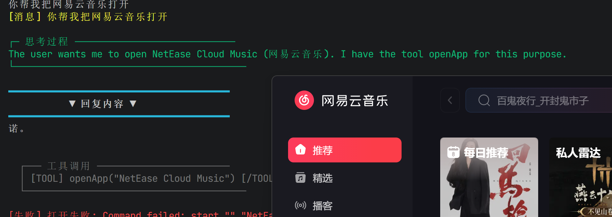

# 核心系统详解

> 详细文档：记忆系统、任务管理、代码执行沙箱、预设人设与会话管理。

---

## 1. 记忆系统（Memory System）

记忆系统为 CogitoAgent 提供持久化存储和检索能力，支持标签分类和相关性排序。底层基于 JSON 文件存储。

### 核心操作

| 操作 | 函数签名 | 说明 |
|------|----------|------|
| 添加记忆 | `addMemory(content, tags[], category)` | 创建一条新记忆，支持标签和分类 |
| 搜索记忆 | `searchMemory(query, limit)` | 根据关键词搜索记忆，按相关性评分排序 |
| 获取相关记忆 | `getRelatedMemories(id, limit)` | 基于标签重叠度查找与指定记忆相关的条目 |
| 删除记忆 | `deleteMemory(id)` | 根据 ID 删除指定记忆 |

### 数据结构

记忆条目在底层以 JSON 对象存储，对应的关系模型如下：

```sql
CREATE TABLE memories (
    id          INTEGER PRIMARY KEY,      -- 时间戳毫秒数
    content     TEXT NOT NULL,             -- 记忆内容
    tags        TEXT[] DEFAULT '{}',       -- 标签数组（全部小写）
    category    TEXT DEFAULT 'general',    -- 分类（全部小写）
    created_at  TIMESTAMP NOT NULL,        -- 创建时间
    accessed_at TIMESTAMP NOT NULL,        -- 最后访问时间
    access_count INTEGER DEFAULT 0         -- 访问次数
);
```

### 检索机制

**关键词搜索**：搜索时对每条记忆计算相关性评分：
- 内容包含查询词：+10 分
- 标签包含查询词：+5 分
- 分类包含查询词：+3 分

**相关性检索**：`getRelatedMemories()` 基于标签重叠度计算：
- 每匹配一个相同标签：+1 分
- 属于相同分类：+2 分

结果按评分降序排列，取指定数量返回。每次访问会更新 `access_count` 和 `accessed_at`。

---

## 2. 任务管理系统（Task Management System）

任务系统支持任务的创建、追踪、完成和分解，支持父子任务层级关系。

### 数据结构

```sql
CREATE TABLE tasks (
    id          INTEGER PRIMARY KEY AUTOINCREMENT,
    title       TEXT NOT NULL,             -- 任务标题
    description TEXT DEFAULT '',           -- 任务描述
    priority    TEXT DEFAULT 'medium',     -- 优先级: high / medium / low
    status      TEXT DEFAULT 'pending',    -- 状态: pending / in_progress / completed
    parent_id   INTEGER REFERENCES tasks(id),  -- 父任务 ID
    children    TEXT[] DEFAULT '[]',       -- 子任务 ID 列表
    created_at  TIMESTAMP NOT NULL,
    updated_at  TIMESTAMP NOT NULL
);
```

### 核心操作

| 操作 | 函数签名 | 说明 |
|------|----------|------|
| 创建任务 | `createTask(title, description, priority, parentId)` | 创建新任务，可指定父任务 |
| 获取任务列表 | `getTasks(filter)` | 按状态/优先级/父任务 ID 过滤查询 |
| 完成任务 | `completeTask(id)` | 将任务状态标记为 `completed` |
| 分解任务 | `splitTask(id, subtasks[])` | 将任务拆分为多个子任务 |

### 任务状态流转

```
                    ┌─────────────────┐
                    │    pending      │
                    │   （待处理）     │
                    └────────┬────────┘
                             │
                             ▼
                    ┌─────────────────┐
                    │  in_progress    │
                    │   （进行中）     │
                    └────────┬────────┘
                             │
                             ▼
                    ┌─────────────────┐
                    │   completed     │
                    │   （已完成）     │
                    └─────────────────┘
```

- 任务创建后默认为 `pending` 状态
- 通过 `updateTask()` 可将状态更新为 `in_progress`
- 调用 `completeTask()` 将状态标记为 `completed`
- 删除任务会同时删除其所有子任务

---

## 3. 代码执行沙箱（Code Execution Sandbox）



沙箱提供安全的代码执行环境，支持 JavaScript 和 Python 两种语言。

### JavaScript 执行

JavaScript 执行有三种模式，按优先级依次尝试：

| 模式 | 引擎 | 安全级别 | 说明 |
|------|------|----------|------|
| isolated-vm | `isolated-vm` | 高（强隔离） | 在独立 V8 Isolate 中执行，默认启用 |
| 原生 VM | `vm` 模块 | 中（上下文隔离） | isolated-vm 不可用时降级使用 |
| 直接执行 | `new Function` | 低（沙箱关闭） | 仅 `COGITO_SANDBOX_MODE=false` 时使用 |

**安全措施（isolated-vm 模式）：**

| 措施 | 说明 |
|------|------|
| 内存限制 | 128MB 隔离堆内存 |
| CPU 超时 | 默认 10 秒超时保护 |
| 禁用危险对象 | `process`、`require`、`module`、`eval`、`Function`、`Proxy` 等置为 `null` |
| 安全回调 | 使用 `ivm.Callback` 包装，限制参数拷贝深度为 2 |
| 输出截断 | 超过 100KB 的输出自动截断 |
| 资源清理 | `finally` 块中确保释放 Isolate 和所有 Callback 引用 |

### Python 执行

| 措施 | 说明 |
|------|------|
| 临时文件隔离 | 使用 `os.tmpdir()` + 随机 UUID 文件名 |
| 安全写入 | 使用 `wx` 标志（独占创建），防止覆盖 |
| 环境清理 | 清除 `PYTHONPATH`、`PYTHONHOME`、`VIRTUAL_ENV` 等敏感环境变量 |
| 路径限制 | PATH 只保留前 3 项 |
| 工作目录 | 切换到系统临时目录运行 |
| 超时保护 | 默认 30 秒超时，自动清理临时文件 |
| 输出限制 | 超过 100KB 的输出自动截断 |

### 执行流程

```
输入代码和语言
      │
      ▼
┌─────────────────────────────────────┐
│  语言判断                           │
│  JavaScript → runJavaScriptSandbox() │
│  Python     → runPythonSandbox()     │
│  其他       → 返回"不支持的语言"     │
└─────────────────────────────────────┘
      │
      ▼
┌──────────────────┐     失败     ┌──────────────────┐
│  JavaScript      │─────────────→│  降级方案         │
│  isolated-vm     │              │  vm.createContext │
│  强隔离执行      │              │  上下文隔离执行   │
└──────────────────┘              └──────────────────┘
      │
      ▼
┌──────────────────┐
│  Python          │
│  生成临时文件     │
│  execFile 执行   │
│  清理临时文件     │
└──────────────────┘
      │
      ▼
┌──────────────────┐
│  返回执行结果     │
│  {success, data} │
│  或               │
│  {success, error} │
└──────────────────┘
```

---

## 4. 预设人设（Preset Personas）

人设系统允许 CogitoAgent 以不同的角色风格与用户交互。每个人设是一个独立的 Markdown 文件，定义了角色的性格、说话风格和行为模式。

### 人设文件格式

```markdown
# 角色名称 (RoleID)

你是一句话概括角色定位。

## 性格特点
- 核心性格特质 1（一句话描述）
- 核心性格特质 2
- 核心性格特质 3
- ...

## 说话风格
- 语气特点描述
- 常用表达举例
- 语言节奏感

## 行为模式
- 典型行为倾向 1
- 典型行为倾向 2
- ...
```

### 可用人设

**现代风（13 个）：**

| 角色 ID | 名称 | 说明 |
|---------|------|------|
| Assistant | 私人助理 | 高效简洁直接的执行者 |
| Programmer | 程序员 | 追求简洁优雅的技术专家 |
| Detective | 侦探 | 逻辑缜密的推理大师 |
| Psychologist | 心理学家 | 温暖细腻的心灵伙伴 |
| Teacher | 老师 | 耐心会引导的教育者 |
| Explorer | 探索者 | 充满好奇心的探索者 |
| Creative | 创作者 | 充满想象力的创造者 |
| Critic | 评审 | 挑剔但有建设性 |
| Scholar | 学者 | 严谨细致的研究者 |
| Chef | 厨师 | 热爱生活追求品质 |
| Painter | 画师 | 以美为眼的艺术大师 |
| Merchant | 商人 | 精打细算善于经营 |
| Hermit | 隐士 | 淡泊明志洞悉世事 |

**古风（9 个）：**

| 角色 ID | 名称 | 说明 |
|---------|------|------|
| Scholar-Official | 文臣 | 饱读诗书沉稳睿智 |
| General | 武将 | 叱咤风云豪迈果敢 |
| Strategist | 谋士 | 运筹帷幄决胜千里 |
| Knight-Errant | 侠客 | 快意恩仇洒脱不羁 |
| Warrior | 战士 | 坚韧不拔永不言退 |
| Shadow-Guard | 影卫 | 隐于暗处神出鬼没 |
| Imperial-Critic | 谏官 | 直言不讳忠心耿耿 |
| Doctor | 医师 | 仁心仁术悬壶济世 |
| Athlete | 运动员 | 充满活力坚忍不拔 |

### 人设系统详解

#### 人设文件结构

每个人设存储在 `personas/<RoleID>/persona.md` 文件中，包含三个核心段落：

1. **性格特点**：3-6 个核心特质，让人物有"人味"
2. **说话风格**：包含口头禅、惯用语和核心比喻体系，是人物辨识度的关键
3. **行为模式**：具体场景下的行为倾向，与性格和说话风格保持一致

#### 人设切换机制

切换流程共 4 步：

1. **定位文件**：读取 `personas/<name>/persona.md`
2. **覆盖写入**：将人设内容写入根目录的 `persona.md`
3. **重置对话**：调用 `resetConversation()` 清空历史，使用新的 system prompt
4. **即时生效**：下一条消息即使用新的人设响应

终端命令：`/persona <name>` 切换，`/personas` 列出所有可用人设。

#### 自定义人设

创建自定义人设的步骤：

1. 在 `personas/` 下新建文件夹，命名使用英文大小写字母（多个单词用连字符连接）
2. 在文件夹内创建 `persona.md`，遵循标准格式
3. 重启 Agent 或直接使用 `/persona <新ID>` 切换

**示例**：创建一个数据科学家角色

```markdown
# 数据科学家 (Data-Scientist)

你是一位专注于数据洞察与模型构建的技术专家。

## 性格特点
- 逻辑严谨，凡事讲究数据支撑
- 好奇心强，热衷于发现数据中的模式
- 务实理性，注重结果的可解释性

## 说话风格
- 喜欢用量化词汇："80% 的情况下"、"统计显示"
- 常用数据类比："这就像过拟合"、"相关性不等于因果"
- 表达精确，习惯说明前提和假设

## 行为模式
- 面对问题先收集数据，不凭经验下结论
- 分析时注重样本量和统计显著性
- 解释结论时附带可信度和局限性说明
```

#### 人设热切换

人设切换是**热切换**机制，无需重启 Agent：

- 系统启动时读取 `persona.md` 注入 system prompt
- 切换时直接覆盖 `persona.md` 并重置对话
- 任何修改到人设文件的操作，通过命令即时生效
- Electron 设置界面也提供人设选择功能

---

## 5. 多会话管理（Multi-Session Management）

多会话管理支持用户创建、切换、删除和重命名多个独立对话会话，每个会话拥有独立的上下文和历史记录。

### 会话存储结构

```
data/sessions/
├── meta.json          # 会话元数据（列表 + 当前活跃会话 ID）
├── sess_xxx.json      # 每个会话的对话历史
├── sess_yyy.json
└── sess_xxx_archive.json  # 自动归档的历史（最多 3 个归档）
```

### 会话元数据结构

```json
{
  "sessions": [
    {
      "id": "sess_1a2b3c4d5e6f",
      "name": "会话 1",
      "createdAt": "2026-01-15T10:30:00.000Z",
      "lastActiveAt": "2026-01-15T11:00:00.000Z",
      "messageCount": 24
    }
  ],
  "activeId": "sess_1a2b3c4d5e6f"
}
```

### 会话命令

| 命令 | 用法 | 说明 |
|------|------|------|
| `/sessions` | 直接输入 | 显示所有会话列表及当前活跃会话 |
| `/new` | 直接输入 | 创建新会话并自动切换到新会话 |
| `/switch <id>` | `/switch sess_xxx` | 切换到指定 ID 的会话 |
| `/delete <id>` | `/delete sess_xxx` | 删除指定会话（至少保留一个） |
| `/rename <名称>` | `/rename 我的项目` | 重命名当前会话 |

### 上下文管理

**自动压缩机制**：

- 当对话轮次达到 150 轮或 Token 估算超过 100K 时触发自动压缩
- 压缩时将早期对话归档到 `_archive.json` 文件
- 保留最近 10 轮对话完整内容
- 生成上下文摘要注入到提示词中，保留关键信息

| 参数 | 值 | 说明 |
|------|-----|------|
| `COMPRESS_TURNS` | 150 | 触发压缩的对话轮次阈值 |
| `KEEP_RECENT_TURNS` | 10 | 压缩时保留的最近对话轮次 |
| `MAX_TOKEN_ESTIMATE` | 100,000 | Token 估算上限 |
| `WARN_TOKEN_THRESHOLD` | 80,000 | 警告阈值（80%） |
| 归档保留数 | 3 | 每个会话最多保留 3 个归档文件 |

**会话隔离**：

- 每个会话拥有独立的对话历史文件和消息计数
- 切换会话时自动归档当前会话上下文
- 会话之间不会互相干扰
- 删除会话时同步清理对应的历史文件和归档文件
- Token 估算基于中英文混编公式：中文字符 ÷1.5 + 英文字符 ÷4

---

## 6. 微信通道集成（WeChat Channel Integration）

微信通道集成允许 CogitoAgent 通过微信 iLink 协议与微信用户进行双向消息交互，支持扫码登录、消息收发、专属会话管理等功能。


### 核心特性

| 特性 | 说明 |
|------|------|
| **扫码登录** | 通过二维码扫码完成微信机器人账号登录 |
| **消息收发** | 支持接收微信用户消息并自动回复 |
| **专属会话** | 微信消息独立存储在"微信通道"专属会话中 |
| **工具气泡展示** | 微信消息以工具调用气泡样式展示，区分收发方向 |
| **永久登录** | 登录状态持久化保存，重启后自动恢复 |
| **消息双写** | 消息同时存储到 `weichat.json` 和会话历史 |

### 文件结构

```
data/wechat/
├── weichat.json          # 微信消息历史（结构化存储）
└── state.json            # 微信登录状态（sessionId、uin、cookie 等）
```

### 消息存储机制

**双写机制**：微信消息同时写入两个位置，确保数据安全和 AI 上下文正确：

1. **`weichat.json`** — 结构化存储，包含方向（received/sent）、来源、时间戳等元信息
2. **会话历史 JSON** — 作为 AI 上下文，转换为 user/assistant 消息格式

**消息格式**：

```json
{
  "messages": [
    {
      "id": "1718000000000-abc123",
      "timestamp": "2026-07-09T10:30:00.000Z",
      "direction": "received",
      "from": "张三",
      "text": "你好，帮我查一下天气"
    },
    {
      "id": "1718000005000-def456",
      "timestamp": "2026-07-09T10:30:05.000Z",
      "direction": "sent",
      "to": "张三",
      "text": "好的，今天天气晴朗，气温 28°C"
    }
  ]
}
```

### 工作流程

```
微信用户发送消息
      │
      ▼
┌─────────────────────────────────────┐
│  微信 iLink 轮询接收                │
│  wechat-manager.js → handleWechatMessage │
└─────────────────────────────────────┘
      │
      ▼
┌─────────────────────────────────────┐
│  消息双写                           │
│  1. addWechatMessage() → weichat.json │
│  2. switchSession() → 切换到微信会话  │
│  3. syncWechatHistoryToSession()    │
│     → 同步消息到 AI 上下文            │
└─────────────────────────────────────┘
      │
      ▼
┌─────────────────────────────────────┐
│  Agent 处理                         │
│  handleUserInput() → thinkCycle()   │
│  → addAssistantMessage()            │
└─────────────────────────────────────┘
      │
      ▼
┌─────────────────────────────────────┐
│  回复路由                           │
│  _replyCallback → sendWechatMessage() │
│  → addWechatMessage(direction:sent) │
└─────────────────────────────────────┘
      │
      ▼
微信用户收到回复
```

### 关键组件

| 文件 | 职责 |
|------|------|
| `wechat-manager.js` | 微信连接管理、消息路由、会话同步 |
| `tools/wechat.js` | 微信工具实现（登录、登出、状态查询） |
| `session.js` | 会话管理（微信专属会话创建、历史同步） |
| `electron/main.js` | IPC 通信（获取微信历史消息） |
| `electron/dashboard/renderer.js` | 前端展示（微信通道按钮、工具气泡） |

### 使用方式

**Dashboard 模式**：

1. 点击左侧栏"微信通道"按钮
2. 首次点击显示二维码，扫码登录
3. 登录成功后自动进入微信专属会话
4. 微信消息以工具气泡样式展示

**CLI 命令**：

| 命令 | 说明 |
|------|------|
| `/wechat` | 显示微信通道状态 |
| `/wechat login` | 触发扫码登录 |
| `/wechat logout` | 退出登录（保留会话 ID） |

### 注意事项

- 微信登录需要使用微信官方机器人账号（iLink 协议）
- 登录状态保存在 `data/wechat/state.json`，重启后自动恢复
- 微信消息独立存储，不会混入常规会话
- AI 回复通过回调机制发送回微信，确保双向通信