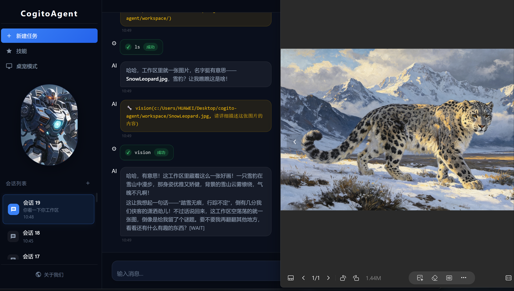

# 工具系统详解

> 详细文档：工具注册机制、各分类工具使用说明与最佳实践。

## 工具系统


工具系统由 `registry.js` 统一管理，所有工具函数通过 `[TOOL] functionName(args) [/TOOL]` 格式调用。

### 工具分类

| 分类 | 文件 | 主要功能 |
|------|------|----------|
| 文件操作 | `file.js` | `ls`, `read`, `create`, `copy`, `mkdir`, `delete`, `move` |
| 网页工具 | `web.js` | `search`, `browse`, `fetchPage`, `searchOnEngine` |
| 浏览器自动化 | `browser.js` | `initBrowser`, `clickElement`, `fillField`, `takeScreenshot` |
| 系统操作 | `system.js` | `listApps`, `openApp`, `closeApp` |
| 代码执行 | `code.js` | `executeCode`, `runJavaScript`, `runPython` |
| Git | `git.js` | `gitStatus`, `gitCommit`, `gitPush`, `gitPull`, `gitDiff`, `gitLog` |
| 任务管理 | `task.js` | `createTask`, `getTasks`, `completeTask`, `splitTask` |
| 记忆系统 | `memory.js` | `addMemory`, `searchMemory`, `getRelatedMemories`, `deleteMemory` |
| 数据处理 | `data.js` | `readCSV`, `writeJSON`, `csvToJSON`, `queryData` |
| 数据库 | `db.js` | `executeSQL`, `query`, `insert`, `update`, `createTable`, `getTables` |
| 邮件 | `email.js` | `sendEmail`, `sendTextEmail`, `sendHtmlEmail` |
| 系统监控 | `monitor.js` | `getCPUInfo`, `getMemoryInfo`, `monitorSystem` |
| 定时任务 | `scheduler.js` | `addScheduleTask`, `getScheduleTasks`, `toggleScheduleTask` |
| 图像识别 | `ocr.js` | `ocr`, `ocrBatch` |
| Office 文档 | `office.js` | `createPpt`, `createWord`, `createExcel`, `readExcel` |

### 工具注册机制

工具函数统一注册到注册表，包含以下元数据：

```javascript
{
  name: '函数名',
  description: '函数描述',
  parameters: { /* JSON Schema */ },
  category: '分类',
  dangerLevel: 'none | low | medium | high',  // 危险操作需用户确认
  fn: async (args) => { /* 实现 */ }
}
```

### 工具调用示例

```
AI: [TOOL] ls("/project/src") [/TOOL]
→ 返回目录文件列表

AI: [TOOL] runPython("print('hello')") [/TOOL]
→ 执行 Python 代码，返回输出
```

> 详细工具开发文档参见 `src/agent/tools/TOOL_DEVELOPMENT.md`

---

## 浏览器自动化详解


浏览器自动化工具基于 Playwright 实现，支持网页交互、截图、表单填写等操作。

### 核心工具

| 工具 | 说明 | 参数 |
|------|------|------|
| `initBrowser` | 初始化浏览器实例 | 无 |
| `navigateTo` | 导航到指定 URL | `url` |
| `clickElement` | 点击页面元素 | `selector` |
| `fillField` | 填写表单字段 | `selector`, `value` |
| `takeScreenshot` | 截取页面截图 | `selector`（可选） |
| `getText` | 获取元素文本 | `selector` |
| `waitForElement` | 等待元素出现 | `selector`, `timeout` |
| `closeBrowser` | 关闭浏览器实例 | 无 |

### 使用示例

**基本网页浏览：**

```javascript
// 初始化浏览器
[TOOL] initBrowser() [/TOOL]

// 导航到网页
[TOOL] navigateTo("https://example.com") [/TOOL]

// 截取整页截图
[TOOL] takeScreenshot() [/TOOL]

// 关闭浏览器
[TOOL] closeBrowser() [/TOOL]
```

**表单填写与提交：**

```javascript
// 初始化并导航
[TOOL] initBrowser() [/TOOL]
[TOOL] navigateTo("https://login.example.com") [/TOOL]

// 填写登录表单
[TOOL] fillField("#username", "myuser") [/TOOL]
[TOOL] fillField("#password", "mypassword") [/TOOL]

// 点击登录按钮
[TOOL] clickElement("#login-button") [/TOOL]

// 等待登录成功
[TOOL] waitForElement(".dashboard", 5000) [/TOOL]

// 截取登录后页面
[TOOL] takeScreenshot() [/TOOL]
```

**数据抓取：**

```javascript
// 导航到目标页面
[TOOL] navigateTo("https://news.example.com") [/TOOL]

// 获取标题列表
[TOOL] getText(".article-title") [/TOOL]

// 截取特定区域
[TOOL] takeScreenshot(".main-content") [/TOOL]
```

### 浏览器配置

**浏览器类型：**

默认使用 Chromium，可通过配置切换：

```json
{
  "browser": {
    "type": "chromium",  // chromium | firefox | webkit
    "headless": true,    // 无头模式
    "timeout": 30000     // 默认超时（ms）
  }
}
```

**安全限制：**

- 浏览器实例最多存活 5 分钟
- 自动关闭长时间未操作的浏览器
- 禁止访问本地文件系统 URL（file://）
- 截图自动保存到临时目录，定期清理

### 最佳实践

1. **及时关闭浏览器** - 避免资源浪费
2. **使用无头模式** - 提高执行效率
3. **合理设置超时** - 防止页面加载卡死
4. **选择器优先级** - ID > Class > XPath
5. **错误处理** - 检查元素是否存在再操作

---

## 数据库操作详解

数据库工具支持 SQLite 数据库的创建、查询、插入、更新等操作。

### 核心工具

| 工具 | 说明 | 参数 |
|------|------|------|
| `executeSQL` | 执行任意 SQL 语句 | `sql` |
| `query` | 执行查询语句 | `sql`, `params`（可选） |
| `insert` | 插入数据 | `table`, `data` |
| `update` | 更新数据 | `table`, `data`, `where` |
| `delete` | 删除数据 | `table`, `where` |
| `executeTransaction` | 执行事务 | `statements` |
| `createTable` | 创建表 | `tableName`, `schema` |
| `listTables` | 列出所有表 | 无 |

### 使用示例

**创建表：**

```javascript
[TOOL] createTable("users", {
  id: "INTEGER PRIMARY KEY AUTOINCREMENT",
  name: "TEXT NOT NULL",
  email: "TEXT UNIQUE",
  created_at: "INTEGER"
}) [/TOOL]
```

**插入数据：**

```javascript
// 单条插入
[TOOL] insert("users", {
  name: "张三",
  email: "zhangsan@example.com",
  created_at: Date.now()
}) [/TOOL]

// 批量插入
[TOOL] executeTransaction([
  { sql: "INSERT INTO users (name, email) VALUES (?, ?)", params: ["张三", "zhang@example.com"] },
  { sql: "INSERT INTO users (name, email) VALUES (?, ?)", params: ["李四", "li@example.com"] }
]) [/TOOL]
```

**查询数据：**

```javascript
// 简单查询
[TOOL] query("SELECT * FROM users") [/TOOL]

// 条件查询
[TOOL] query("SELECT * FROM users WHERE name = ?", ["张三"]) [/TOOL]

// 排序查询
[TOOL] query("SELECT * FROM users ORDER BY created_at DESC LIMIT 10") [/TOOL]
```

**更新数据：**

```javascript
[TOOL] update("users", 
  { email: "newemail@example.com" },
  { name: "张三" }
) [/TOOL]
```

**删除数据：**

```javascript
[TOOL] delete("users", { name: "张三" }) [/TOOL]
```

**事务操作：**

```javascript
[TOOL] executeTransaction([
  { sql: "UPDATE accounts SET balance = balance - 100 WHERE id = 1" },
  { sql: "UPDATE accounts SET balance = balance + 100 WHERE id = 2" },
  { sql: "INSERT INTO transactions (from_id, to_id, amount) VALUES (1, 2, 100)" }
]) [/TOOL]
```

### 数据库配置

**数据库路径：**

```json
{
  "database": {
    "path": "./data/mydb.db",
    "timeout": 5000
  }
}
```

**安全限制：**

- 只能访问工作区内的数据库文件
- 禁止执行 DROP DATABASE 等危险操作
- 事务失败自动回滚
- 查询结果最多返回 1000 行

### 数据库管理

**列出所有表：**

```javascript
[TOOL] listTables() [/TOOL]
// → ["users", "tasks", "memories"]
```

**获取表结构：**

```javascript
[TOOL] query("PRAGMA table_info(users)") [/TOOL]
```

**数据库备份：**

```javascript
// 导出数据库
[TOOL] executeSQL("SELECT * FROM users") [/TOOL]
// 将结果保存为 JSON 文件
[TOOL] create("./backup/users.json", JSON.stringify(result)) [/TOOL]
```

### 最佳实践

1. **使用事务** - 批量操作时使用事务提高性能
2. **参数化查询** - 防止 SQL 注入
3. **索引优化** - 为常用查询字段创建索引
4. **定期备份** - 导出重要数据
5. **错误处理** - 检查 SQL 执行结果

---

## 图像文字识别（OCR）详解

OCR 工具基于视觉大模型（如 Qwen2.5-VL-32B-Instruct）实现图像文字识别能力，支持常见图片格式的文字提取。

---

## 视觉分析（Vision）详解



视觉分析工具基于多模态大模型，支持对图片内容进行描述、理解与问答，可分析本地图片和网络图片。

### 核心工具

| 工具 | 说明 | 参数 |
|------|------|------|
| `vision` | 分析本地图片内容 | `imagePath`（图片路径），`prompt`（可选提示词） |
| `visionFromUrl` | 分析网络图片 URL | `imageUrl`（图片 URL），`prompt`（可选提示词） |

### 支持格式

与 OCR 相同，支持 JPEG、PNG、WebP、BMP、GIF 五种格式。

### 使用示例

**分析本地图片：**

```javascript
[TOOL] vision("/path/to/photo.jpg") [/TOOL]
// → 返回图片的详细描述和分析结果

[TOOL] vision("screenshots/ui.png", "请描述这个界面的布局和功能") [/TOOL]
// → 返回针对界面的具体分析
```

**分析网络图片：**

```javascript
[TOOL] visionFromUrl("https://example.com/image.jpg") [/TOOL]
// → 返回网络图片的分析结果
```

### 特性

- **流式响应** — 支持 SSE 流式返回思考过程（reasoning_content）和分析内容
- **思考过程可见** — 返回结果包含「思考过程」和「分析结果」两部分
- **配置回退** — 可独立配置 API Key 和模型，不配置则自动回退到主 API 配置

### Vision 配置

```json
{
  "vision": {
    "baseURL": "",              // 视觉 API 地址（可选，默认使用 api.baseURL）
    "apiKey": "",               // 视觉 API 密钥（可选，默认回退到主 API Key）
    "model": "Qwen2.5-VL-32B-Instruct"  // 视觉模型名称
  }
}
```

---

### 核心工具

| 工具 | 说明 | 参数 |
|------|------|------|
| `ocr` | 识别单张图片中的文字 | `imagePath`（图片路径，支持相对/绝对路径） |
| `ocrBatch` | 批量识别多张图片文字 | `images`（多个图片路径，用英文逗号分隔） |

### 支持格式

| 格式 | 扩展名 | 说明 |
|------|--------|------|
| JPEG | `.jpg` `.jpeg` | 最常用的压缩图片格式 |
| PNG | `.png` | 无损压缩，支持透明背景 |
| WebP | `.webp` | 现代高效压缩格式 |
| BMP | `.bmp` | 位图，无压缩 |
| GIF | `.gif` | 动图（取第一帧） |

### 使用示例

**单张图片识别：**

```javascript
// 识别本地图片中的文字
[TOOL] ocr("/path/to/screenshot.png") [/TOOL]
// → 返回识别出的文本内容

// 识别工作区内的图片
[TOOL] ocr("documents/invoice.jpg") [/TOOL]
// → 识别发票图片中的文字信息
```

**批量识别多张图片：**

```javascript
// 批量识别多张截图
[TOOL] ocrBatch("img1.jpg, img2.png, img3.webp") [/TOOL]
// → 依次返回每张图片的识别结果
```

**配合其他工具使用：**

```javascript
// 先获取目录下的图片文件，再识别
[TOOL] ls("./screenshots") [/TOOL]
// → ["page1.png", "page2.png", "page3.png"]

// 识别其中一张图片
[TOOL] ocr("./screenshots/page1.png") [/TOOL]
// → 返回图片中的文字内容
```

### OCR 配置

在 `config.json` 中配置 OCR 相关参数：

```json
{
  "ocr": {
    "provider": "",              // OCR 服务提供商（可选）
    "baseURL": "",              // OCR API 基础地址，不填则使用 api.baseURL
    "apiKey": "",               // OCR API 密钥（必需）
    "model": "Qwen2.5-VL-32B-Instruct"  // 视觉模型名称
  }
}
```

**配置说明：**

| 字段 | 必需 | 说明 | 默认值 |
|------|------|------|--------|
| `apiKey` | ✅ | OCR 服务的 API 密钥 | - |
| `baseURL` | ⚠️ | API 服务地址，不填则使用主 API 地址 | `api.baseURL` |
| `model` | ✅ | 视觉大模型名称，需支持图像输入 | `Qwen2.5-VL-32B-Instruct` |
| `provider` | ⚠️ | 服务商标识，用于区分不同提供商 | - |

### 支持的视觉模型

| 模型名称 | 说明 |
|----------|------|
| `Qwen2.5-VL-32B-Instruct` | 阿里通义千问视觉模型，推荐使用 |
| `gpt-4o` / `gpt-4o-mini` | OpenAI 视觉模型，需配置对应 API |
| `claude-3-opus` / `claude-3-sonnet` | Anthropic 视觉模型 |
| `gemini-1.5-pro` / `gemini-1.5-flash` | Google 视觉模型 |

### 图片要求

| 项目 | 限制 | 说明 |
|------|------|------|
| 文件大小 | ≤ 10 MB | 过大的图片会导致 API 请求失败 |
| 格式支持 | 5 种 | JPEG、PNG、WebP、BMP、GIF |
| 文字清晰度 | 建议 ≥ 12pt | 过小或模糊的文字可能识别不准确 |
| 路径编码 | UTF-8 | 中文路径需确保文件系统支持 |

### 使用流程

```
1. 在 config.json 中配置 ocr.apiKey 和 ocr.model
2. 在对话中让 Agent 调用 ocr(imagePath)
3. Agent 将图片编码为 base64，通过多模态 API 发送
4. AI 模型识别图片中的文字并返回结果
5. 结果以文本形式追加到对话上下文中
```

### 最佳实践

1. **确保图片清晰度** - 文字越大越清晰，识别效果越好
2. **控制图片大小** - 建议压缩到 5MB 以内，加快处理速度
3. **合理使用批量** - `ocrBatch` 会依次调用 API，注意 API 频率限制
4. **路径正确** - 相对路径相对于配置的 workspace，或使用绝对路径
5. **API 密钥保护** - 不要将 `config.json` 提交到公开仓库

### 常见问题

| 问题 | 原因 | 解决方案 |
|------|------|----------|
| 提示「API 密钥未配置」 | `ocr.apiKey` 为空 | 在 config.json 中填入正确的 API 密钥 |
| 「文件不存在」 | 图片路径错误 | 检查路径是否正确，相对路径是否相对于 workspace |
| 「格式不支持」 | 文件扩展名不在支持列表 | 将图片转换为 JPEG/PNG/WebP 等格式 |
| 「文件过大」 | 图片超过 10MB | 使用图片压缩工具减小文件大小 |
| API 请求超时/失败 | 网络问题或 API 服务不可用 | 检查网络连接，确认 API 服务正常 |

### 环境变量配置

也可以通过环境变量配置 OCR（优先级高于 config.json）：

```bash
# OCR API 密钥（必需）
OCR_API_KEY=your-ocr-api-key-here

# OCR API 基础地址（可选，不填则使用主 API 地址）
OCR_API_BASE_URL=https://api.example.com/v1

# OCR 视觉模型名称（可选，默认为 Qwen2.5-VL-32B-Instruct）
OCR_MODEL=Qwen2.5-VL-32B-Instruct

# OCR 服务提供商（可选）
OCR_PROVIDER=qwen
```

---

## Office 文档工具详解

Office 文档工具支持创建 PPT 演示文稿、Word 文档和 Excel 表格，基于纯 JavaScript 库实现，无需安装 Office 软件。

### 核心工具

| 工具 | 说明 | 参数 |
|------|------|------|
| `createPpt` | 创建 PPT 演示文稿 | `options`（对象）或 `outputPath, title, content`（位置参数） |
| `createWord` | 创建 Word 文档 | `options`（对象）或 `outputPath, title, content`（位置参数） |
| `createExcel` | 创建 Excel 表格 | `options`（对象）或 `outputPath, sheetName, data`（位置参数） |
| `readExcel` | 读取 Excel 文件 | `filePath`（文件路径） |

### 支持的格式

| 文档类型 | 扩展名 | 核心库 |
|----------|--------|--------|
| 演示文稿 | `.pptx` | pptxgenjs |
| 文档 | `.docx` | docx |
| 表格 | `.xlsx` | xlsx (SheetJS) |

### 使用示例

**创建简单 PPT（位置参数）：**

```javascript
[TOOL] createPpt("data/presentation.pptx", "项目报告", "这是项目报告的内容") [/TOOL]
```

**创建复杂 PPT（对象参数）：**

```javascript
[TOOL] createPpt({
  outputPath: "data/presentation.pptx",
  title: "季度汇报",
  author: "CogitoAgent",
  slides: [
    { title: "封面", content: "2024年Q2季度汇报" },
    { title: "业绩概览", bullets: ["营收增长25%", "用户增长30%", "市场份额提升5%"] },
    { title: "数据分析", image: "data/chart.png" }
  ]
}) [/TOOL]
```

**创建 Word 文档：**

```javascript
[TOOL] createWord({
  outputPath: "data/report.docx",
  title: "项目报告",
  paragraphs: [
    { type: "heading", text: "第一章 项目概述", level: 1 },
    { type: "text", text: "本项目旨在..." },
    { type: "heading", text: "核心成果", level: 2 },
    { type: "list", items: ["完成系统设计", "实现核心功能", "通过测试验证"] },
    { type: "heading", text: "数据统计", level: 2 },
    { type: "table", rows: [["指标", "数值"], ["用户数", "10000"], ["转化率", "25%"]] }
  ]
}) [/TOOL]
```

**创建 Excel 表格：**

```javascript
[TOOL] createExcel({
  outputPath: "data/sales.xlsx",
  sheets: [
    {
      name: "销售数据",
      data: [
        ["产品", "销量", "金额"],
        ["A产品", 100, 5000],
        ["B产品", 200, 8000],
        ["C产品", 150, 6000]
      ]
    },
    {
      name: "库存数据",
      data: [
        ["产品", "库存"],
        ["A产品", 50],
        ["B产品", 30]
      ]
    }
  ]
}) [/TOOL]
```

**读取 Excel 文件：**

```javascript
[TOOL] readExcel("data/sales.xlsx") [/TOOL]
// → { "销售数据": [["产品","销量",...], ...], "库存数据": [...] }
```

### PPT 幻灯片参数说明

每张幻灯片支持以下字段：

| 字段 | 类型 | 说明 |
|------|------|------|
| `title` | string | 幻灯片标题 |
| `content` | string | 正文内容 |
| `bullets` | string[] | 要点列表（项目符号） |
| `image` | string | 图片文件路径 |

### Word 段落类型说明

| 类型 | 参数 | 说明 |
|------|------|------|
| `heading` | `text`, `level`(1-6) | 标题段落 |
| `text` | `text` | 正文段落 |
| `list` | `items`(string[]) | 列表段落 |
| `table` | `rows`(二维数组) | 表格段落 |
| `image` | `src`, `width`, `height` | 图片段落 |

### Excel 数据格式

- `sheets` 为数组，每项包含 `name`（表名）和 `data`（二维数组）
- `data` 的第一行通常作为表头
- 单元格值可以是字符串或数字

### 两种调用方式

所有 Office 创建工具都支持两种调用方式：

| 方式 | 语法 | 适用场景 |
|------|------|----------|
| **位置参数** | `createPpt(outputPath, title, content)` | 快速创建简单文档 |
| **对象参数** | `createPpt({ outputPath, slides, ... })` | 创建复杂格式文档 |

### 最佳实践

1. **使用正确扩展名** - PPT 用 `.pptx`，Word 用 `.docx`，Excel 用 `.xlsx`
2. **路径使用相对路径** - 相对于工作区目录，或使用绝对路径
3. **图片提前准备** - 插入的图片需确保文件存在
4. **数据格式正确** - Excel 数据使用二维数组，表头在第一行
5. **大文档注意性能** - 过多幻灯片/表格可能增加生成时间

### 常见问题

| 问题 | 原因 | 解决方案 |
|------|------|----------|
| 提示「缺少 outputPath 参数」 | 未指定输出路径 | 确保传入正确的文件路径参数 |
| 生成的文件打不开 | 扩展名不正确 | 确保使用正确的扩展名（.pptx/.docx/.xlsx） |
| 图片不显示 | 图片路径错误或文件不存在 | 检查图片路径是否正确，文件是否存在 |
| 中文乱码 | 编码问题 | 确保使用 UTF-8 编码，库已内置中文支持 |

---

## 应用场景示例

### 文件探索

```javascript
// 分析项目结构
[TOOL] ls("./src") [/TOOL]
// → ["agent", "api", "io", "config.js", "index.js"]

// 读取关键文件
[TOOL] read("./src/agent/Agent.js") [/TOOL]
// → 返回文件内容
```

### 代码执行

```javascript
// Python 脚本执行
[TOOL] runPython(`
import json
data = {"fibonacci": [0, 1, 1, 2, 3, 5, 8]}
print(json.dumps(data))
`) [/TOOL]
// → {"fibonacci": [0, 1, 1, 2, 3, 5, 8]}

// JavaScript 沙箱执行
[TOOL] runJavaScript(`
const arr = [1, 2, 3, 4, 5];
const sum = arr.reduce((a, b) => a + b, 0);
console.log(sum);
`) [/TOOL]
// → 15
```

### Git 版本控制

```javascript
// 查看仓库状态
[TOOL] gitStatus() [/TOOL]
// → { files: ["src/index.js", "README.md"], branch: "main" }

// 提交更改
[TOOL] gitCommit("feat: 添加新工具") [/TOOL]
// → committed (a1b2c3d)

// 推送远程
[TOOL] gitPush("origin", "main") [/TOOL]
// → done
```

### 数据库操作

```javascript
// 执行 SQL
[TOOL] executeSQL("SELECT * FROM tasks WHERE status = 'pending'") [/TOOL]
// → [{ id: "1", title: "任务A", status: "pending" }]

// 插入数据
[TOOL] insert("tasks", { title: "新任务", priority: "high" }) [/TOOL]
// → { id: "2", title: "新任务", priority: "high" }
```

### 联网搜索

```javascript
// 搜索信息
[TOOL] search("Node.js 20 new features") [/TOOL]
// → [{ title: "...", url: "...", snippet: "..." }]

// 获取页面内容
[TOOL] fetchPage("https://nodejs.org/") [/TOOL]
// → { title: "Node.js", content: "..." }
```

### 图像文字识别（OCR）

```javascript
// 识别单张图片中的文字
[TOOL] ocr("screenshots/invoice.png") [/TOOL]
// → 返回图片中的文本内容

// 批量识别多张图片
[TOOL] ocrBatch("page1.jpg, page2.jpg, page3.jpg") [/TOOL]
// → 依次返回每张图片的识别结果

// 配合文件操作工具使用
[TOOL] ls("./photos") [/TOOL]
// → ["meeting_notes.jpg", "whiteboard.png"]
[TOOL] ocr("./photos/whiteboard.png") [/TOOL]
// → 识别白板照片中的文字内容
```

### Office 文档生成

```javascript
// 创建 PPT 演示文稿
[TOOL] createPpt({
  outputPath: "data/presentation.pptx",
  title: "项目汇报",
  slides: [
    { title: "封面", content: "2024年度项目总结" },
    { title: "核心成果", bullets: ["完成目标1", "完成目标2", "超额完成目标3"] },
    { title: "数据展示", image: "data/chart.png" }
  ]
}) [/TOOL]
// → { success: true, path: "data/presentation.pptx", slideCount: 3 }

// 创建 Word 文档
[TOOL] createWord({
  outputPath: "data/report.docx",
  title: "分析报告",
  paragraphs: [
    { type: "heading", text: "一、概述", level: 1 },
    { type: "text", text: "本报告对...进行了深入分析。" },
    { type: "heading", text: "二、数据统计", level: 2 },
    { type: "table", rows: [["项目", "数值"], ["A", "100"], ["B", "200"]] }
  ]
}) [/TOOL]
// → { success: true, path: "data/report.docx", paragraphCount: 4 }

// 创建 Excel 表格
[TOOL] createExcel({
  outputPath: "data/data.xlsx",
  sheets: [
    { name: "销售", data: [["产品", "销量"], ["A", 100], ["B", 200]] },
    { name: "库存", data: [["产品", "库存"], ["A", 50], ["B", 30]] }
  ]
}) [/TOOL]
// → { success: true, path: "data/data.xlsx", sheetCount: 2 }

// 读取 Excel 文件
[TOOL] readExcel("data/data.xlsx") [/TOOL]
// → { "销售": [["产品","销量"],...], "库存": [["产品","库存"],...] }
```